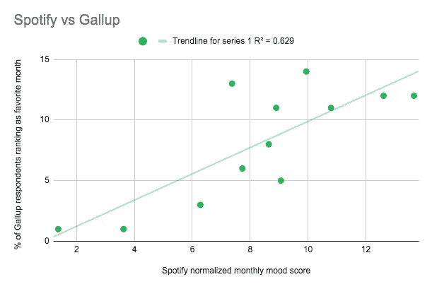
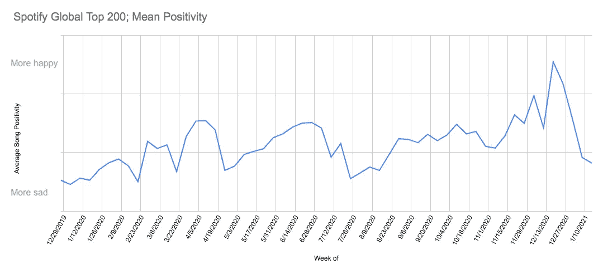
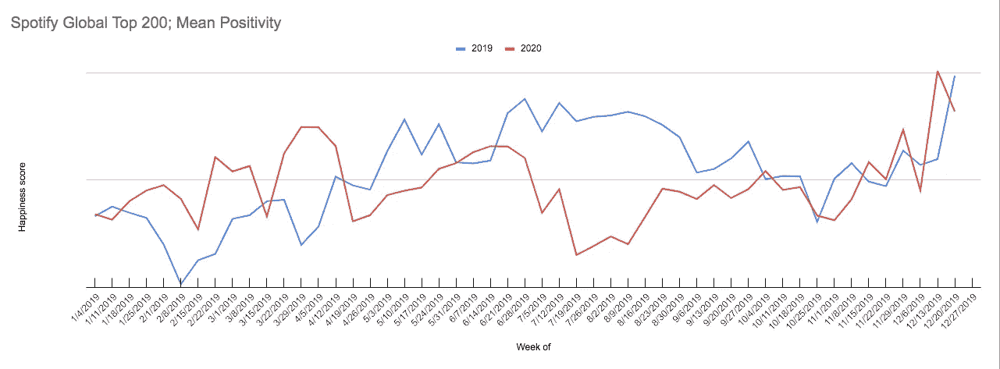

# 世界有多幸福？问问 Spotify 就知道了

> 原文：<https://towardsdatascience.com/tracking-global-mood-with-spotify-847011228085?source=collection_archive---------29----------------------->

## 如何使用 Spotify 的 API 来跟踪全球情绪、研究幸福感、增加销售额等等


萨拉·库菲在 [Unsplash](https://unsplash.com?utm_source=medium&utm_medium=referral) 上拍摄的照片

我总是发现自己在窥探朋友们在 Spotify 上的收听反馈。这是一个很好的，自发的共鸣检查。当我看到格雷厄姆在听坎耶·韦斯特的音乐，或者尼克在听《指环王》的原声带时，我觉得我知道这意味着什么。我知道古典音乐意味着工作，凌晨两点的古典音乐意味着工作。我喜欢看到一个朋友和 ABBA 一起即兴演奏，当看到一个朋友在听 Billie Eilish 的时候感觉很糟糕。在我的想象中，上午 10 点的杰克·约翰森是一顿精力充沛的早餐，下午 2 点的 T-Pain 是一次健身房后的淋浴，而下午 5 点的杰克森·布朗是一次傍晚的烧烤。

Spotify 和我很像，但是更大，内存更大。Spotify 记录我们的收听历史，帮助他们改进宝贵的推荐算法。Spotify 已经创建了一个关于用户收听模式的数据宝库，并友好地通过一个直观的 API 提供给用户。这个数据库就像我自己的 Spotify 上的收听历史一样，可以告诉我们很多关于它背后的听众的信息。

在这篇文章中，我专注于一个项目，试图通过跟踪 Spotify 全球 200 强排行榜上歌曲的平均情绪来跟踪全球情绪波动。

## 背景研究

心理学家将听音乐分为情绪一致、情绪不一致或两者都不是，这取决于音乐是否符合情绪。[研究](https://pdfs.semanticscholar.org/ca11/1d00b9ba52bd127c8b684ffe146bb5359a2b.pdf?_ga=2.41177954.1732601039.1614021982-2020349995.1614021982)已经证明，人类在倾听时会表现出情绪不一致和一致的平衡。一致是指我们听的歌曲与我们的感觉相似，而不一致是指我们试图用乐观的音乐来摆脱坏情绪的现象。Spotify 的数据与盖洛普和《华盛顿邮报》在最受欢迎月份的民意调查正相关，这表明情绪一致性主导了 Spotify 排行榜的收听习惯。在好的月份里，人们听好的音乐，在坏的月份里，他们听悲伤的音乐:



Spotify 数据与盖洛普调查数据正相关*，表明 Spotify 更符合情绪*

## *履行*

*我第一次发现前 200 名榜单是在 2 年前的 spotifycharts.com，每周递增一次。这些列表显示了当周在 Spotify 上获得最多流媒体播放的 200 首歌曲。*

*下载这些 CSV 文件后，我将它们作为数据帧导入到我的 RStudio 中。*

```
*listofdfs <- list(
read_csv("~/Downloads/regional-global-weekly-2019-12-06--2019-12-13.csv", ...)*
```

*接下来，我连接了 Spotify 的 API。你可以很容易地从 [GitHub](https://github.com/charlie86/spotifyr) 下载 spotifyr web wrapper。*

*然后加载它:*

```
*library(spotifyr)*
```

*这个包装器提供了一组从 Spotify 服务器请求歌曲数据所需的函数。我感兴趣的数据是 Spotify 对歌曲的情绪评分。他们将速度、基调和音色等属性结合到一个名为价的度量标准中，该标准将歌曲的情绪从快乐 1 小时到悲伤 0 小时进行评级。*

*我创建了一个函数，将来自 spotifycharts.com[的原始 CSV 转换成一个有序的价值列表。如果你想继续下去，自己尝试代码，我在下面解释这个程序。否则，请随意跳转到结果！](https://spotifycharts.com)*

## ***第一步:获得前 200 首歌曲的 URIs 奖***

*要使用 spotifyr 函数，我需要这些歌曲的 URIs。URI(不要与 url 混淆)是一首歌曲的 22 位条形码，幸运的是包含在前 200 名列表的 url 中。以下代码提取 url 的最后 22 位数字，并用这些值填充示例数据框。它需要一个名为“track_uri”的变量，spotifyr 预加载的函数才能工作。*

```
*uris1 <- data.frame("track_uri" = 1:202, stringsAsFactors = FALSE)

  for (i in 1:202) {
    uris1[[1]][i] <- substr(chartdata[[5]][i], 32, 53)
  }
  uris1 <- na.omit(uris1)*
```

## *第二步:为每首歌曲添加价谱*

*现在，我可以使用 spotifyr 的便捷函数从 API 中请求每首歌曲的价数分数。由于我们在这一步中与 Spotify 服务器通信，因此需要互联网连接。*

*获得化合价分数很容易。我使用函数 get_track_audio_features。它获取一首歌曲 URI，并返回一个包含该歌曲所有音频特征的数据帧。这包括一个称为化合价的变量，所以要得到化合价，我只需过滤列化合价:*

```
*get_track_audio_features(uris1)$valence*
```

## *步骤 3:按流%对化合价进行加权*

*为了更准确地了解人们在听什么，我想通过流计数来衡量情绪得分。这样，一首有 100 万条流的歌曲比一首有 10 万条流的歌曲对排行榜整体情绪的贡献更大。*

*来自 spotifycharts.com 的前 200 名 CSV 列出了流计数，所以我只需要跟踪这些。*

```
*streams <- data.frame("streams" = 1:202, stringsAsFactors = FALSE)

  for (i in 1:200) {
    streams[[1]][i] <- chartdata[[4]][i]
  }*
```

*索引和数据类型有点混乱。*

```
*streams <- na.omit(streams)
streams$streams <- as.double(streams$streams)for (i in 1:200) {
    streams$streams[i] <- streams$streams[i+2]
  }*
```

*最后，我把它从原始数据流变成总数据流的一部分。这样，价平均值与总流数无关。*

```
*streams$streams <- streams$streams / sum(streams$streams)*
```

## *第四步:组装*

*最后，我将流份额乘以化合价并取平均值。这将返回该周的平均情绪！*

```
*return(mean(get_track_audio_features(uris1)$valence * streams$streams))*
```

# *结果*

*在我下载的所有 CSV 上使用 for 循环，我跟踪了过去两年 Spotify 全球 200 强播放列表的每周情绪。*

*这是 2020 年的:*

**

*快乐的圣诞音乐使 12 月下旬成为最快乐的一周，而 1 月初、2 月下旬和 7 月下旬的几个不同时期则是最悲伤的一周。*

*其余的变化很难解释。这是叠加在 2019 年之上的 2020 年:*

**

*我对化合价的长期正趋势进行了标准化。我猜，这种价格持续上涨的趋势可能是 Spotify 价格计算的一种特质，或者是整个音乐行业的一种模式。通过比较，我注意到以下几点:*

*   *2019 年和 2020 年在 10 月至 12 月的范围内几乎相同，表明西方假期对听力模式的稳定影响。*
*   *2019 年是一个更加乐观的夏天。我的猜测是，暑假的[显著下降](https://parkmobile.io/articles/how-did-summer-vacations-change-during-covid-19/)减少了感觉良好的夏季歌曲的流数，如 2019 top charter seorita(valence = 0.75)。*
*   *对于 Spotify 的听众来说，隔离的第一个月真是快乐的一个月。也许它变老了，因为情绪水平直到圣诞节周才会回到 4 月份的峰值。*
*   *在 2019 年这样的正常年份，情绪通常是季节性的，从 1 月份的年度低点开始，随着冬天转向春天而上升，在 6 月和 7 月达到顶峰，然后在寒冷的冬季假期再次下降。*

*这些数据似乎太嘈杂，无法进行更细致的观察。Spotify 对价值标准的记录有点不透明，也不像人们希望的那样准确。音乐和情绪并不总是联系在一起的。人们在悲伤的时候听快乐的音乐，在开心的时候听悲伤的音乐，在这两种情况下都可能根本不听音乐。另一个问题来自于只使用顶部图表。前 200 名榜单受到新专辑、广播电台、Spotify 的算法、音乐趋势以及歌曲是否是你有很多机会播放的歌曲类型的影响。*

## *结论*

*摆弄这些数据很有趣，我在做这个项目时想到了一些应用/进一步的考虑。*

*   *幸福科学:通常很难衡量幸福和心情。[最主要的方法是自我调查](https://www.psychologytoday.com/us/blog/the-happiness-doctor/201705/measuring-happiness-how-can-we-measure-it)，但是这些通常不可靠，因为人们如何合理化他们的情绪。相反，你可以利用情绪一致性(和不一致性——任何相关性都可以利用)。跟踪干预对受试者的影响可能就像听他们的 Spotify 一样简单和准确。或者，你可以将 Spotify 的用户级数据整合到个人情绪跟踪器中。*
*   ***更好的生意**:音乐能对购物者产生惊人的影响。教科书上的例子是 1992 年关于葡萄酒购买的研究。研究发现，在市场上播放法国音乐导致法国葡萄酒的销量是德国葡萄酒的 5 倍；而演奏德国音乐使得德国葡萄酒的销量以 2:1 的比例超过了法国葡萄酒。其他研究发现，加快音乐节奏可以增加酒吧里的饮料购买量，快乐的音乐通常对购物者有利。希望利用音乐对购物者的影响的企业主可以利用 Spotify API 的指标来更准确地跟踪和了解他们商店中的音乐如何影响他们的客户。在效价、可跳舞性、能量、BPM、音调、声音、响度、活力和语速之间，有大量的指标可以测试销售。*
*   ***隐私**:Spotify 可以对我们的数据这样做，这也有点令人担忧。我可能喜欢偶尔看看我的朋友在听什么，但我也有自己的流对朋友隐藏。我认识到，我听的音乐可以透露很多关于我的信息，我不喜欢失去对这些数据的控制。也许在未来，Spotify 会将我的收听习惯与未来的负面健康结果联系起来，并将这些数据出售给我的医疗保健提供商，从而提高我的保费。也许我一直在听的舞曲都会被用来告诉一个未来的雇主，我不会努力。重视 Spotify 的数据意味着认识到我们正在与 Spotify 以及他们现在可能出售数据的任何人分享这一价值。*

*我计划稍后更深入地分析这个问题。如果你想继续收听，请跟我来！谢谢！*

*[1] C. Lee 等人，[人际关系和审美体验中对情绪一致性的偏好](https://pdfs.semanticscholar.org/ca11/1d00b9ba52bd127c8b684ffe146bb5359a2b.pdf?_ga=2.41177954.1732601039.1614021982-2020349995.1614021982) (2013)，《芝加哥消费者研究杂志》。*

*[2] C. Ingraham，[一年中最好和最差月份的权威排名](https://www.washingtonpost.com/news/wonk/wp/2015/08/04/the-definitive-ranking-of-the-best-and-worst-months-of-the-year-according-to-polling/) (2015 年)，《华盛顿邮报》*

*[3]https://spotifycharts.com*

*[https://github.com/charlie86/spotifyr](https://github.com/charlie86/spotifyr)*

*[5] B. Goldman，[新冠肺炎时期的暑假有什么变化？](https://parkmobile.io/articles/how-did-summer-vacations-change-during-covid-19/) (2020)，ParkMobile*

*[6] M. Holder，衡量幸福:[我们如何衡量幸福？](https://www.psychologytoday.com/us/blog/the-happiness-doctor/201705/measuring-happiness-how-can-we-measure-it) (2017)《今日心理学》*

*[7] A.C. North 等人，[店内音乐对葡萄酒选择的影响](https://www.researchgate.net/publication/232593421_The_Influence_of_In-Store_Music_on_Wine_Selections) (1999)，《应用心理学杂志》*

*[8] K.M. Knoeferle 等人，乐观人群:[快速店内音乐缓解高社交密度对顾客消费的负面影响](https://www.sciencedirect.com/science/article/abs/pii/S0022435917300520?via%3Dihub) (2017)，《零售杂志》*

*图像:*

*封面:照片由[Sara kurfe](https://unsplash.com/@stereophototyp?utm_source=medium&utm_medium=referral)在 [Unsplash](https://unsplash.com?utm_source=medium&utm_medium=referral) 上拍摄*