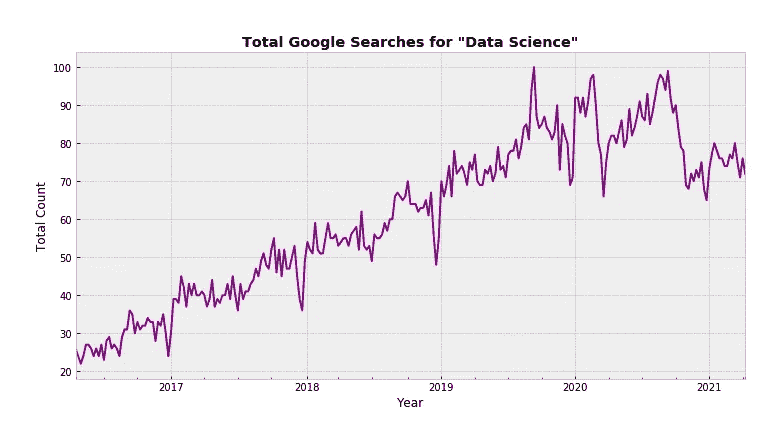
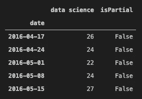

# 用 Pytrends 跟踪谷歌搜索的关键词趋势

> 原文：<https://towardsdatascience.com/tracking-keyword-trends-on-google-search-with-pytrends-cf97c43803f6?source=collection_archive---------18----------------------->

## 只用几行代码就能收集历史数据！


[马库斯·温克勒](https://unsplash.com/@markuswinkler)开启[解锁](https://unsplash.com/photos/afW1hht0NSs)

`Pytrends`是一个用于**追踪谷歌搜索趋势**的非官方 API，我们可以使用`matplotlib`来可视化这些趋势**随着时间的推移**。你可以在这个项目的 GitHub 库[这里](https://github.com/GeneralMills/pytrends)阅读更多关于这个包的信息。

## 什么是谷歌搜索？

我们都知道谷歌搜索是什么。我们每天都要使用它几次，有时会不假思索地访问数以百万计的搜索结果。有趣的是，谷歌搜索工具栏最初是在 2000 年为 ie 5 发布的。

通过查看十年来谷歌搜索关键词的时间序列可视化，**我们可以得出关于几乎任何主题的有价值的见解**。让我们来看一个例子。让我们来看看关键词“数据科学”的趋势。

## **绘制数据科学搜索趋势**



作者图片

下面是 2016 年**到 2021 年**关键词“数据科学”的趋势。我也将分享一个关于如何生成这种可视化的教程！超级简单。

对于任何包，我们从将**安装到本地机器上开始。您可以用一行简单的代码来实现这一点。**

```
! pip install pytrends
```

一旦`pytrends`被安装，我们将**从包中导入**方法`TrendReq`。

```
from pytrends.request import TrendReq
```

接下来，我们需要**连接谷歌**。我们可以使用`TrendReq`并传递几个参数。对于这个例子，我们将使用`hl`和`tz`。

```
# connect to google
pytrends = TrendReq(hl='en-US', tz=360)
```

`hl`参数指定用于访问 Google Trends 的**主机语言**。请注意，只有 https 代理可以工作，您需要在代理 ip 地址后添加端口号。`tz`参数是**时区偏移量**。所以，比如美国 CST 是`360`。

在 API 初始化之后，我们需要**查询我们想要搜索的实际关键词**。为此，我们使用方法`build_payload`告诉 API 我们想要哪些关键字。如前所述，我们在这个例子中使用了“数据科学”。

```
# keywords to search for
pytrends.build_payload(kw_list=['data science'])
```

现在最困难的部分已经过去了！接下来，我们只需要创建一个 **dataframe** 来保存这个查询的时序数据。有一个 API 方法`Interest over Time`，它返回**历史索引数据**，显示该关键字在 Google Trends 的 Interest Over Time 部分被搜索最多的时间。

```
# dataframe
time_df = pytrends.interest_over_time()
```

通过运行一个简单的`time_df.head()`，看看该数据帧的**前 5 行**是什么样子。



一旦一切都设置好了，我们就可以使用`matplotlib`来**可视化这个数据框架**！我不会解释这一部分，但这里是我在这个项目中使用的完整代码。如您所见，整个项目只用了大约 22 行代码就完成了。

## 你自己试试

这个小练习只是我们可以用`pytrends`计划做的许多事情之一。例如，我们可以查看历史每小时兴趣、地区兴趣、相关主题、相关查询等等。

您可以随意安装 Pytrends 并自己使用它！有数不清的术语要搜索。