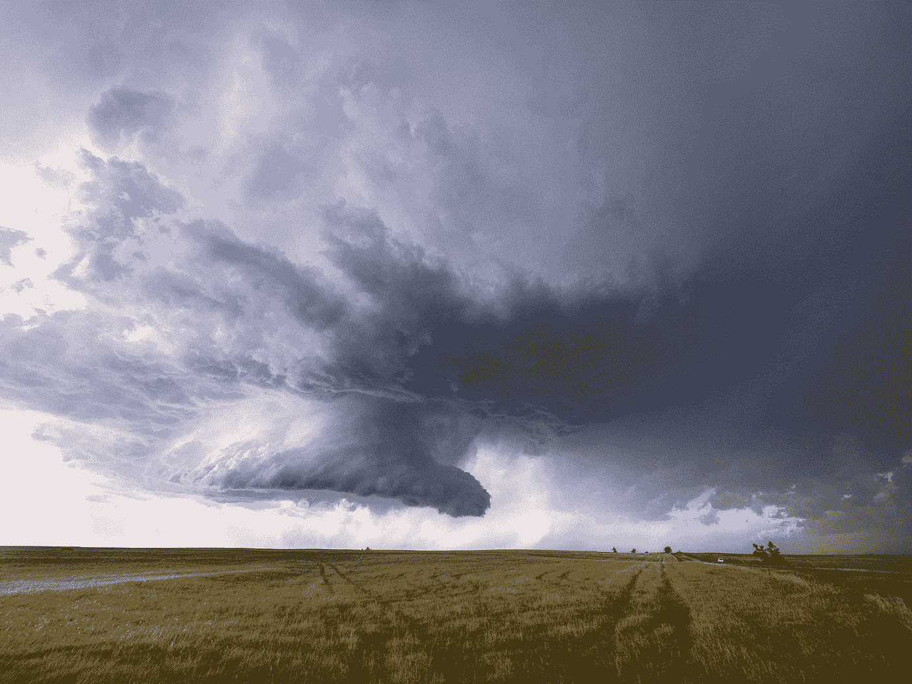
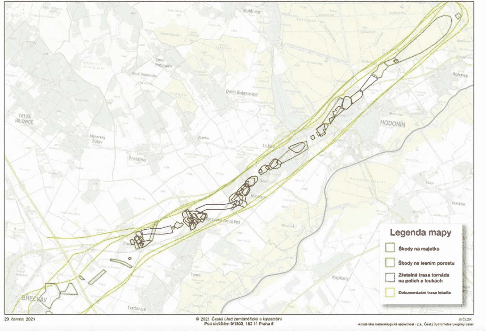
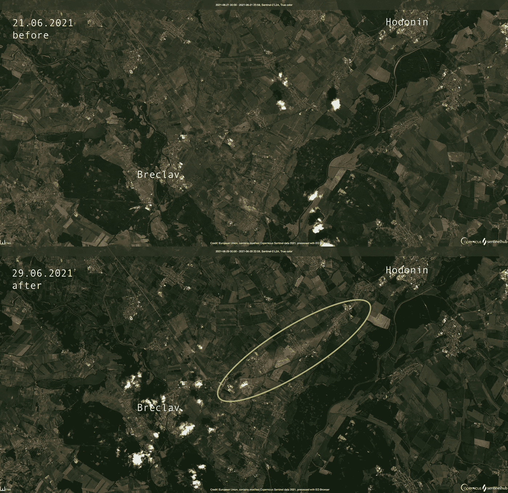
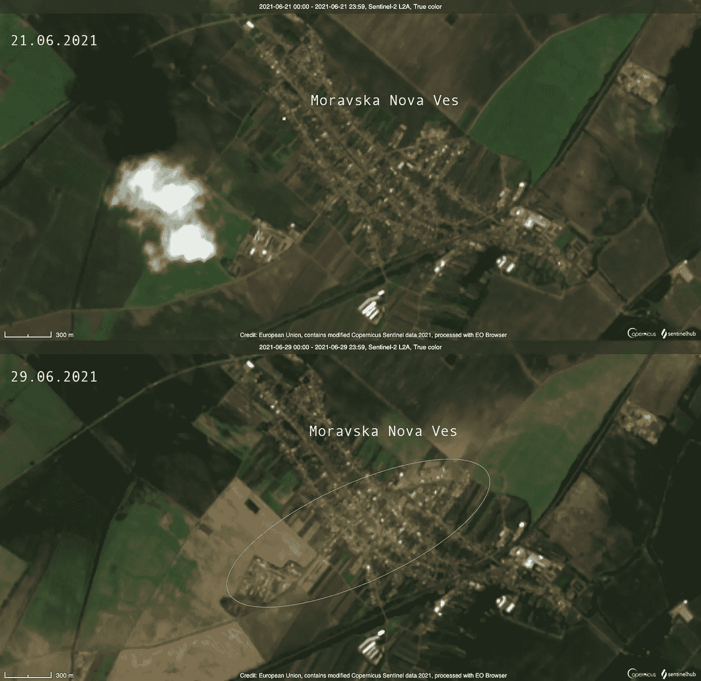
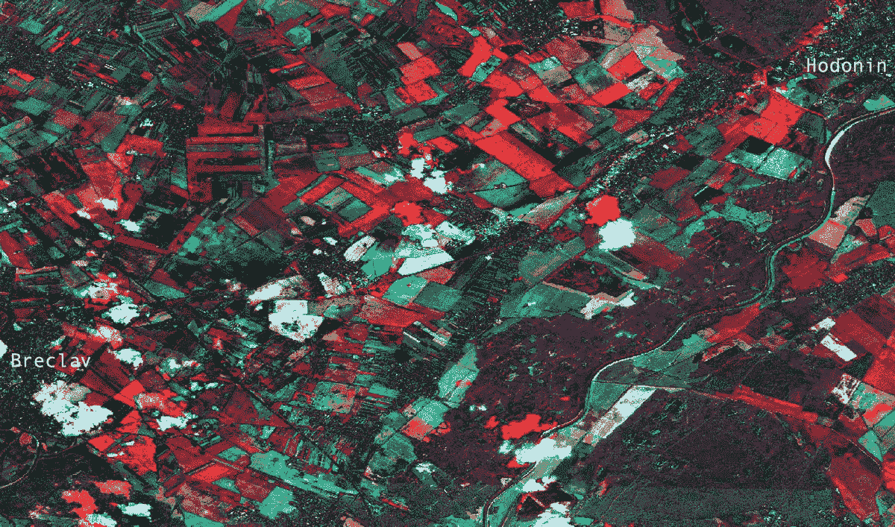

# 从太空追踪龙卷风

> 原文：<https://towardsdatascience.com/tracking-tornados-from-space-ce4e525fd5b5?source=collection_archive---------26----------------------->

## 借助高分辨率哨兵-2 卫星数据对捷克境内龙卷风的评估

瑞歇尔·桑纳在 [Unsplash](https://unsplash.com?utm_source=medium&utm_medium=referral) 上拍摄的照片

6 月 24 日星期四下午 7:15 左右，一场大龙卷风袭击了捷克南部摩拉维亚地区，风速至少为 219 公里/小时(136 英里/小时)。在 T4 的藤田等级中，龙卷风被划分为 F4 级。

> “简直是活地狱！”—南摩拉维亚州长扬·格罗里奇

六人死亡，至少 200 人受伤。当地人报告说冰雹有网球那么大。总的来说，六个不同的村庄(Hruš ky、Moravska Nova Ves、Mikulč ice、luice、Hodonína 和 Ratíkovic)遭到严重破坏。龙卷风的路径是通过空中任务评估的，如下图所示。红色区域表示对建筑物的损害，绿色区域表示对森林的损害，蓝色区域表示对农业的损害，黄色轮廓显示龙卷风的路径，大约 26 公里长，700 米宽。

根据空中任务评估龙卷风的破坏和路径——图片来自[捷克气象局](https://www.chmi.cz/files/portal/docs/tiskove_zpravy/2021/Zprava_k_tornadu_1.pdf)

# 从太空看得见吗？

在我看到电视上的视频和灾难性事件的报道后，我脑海中闪现的问题是— *“龙卷风的影响能在卫星图像上看到吗？”因此，我决定查看 Sentinel-2 卫星星座的最新图像，该星座大约每 5 天(取决于位置)提供一次分辨率为 10m 的地球表面高分辨率图像。尽管有各种各样的工具可以用来访问数据，但我决定使用优秀的 [Sentinelhub EO 浏览器](https://apps.sentinel-hub.com/eo-browser/)，它使搜索和可视化最近的卫星数据变得非常容易。*

来自龙卷风之前(顶部)和之后(底部)的 Sentinel-2 图像-由作者基于 Sentinelhub EO 浏览器提供的图像-包含修改后的 2021 年哥白尼 Sentinel 数据

上面的图像显示了哨兵-2 卫星拍摄的两个场景。上面的场景拍摄于 7 月 21 日，下面的场景描绘了 7 月 29 日龙卷风过后五天的同一地区。你可以清楚地看到在布雷克拉夫和霍多宁之间的底部场景的中心部分有一个亮点。这个斑点(光谱特性的变化)可以清楚地归因于龙卷风的影响。

# 评估损失

让我们把镜头拉近一点，看看我们刚刚确定的受龙卷风影响的地区:Moravska Nova Ves 村。如果你看下面的两幅卫星照片(再次显示前后对比)，你可以看到村庄的北部和南部看起来没有受到影响，然而，中部再次显示了光谱特性的**显著变化:你可以看到该区域以黄色突出显示的红色屋顶基本上都消失了，现在呈现出蓝色。这可能意味着该地区的屋顶或整个建筑被完全摧毁。在村庄周围(尤其是西边)，你还可以看到龙卷风过后出现在橙色/褐色调中的农业区所遭受的大面积破坏。**

Sentinel-2 在龙卷风袭击 Moravska Nova Ves 村之前(上图)和之后(下图)的图像——由作者基于 Sentinelhub EO 浏览器制作的图像——包含修改后的 2021 年哥白尼 Sentinel 数据

# 推导龙卷风的轨迹

在上面的第一幅图中，我们可以看到，通过对比龙卷风前后的卫星图像，我们可以确定对农业和建筑造成严重破坏的热点。但是有可能推导出龙卷风的轨迹吗？

为了找到答案，我对前后场景的光谱带进行了归一化，并计算了两个时间步长之间的光谱差异。结果是假色(8-4-3 ),如下图所示。如果你仔细观察，特别是从图像的中央部分向右上方，你可以清楚地看到一条路径，显示由于植被和基础设施的破坏而产生的光谱差异！

## 相关链接

[1] Synergise Sentinelhub 电子浏览器:【https://apps.sentinel-hub.com/eo-browser 

[2]捷克气象局关于龙卷风的报告:[https://www . chmi . cz/files/portal/docs/tisk ove _ zpravy/2021/Zprava _ k _ torna du _ 1 . pdf](https://www.chmi.cz/files/portal/docs/tiskove_zpravy/2021/Zprava_k_tornadu_1.pdf)