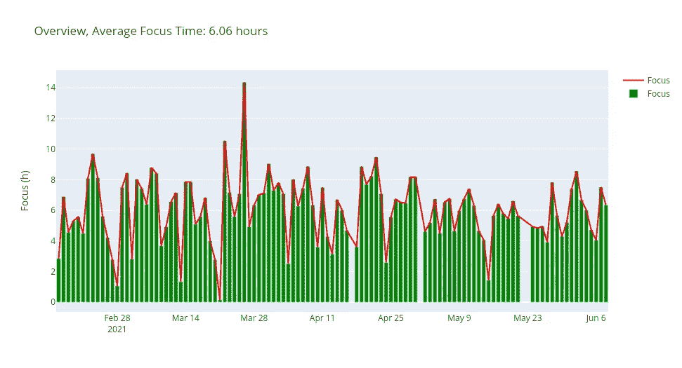
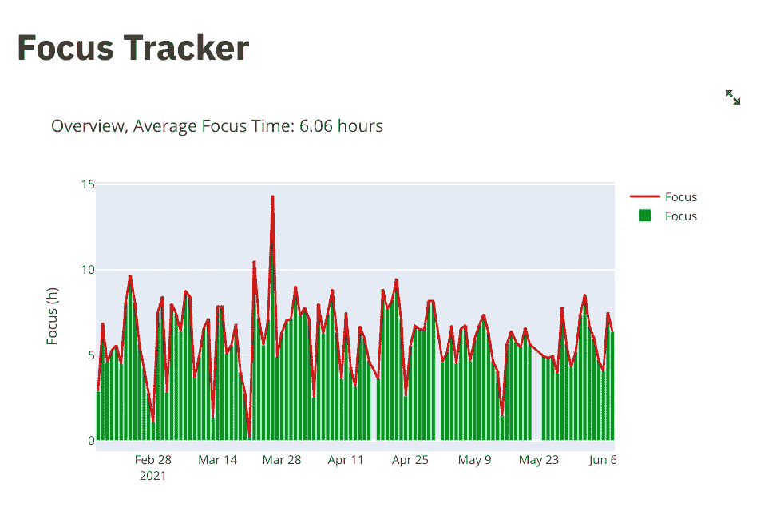

# 用 Python 追踪你的焦点

> 原文：<https://towardsdatascience.com/tracking-your-focus-with-python-bcd804f1f6f2?source=collection_archive---------22----------------------->


卢克·切瑟在 [Unsplash](https://unsplash.com?utm_source=medium&utm_medium=referral) 上拍摄的照片

## 一个简单的脚本，使用 Python 和 Streamlit 跟踪和可视化您的日常工作时间

# 注意力的价值

如今，注意力似乎成了一种商品。你访问的每个应用和网站都想吸引你的注意力，这几乎是一种货币。因此，尽可能多的控制自己的注意力是有意义的。

***今天，我将向你展示如何使用 Python 和 Streamlit*** 追踪和可视化你专注的时间

# 跟踪和可视化

这些步骤将是:

*   设置跟踪脚本
*   设置可视化
*   将代码包装在一个 Streamlit 应用程序中

## 1.跟踪脚本

让我们开始写脚本来跟踪你的焦点:

让我们来看看这里发生了什么:

1.  首先，我们编写一个名为`trackFocus()`的函数，它简单地跟踪由用户的简单输入分隔的时间间隔(比如按回车键)
2.  然后我们调用`calculatefocustime()`函数，该函数返回给定一天中跟踪的总时间
3.  最后，我们调用`logFocus()`函数，它记录会话开始和结束的时间戳

现在我们有了追踪器，让我们写一个简单的可视化程序来看看我们每天集中的时间。

## 2.可视化聚焦时间

为了可视化聚焦时间，我们需要两个函数，一个用于创建数据帧以正确存储数据，另一个用于绘图。

绘制聚焦时间的脚本

输出:



聚焦时间 2021 年 2-6 月

该守则有两个主要部分:

1.  使用`create_focus_df()`功能创建数据帧
2.  使用`plotfocus()`功能中的`plotly`库绘制焦点。

这件事很酷的一点是，它让你知道你实际上在活动上花了多少时间，以及这些时间是如何变化的。

对我来说，这些见解是有帮助的，因为它们让我对我的一致性和我在做有成效的工作所花费的时间方面的总体表现有了一个总体的了解。

## 3.将所有东西打包到一个 Streamlit 应用中

现在，作为结束，让我们用 Streamlit 制作一个简单的仪表板应用程序，只需从终端发出一个简单的命令，就可以随时可视化我们的数据。

现在，在终端中我们运行:

```
streamlit run app.py
```



你可以在这里找到源代码

# 追踪洞察力

我喜欢自我跟踪的想法，因为它给了我一些关于我的规律性和我每天实际关注多少时间的洞察力。有了这些信息，我可以为接下来的几周设定更现实的目标，并培养一种脚踏实地的进步意识。

如果你喜欢这篇文章，请在 [Twitter](https://twitter.com/LucasEnkrateia) 、 [LinkedIn](https://www.linkedin.com/in/lucas-soares-969044167/) 、 [Instagram](https://www.instagram.com/theaugmentedself/) 上联系我，并在 [Medium](https://lucas-soares.medium.com/) 上关注我。谢谢，下次再见！:)