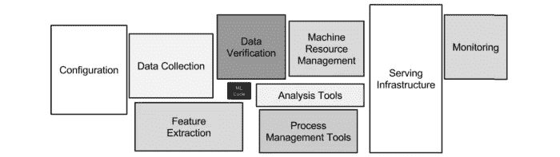

# 使用 MLMD 跟踪您的机器学习工作流

> 原文：<https://towardsdatascience.com/tracking-your-machine-learning-workflows-with-mlmd-b289e37e020c?source=collection_archive---------29----------------------->

## 记录、分析和检索与您的 ML 开发项目相关的元数据

图片来自[皮克斯拜](https://pixabay.com/?utm_source=link-attribution&utm_medium=referral&utm_campaign=image&utm_content=1813410)

当我们想到机器学习(ML)项目时，我们会想到数据采集和处理。我们考虑模型开发、拟合、评估和部署。

构建和训练 ML 模型的过程一直是人们关注的焦点。有很多关于不同的神经网络架构实现前所未有的结果或新平台促进想法到生产的过渡的谈论。

但是，如果出了问题会怎么样呢？如果我们想回到过去，检查我们用来训练模型的数据集的版本，超参数的值是什么，以及生成模型的运行与其他运行相比如何，会发生什么情况。

2015 年，谷歌发表了一篇开创性的论文，名为《机器学习系统中的[隐藏技术债务](https://web.kaust.edu.sa/Faculty/MarcoCanini/classes/CS290E/F19/papers/tech-debt.pdf)。如果你在 ML 工作超过六个月，你就已经看到下图了。

机器学习系统中隐藏的技术债务。

在这项工作中，作者试图警告说，只关注今天可用的强大的 ML 工具并认为它们是理所当然的是危险的；我引用:*“使用技术债务的软件工程框架，我们发现在现实世界的 ML 系统中招致大量的持续维护成本是很常见的。”*

今天，我们讨论一个图中没有的盒子。我们讨论的是一个在后台默默工作的组件，它收集信息并提供将所有东西结合在一起的粘合剂。在我看来，这是 ML 管道中最关键的元素:元数据存储。

> [学习率](https://www.dimpo.me/newsletter?utm_source=medium&utm_medium=article&utm_campaign=mlmd)是为那些对 AI 和 MLOps 的世界感到好奇的人准备的时事通讯。你会在每周五收到我关于最新人工智能新闻和文章的更新和想法。在这里订阅！

# ML 元数据

元数据存储是一个存储后端和 API，用于记录和检索与 ML 工作流相关的元数据。管道步骤的输入是什么？该步骤产生了哪些工件？他们住在哪里？他们是什么类型的？

这个故事讲述了一个具体的元数据存储实现:Google 的 [ML 元数据(MLMD)](https://github.com/google/ml-metadata) 库，它是[tensor flow Extended(TFX)](https://www.tensorflow.org/tfx)的一个组成部分，但同时也是一个独立的应用程序。使用这个元数据存储实现将帮助我们更好地理解对这样一个组件的需求。

# MLMD 图书馆

MLMD 帮助我们分析一个 ML 工作流程的所有部分和他们的相互联系，而不是看孤立的过程。它提供了发生的每一个事件的完整谱系，最重要的是，一个模型的完整历史。其中，MLML 可以帮助我们确定:

*   模型在哪个数据集上训练？
*   用于训练模型的超参数是什么？
*   模型的衡量标准是什么？
*   哪个运行创建了模型？
*   我们用这个数据集训练过其他模型吗？
*   不同的型号相比如何？
*   特定 ML 框架的哪个版本创建了这个模型？

MLMD 需要一个存储后端来记录它收集的信息。存储后端是可插拔的，可以扩展，但 MLMD 提供了现成的 SQLite 和 MySQL 的参考实现。MLMD 支持 SQLite 和 MySQL。但是，在大多数情况下，您不会关心底层运行的存储系统。

## 基本概念

要与 MLMD 合作，首先你需要定义三个`Types`:

*   `ContextType`
*   `ExecutionType`
*   `ArtifactType`

想象这些是你想要追踪的实体的蓝图。使用这些`Types`你可以创建符合相应`ArtifactType`的`Artifact`对象。然后，您还可以创建`Execution`对象和`Context`对象。

把一个`Artifact`想象成一个由 and `Execution`产生的具体对象。例如，模型是从训练步骤(即`Execution`)产生的`Artifact`。`Context`可以是封装实验的整个运行。

每当一个步骤产生一个`Artifact`时，我们可以说它发出一个`Event`，这是将一个`Artifact`和一个`Execution`绑定在一起的另一种实体。最后，`Attribution`用`Context`连接`Artifact`，用`Association`连接`Execution`和`Context`。

因此，我们可以说，一个模型(即`Artifact`)是由一个`Execution`(即工作流步骤)产生的，并由一个`Event`对象绑定在一起。然后，`Execution`是实验的一部分(即`Context`)，它们通过`Association`对象绑定在一起。最后，一个实验(即`Context`)生成了一个模型(即`Artifact`)，它们被这个`Attribution`对象绑定在一起。

## MLMD 在行动

现在让我们走一遍典型的 ML 工作流程，并将 MLMD 集成到管道步骤中。最初，我们需要创建两个`Artifacts`:一个代表数据集，一个代表模型。为此，我们应该先注册相关的`ArtifactTypes`。

让我们看看代表数据集的`ArtifactType`。在我们的声明中，我们指定每个数据集`Artifact`应该有两个属性:一个`day`和一个`split`。同样的，型号`Artifact`也有一个`version`和一个`name`。

除此之外，其他属性被直接传递给每个`Artifact`。可以把它想象成面向对象编程中的继承属性。比如每个`Artifact`都要有一个`uri`指向物理对象。因此，让我们为数据集创建一个`Artifact`。

接下来，让我们创建一个`ExecutionType`和相应的`Execution`对象来跟踪管道中的步骤。让我们创建一个 trainer `execution`对象来表示训练步骤，并将其状态设置为 running。

现在，我们想要指定我们之前创建的数据集`Artifact`是名为*“Trainer”的`Execution`步骤的输入。*我们可以通过声明一个`Event`实体来实现。

当训练步骤完成时，它产生一个模型。让我们定义一个模型`Artifact`，并将其设置为`Execution`步骤*“训练器”的输出*

最后，*“培训师”步骤*完成，我们可以将其状态设置为*“已完成”*

为了获得完整的图片，让我们将所有东西绑定在一起，并使用`Attributions`和`Assertions`实体记录我们的模型`Artifact`的完整血统。

这 23 行代码为实验创建了一个`Context`实体，并将*“Trainer”*链接为实验的`Execution`步骤，并将模型链接为其输出。仅此而已；MLMD 负责剩下的事情，所以你将能够像我们在第一部分看到的那样跟踪一切。

# 结论

虽然训练代码是 ML 引擎的心脏，但连接一切的循环系统往往是缺失的。端到端 ML 系统中有许多组件，每个组件都扮演着重要的角色。

然而，今天我们讨论了一个在后台默默工作的组件，它提供了将所有东西绑定在一起的粘合剂——元数据存储。

我们看到了 MLMD 如何实现这个想法，它的核心概念，以及我们如何在一个简单的 ML 环境中使用它。要开始安装，请参见此处的安装说明[。](https://github.com/google/ml-metadata#installing-from-pypi)

但是，如果你把它安装在本地，你将看不到它的全部潜力。相反，最好在完整的云原生环境中使用。因此，我建议在一个 MiniKF 实例中工作，在那里一切都是预先配置好的。要开始，请参阅下面的故事:

</kubeflow-is-more-accessible-than-ever-with-minikf-33484d9cb26b>  

# 关于作者

我叫 [Dimitris Poulopoulos](https://www.dimpo.me/?utm_source=medium&utm_medium=article&utm_campaign=mlmd) ，我是一名为 [Arrikto](https://www.arrikto.com/) 工作的机器学习工程师。我曾为欧洲委员会、欧盟统计局、国际货币基金组织、欧洲央行、经合组织和宜家等主要客户设计和实施过人工智能和软件解决方案。

如果你有兴趣阅读更多关于机器学习、深度学习、数据科学和数据运算的帖子，请在 Twitter 上关注我的 [Medium](https://towardsdatascience.com/medium.com/@dpoulopoulos/follow) 、 [LinkedIn](https://www.linkedin.com/in/dpoulopoulos/) 或 [@james2pl](https://twitter.com/james2pl) 。

所表达的观点仅代表我个人，并不代表我的雇主的观点或意见。