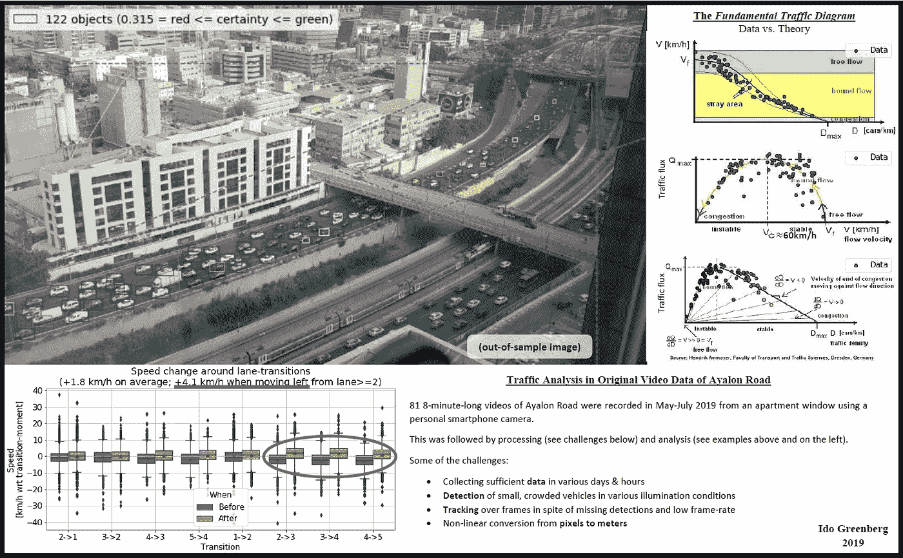
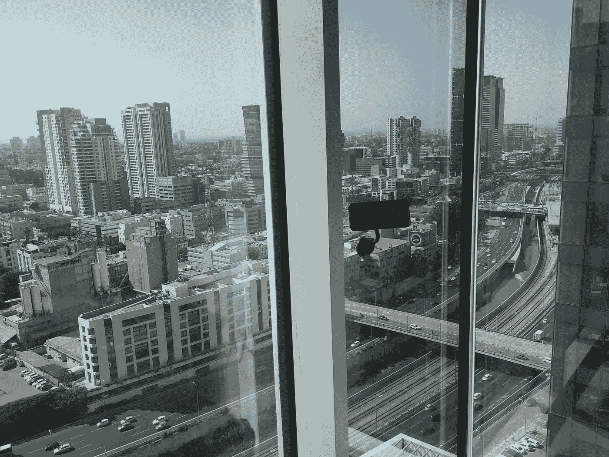
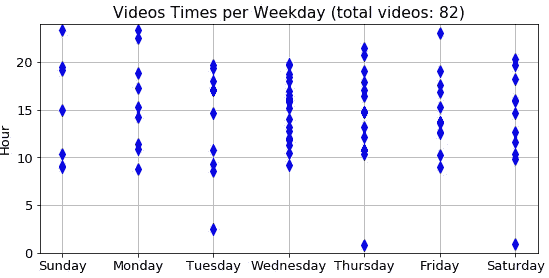
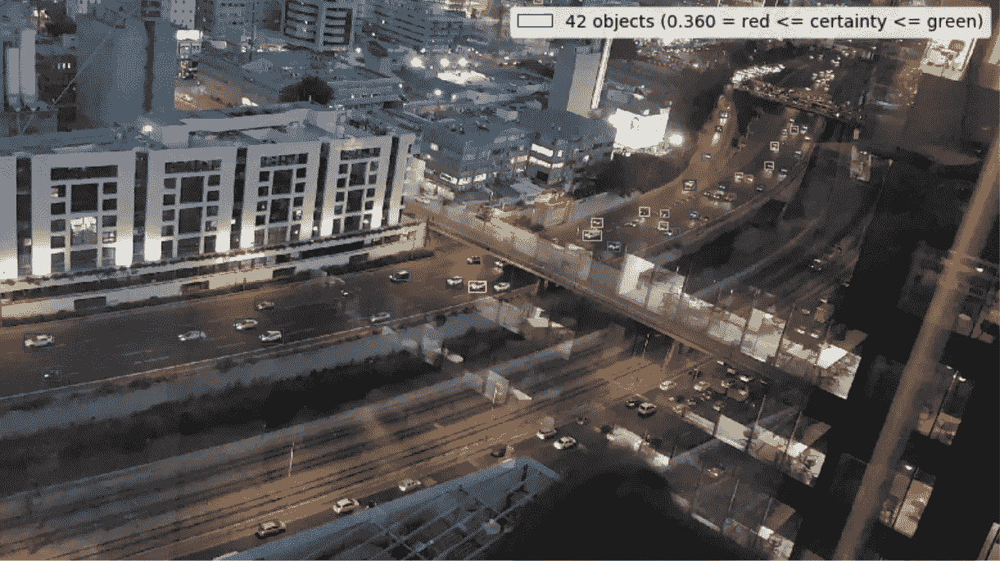
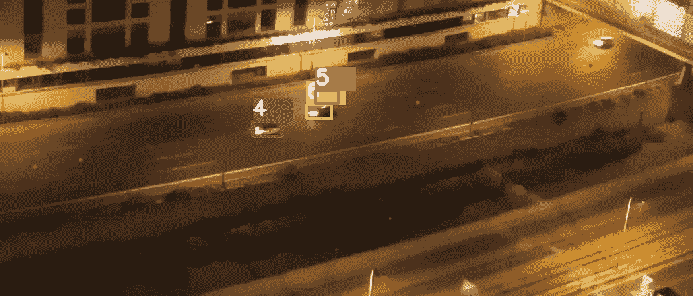
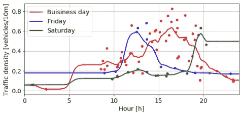
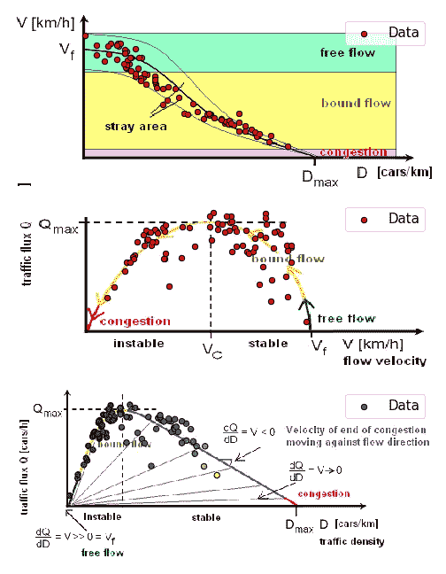
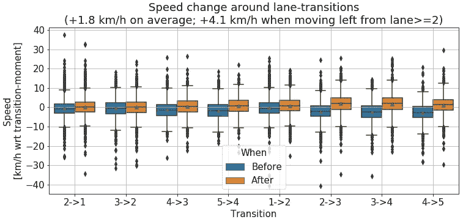

# 阿亚龙路原始视频数据中的交通分析

> 原文：<https://towardsdatascience.com/traffic-analysis-in-original-video-data-of-ayalon-road-158061b811ab?source=collection_archive---------23----------------------->

帖子中的所有图片均由作者创作，除非另有说明

<https://github.com/ido90/AyalonRoad>  

# 摘要

这是 81 个 8 分钟长的视频的故事，记录了一个半月来*阿亚龙路* 的交通情况，这些视频是从我 2019 年住的公寓的窗户观察到的。我的任务物品包括一台笔记本电脑，一个智能手机摄像头和一个汽车真空支架。

分析交通需要**检测视频帧中特定区域的车辆**以及**在连续帧中跟踪车辆**。

由于视频中拥挤的小汽车未能被几个现成的检测器检测到，我在 15 帧内手动标记了车辆，并训练了一个专门设计的**CNN**(总体精神是*更快的 RCNN* )，由预训练的 Resnet34 层(根据所需的特征地图单元大小和感受域选择)、基于位置的网络(合并道路地图信息)和检测&位置头组成。

由于低帧速率不能保证相邻帧中相同车辆的包围盒之间的相交，我用通过卡尔曼滤波器实现的基于位置的概率模型代替了分类跟踪器的分配机制。

生成的交通数据从像素转换为米单位，并以空间和面向车辆的结构进行组织。提出了几个研究问题，例如速度/密度/流量之间的关系( ***基本交通图*** )、日常和时间模式以及**车道转换**的影响。

# 主要贡献

*   使用智能手机和个人笔记本电脑等简单工具进行实证交通研究的概念验证
*   主要道路交通的原始数据集
*   在噪声图像中检测小而拥挤的物体，可通过少量数据进行训练
*   对漏检具有鲁棒性的低帧率视频中快速运动对象的跟踪
*   验证*基本交通图*，检测流量最大化的临界速度(60km/h)并初步了解车道转换的影响

# 数据采集

数据是我住在特拉维夫 ***阿亚龙路*** 主要区间附近的一座塔里时收集的(在*哈沙罗姆*立交附近)，使用 **Galaxy S8+ Hyperlapse 模式，速度为 x8，分辨率为 FHD，其他为标准配置**。我的同事兼朋友奥德·西蒙好心地提供了一个简单的磁铁支架，并把它放在公寓的玻璃墙上。事实证明，这样拍摄的 8 分钟视频(压缩为 1 分钟)需要大约 120MB 的存储空间。这不允许 24-7 记录道路，但允许在不同日期和时间合理覆盖道路。

**在一个半月的时间里录制了 81 个视频(约 14 小时，总共 13gb)**。

正在录音的智能手机

录制的视频覆盖小时和工作日(每个点代表一个视频)

# 车辆检测

在几个现成的工具失败后，我决定自己训练一个专用的 CNN 来检测视频帧中的车辆。我手动标记了 15 帧(共 190K 帧)的所有车辆以供借鉴。我遵循了常用对象检测解决方案(如 SSD、YOLO)中使用的锚盒框架，并将其简化为对应于我的二进制检测问题(而不是多类分类)。

我使用了标准 ResNet34 中的迁移学习，并在 15 层后对其进行了裁剪，以使特征图的分辨率与帧中车辆的密度相对应，感受域与所需的输入范围相对应。我还添加了锚定框的位置作为输入:当道路总是出现在你的视频中的相同位置时，位置过度拟合并不是一个诅咒:)

锚盒及其感受野样本

检测网络架构

我用亚当优化器来训练我的网络。由于大多数图像不包含车辆，我必须对正面锚盒(即有车辆的锚盒)进行上采样，以便网络不会简单地学习预测“没有车辆”。这个概念被称为硬负抽样，它对训练的成功至关重要。

经过训练的检测器的输出样本应用于具有显著窗户反射噪声的黑暗照片(检测器被训练为仅检测在经过哈沙勒姆立交后向北行驶的道路上的车辆)

# 跟踪

跟踪是在[*Objectdetecttrack*](https://github.com/cfotache/pytorch_objectdetecttrack)包的框架下开发的。然而， [*SORT*](https://arxiv.org/abs/1602.00763) 追踪器——该框架所基于的——根据相应边界框的交集来关联相邻帧中相同对象的检测，隐含地假设高帧速率来保证这种交集。由于该假设不适用于本项目中的数据(汽车快速移动，在超延时相机模式下只有约 4 FPS)，分配机制被替换为通过卡尔曼滤波器实现的[基于位置的概率模型，该模型表达了车辆沿道路方向的位置的较大变化。该模型基本上询问“轨迹`i`(给定道路方向和轨迹历史)在一帧内到达新检测`j`的位置的可能性有多大？”。](https://github.com/ido90/AyalonRoad/tree/master/Tracker#kalman-filter-based-probabilistic-model-for-objects-assignment)

在 3 个相邻帧中具有 3 个不相交边界框的车辆(#18):边界框之间的连接不能基于相交，但是可以从基于卡尔曼滤波器的概率模型中推导出，该概率模型的输出可能性由彩色点表示(红色表示低可能性，绿色表示高可能性)

跟踪主要应用于道路的连续可见区间(Moses 桥以北)。修改的跟踪算法允许在大部分道路区间上成功跟踪大部分车辆，即使在少数连续帧中存在遗漏检测。

对遗漏检测具有鲁棒性的跟踪:红点在各种帧上标记被跟踪对象(#4)的检测位置

最终的跟踪算法每秒可以处理 1.2 个完整帧或 3 个裁剪帧，这需要 10 分钟来处理 8 分钟的单个裁剪视频。

# 交通分析

分析输出的示例如下所示。更多信息，请访问该项目的回购协议。

几天和几个小时内的交通密度:工作日的高峰时间约为 16-17，星期五(安息日之前)为 12-13，星期六(安息日之后)为 19-20

[*基础交通图*](https://en.wikipedia.org/wiki/Fundamental_diagram_of_traffic_flow) 和理论很像(要点来自数据，背景和笔记是 Hendrik Ammoser 出现在[维基百科](https://en.wikipedia.org/wiki/Fundamental_diagram_of_traffic_flow))；流量-密度图显示了自由流动交通和拥挤之间的明显区别；最大通量速度(*临界速度*)约为 60 公里/小时

车辆车道转换通常伴随着车辆速度的显著且立即的增加

很高兴看到速度和密度之间关系的理论符合实际交通，或者得出最大化车辆流量的交通密度。车道转换的现象也很有意思，正如我们所料，它让车手们加快了速度。我也希望了解外部性(即车道转换对其他司机的影响)，但不幸的是，我的数据噪音太大。

# 结论

在这个项目中，我获得了一些关于 Ayalon 路交通的见解，并开发了一些技术解决方案(如从少量和嘈杂的数据中检测小型和拥挤的对象，以及在低帧速率下跟踪快速目标)。然而，我相信从这个项目中得到的主要信息是，数据无处不在，通过注意到它们，我们可以用智能手机和笔记本电脑这样简单的工具做漂亮的事情。