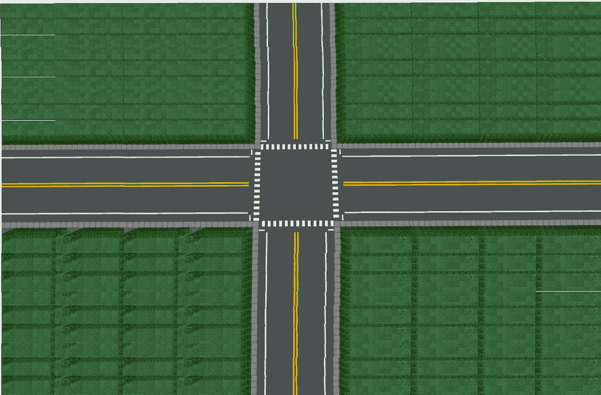
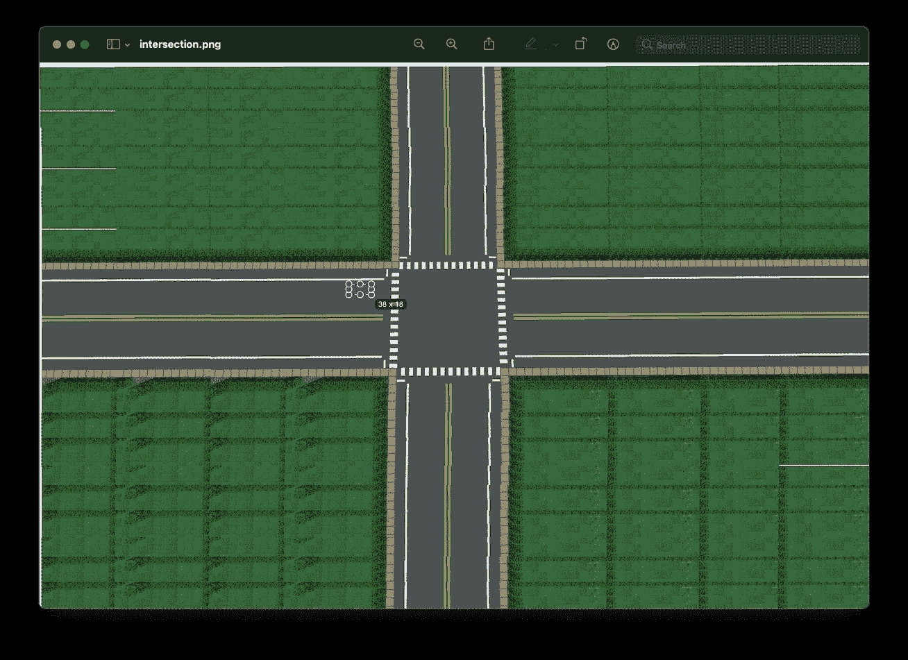
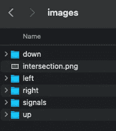
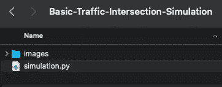
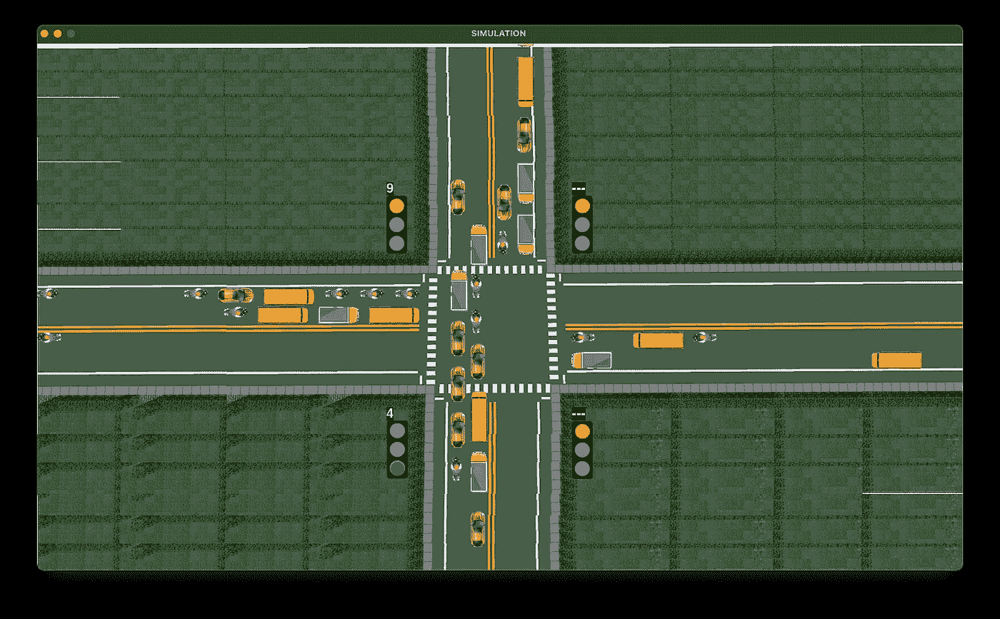

# 使用 Pygame 的交通路口模拟，第 1 部分

> 原文：<https://towardsdatascience.com/traffic-intersection-simulation-using-pygame-689d6bd7687a?source=collection_archive---------4----------------------->

## [实践教程](https://towardsdatascience.com/tagged/hands-on-tutorials)

## 这一系列文章包含了使用 Pygame 从头开始开发交通路口模拟的分步指南。

# 我们在建造什么？

> 我们正在使用 Pygame 从头开始开发一个模拟程序，来模拟车辆穿过一个有计时器的交通灯的十字路口。它包括一个四向交通交叉口，交通信号控制着每个方向的交通流量。每个信号灯上方都有一个计时器，显示信号灯从绿色变为黄色、从黄色变为红色或从红色变为绿色的剩余时间。产生了汽车、自行车、公共汽车和卡车等交通工具，它们的运动根据信号和它们周围的交通工具来控制。这种模拟可以进一步用于数据分析或可视化 AI 或 ML 应用。下面的视频显示了我们将要构建的模拟的最终输出。

模拟的最终输出

# 获取图像

在开始编码并看到我们美丽的模拟变得栩栩如生之前，让我们先来看一些构建模拟所需的图片。这是我们需要的东西的清单:

*   四向交叉路口



intersection.png

*   交通信号:红色、黄色和绿色


red.png


yellow.png


green.png

*   汽车:


car.png

*   自行车:


bike.png

*   公共汽车


bus.png

*   卡车


truck.png

**请确保你根据上面图片的标题给你下载的图片重新命名。**接下来，我们需要根据四向交叉路口图像的大小来调整交通信号和车辆的图像。这是唯一需要反复试验的步骤，但是因为我们是从零开始构建模拟，所以这是必要的。

在应用程序中打开四向交叉点图像，如 Windows 的 Paint 或 Mac 的 Preview。选择一个区域，该区域等于您希望车辆在最终模拟中的外观。记下尺寸。



从路口图像中获取车辆尺寸和坐标

现在，在你选择的任何工具中打开你的车辆，把它们调整到这个尺寸。对交通信号图像也重复相同的过程。

在我们继续编码之前，还有最后一步。你可能已经注意到了，我们有车辆只朝右的图像。因此，旋转车辆的图像并保存它们，以获得面向所有方向的图像，如下图所示。


创建一个文件夹'*交通路口模拟*，并在其中创建一个文件夹'*图片*。在这里，我们将存储所有这些图像。文件夹结构如下所示，其中:

*   **向下**:包含面朝下的车辆图像
*   **向上**:包含车辆朝上的图像
*   **左侧**:包含面向左侧的车辆图像
*   **右侧**:包含面向右侧的车辆图像
*   **信号**:包含交通信号的图像



# 编码

现在让我们深入编码。

## 安装 Pygame

在安装 PyGame 之前，您需要在您的系统上安装 Python 3.1+。你可以从[这里](https://www.python.org/downloads/)下载 Python。安装 Pygame 最简单的方法是使用 [pip](https://pypi.org/project/pip/) 。只需在 cmd/Terminal 中运行以下命令。

```
$ pip install pygame
```

## 导入所需的库

我们首先创建一个名为' *simulation.py* '的文件，并导入开发该模拟所需的库。

```
import randomimport timeimport threadingimport pygameimport sys
```

请注意，此时您的文件夹结构应该如下所示。



项目的文件夹结构

## 定义常数

接下来，我们定义一些常量，这些常量将用于模拟中车辆的移动以及交通信号计时器的控制。

```
# Default values of signal timers in secondsdefaultGreen = {0:20, 1:20, 2:20, 3:20}defaultRed = 150defaultYellow = 5signals = []noOfSignals = 4currentGreen = 0   # Indicates which signal is green currentlynextGreen = (currentGreen+1)%noOfSignals currentYellow = 0   # Indicates whether yellow signal is on or offspeeds = {'car':2.25, 'bus':1.8, 'truck':1.8, 'bike':2.5}  # average speeds of vehicles
```

下面的坐标也是通过在 Paint/Preview 中打开 4 向交叉点图像并获取像素值来提取的。

```
# Coordinates of vehicles’ start
x = {‘right’:[0,0,0], ‘down’:[755,727,697], ‘left’:[1400,1400,1400], ‘up’:[602,627,657]}y = {‘right’:[348,370,398], ‘down’:[0,0,0], ‘left’:[498,466,436], ‘up’:[800,800,800]}vehicles = {‘right’: {0:[], 1:[], 2:[], ‘crossed’:0}, ‘down’: {0:[], 1:[], 2:[], ‘crossed’:0}, ‘left’: {0:[], 1:[], 2:[], ‘crossed’:0}, ‘up’: {0:[], 1:[], 2:[], ‘crossed’:0}}vehicleTypes = {0:’car’, 1:’bus’, 2:’truck’, 3:’bike’}directionNumbers = {0:’right’, 1:’down’, 2:’left’, 3:’up’}# Coordinates of signal image, timer, and vehicle countsignalCoods = [(530,230),(810,230),(810,570),(530,570)]signalTimerCoods = [(530,210),(810,210),(810,550),(530,550)]# Coordinates of stop linesstopLines = {‘right’: 590, ‘down’: 330, ‘left’: 800, ‘up’: 535}defaultStop = {‘right’: 580, ‘down’: 320, ‘left’: 810, ‘up’: 545}# Gap between vehiclesstoppingGap = 15    # stopping gapmovingGap = 15   # moving gap
```

## 正在初始化 Pygame

接下来，我们用下面的代码初始化 Pygame:

```
pygame.init()simulation = pygame.sprite.Group()
```

## 定义类别

现在让我们构建一些类，我们将在模拟中生成这些类的对象。我们需要定义两个类。

1.  **交通信号**:我们需要为我们的模拟生成 4 个交通信号。因此，我们构建了一个具有以下属性的 TrafficSignal 类:

*   *红色*:红色信号定时器的值
*   *黄色*:黄色信号定时器的值
*   *绿色*:绿色信号定时器的值
*   *信号文本*:要显示的定时器值

```
class TrafficSignal:
    def __init__(self, red, yellow, green):
        self.red = red
        self.yellow = yellow
        self.green = green
        self.signalText = ""
```

2.车辆:这是一个表示我们将在模拟中生成的车辆对象的类。Vehicle 类具有以下属性和方法:

*   *车辆类别*:表示车辆的类别，如轿车、公共汽车、卡车或自行车
*   *速度*:根据车辆的级别表示车辆的速度
*   *direction_number* :表示方向——0 为右，1 为下，2 为左，3 为上
*   *方向*:表示文本格式的方向
*   *x* :表示车辆当前的 x 坐标
*   *y* :表示车辆当前的 y 坐标
*   *已过*:表示车辆是否已过信号灯
*   *索引*:表示本车在同方向同车道行驶的车辆中的相对位置
*   *图像*:表示要渲染的图像
*   render():在屏幕上显示图像
*   move():根据交通灯和前面的车辆控制车辆的移动

```
class Vehicle(pygame.sprite.Sprite):
    def __init__(self, lane, vehicleClass, direction_number, direction):
        pygame.sprite.Sprite.__init__(self)
        self.lane = lane
        self.vehicleClass = vehicleClass
        self.speed = speeds[vehicleClass]
        self.direction_number = direction_number
        self.direction = direction
        self.x = x[direction][lane]
        self.y = y[direction][lane]
        self.crossed = 0
        vehicles[direction][lane].append(self)
        self.index = len(vehicles[direction][lane]) - 1
        path = "images/" + direction + "/" + vehicleClass + ".png"
        self.image = pygame.image.load(path) if(len(vehicles[direction][lane])>1 
        and vehicles[direction][lane][self.index-1].crossed==0): 
            if(direction=='right'):
                self.stop = 
                vehicles[direction][lane][self.index-1].stop 
                - vehicles[direction][lane][self.index-1].image.get_rect().width 
                - stoppingGap        
            elif(direction=='left'):
                self.stop = 
                vehicles[direction][lane][self.index-1].stop 
                + vehicles[direction][lane][self.index-1].image.get_rect().width 
                + stoppingGap
            elif(direction=='down'):
                self.stop = 
                vehicles[direction][lane][self.index-1].stop 
                - vehicles[direction][lane][self.index-1].image.get_rect().height 
                - stoppingGap
            elif(direction=='up'):
                self.stop = 
                vehicles[direction][lane][self.index-1].stop 
                + vehicles[direction][lane][self.index-1].image.get_rect().height 
                + stoppingGap
        else:
            self.stop = defaultStop[direction]

        if(direction=='right'):
            temp = self.image.get_rect().width + stoppingGap    
            x[direction][lane] -= temp
        elif(direction=='left'):
            temp = self.image.get_rect().width + stoppingGap
            x[direction][lane] += temp
        elif(direction=='down'):
            temp = self.image.get_rect().height + stoppingGap
            y[direction][lane] -= temp
        elif(direction=='up'):
            temp = self.image.get_rect().height + stoppingGap
            y[direction][lane] += temp
        simulation.add(self) def render(self, screen):
        screen.blit(self.image, (self.x, self.y))
```

让我们理解构造函数的后半部分。

在构造函数中，初始化所有变量后，我们检查是否有车辆已经出现在与当前车辆相同的方向和车道上。如果是，我们需要考虑'*停止*的值和前面车辆的宽度/高度，以及*停止间隙*，设置当前车辆的'*停止*的值。如果前方已经没有车辆，那么*停止*值被设置为等于*默认停止*。*停止*的这个值用于控制当信号为红色时车辆将停止的位置。一旦完成，我们就从车辆生成的地方更新坐标。这样做是为了避免新生成的车辆与现有车辆重叠，因为有很多车辆在红灯时停下来。

现在让我们谈谈 move()函数，它是我们模拟中最重要的代码之一。注意，这个函数也是上面定义的 Vehicle 类的一部分，需要相应地缩进。

```
 def move(self):
        if(self.direction=='right'):
            if(self.crossed==0 and            self.x+self.image.get_rect().width>stopLines[self.direction]):
                self.crossed = 1
            if((self.x+self.image.get_rect().width<=self.stop 
            or self.crossed == 1 or (currentGreen==0 and currentYellow==0)) 
            and (self.index==0 or self.x+self.image.get_rect().width
            <(vehicles[self.direction][self.lane][self.index-1].x - movingGap))):
                self.x += self.speed
        elif(self.direction=='down'):
            if(self.crossed==0 and 
self.y+self.image.get_rect().height>stopLines[self.direction]):
                self.crossed = 1
            if((self.y+self.image.get_rect().height<=self.stop 
            or self.crossed == 1 or (currentGreen==1 and currentYellow==0)) 
            and (self.index==0 or self.y+self.image.get_rect().height
            <(vehicles[self.direction][self.lane][self.index-1].y - movingGap))):
                self.y += self.speed
        elif(self.direction=='left'):
            if(self.crossed==0 and 
            self.x<stopLines[self.direction]):
                self.crossed = 1
            if((self.x>=self.stop or self.crossed == 1 
            or (currentGreen==2 and currentYellow==0)) 
            and (self.index==0 or self.x
            >(vehicles[self.direction][self.lane][self.index-1].x 
            + vehicles[self.direction][self.lane][self.index-1].image.get_rect().width
            + movingGap))):                
                self.x -= self.speed    
        elif(self.direction=='up'):
            if(self.crossed==0 and 
            self.y<stopLines[self.direction]):
                self.crossed = 1
            if((self.y>=self.stop or self.crossed == 1 
            or (currentGreen==3 and currentYellow==0)) 
            and (self.index==0 or self.y
            >(vehicles[self.direction][self.lane][self.index-1].y 
            + vehicles[self.direction][self.lane][self.index-1].image.get_rect().height
            + movingGap))):                
                self.y -= self.speed
```

对于每个方向，我们首先检查车辆是否已经穿过十字路口。这一点很重要，因为如果车辆已经过了马路，那么不管信号是绿灯还是红灯，它都可以继续行驶。所以当车辆穿越路口时，我们将*穿越*的值设置为 1。接下来，我们决定车辆何时移动，何时停止。车辆移动时有三种情况:

1.  如果它在交叉路口之前没有到达它的停止点
2.  如果它已经过了十字路口
3.  如果控制车辆行驶方向的交通信号是绿色的

只有在这三种情况下，车辆的坐标才根据车辆的运动方向，通过增加/减少车辆的速度来更新。然而，我们需要考虑另一种可能性，即前方有一辆车在同一个方向和车道上行驶。在这种情况下，车辆只有在与前方车辆有足够的间隙时才能移动，这是通过考虑前方车辆的坐标和宽度/高度以及*移动间隙*来决定的。

## 创建 TrafficSignal 类的对象

接下来，我们初始化 4 个 TrafficSignal 对象，以顺时针方向从左上到左下，使用信号计时器的默认值。 *ts2* 的红色信号定时器设置为等于 *ts1* 的黄色和绿色信号定时器之和。

```
def initialize():
    ts1 = TrafficSignal(0, defaultYellow, defaultGreen[0])
    signals.append(ts1)
    ts2 = TrafficSignal(ts1.yellow+ts1.green, defaultYellow, defaultGreen[1])
    signals.append(ts2)
    ts3 = TrafficSignal(defaultRed, defaultYellow, defaultGreen[2])
    signals.append(ts3)
    ts4 = TrafficSignal(defaultRed, defaultYellow, defaultGreen[3])
    signals.append(ts4)
    repeat()
```

## 重复()函数

在上面的 initialize()函数末尾调用的函数 repeat()是一个递归函数，它运行我们的整个模拟。这是我们模拟的驱动力。

```
def repeat():
    global currentGreen, currentYellow, nextGreen
    while(signals[currentGreen].green>0):
        updateValues()
        time.sleep(1)
    currentYellow = 1   
    for i in range(0,3):
        for vehicle in vehicles[directionNumbers[currentGreen]][i]:
            vehicle.stop=defaultStop[directionNumbers[currentGreen]]
    while(signals[currentGreen].yellow>0):  
        updateValues()
        time.sleep(1)
    currentYellow = 0  

    signals[currentGreen].green = defaultGreen[currentGreen]
    signals[currentGreen].yellow = defaultYellow
    signals[currentGreen].red = defaultRed

    currentGreen = nextGreen 
    nextGreen = (currentGreen+1)%noOfSignals
    signals[nextGreen].red = signals[currentGreen].yellow+signals[currentGreen].green
    repeat()
```

repeat()函数首先每秒调用 updateValues()函数更新信号计时器，直到*当前绿色*信号的*绿色*计时器达到 0。然后，它将该信号设置为黄色，并重置所有在由*当前绿色*信号控制的方向上行驶的车辆的*停止*值。然后每秒再次调用 updateValues()函数，直到 *currentGreen* 信号的*黄色*计时器达到 0。*current allow*值现在设置为 0，因为该信号现在将变红。最后， *currentGreen* 信号的值被恢复为默认值， *currentGreen* 和 *nextGreen* 的值被更新以指向循环中的下一个信号，并且 *nextGreen* 信号的 *red* 定时器的值根据更新后的*current green*的 *yellow* 和 *green* 进行更新 repeat()函数随后调用自身，并使用更新后的 *currentGreen* 信号重复该过程。

## updateValues()函数

函数 updateValues()每秒更新一次所有信号的计时器。

```
def updateValues():
    for i in range(0, noOfSignals):
        if(i==currentGreen):
            if(currentYellow==0):
                signals[i].green-=1
            else:
                signals[i].yellow-=1
        else:
            signals[i].red-=1
```

## generateVehicles()函数

函数的作用是生成车辆。车辆的类型(轿车、公共汽车、卡车或自行车)、车道号(1 或 2)以及车辆行驶的方向由随机数决定。变量 *dist* 以百分比表示车辆的累积分布。因此，[25，50，75，100]的分布意味着所有 4 个方向的车辆分布相等(各 25%)。其他一些分布可以是[20，50，70，100]，[10，20，30，100]等等。每 1 秒钟后，一辆新的车辆将添加到模拟中。

```
def generateVehicles():
    while(True):
        vehicle_type = random.randint(0,3)
        lane_number = random.randint(1,2)
        temp = random.randint(0,99)
        direction_number = 0
        dist= [25,50,75,100]
        if(temp<dist[0]):
            direction_number = 0
        elif(temp<dist[1]):
            direction_number = 1
        elif(temp<dist[2]):
            direction_number = 2
        elif(temp<dist[3]):
            direction_number = 3
        Vehicle(lane_number, vehicleTypes[vehicle_type], direction_number, directionNumbers[direction_number])
        time.sleep(1)
```

## 主类

我们已经到达了我们的最后一段代码，Main 类，之后我们可以看到我们的模拟在运行。

```
class Main:
    thread1 = threading.Thread(name="initialization",target=initialize, args=())    
    thread1.daemon = True
    thread1.start() 

    black = (0, 0, 0)
    white = (255, 255, 255) 
    screenWidth = 1400
    screenHeight = 800
    screenSize = (screenWidth, screenHeight)
    background = pygame.image.load('images/intersection.png')
    screen = pygame.display.set_mode(screenSize)
    pygame.display.set_caption("SIMULATION") redSignal = pygame.image.load('images/signals/red.png')
    yellowSignal = pygame.image.load('images/signals/yellow.png')
    greenSignal = pygame.image.load('images/signals/green.png')
    font = pygame.font.Font(None, 30) thread2 =   threading.Thread(name="generateVehicles",target=generateVehicles, args=())
    thread2.daemon = True
    thread2.start() while True:
        for event in pygame.event.get():
            if event.type == pygame.QUIT:
                sys.exit() screen.blit(background,(0,0))   
        for i in range(0,noOfSignals):
            if(i==currentGreen):
                if(currentYellow==1):
                    signals[i].signalText = signals[i].yellow
                    screen.blit(yellowSignal, signalCoods[i])
                else:
                    signals[i].signalText = signals[i].green
                    screen.blit(greenSignal, signalCoods[i])
            else:
                if(signals[i].red<=10):
                    signals[i].signalText = signals[i].red
                else:
                    signals[i].signalText = "---"
                screen.blit(redSignal, signalCoods[i])
        signalTexts = ["","","",""]
        for i in range(0,noOfSignals):  
            signalTexts[i] = font.render(str(signals[i].signalText), True, white, black)
            screen.blit(signalTexts[i],signalTimerCoods[i])

        for vehicle in simulation:  
            screen.blit(vehicle.image, [vehicle.x, vehicle.y])
            vehicle.move()
        pygame.display.update()
```

让我们通过将 Main()函数分解成更小的部分来理解它。我们首先为 initialize()方法创建一个单独的线程，它实例化了 4 个 *TrafficSignal* 对象。然后我们定义两种颜色，*白色*和*黑色*，我们将在我们的显示中使用。接下来，我们定义屏幕宽度和屏幕大小，以及要在模拟窗口中显示的背景和标题。然后，我们加载 3 个信号的图像，即红色、黄色和绿色。现在我们为 generateVehicles()创建另一个线程。

接下来，我们运行一个无限循环，不断更新我们的模拟屏幕。在循环中，我们首先定义退出标准。在下一节中，我们将为 4 个交通信号中的每一个呈现适当的信号图像和信号计时器。最后，我们在屏幕上呈现车辆，并在每辆车上调用函数 move()。该功能使车辆在下一次更新时移动。

> **blit()** 函数用于渲染屏幕上的对象。它需要两个参数，要渲染的图像和坐标。坐标指向图像的左上角。

快好了！现在我们只需要调用 Main()程序，我们的代码就完成了。

```
Main()
```

## 运行代码

是时候看看结果了。启动 cmd/终端并运行命令:

```
$ python simulation.py
```



最终模拟输出的快照

瞧啊。我们有一个从零开始构建的 4 向交叉路口的全功能模拟，从获取交叉路口、信号和车辆的图像，到编码信号切换和车辆移动的逻辑。

**源代码:**[https://github . com/mihir-m-Gandhi/Basic-Traffic-cross-Simulation](https://github.com/mihir-m-gandhi/Basic-Traffic-Intersection-Simulation)

这是系列文章的第一部分:

*   [使用 Pygame 的交通路口模拟，第 1 部分](/traffic-intersection-simulation-using-pygame-689d6bd7687a)
*   [使用 Pygame 的交通路口模拟，第 2 部分](/traffic-intersection-simulation-using-pygame-part-2-9ce512fdb253)
*   [使用 Pygame 的交通路口模拟，第 3 部分](/traffic-intersection-simulation-using-pygame-part-3-98159178ef30)

这种模拟是作为一个名为“使用人工智能的交通灯智能控制”的研究项目的一部分开发的。点击查看其演示视频[。这项研究工作在 2020 年 IEEE 工程最新进展和创新国际会议(ICRAIE)上提出，并在 IEEE Xplore 上发表。在这里阅读论文](https://youtu.be/OssY5pzOyo0)。

*感谢阅读！我希望这篇文章是有帮助的。如果您有任何疑问或需要进一步澄清，请随时联系我*[*LinkedIn*](https://www.linkedin.com/in/mihir-gandhi-0706/)*。*