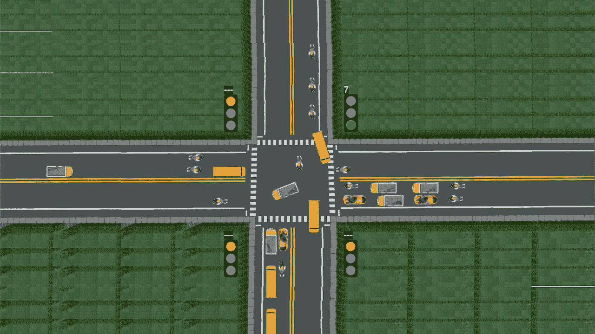
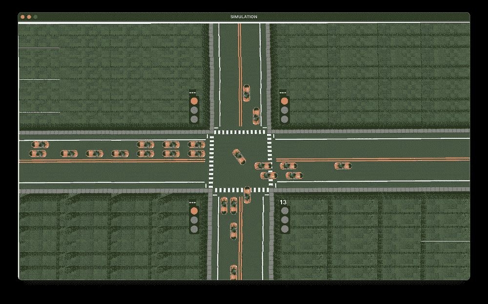
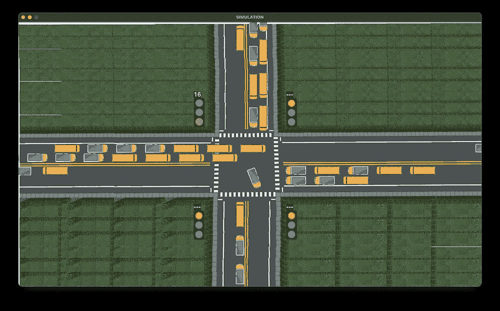

# 使用 Pygame 的交通路口模拟，第 2 部分

> 原文：<https://towardsdatascience.com/traffic-intersection-simulation-using-pygame-part-2-9ce512fdb253?source=collection_archive---------21----------------------->

## 这一系列文章包含了使用 Pygame 从头开始开发交通路口模拟的分步指南。

# 我们增加了什么功能？

> 在本文中，我们将在我的[上一篇文章](/traffic-intersection-simulation-using-pygame-689d6bd7687a)中开发的模拟中添加更多的特性。这种更新的模拟将更接近真实生活场景，可以有效地用于数据分析任务或人工智能应用。首先，我们将为生成的车辆添加**转向功能**。因此，与之前所有车辆直行通过十字路口的模拟不同，在修改后的模拟中，一些车辆将左转，一些车辆将右转，一些车辆将直行。第二，我们将增加一个功能，让我们**在汽车、公共汽车、卡车和自行车中选择我们想要的交通工具类型**。第三，我们将添加一个**随机绿色信号定时器**功能，它将绿色信号时间设置为一个在给定范围内产生的随机数，并有助于建模任务。下面的视频显示了我们将要构建的模拟的最终输出。

模拟的最终输出

# 安装

我们从[上一篇文章](/traffic-intersection-simulation-using-pygame-689d6bd7687a)中停止的地方开始。按照文章中的步骤设置环境并构建一个基本的模拟，看起来有点像 [this](https://youtu.be/ZzKuR2kSqM4) 。在本文中，我们将修改基本模拟，以包括前面提到的附加功能。或者，您可以在这里找到基本模拟的源代码以及设置说明[。](https://github.com/mihir-m-gandhi/Basic-Traffic-Intersection-Simulation/)

# 编码

为了将额外的功能编码到我们现有的模拟中，我们需要添加一些新的变量，定义一些新的函数，并修改一些现有的函数。

## 定义变量

这里，我们增加了两个变量的值，*停止间隙*和*移动间隙*。这样做是为了防止车辆转弯时重叠。

```
# modify existing variables
stoppingGap = 25    
movingGap = 25
```

接下来，我们定义一些实现我们期望的功能所需的新变量。

```
# add new variables
allowedVehicleTypes = {'car': True, 'bus': True, 'truck': True, 'bike': True}
allowedVehicleTypesList = []
vehiclesTurned = {'right': {1:[], 2:[]}, 'down': {1:[], 2:[]}, 'left': {1:[], 2:[]}, 'up': {1:[], 2:[]}}
vehiclesNotTurned = {'right': {1:[], 2:[]}, 'down': {1:[], 2:[]}, 'left': {1:[], 2:[]}, 'up': {1:[], 2:[]}}
rotationAngle = 3
mid = {'right': {'x':705, 'y':445}, 'down': {'x':695, 'y':450}, 'left': {'x':695, 'y':425}, 'up': {'x':695, 'y':400}}
randomGreenSignalTimer = True
randomGreenSignalTimerRange = [10,20]
```

*allowedVehicleTypes* 字典用于控制模拟中将生成哪些车型。 *mid* 字典表示十字路口图像中点的坐标，车辆将从这里右转穿过十字路口。 *randomGreenSignalTimer* 用于控制绿色信号定时器是随机设置还是等于默认值。如果 *randomGreenSignalTimer* 设置为真，则在*randomgreensignaltimerrage*指定的范围内的一个随机数被设置为绿色信号时间。

## 修改车辆类别

我们需要给 *Vehicle* 类添加一些新的属性，并更新 move()函数。*车辆*类别现在具有以下附加属性:

*   *willTurn* :表示车辆在十字路口是否转弯
*   *转向*:表示车辆是否已经转向
*   *旋转角度*:表示每次调用 move()时车辆旋转的角度
*   *crossedIndex* :表示车辆通过路口后，在同方向同车道行驶的车辆中的相对位置
*   *指标*:表示本车在同方向同车道行驶的车辆中的相对位置
*   originalImage:表示车辆的原始图像

构造函数也需要修改以适应这些新的属性。改装车类看起来是这样的。

改装车辆类别

构造函数的后半部分和 *render* ()函数保持不变。

现在是我们代码中最重要也是最复杂的部分， *move* ()函数。让我们关注向右移动的车辆的代码，因为对于其他方向检查相同的条件，并且代码非常相似。

向右移动车辆的部分移动()功能

对于每个方向，我们首先检查车辆是否已经穿过十字路口。这一点很重要，因为如果车辆已经过了马路，那么不管信号是绿色还是红色，它都可以继续行驶，这仅仅取决于前面的车辆。所以当车辆穿越路口时，我们将*穿越*的值设置为 1。现在，如果车辆直行，即不转弯，那么我们将其添加到*未转弯车辆*列表中，并更新其*交叉索引*，这是其在*未转弯车辆*列表中的索引。这样做是因为车辆的顺序在交叉路口后会发生变化，有些会转弯，有些不会，并且之前定义的*车辆*列表对于防止它们重叠没有用。

接下来，如果车辆要转弯，它会直行直到十字路口中间的转弯点。这种移动可能发生在三种情况下:

1.  如果它在交叉路口之前没有到达它的停止点
2.  如果它已经过了十字路口
3.  如果控制车辆行驶方向的交通信号是绿色的

与此同时，我们需要确保在车辆移动时不会与前方车辆重叠。这是通过考虑以下**三个参数**决定的:前方车辆的坐标、前方车辆的宽度/高度和*移动间隙*。此外，如果前面的车辆已经转向，那么我们不必担心重叠。只有当这三个条件中的任何一个都满足并且没有重叠时，车辆的坐标才根据其运动方向通过增加/减少车辆的速度来更新。

一旦车辆越过其转向点，如果*转向*值为 0，则车辆在旋转的同时沿 x 轴和 y 轴移动。一旦*旋转角度*为 90 度，则*转动的*变量被设置为 1，车辆被添加到*车辆转动的*列表中，并且其*交叉索引*被更新。否则，如果*转向*值为 1，车辆仅在与前方车辆有足够的间隙时移动，使用*车辆转向*列表。这是基于上述相同的三个参数来决定的。这种转向逻辑是为两个车道分别编码的，以便对模拟有更多的控制。

> 这是使用原始图像的地方。旋转图像被视为破坏性变换。这意味着每次执行该操作时，图像都会丢失像素数据。因此，重新变换原始图像比多次变换图像要好。因此，我们通过旋转角度来旋转原始图像，并通过修改后的图像来更新图像，同时保持原始图像不变。

最后，如果车辆不打算转弯，那么第一部分保持与转弯车辆相同，它们一直向前移动，直到穿过十字路口。然而，在穿过十字路口后，如果与前面的车辆有足够的距离，他们就移动，这是使用*未转弯车辆*列表发现的。同样，这是基于上述三个参数决定的。

下面给出了整个 *move()* 函数。注意，该功能也是上面定义的*车辆*类的一部分，需要相应地缩进。

完成 move()函数

## 创建 TrafficSignal 类的对象

我们需要修改 *initialize* ()函数，以便如果 *randomGreenSignalTime* 被设置为 True，则 4 个 *TrafficSignal* 对象被初始化为由*randomgreensignaltimerrage*指定的范围内的随机值。

```
def initialize():
    minTime = randomGreenSignalTimerRange[0]
    maxTime = randomGreenSignalTimerRange[1]
    if(randomGreenSignalTimer):
        ts1 = TrafficSignal(0, defaultYellow, random.randint(minTime,maxTime))
        signals.append(ts1)
        ts2 = TrafficSignal(ts1.yellow+ts1.green, defaultYellow, random.randint(minTime,maxTime))
        signals.append(ts2)
        ts3 = TrafficSignal(defaultRed, defaultYellow, random.randint(minTime,maxTime))
        signals.append(ts3)
        ts4 = TrafficSignal(defaultRed, defaultYellow, random.randint(minTime,maxTime))
        signals.append(ts4)
    else:
        ts1 = TrafficSignal(0, defaultYellow, defaultGreen[0])
        signals.append(ts1)
        ts2 = TrafficSignal(ts1.yellow+ts1.green, defaultYellow, defaultGreen[1])
        signals.append(ts2)
        ts3 = TrafficSignal(defaultRed, defaultYellow, defaultGreen[2])
        signals.append(ts3)
        ts4 = TrafficSignal(defaultRed, defaultYellow, defaultGreen[3])
        signals.append(ts4)
    repeat()
```

## 重复()函数

这同样适用于*重复*()功能。唯一的变化是，如果 *randomGreenSignalTimer* 设置为 True，我们在*randomgreensignaltimerrage*【0】和*randomgreensignaltimerrage*【1】之间生成一个随机数，并将其设置为绿灯信号时间。

```
def repeat():
    global currentGreen, currentYellow, nextGreen
    while(signals[currentGreen].green>0):
        updateValues()
        time.sleep(1)
    currentYellow = 1   
    for i in range(0,3):
        for vehicle in vehicles[directionNumbers[currentGreen]][i]:
            vehicle.stop=defaultStop[directionNumbers[currentGreen]]
    while(signals[currentGreen].yellow>0):  
        updateValues()
        time.sleep(1)
    currentYellow = 0  
    minTime = randomGreenSignalTimerRange[0]
    maxTime = randomGreenSignalTimerRange[1]
    if(randomGreenSignalTimer):
        signals[currentGreen].green=random.randint(minTime, maxTime)
    else:
        signals[currentGreen].green = defaultGreen[currentGreen]
    signals[currentGreen].yellow = defaultYellow
    signals[currentGreen].red = defaultRed
    currentGreen = nextGreen 
    nextGreen = (currentGreen+1)%noOfSignals
    signals[nextGreen].red = signals[currentGreen].yellow+signals[currentGreen].green
    repeat()
```

## generateVehicles()函数

*generateVehicles* ()函数修改如下。通过从*allowedVehicleTypesList*中生成一个随机数来设置车辆类型。该列表填充在下面的*主*类中。我们定义一个新的变量 *will_turn* ，初始设置为 0。 *will_turn* 然后用随机数设定为 1，有 40%的几率。最后，除了现有变量之外，在创建 *Vehicle* 类的对象时，这个 *will_turn* 变量也被传入构造函数。

```
def generateVehicles():
    while(True):
        vehicle_type = random.choice(allowedVehicleTypesList)
        lane_number = random.randint(1,2)
        will_turn = 0
        if(lane_number == 1):
            temp = random.randint(0,99)
            if(temp<40):
                will_turn = 1
        elif(lane_number == 2):
            temp = random.randint(0,99)
            if(temp<40):
                will_turn = 1
        temp = random.randint(0,99)
        direction_number = 0
        dist = [25,50,75,100]
        if(temp<dist[0]):
            direction_number = 0
        elif(temp<dist[1]):
            direction_number = 1
        elif(temp<dist[2]):
            direction_number = 2
        elif(temp<dist[3]):
            direction_number = 3
        Vehicle(lane_number, vehicleTypes[vehicle_type], direction_number, directionNumbers[direction_number], will_turn)
        time.sleep(1)
```

## 主类

这里只有一个小补充。我们只需要根据 *allowedVehicleTypes* 字典填充*allowed vehicle types list*。为此，需要将下面的代码添加到主类的开头，如下所示。其余的*主*级保持不变。

```
class Main:
    global allowedVehicleTypesList
    i = 0
    for vehicleType in allowedVehicleTypes:
        if(allowedVehicleTypes[vehicleType]):
            allowedVehicleTypesList.append(i)
        i += 1
```

# 运行代码

是时候看看结果了。启动 cmd/终端并运行命令:

```
$ python simulation.py
```



显示车辆转向的最终模拟输出快照



显示模拟的快照:(I)仅汽车，(ii)仅重型车辆(公共汽车和卡车)

***我们完了！*** 我们在模拟中增加了三个额外的功能——转弯功能、车辆类型控制器和随机绿灯定时器功能。这使得模拟更能代表现实生活中的场景，并给我们更多的控制来定制它，从而成为数据分析以及 AI 或 ML 应用程序的便捷工具。

**源代码:**[https://github . com/mihir-m-Gandhi/Traffic-crossion-Simulation-with-Turns](https://github.com/mihir-m-gandhi/Traffic-Intersection-Simulation-with-Turns)

这是系列文章的第二部分:

*   [使用 Pygame 的交通路口模拟，第 1 部分](/traffic-intersection-simulation-using-pygame-689d6bd7687a)
*   [使用 Pygame 的交通路口模拟，第 2 部分](/traffic-intersection-simulation-using-pygame-part-2-9ce512fdb253)
*   [使用 Pygame 的交通路口模拟，第 3 部分](/traffic-intersection-simulation-using-pygame-part-3-98159178ef30)

这种模拟是作为一个名为“使用人工智能的交通灯智能控制”的研究项目的一部分开发的。查看它的演示视频[这里](https://youtu.be/OssY5pzOyo0)。这项研究工作在 2020 年 IEEE 工程最新进展和创新国际会议(ICRAIE)上提出，并在 IEEE Xplore 上发表。看这里的报纸。

*感谢阅读！我希望这篇文章是有帮助的。如有疑问或需要进一步澄清，欢迎在*[*LinkedIn*](https://www.linkedin.com/in/mihir-gandhi-0706/)*联系我。*