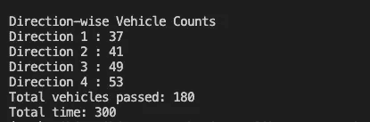
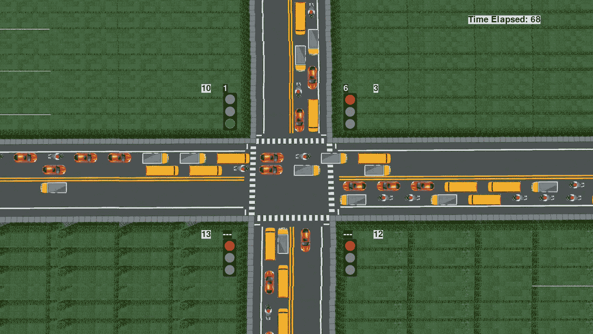

# 使用 Pygame 的交通路口模拟，第 3 部分

> 原文：<https://towardsdatascience.com/traffic-intersection-simulation-using-pygame-part-3-98159178ef30?source=collection_archive---------19----------------------->

## 使用 Pygame 从头开始开发交通路口模拟的分步指南。

# 我们增加了什么功能？

> 在本文中，我们将在我的[上一篇文章](/traffic-intersection-simulation-using-pygame-part-2-9ce512fdb253)中开发的模拟中进一步添加更多的特性。更新后的模拟将显示每个方向穿过交叉路口的车辆的**计数，显示自模拟开始后经过的**时间**，启用设置**模拟持续时间**，**每秒在终端**上打印信号计时器以供分析，并打印一些**统计数据**，如方向车辆计数、车辆总数和模拟结束时的模拟时间。然后，这些统计数据和计时器可用于建模问题，如研究到达间隔时间、等待时间、&周转时间、交通数据分析&交通信号性能分析等数据分析任务，以及智能交通控制的自适应交通灯系统& V2V 通信等人工智能应用。下面的视频显示了我们将要构建的模拟的最终输出。**

模拟的最终输出

# 安装

我们从上一篇[文章](/traffic-intersection-simulation-using-pygame-part-2-9ce512fdb253)中停止的地方开始。按照文章中的步骤设置环境并构建模拟，看起来有点像 [this](https://youtu.be/Kq-G5G1XAa0) 。在本文中，我们将修改模拟，以包括前面提到的附加功能。你可以在这里找到模拟的源代码以及设置说明。

# 编码

为了将额外的功能编码到我们现有的模拟中，我们需要添加一些新的变量，定义一些新的函数，并修改一些现有的函数。

## 导入所需的库

只需要导入一个额外的库，即“os”。

```
import os
```

## 定义变量

我们需要定义一些新的变量来实现我们想要的功能。

```
timeElapsed = 0
simulationTime = 300
timeElapsedCoods = (1100,50)
vehicleCountTexts = ["0", "0", "0", "0"]
vehicleCountCoods = [(480,210),(880,210),(880,550),(480,550)]
```

timeElapsed 变量存储自模拟开始以来经过的时间值，初始设置为 0。simulationTime 变量以秒为单位表示模拟持续时间，因此值 300 表示 300/60，即 5 分钟。vehicleCountTexts 表示以[右、下、左、上]方向穿过交叉口的车辆数量。timeElapsedCoods 和 vehicleCountCoods 表示 timeElapsed 和 vehicleCountTexts 将在屏幕上呈现的坐标。

交通信号和车辆类别没有变化。

## printStatus()函数

该功能每秒钟在终端上打印所有 4 个信号的定时器值。此功能使我们能够检查模拟场景中的幕后情况，并仔细分析计时器值。

```
def printStatus():
    for i in range(0, 4):
        if(signals[i] != None):
            if(i==currentGreen):
                if(currentYellow==0):
                    print(" GREEN TS",i+1,"-> r:",signals[i].red," y:",signals[i].yellow," g:",signals[i].green)
                else:
                    print("YELLOW TS",i+1,"-> r:",signals[i].red," y:",signals[i].yellow," g:",signals[i].green)
            else:
                print("   RED TS",i+1,"-> r:",signals[i].red," y:",signals[i].yellow," g:",signals[i].green)
    print()
```

计时器打印在终端上，如下图所示。格式如下:
signal color SignalNumber→r:red timer y:yellow timer g:green timer，其中 signal number 从左上开始，顺时针移动到左下。

端子上印有信号计时器

## 重复()函数

因为我们希望每秒在终端上打印计时器，所以我们在 repeat 函数()的 while 循环中调用 printStatus()函数，如下所示。

```
def repeat():
    global currentGreen, currentYellow, nextGreen
    while(signals[currentGreen].green>0):
        **printStatus()**
        updateValues()
        time.sleep(1)
    currentYellow = 1   
    for i in range(0,3):
        for vehicle in vehicles[directionNumbers[currentGreen]][i]:
            vehicle.stop=defaultStop[directionNumbers[currentGreen]]
    while(signals[currentGreen].yellow>0):  
        **printStatus()**
        updateValues()
        time.sleep(1)
    currentYellow = 0  
    minTime = randomGreenSignalTimerRange[0]
    maxTime = randomGreenSignalTimerRange[1]
    if(randomGreenSignalTimer):
        signals[currentGreen].green=random.randint(minTime, maxTime)
    else:
        signals[currentGreen].green = defaultGreen[currentGreen]
    signals[currentGreen].yellow = defaultYellow
    signals[currentGreen].red = defaultRed
    currentGreen = nextGreen 
    nextGreen = (currentGreen+1)%noOfSignals
    signals[nextGreen].red = signals[currentGreen].yellow+signals[currentGreen].green
    repeat()
```

## showStats()函数

当我们退出模拟或当 time elapsed 等于 simulationTime 时模拟自行终止时，此函数打印方向车辆计数以及累计统计数据，如从所有方向穿过交叉口的车辆总数以及模拟结束时经过的总时间。

```
def showStats():
    totalVehicles = 0
    print('Direction-wise Vehicle Counts')
    for i in range(0,4):
        if(signals[i]!=None):
            print('Direction',i+1,':',vehicles[directionNumbers[i]]['crossed'])
            totalVehicles += vehicles[directionNumbers[i]]['crossed']
    print('Total vehicles passed:',totalVehicles)
    print('Total time:',timeElapsed)
```



模拟结束时，统计数据打印在终端上

## simTime()函数

该函数负责每秒更新 timeElapsed 变量，并在 timeElapsed 等于 simulationTime 时终止模拟。正如我们在下面看到的，showStats()在退出之前被调用。

```
def simTime():
    global timeElapsed, simulationTime
    while(True):
        timeElapsed += 1
        time.sleep(1)
        if(timeElapsed==simulationTime):
            showStats()
            os._exit(1)
```

## 主类

我们需要对主类做一些补充。首先，我们需要为 simTime()函数创建一个新线程，它每秒更新一次 timeElapsed(第 23–25 行)。其次，我们需要在退出模拟之前调用 showStats()(第 32 行)。第三，我们需要添加代码以在模拟屏幕上显示车辆计数和经过的时间(第 55–63 行)。主类的其余部分保持不变。

更新的主类

# 运行代码

是时候看看结果了。启动 cmd/终端并运行命令:

```
$ python simulation.py
```



最终模拟输出的快照，在右上角显示每个信号旁边的车辆计数和经过的时间(图片由作者提供)

***现在我们有了最后的模拟！*** 我们在模拟中增加了一些统计和分析功能——车辆计数、经过的时间、终端上打印的计时器、模拟结束时的累积统计数据，以及设置模拟结束时间的能力。这些统计数据、计时器和日志在建模问题、数据分析任务和 AI 应用程序中非常有用。在根据您的应用定制仿真时，它们也有助于有效的调试。

**源代码:**[https://github . com/mihir-m-Gandhi/Traffic-crossion-Simulation-with-Stats](https://github.com/mihir-m-gandhi/Traffic-Intersection-Simulation-with-Stats)

这是系列文章的第三部分:

*   [使用 Pygame 的交通路口模拟，第 1 部分](/traffic-intersection-simulation-using-pygame-689d6bd7687a)
*   [使用 Pygame 的交通路口模拟，第 2 部分](/traffic-intersection-simulation-using-pygame-part-2-9ce512fdb253)
*   [使用 Pygame 的交通路口模拟，第 3 部分](/traffic-intersection-simulation-using-pygame-part-3-98159178ef30)

这种模拟是作为一个名为“使用人工智能的交通灯智能控制”的研究项目的一部分开发的。点击查看其演示视频[。这项研究工作在 2020 年 IEEE 工程最新进展和创新国际会议
(ICRAIE)上提出，并发表在 IEEE Xplore 上。在这里阅读论文](https://youtu.be/OssY5pzOyo0)。

*特别感谢* [*达尔山*](https://medium.com/u/78c2014c2051?source=post_page-----98159178ef30--------------------------------) *和* [*杰尼尔·沙阿*](https://medium.com/u/8512afd7d5e9?source=post_page-----98159178ef30--------------------------------) *为本系列所有文章进行校对。*

*感谢阅读！我希望这篇文章是有帮助的。如有疑问或需要进一步澄清，欢迎联系我*[*LinkedIn*](https://www.linkedin.com/in/mihir-gandhi-0706/)*。*