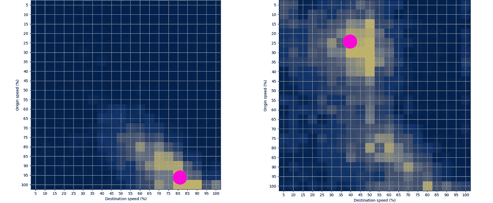
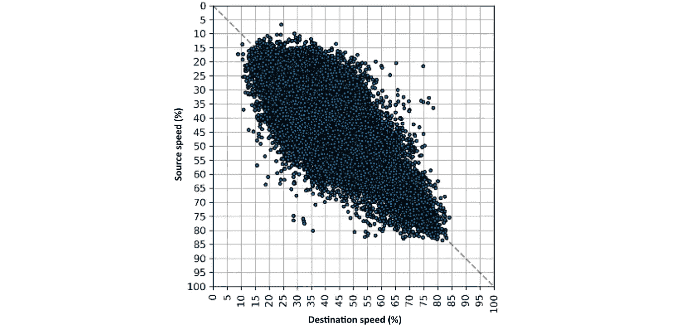
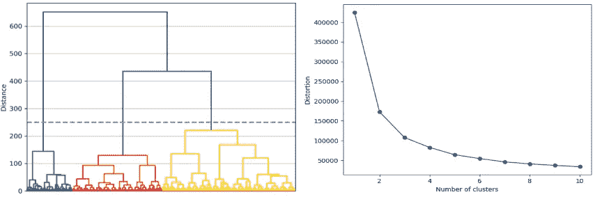
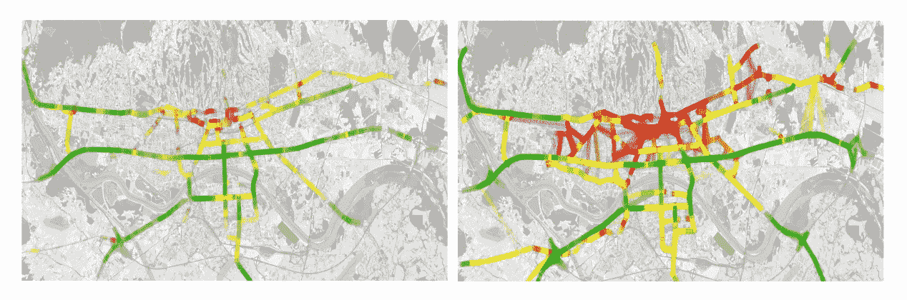

# 基于速度转移矩阵的道路交通状态聚类

> 原文：<https://towardsdatascience.com/traffic-state-classification-using-the-speed-transition-matrices-36f7a03ca776?source=collection_archive---------20----------------------->

## 一种新的城市交通状态分类方法

[阿尔瓦罗·雷耶斯](https://unsplash.com/@alvarordesign?utm_source=medium&utm_medium=referral)在[号航天飞机](https://unsplash.com?utm_source=medium&utm_medium=referral)上拍摄的照片

[速度转移矩阵(STM)](https://medium.com/analytics-vidhya/speed-transition-matrix-novel-road-traffic-data-modeling-technique-d37bd82398d1) 是一种用于交通状态估计、异常检测等各种交通相关分析的新型交通数据技术。本文将展示 STM 在处理 GPS 数据时如何应用于交通状态分类问题。整张纸可以在这里找到[【1】](https://www.researchgate.net/publication/344138884_Traffic_State_Estimation_and_Classification_on_Citywide_Scale_Using_Speed_Transition_Matrices)。

# 介绍

聚类技术主要用于对未标记的数据集进行分组。处理流量数据时，目标是将数据群集到遵循相似流量模式的组中。这样，对大型流量数据集的分析就更简单，也更容易解释。在本文中，我们试图对数据进行分组，以表示不同的流量状态，如“拥塞”、“不稳定流量”等。 [[2]](https://www.sciencedirect.com/science/article/abs/pii/S0968090X09001430?via%3Dihub) 。

时间序列最常用于表示交通参数的变化，如速度、延误或交通量。大多数情况下，需要聚合大量数据来创建此类时间序列。在这一步中，会出现不同的问题，大多与较大的偏差有关。STM 就是为了解决这个问题而提出的，它提供了一种从交通数据中提取更多信息的方法。

如欲了解更多关于 STM 的信息，请参考以下文章:

<https://medium.com/analytics-vidhya/speed-transition-matrix-novel-road-traffic-data-modeling-technique-d37bd82398d1>  

# 方法学

## **1。使用质心**

第一步是只使用 2D 空间中的一个点来表示 STM。我们将通过估算每个观测 STM 的质心(COM)来完成:

每个 STM 的 COM 估计(图像作者:作者)

正如我们在图片中看到的，COM 是处理 STM 的一个重要特性。它显示了两个连续路段之间最可能的速度转换。当它被放置在右下角时，它表示正常的交通流量，因为车辆在起点和终点链接上的速度很快。另一方面，当放置在左上角时，它表示拥塞，因为起点和目的地链接的速度非常低。

当我们计算每个 STM 的 COMs 时，结果如下:

每个观测到的 STM 的 COM 计算结果(图片来源:作者[1])

## **2。聚类**

现在，我们使用一些聚类方法来定义最佳的聚类数。每个聚类将代表一个交通状态。当应用分层凝聚聚类和拐点方法时，得到的聚类数为 3。图片在这里:

层次凝聚聚类和膝盖方法的结果(图片来源:作者[1])

这些类别的标签定义如下:

1.  “自由流”——车辆之间几乎没有相互作用的交通流。
2.  “稳定流”——有一些相互作用的交通流，没有严重的后果。
3.  “拥堵”——拥堵的交通流量导致交通堵塞。

## **3。领域知识验证**

验证过程涉及到将得到的类与领域知识数据进行比较。众所周知的服务水平(LoS)的 HCM 值代表了用于交通状态估计过程的特定领域知识数据。HCM 根据驾驶速度值为路段定义了六个服务级别，从 A 到 F，其中 LoS A 代表最佳驾驶条件，LoS F 代表最差驾驶条件。首先，以如下方式将 LoS 值合并为三个类别:(I)由标记为 A 和 B 的 LoS 表示的自由流动交通状况，(ii)由标记为 C 和 D 的 LoS 表示的交通状况被标记为稳定，以及(iii)由 LoS 表示的拥堵交通状况被标记为 E 和 f。然后，标记的数据集被用作基础真值，并与聚集聚类结果进行比较。总准确率为 91%，混淆矩阵如下图所示:

困惑矩阵(图片作者:作者[1])

## 4.形象化

下图显示了所获得结果的可视化效果。结果显示为非高峰时间(左)和高峰时间间隔(右)。

三类可视化:拥堵(红色)、稳定流(黄色)和自由流(绿色)

# 结论

在这篇文章中，STM 被描述为一种新颖的交通数据建模技术，显示了巨大的交通数据表示和分析潜力。交通状态估计只是使用 STM 可以解决的许多问题之一。最近的论文[【3】](https://www.researchgate.net/publication/344667216_Spatiotemporal_Traffic_Anomaly_Detection_on_Urban_Road_Network_Using_Tensor_Decomposition_Method)[【4】](https://www.researchgate.net/publication/344471121_Measure_for_Traffic_Anomaly_Detection_on_the_Urban_Roads_Using_Speed_Transition_Matrices)展示了一些检测流量异常的有趣应用。

这是第一篇发表的论文，展示了应用 STMs 的可能性！如果您对这类研究感兴趣，请随时关注我的文章。这仍然是一项“进行中的工作”，所以如果你有任何问题或建议，请随时评论或联系我！

领英:【https://www.linkedin.com/in/leo-tisljaric-28a56b123/ 

## 参考

[1]l . tiljari，T. Cari，B. Abramovi 和 T. Fratrovi，[使用速度转换矩阵对全市范围内的交通状态进行评估和分类(2020)](https://www.researchgate.net/publication/344138884_Traffic_State_Estimation_and_Classification_on_Citywide_Scale_Using_Speed_Transition_Matrices) ，*可持续性*，12，18:7278–7294

[2] J.C. Herrera，D.B. Work，R. Herring，X.J. Ban，Q. Jacobson，A.M. Bayen，[通过支持 GPS 的移动电话获得的交通数据的评估:移动世纪现场实验(2010)](https://www.sciencedirect.com/science/article/abs/pii/S0968090X09001430?via%3Dihub) ， *Transp。零件紧急情况。技术，18，1:568–583。*

[3]l . tiljari，S. Fernandes，T. Cari，和 J. Gama，[利用张量分解方法对城市道路网进行时空交通异常检测](https://www.researchgate.net/publication/344667216_Spatiotemporal_Traffic_Anomaly_Detection_on_Urban_Road_Network_Using_Tensor_Decomposition_Method) (2020)，载于*发现科学。计算机科学讲义*，A. Appice、G. Tsoumakas、Y. Manolopoulos 和 S. Matwin 编辑。湛:施普林格，12323，1:674–688。

[4]l . tiljari，Majstorovi、T. Erdeli 和 T. Cari，[使用速度转换矩阵进行城市道路交通异常检测的措施(2020)](https://www.researchgate.net/publication/344471121_Measure_for_Traffic_Anomaly_Detection_on_the_Urban_Roads_Using_Speed_Transition_Matrices) ，载于*国际信息和通信技术、电子和微电子会议记录*，268–275。