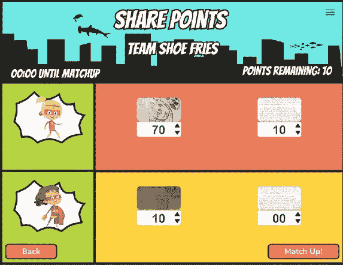
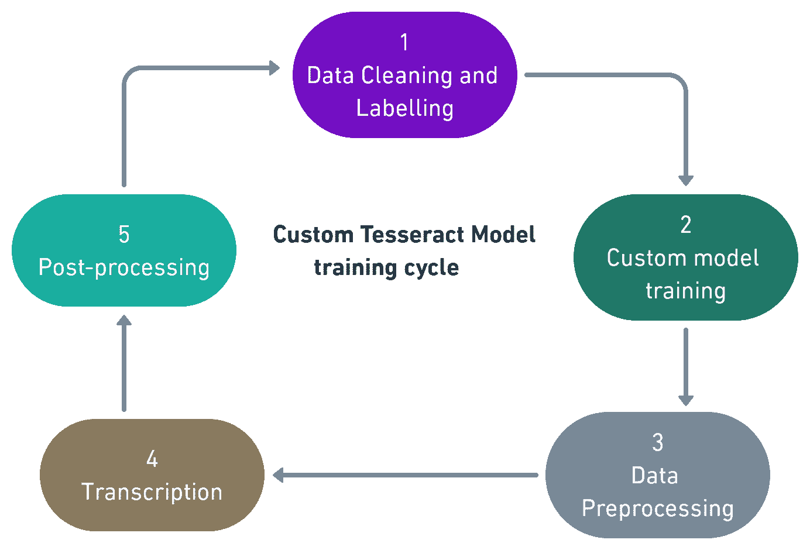
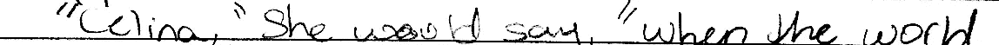
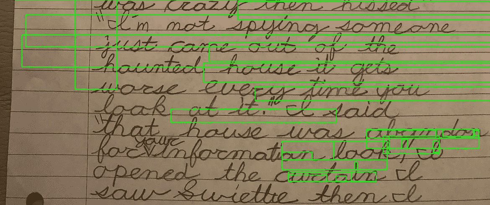
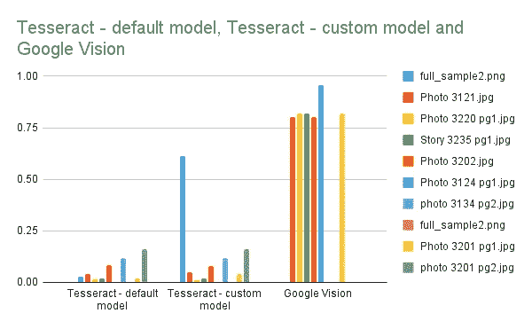

# 训练自定义的 Tesseract OCR 模型，作为阅读儿童笔迹的 Google vision 的替代方案

> 原文：<https://towardsdatascience.com/train-a-custom-tesseract-ocr-model-as-an-alternative-to-google-vision-ocr-for-reading-childrens-db8ba41571c8?source=collection_archive---------9----------------------->

## *一个故事小队项目*

T 他是 [Story Squad](https://www.storysquad.education/) 的联合创始人，Graig Peterson 和 Darwin Johnson 开创了一个平台，让孩子们有机会发挥创造力，提高他们的阅读和写作能力，同时减少他们花在屏幕上的时间。故事班通过游戏化来保持这个过程的趣味性。

图片由故事小队提供

> **那么，这个游戏是如何让孩子们参与进来，而不是在他们的屏幕上呢？**

下面是一个解释故事班的视频:

Graig Peterson(Story Squad 的联合创始人)的视频

**什么是 OCR？** 光学字符识别(OCR)是一种从扫描文档或图像文件的打印或手写文本中自动提取数据的解决方案。然后，文本被转换成可以通过数据处理进行操作的形式。OCR 有许多应用，例如，支票、护照、银行结单和收据等商业文件的数据输入、自动车牌识别和交通标志识别。

**为什么这个项目需要 OCR？**

我们需要转录孩子们上传的故事，并处理转录。在游戏中，每个孩子都需要与另一个写作水平相似的孩子配对，每个团队都应该与同一类别的另一个团队配对，这样游戏才会有竞争性和趣味性。这就是数据科学团队的用武之地。

*   使用 NLP 工具来找出写作的复杂程度，可以对参与者进行适当的分组。
*   我们需要 OCR 在家长仪表板上创建一个单词云，让家长看到他们的孩子写了什么。
*   我们需要监控孩子的进步(随着时间的推移，他们的复杂程度有所提高吗？他们平均写多少字？)
*   我们还想标记不恰当的词语。尽管每个故事都会被人看到，但我们会采取一切预防措施，通过添加自定义的脏话过滤器，让平台成为孩子们的安全空间。

**tessera CT OCR Vs Google vision OCR** Google vision 正在以大约 80–95%的准确率记录手写图像。我们现在面临的问题是这项服务是有价格标签的。利益相关者希望降低这些成本。

DS 团队的任务是训练一个宇宙魔方 OCR 模型，一个开源的 OCR，作为 Google vision 的替代方案。

**宇宙魔方 OCR 模型训练周期**

图片由作者提供

1.  数据准备:数据清理和标记

Tesseract OCR 接收分段的手写图像及其相应的转录文本(基本事实)。这对需要有相同的名字<name>。图像的 tif 或转录文本文件的 <name>.gt.txt。该模型也可以在 png 图像上训练。</name></name>

图片由作者提供

> “塞利纳，”她会说，“当世界

如果存在文件命名不匹配，训练将会中断。您必须通过删除或重命名受影响的文件来纠正不匹配。repo(utils/check _ ground truth _ files _ pair . py)中有一个脚本可以检查是否存在不匹配。那些进行数据清理的人可以在将数据推送到回购之前纠正这些错误。此外，由于 [COPPA](https://www.ftc.gov/enforcement/rules/rulemaking-regulatory-reform-proceedings/childrens-online-privacy-protection-rule) ，GitHub 上不允许儿童写作的完整图像。有一个脚本检查数据中的完整图像(utils/essay check _ w _ image _ height . py)。

过去，数据准备有两种不同的方式。文件夹 32 和 52 中的图像经过预处理，将图像二值化，然后使用命令行上的脚本将它们分段。文件夹 31-和 51-(只有最后 5 个故事)被清理，并使用画图软件和另一个手动 python 脚本(不包括在 repo 中)手工标记。文件夹 31 在剪辑前没有二进制化。你可以在 ds repo/data/story-squad-ground-truth 中找到经过清理和标记的数据。

开发了一个数据管道来实现数据准备过程的半自动化。您可以在 data_management 文件夹中找到它。

2.宇宙魔方模型定型和调整

*   GPU 箱将由讲师设置
*   下载 *pem* 键获得进入 EE2 机器的许可
*   在终端*中，使用 pem 键将 cd* 放入目录，并运行 ssh 命令以进入 EE2 机器
*   git 克隆 ds repo(如果 repo 中有新数据，将其移动到*tes strain \ \ data \ \ story squad-ground-truth*dir)
*   在根目录下运行*source training _ setup . sh*命令
*   cd 进入*test strain*并通过运行命令*source ocr \ \ bin \ \ activate*激活虚拟环境。如果有效，您应该切换到(OCR)环境
*   在 *tesstrain* dir 中运行该命令来训练模型 make training*MODEL _ NAME = story squad START _ MODEL = eng Tess data =/home/Ubuntu/tesserac t/Tess data*
*   上面的命令将使用默认的超参数来训练模型。要调整超参数，必须修改命令行以指示超参数，例如，如果您想将 PSM 设置为 7 而不是使用默认值，则必须修改命令行。
*   注意:这大约需要一个小时来运行。如果 ground_truth 和 snippet 之间有任何不匹配，将会出现一个错误。你需要进入 *story-squad-ground-truth* 目录，通过删除或上传相应的文件来解决问题。当问题解决后，只需再次运行训练命令，模型将从出错的地方开始。
*   一旦模型完成训练，新的模型将被存储在*测试应变\ \数据*中。现在默认的名字是 *storysquad.traineddata* 。如果新模型没有被移动到另一个目录或重命名，它们将覆盖旧模型。

由于 EC2 实例没有足够的空间让 tesseract 训练更多的数据，因此为将来的 tesseract 训练建立了一个 docker 文件*` ds repo \ docker file _ tessera CT _ training`*。

**3 & 4 数据预处理和转录**

在使用新模型转录图像之前，进行数据预处理。每个图像需要不同的预处理方法。如果图像是打印文本，它几乎不需要预处理。有几个预处理方法是通用的，你总是想确保图像没有倾斜，并以一种或另一种形式二值化。印刷文本不需要太多的预处理。Tesseract OCR 可以准确地读取印刷文本和整洁书写的文字，但可能难以转录独特的字体和低质量的图像。

图片由作者提供

使用十个故事和它们相应的基本事实(人类转录的)来测试模型性能。我们还使用了一个整洁的手写图像作为对照(这个图像几乎不需要预处理)。

这个阶段包括使用 NLP 技术来提高转录文本的准确性。对于大多数 OCR 应用程序来说，这个阶段是必不可少的。然而，利益相关者希望保留儿童的话语。如果他们拼错了一个单词，自然语言处理技术可能会纠正它。
我们专注于使用准确度分数评估模型。我们遇到了准确性分数的问题。该模型对一些它根本无法转录的图像给出了很高的精确度。未来的群组可能会考虑使用其他评估指标，如余弦相似度、CER(字符错误率)和 WER(单词错误率)。

**关键时刻**

我们在整洁的手写图像(full_sample2.png)上使用模型取得了一些进展。准确率分数提高了 13%。不幸的是，该模型在儿童手写图像上表现不佳。我们的准确率在 0-20%之间。预处理图像将一些分数提高了大约 10%。

图片由作者提供

**接下来是什么？**

我们还有很长的路要走。DS 团队需要与经理和利益相关者讨论前进的方向。

以下是我们认为有助于继续我们工作的一些任务。

*   清除更多数据
*   构建一个 ML 基础设施，用于自动化关于模型结构、超参数和性能指标的重要信息
*   数据管道的优化
*   使用 Docker 容器进行 OCR 训练
*   构建预处理管道

**参考文献**

兰姆达学校涂鸦体育场 DS 回购:【https://github.com/Lambda-School-Labs/scribble-stadium-ds 

儿童在线隐私保护规则(“COPPA”):[https://www . FTC . gov/enforcement/rules/Rule making-regulatory-reform-proceedings/children-Online-Privacy-Protection-Rule](https://www.ftc.gov/enforcement/rules/rulemaking-regulatory-reform-proceedings/childrens-online-privacy-protection-rule)

故事小队(Scribble stadium):[https://www . story Squad . education/](https://www.storysquad.education/)