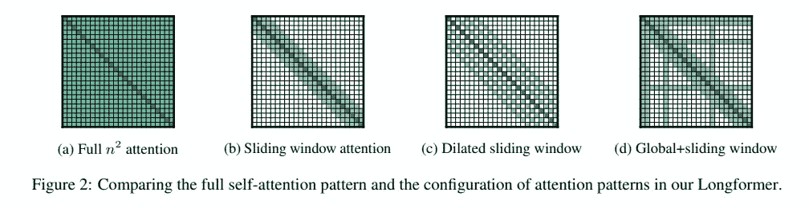

# 训练一个用于检测超参数新闻内容的长模型

> 原文：<https://towardsdatascience.com/train-a-longformer-for-detecting-hyperpartisan-news-content-7c141230784e?source=collection_archive---------39----------------------->

## 用数据做很酷的事情


资料来源:联合国人口与发展论坛—[https://unsplash.com/photos/WYd_PkCa1BY](https://unsplash.com/photos/WYd_PkCa1BY)

# 介绍

超党派新闻被描述为极度偏向一个政党的新闻。这可能是极左或极右。不幸的是，目前美国存在着严重的政治两极分化。人们只喜欢他们群体成员分享的政策和观点。最近美国国会大厦的骚乱暴露了自由派和保守派选民之间日益扩大的差距。随着时间的推移，这种政治分歧越来越大。查看皮尤研究中心关于 2020 年惊人发现的[这篇文章](https://www.pewresearch.org/fact-tank/2020/12/11/20-striking-findings-from-2020/)。他们的研究表明，拜登和特朗普的选民在美国核心价值观等基本问题上存在根本分歧。80%的拜登支持者认为，特朗普的支持者不仅在政治方面有不同的优先考虑，而且有不同的核心价值观。同样比例的特朗普支持者对另一个阵营也有同样的想法。这是惊人的不信任！

在许多情况下，现有的新闻媒体通过让读者接触高度党派化的观点，加剧了这种两极分化。在这篇博客中，我想使用一个 Longformer 模型来检测超参数新闻。如果可以检测到超级名人新闻，那么这些新闻就会被自动标记，要么被删除，要么至少读者会被告知。这个模型的代码可以在我的 Colab 笔记本[这里](https://colab.research.google.com/drive/1wdCKvXGeOY4lLZMLdpeMzclbHhqn9JFR?usp=sharing)找到。我也上传到我的 GitHub [这里](https://github.com/priya-dwivedi/Deep-Learning/blob/master/Longformer_HyperPartisan_news/Longformer_classifier_HyperPartisan_News.ipynb)。

# 数据集和预处理

对于这个博客，我们使用[超级新闻数据集](https://www.aclweb.org/anthology/S19-2145/)。语义评估研讨会公开了这个数据集。我已经用 [HuggingFace 数据集库](https://github.com/huggingface/datasets)下载了它。数据集库提供了一个简单的 API 来下载和访问数据集。

```
!pip install datasetsdataset  = datasets.load_dataset('hyperpartisan_news_detection', 'bypublisher')
```

数据集在训练集中有 60 万篇新闻文章，在验证集中有 60 万篇。每篇文章都有一个“真/假”的标签，其中“真”意味着文章是超参数的。

标记为“超级艺术家”的文章示例如下:

```
As we prepare for oral arguments Friday before a federal appeals court in Washington, D.C. in our appeal of our lawsuit challenging ObamaCare, it\'s important to note that a growing number of Americans reject the pro-abortion, government-run, and costly health care law. In a new poll released by <a href="http://www.rasmussenreports.com/public_content/politics/current_events/healthcare/health_care_law">Rasmussen</a>, 56% of likely voters favor repeal of ObamaCare, while 52% say the health care law is bad for the country. A clear majority of voters have favored repeal of the law in every Rasmussen survey but one since the measure was passed by Congress in March of last year. As you may recall, our legal team is preparing for critical arguments before a three-judge panel of a federal appeals court in Washington on Friday. We\'re appealing a lower court decision dismissing our federal lawsuit which challenges the constitutionality of ObamaCare. We filed our lawsuit in federal
```

在文章被发送用于训练之前，我们对其进行一些基本的预处理。我已经用漂白剂库清理了文章中的 HTML 标签。我还随机抽取了 20K 个样本进行训练，5K 个样本进行验证。这是为了加快训练过程。

数据预处理中的一个关键步骤是确定文章的令牌长度。转换器将截断所有长于令牌长度的内容，并填充任何短于令牌长度的内容。使用 Longformer 模型的主要优点之一是，它可以使用多达 4096 个令牌的令牌长度进行训练。这里我们将令牌化到最大长度为 2048 个令牌。下面的代码片段进行了标记化。

```
encodings = tokenizer.encode_plus(text_, pad_to_max_length=True,          max_length=2048,add_special_tokens=True,return_token_type_ids=False,return_attention_mask=True,padding='max_length', truncation=True)
```

> 典型的转换器模型可以接收 512 或 1024 个令牌，这可能不足以解决许多问题。Longformer 的主要优势之一是能够处理更长的序列。

# 龙前模特培训

[long former](https://arxiv.org/pdf/2004.05150.pdf)—long document transformer 是艾伦人工智能研究所 2020 年发布的模型。基于转换器的模型不能处理长序列，因为它们使用的注意力机制是二次缩放的。因此，大多数 transformer 模型只能处理 512 或 1024 个令牌。Longformer 提出了一种与序列长度成线性比例的注意机制。这是通过使用局部窗口注意和特定任务的全局注意来实现的。Longformer 模型在长文档任务上优于 BERT/RoBERTa。

下图显示了不同的注意机制。在图 a 中，常规变压器使用完全二次注意，而 Longformer 使用基于窗口的局部注意+选择的全局注意，如在图 d 中所示。



来源:[龙前论文](https://arxiv.org/pdf/2004.05150.pdf)

为了训练这个模型，我们使用了[拥抱脸变形金刚 repo](https://github.com/huggingface/transformers) 。Longformer 模型初始化如下所示:

```
self.model = LongformerForSequenceClassification.from_pretrained("allenai/longformer-base-4096", return_dict=True, num_labels=2)self.tokenizer = LongformerTokenizer.from_pretrained('allenai/longformer-base-4096')
```

我创建了一个基于 PyTorch Lightning 的 LongformerFineTuner 类来执行训练和验证。该模型在 20K 篇新闻文章的训练集上被训练 2 个时期。定期执行验证，并输出准确度分数。

请在我的 [colab 笔记本](https://colab.research.google.com/drive/1wdCKvXGeOY4lLZMLdpeMzclbHhqn9JFR?usp=sharing#scrollTo=MCZJQ6QUZhRu)或 Github [这里](https://github.com/priya-dwivedi/Deep-Learning/blob/master/Longformer_HyperPartisan_news/Longformer_classifier_HyperPartisan_News.ipynb)找到完整代码。

我用 Colab Pro 训练过这个模型。整个培训大约花了 7 个小时。

# 模型评估

在验证集上评估训练的模型。模型的总体准确率为 93.4%。

该模型的精确度、召回率和 F1 值为:

```
 precision    recall  f1-score   support
Not HyperPartisan       0.95      0.92      0.93      7572
   Hyper Partisan       0.92      0.95      0.93      7428accuracy                                    0.93     15000
   macro avg            0.93      0.93      0.93     15000
weighted avg            0.93      0.93      0.93     15000
```

该模型正确地识别出下面的天气相关文章不是超参数的。

```
Input Text: <s>July 31 (UPI) &#8212; A tropical depression off the Gulf Coast of Florida was upgraded to a tropical storm on Monday, the National Hurricane Center said. The storm was designated Tropical Storm Emily on Monday morning &#8212; the fifth named storm of the 2017 Atlantic hurricane season. Emily is moving eastward with strong winds at about 8 mph, and is expected to bring very heavy rain to south and central Florida in the coming days. Monday, officials said 60 mph winds forced the closure of the Sunshine Skyway Bridge in St. Petersburg and caused some infrastructure damage. No serious injuries have yet been reported. A <a href="[http://www.sun-](http://www.sun-/) sentinel.com/news/weather/fl-reg-tropics-monday-20170731-story.html">tropical storm warning</a> was issued early Monday for the west coast of Florida, from Anclote River southward to Bonita Beach. The tropical storm made landfall at about 10:45 a.m., on Anna Maria Island, near Bradenton. Emily is expected to turn northeast as it passes over the state, indicating central Florida will receive much of the expected rain. The storm is expected to move offshore to the Atlantic Ocean by early Tuesday. Rain accumulations of two to four inches are predicted for the state&#8217;s west coast, the <a href="[http://www.nhc.noaa.gov/text/refresh/MIATCPAT1+shtml/311139.shtml](http://www.nhc.noaa.gov/text/refresh/MIATCPAT1+shtml/311139.shtml)">National Hurricane Center</a> said, with isolated amounts of up to eight inches possible
```

下面的这篇文章被正确地识别为一篇超级名人新闻。实际 1300+字的文章被 Longformer 不加删节的摄取！

```
'A combative President Trump launched an urgent, last-ditch bid Wednesday to revive an Obamacare repeal effort that had been left for dead just 24 hours earlier, imploring Republicans to stay in Washington until the job is done and warning that failure would decimate the party and its agenda.I'm ready to act, Mr. Trump said at the White House. For seven years you've promised the American people that you would repeal Obamacare. People are hurting. Inaction is not an option. The urgent public plea marked a confrontational shift in tone for Mr. Trump, who had been lobbying senators mainly behind the scenes, and a renewed commitment to the effort. One day earlier,Mr. Trump said Republicans should force Democrats to own Obamacare by letting it collapse under its unsustainable weight.SEE ALSO: Trump hosting GOP senators at White House on Obamacare repeal Mr. Trump got personal at times, leaning into Sen. Dean Heller, a Nevada Republican who faces a tough re-election battle next year and is wary of backing the repeal-and-replace effort....
```

我喜欢将自然语言处理应用于政治/新闻文章。我写过其他关于这个话题的有趣的博客。请查看[这篇](/election-special-train-a-gpt-2-to-generate-donald-trump-speeches-b66fc3aa92b9)关于使用 GPT2 的语言生成能力生成唐纳德·川普风格的演讲的文章和[这篇](/election-special-detect-fake-news-using-transformers-3e38d0c5b5c7)关于使用 T5 变压器检测假新闻的文章。

# 结论

这篇博客提出了一个解决超级名人新闻这一紧迫问题的方案。如果可以在社交媒体/博客上识别和标记极左/极右文章，那么它们可能有助于缩小两个政党之间日益扩大的差距。此外，本博客使用 Longformer 进行检测。我个人认为 Longformer 或处理更长序列的类似模型更实用，并将成为未来的趋势。我们能够处理 2048 个代币，并且仍然在合理的时间内训练。Longformer 可以扩展到其他任务，包括长文本问答或长文本摘要。如果你需要帮助，请直接联系我。

我希望您尝试一下代码，并训练自己的模型。请在下面的评论中分享你的经历。

在[深度学习分析](https://deeplearninganalytics.org/)，我们非常热衷于使用机器学习来解决现实世界的问题。我们已经帮助许多企业部署了创新的基于人工智能的解决方案。如果您看到合作的机会，请通过我们的网站[这里](https://deeplearninganalytics.org/contact-us/)联系我们。

# 参考

*   [龙前](https://arxiv.org/abs/2004.05150)
*   [拥抱脸变形金刚](https://huggingface.co/transformers/model_doc/longformer.html)
*   [政治上的两极分化](https://www.pewresearch.org/fact-tank/2020/12/11/20-striking-findings-from-2020/)