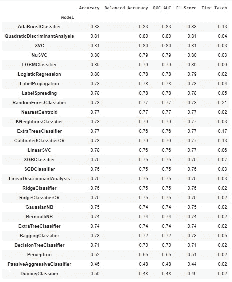
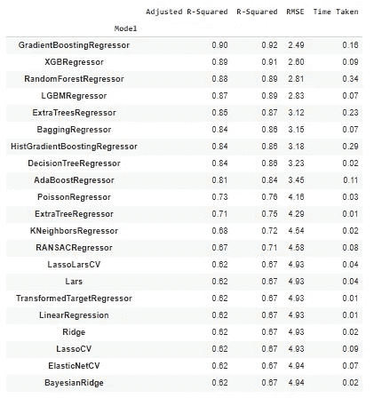
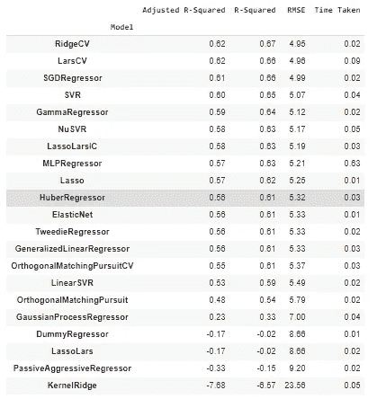

# 在一行 Python 代码中训练所有分类或回归模型

> 原文：<https://towardsdatascience.com/train-all-classification-or-regression-models-in-one-line-of-python-code-4ccdcaf01f0c?source=collection_archive---------5----------------------->

## 使用 lazypredict 进行自动化模型训练


图片由[穆罕默德·哈桑](https://pixabay.com/users/mohamed_hassan-5229782/?utm_source=link-attribution&amp;utm_medium=referral&amp;utm_campaign=image&amp;utm_content=6038877)来自 [Pixabay](https://pixabay.com/?utm_source=link-attribution&amp;utm_medium=referral&amp;utm_campaign=image&amp;utm_content=6038877)

自动化机器学习(Auto-ML)是指自动化数据科学模型开发管道的组件。AutoML 减少了数据科学家的工作量，加快了工作流程。AutoML 可用于自动化各种管道组件，包括数据理解、EDA、数据处理、模型训练、超参数调整等。

对于端到端的机器学习项目，每个流水线组件的复杂度取决于项目。有各种各样的 AutoML 开源库可以加速每个管道组件。阅读[这篇文章](https://medium.com/swlh/8-automl-libraries-to-automate-machine-learning-pipeline-3da0af08f636)了解 8 个这样的 AutoML 库，实现机器学习流水线的自动化。

在本文中，我们将讨论如何使用开源 Python 库 LazyPredict 来自动化模型训练过程。

# 什么是 LazyPredict？

LazyPredict 是一个开源的 Python 库，它自动化了模型训练管道，加快了工作流的速度。LazyPredict 为分类数据集训练大约 30 个分类模型，为回归数据集训练大约 40 个回归模型。

LazyPredict 返回经过训练的模型及其性能指标，而无需编写太多代码。人们可以比较每个模型的性能指标，并调整最佳模型以进一步提高性能。

## 安装:

LazyPredict 可以使用以下代码从 PyPl 库安装:

```
**pip install lazypredict**
```

安装后，可以导入库来执行分类和回归模型的自动训练。

```
**from lazypredict.Supervised import LazyRegressor, LazyClassifier**
```

# 用法:

LazyPredict 支持分类和回归问题，因此我将讨论这两项任务的演示

> Boston Housing(回归)和 Titanic(分类)数据集用于 LazyPredict 库的演示。

## 分类任务:

LazyPredict 的用法非常直观，类似于 scikit-learn。首先，为分类任务创建一个估计器`**LazyClassifier**` 的实例。用户可以通过自定义指标进行评估，默认情况下，将对每个模型的准确性、ROC AUC 得分、F1 得分进行评估。

在进行 lazypredict 模型训练之前，必须读取数据集并对其进行处理，以使其适合训练。

(作者代码)，Titanic 数据集处理

在特征工程和将数据分割成训练测试数据之后，我们可以使用 LazyPredict 继续进行模型训练。

```
# LazyClassifier Instance and fiting data **cls= LazyClassifier(ignore_warnings=False, custom_metric=None)
models, predictions = cls.fit(X_train, X_test, y_train, y_test)**
```



(图片由作者提供)，泰坦尼克号数据集的 27 个分类模型的性能指标

## 回归任务:

与分类模型训练类似，LazyPredict 附带了针对回归数据集的自动化模型训练。实现类似于分类任务，只是实例`**LazyRegressor**`有所变化。

(作者代码)，波士顿住房数据集处理

```
**reg = LazyRegressor(ignore_warnings=False, custom_metric=None)
models, predictions = reg.fit(X_train, X_test, y_train, y_test)**
```



(图片由作者提供)，波士顿住房数据集的 42 个回归模型的性能指标

观察上述性能指标，AdaBoost 分类器是分类任务的最佳性能模型，而 GradientBoostingRegressor 模型是回归任务的最佳性能模型。

# 结论:

在本文中，我们讨论了 LazyPredict 库的实现，它可以用几行 Python 代码训练大约 70 个分类和回归模型。这是一个非常方便的工具，因为它提供了模型性能的总体情况，并且可以比较每个模型的性能。

每个模型都使用其默认参数进行训练，因为它不执行超参数调整。在选择了性能最佳的模型之后，开发人员可以调整模型以进一步提高性能。

阅读下面提到的文章中的[可以知道 8 个类似于 LazyPredict 的 AutoML 库。](https://medium.com/swlh/8-automl-libraries-to-automate-machine-learning-pipeline-3da0af08f636)

[](https://medium.com/swlh/8-automl-libraries-to-automate-machine-learning-pipeline-3da0af08f636) [## 8 个自动化机器学习管道的 AutoML 库

### 各种 AutoML 框架概述

medium.com](https://medium.com/swlh/8-automl-libraries-to-automate-machine-learning-pipeline-3da0af08f636) 

# 参考资料:

[1] LazyPredict 文档:[https://pypi.org/project/lazypredict/](https://pypi.org/project/lazypredict/)

> 感谢您的阅读