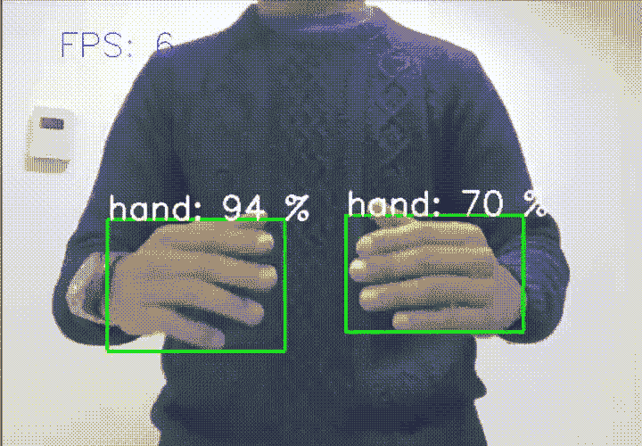
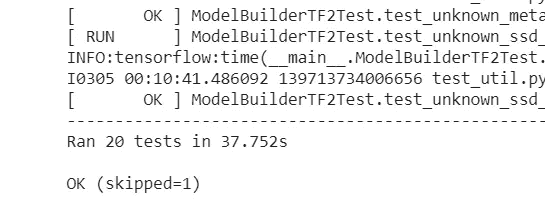
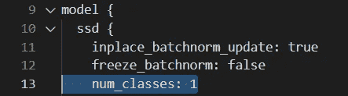
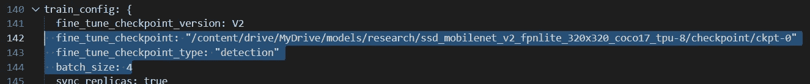
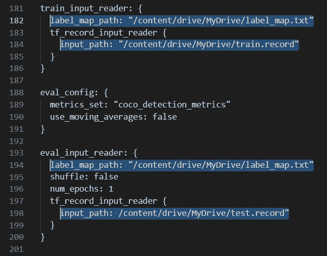

# 2021 年使用 Tensorflow 2 对象检测 API 训练一个手部检测器

> 原文：<https://towardsdatascience.com/train-an-object-detector-using-tensorflow-2-object-detection-api-in-2021-a4fed450d1b9?source=collection_archive---------6----------------------->



作者图片

## 我们使用 Google Colab 在以自我为中心的手部图像数据集上训练我们的自定义对象检测器

我想开发一个计算机视觉应用程序，可以实时检测我的手。网上有很多文章都使用了 Tensorflow 对象检测 API 和 Google Colab，但我仍然努力让它真正工作起来。原因？**库和代码的版本改变了！**

这里有一个在**虚拟特雷门琴中使用这个检测器的例子:**

作者提供的视频

**这篇文章应该会指导你现在(2021 年 3 月)什么是有效的。我假设你知道基本的 Python 技巧，并且有足够的知识从其他教程中查找你不知道的东西！😂**

**我们将使用的东西:**

*   Google Colab
*   Tensorflow 对象检测 API 2
*   Egohands 数据集:[*http://vision.soic.indiana.edu/projects/egohands/*](http://vision.soic.indiana.edu/projects/egohands/)

**步骤:** 1 .设置环境
2。下载并安装 Tensorflow 2 物体检测 API
3。下载数据集，生成 tf_records
4。下载模型并编辑配置
5。训练模型并导出为 savedmodel 格式

**鸣谢:** 非常感谢 github 用户 [molyswu](https://github.com/molyswu/hand_detection) 、 [datitran](https://github.com/datitran/raccoon_dataset) 和 [gilberttanner](https://gilberttanner.com/) ，我从他们那里获取了一些代码并对其进行了轻微的修改。也请查看他们的教程。

# 1.设置环境

打开一个新的 Google Colab 笔记本，然后**安装你的 Google drive** 。你不需要这样做，但是如果你从你的会话中断开，或者只是想再次回到会话中，这是非常方便的。

```
from google.colab import drive
drive.mount('/content/drive')%cd /content/drive/MyDrive
```

我们现在在你的谷歌硬盘里。(您可能需要更改最后的%cd，以防您的驱动器装载到稍微不同的路径)。

Google Colab 将使用 Tensorflow 2，但为了以防万一，请明确地这样做:

```
%tensorflow_version 2.x
```

# 2.下载并安装 Tensorflow 2 对象检测 API

第一件事是下载并安装 **Tensorflow 2 对象检测 API** 最简单的方法是首先进入你的根目录，然后从 git 克隆:

```
%cd /content/drive/MyDrive
!git clone [https://github.com/tensorflow/models.gi](https://github.com/tensorflow/models.git)t
```

然后，编译原型——顺便说一下，没有输出。
( *协议*应该可以正常工作，因为 Google Colab 已经安装了它):

```
%cd /content/drive/MyDrive/models/research
!protoc object_detection/protos/*.proto --python_out=.
```

现在安装实际的 API:

```
!cp object_detection/packages/tf2/setup.py . 
!python -m pip install .
```

测试您的 tensorflow 对象检测 API 2 安装！一切都要*“OK”。*(有些测试自动跳过也没关系)。

```
#TEST IF YOU WANT
!python object_detection/builders/model_builder_tf2_test.py
```



作者图片

# 3.下载数据集，生成注释。csv 文件和张量流 tf_records

我将在这里描述你需要做什么，因为这部分和其他教程相比并没有太大的变化。总之，我们将下载 Egohands 数据集，但只使用其中许多图像的子集，因为我们正在进行**迁移学习。**
我们将它们拆分成一个训练目录和一个测试目录，并生成。每个图像的 xml 文件(包含每个图像的边界框注释)。

我已经创建了一个通用脚本:

*   下载整个 Egohands 数据集并提取它
*   仅保留少量(4 个)文件夹
*   将图像分割成训练集和测试集
*   创建注释。带边界框坐标的 csv 文件

首先我们需要确保你在你的根目录下，然后克隆我的 git repo。

```
%cd /content/drive/MyDrive
!git clone [https://github.com/aalpatya/detect_hands.git](https://github.com/aalpatya/detect_hands.git)
```

从我下载的 repo 中，将*ego hands _ dataset _ to _ CSV . py*文件复制到您的根目录并运行它。这将为您完成所有工作——默认情况下，它只会从实际的 Egohands 数据集中随机取出 4 个文件夹(即 400 张图像),将它们分成一个训练和测试集，然后生成。csv 文件。

```
!cp detect_hands/egohands_dataset_to_csv.py .
!python egohands_dataset_to_csv.py
```

向 https://github.com/molyswu/hand_detection 大声喊出来，我从他那里得到了最初的剧本。我刚刚整理了一下，做了一些调整。😁

## 生成 tf _ records

刚刚创建的 *test_labels.csv* 和 *train_labels.csv* 文件包含每个图像的边界框位置，但令人惊讶的是，Tensorflow 需要不同格式的信息，即 **tf_record** 。

我们将通过使用来自我的 git repo 的 *generate_tfrecord.py* 来创建所需的文件 *train.record* 和 *test.record* (这是我在 https://github.com/datitran/raccoon_dataset 的[的精彩 datitran 教程中修改的)。](https://ithubusercontent.com/datitran/raccoon_dataset)

```
%cd /content/drive/MyDrive
!cp detect_hands/generate_tfrecord.py .# For the train dataset
!python generate_tfrecord.py --csv_input=images/train/train_labels.csv  --output_path=train.record# For the test dataset
!python generate_tfrecord.py --csv_input=images/test/test_labels.csv  --output_path=test.record
```

## 现在，您应该有一个如下所示的目录:

```
/content/drive/MyDrive (or whatever your root is called)
  |__ egohands
  |__ detect_hands
  |__ images
    |__ train
      |__ <lots of images>
      |__ train.csv
    |__ test
      |__ <lots of images>
      |__ test.csv
  |__ train.record
  |__ test.record
```

# 4.下载迁移学习模型

## 下载您选择的 Tensorflow 2 模型

从[*https://github . com/tensor flow/models/blob/master/research/object _ detection/g3doc/tf2 _ detection _ zoo . MD*](https://github.com/tensorflow/models/blob/master/research/object_detection/g3doc/tf2_detection_zoo.md)

这里我用的是**SSD Mobilenet V2 fpnlite 320 x320**。我发现一些模型不能与 tensorflow 2 一起工作，所以如果你想确定的话，请使用这个模型。

```
%cd /content/drive/MyDrive!wget [http://download.tensorflow.org/models/object_detection/tf2/20200711/ssd_mobilenet_v2_fpnlite_320x320_coco17_tpu-8.tar.gz](http://download.tensorflow.org/models/object_detection/tf2/20200711/ssd_mobilenet_v2_fpnlite_320x320_coco17_tpu-8.tar.gz)# Unzip
!tar -xzvf ssd_mobilenet_v2_fpnlite_320x320_coco17_tpu-8.tar.gz
```

## 编辑训练参数

首先，创建一个名为 *label_map.pbtxt* 的文件，其中包含您的 hand 类。它应该是这样的:

```
item {
  id: 1
  name: 'hand'
}
```

> 或者，您可以记下已经在我的 git repo 中的路径，您应该已经有了:/content/drive/my drive/detect _ hands/model _ data/SSD _ mobilenet _ v2 _ fpn _ 320/label _ map . Pb txt

接下来我们将编辑下载的 tensorflow 模型附带的 *pipeline.config* **。它将位于您从 tensorflow 模型动物园下载的模型的模型目录中。例如:*SSD _ mobilenet _ v2 _ fpnlite _ 320 x320 _ coco 17 _ TPU-8/pipeline . config***

**靠近 *pipeline.config* 的开头:**

*   将类别数更改为 1:



作者图片

**朝向 *pipeline.config 的中间/末端:***

*   设置模型检查点的路径。我们只需要检查点名称的开头部分，直到数字。比如:**“ckpt-0”**，而不是“ckpt-0.index”。
*   将检查点类型设置为***检测***
*   您可能还想更改批量大小。一般来说，批量越小，模型损耗下降得越快，但是达到损耗值需要更长的时间。我选择批量大小为 4，因为我只是希望训练发生得更快，我并不是在这里寻找最先进的准确性。摆弄这个数字，看[这篇文章](https://machinelearningmastery.com/how-to-control-the-speed-and-stability-of-training-neural-networks-with-gradient-descent-batch-size/)。



作者图片

**在 *pipeline.config* 的末尾:**

*   将路径设置为 *label_map.pbtxt* (有两个地方可以这样做，一个用于测试，一个用于训练)
*   设置*训练记录*和*测试记录*文件的路径



作者图片

## 我们终于准备好开始训练了！

# 5.训练模型并将其导出为“savedmodel”格式

## 加载张量板

首先，我们将加载 tensorboard，这样一旦训练开始，我们就可以在漂亮的图表中可视化进度。

*logdir* 参数是您的训练过程将创建的日志目录的路径。在我们的例子中，这将被称为*输出 _ 训练*，日志自动存储在*输出 _ 训练/训练*中。

```
%load_ext tensorboard
%tensorboard --logdir=/content/drive/MyDrive/output_training/train
```

## 训练模型

现在开始训练，设置到我们的管道配置文件的正确路径，以及到 *output_training* 目录的路径(还没有创建)。

```
%cd /content/drive/MyDrive/models/research/object_detection/#train 
!python model_main_tf2.py \
--pipeline_config_path=/content/drive/MyDrive/detect_hands/model_data/ssd_mobilenet_v2_fpn_320/pipeline.config \
--model_dir=/content/drive/MyDrive/output_training --alsologtostderr
```

这将开始训练的过程，你只要坐下来等待。要么你等很长时间，直到训练过程结束，或者只是在一段时间后取消这个过程(也许你在损失图上看到损失趋于平稳)。这样做是可以的，因为训练过程会不断保存**模型检查点**。

## 导出模型

现在，我们将把训练输出导出到一个 *savedmodel* 格式，这样我们就可以用它来进行推理。

```
%cd /content/drive/MyDrive/models/research/object_detection!python exporter_main_v2.py \
--trained_checkpoint_dir=/content/drive/MyDrive/output_training \
--pipeline_config_path=/content/drive/MyDrive/detect_hands/model_data/ssd_mobilenet_v2_fpn_320/pipeline.config \
--output_directory /content/drive/MyDrive/inference
```

**整件事情的重要部分是*推论*文件夹。如果我们想进行推理，这是我们唯一需要的东西。**

**恭喜你！你训练了一个探手器！🎈🎉🎊**

## 加载用于推理的模型

该模型可以加载 tensorflow 2 作为

```
detect_fn = tf.saved_model.load(PATH_TO_SAVED_MODEL)
```

从那里，您可以使用 *detect_fn* 函数并继续进行推理，但是我将把它留给另一个教程😉