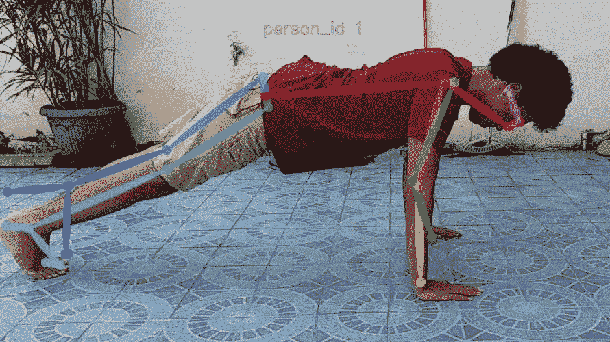
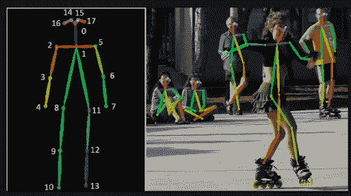
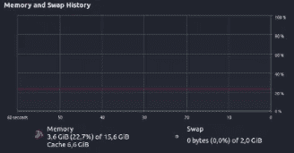
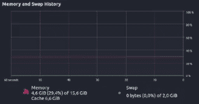
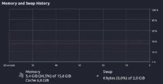
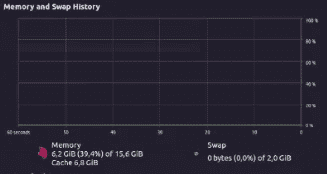
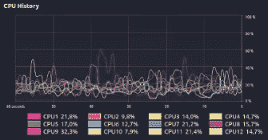
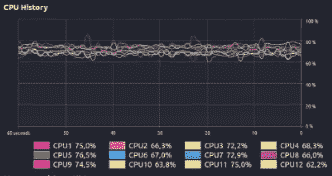
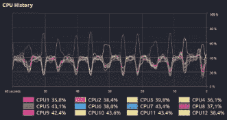
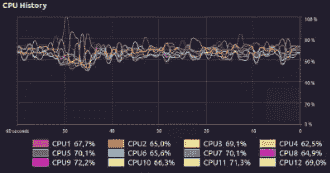

# 使用多重处理将交叉验证时间优化三倍

> 原文：<https://towardsdatascience.com/train-and-test-machine-learning-models-3x-faster-using-multithreading-d8cb0bf9eaf5?source=collection_archive---------29----------------------->

## 我实现了多重处理来优化我的机器学习代码

训练机器学习模型需要时间，一个**很多**的时间。使用支持向量机或朴素贝叶斯等传统机器学习算法的传统模型可能不需要那么长时间，但我们不会谈论这些算法。我们将讨论神经网络。

你看，在过去的几个月里，我和一个团队在做一个项目。我在做什么？我们正在开发一个实时运动评估系统，使用的是——*你猜对了，人工神经网络。* LSTMs，确切的说是一些前馈神经网络。



我们的最终结果，图片由作者提供

我们想做的很简单:

1.  首先，我们需要一个多姿态分类器，使用一个前馈神经网络根据我们运动的开始位置来分类运动的类型。
2.  接下来，我们需要一个二元分类器来分类练习代表是否在起始位置。
3.  在对开始位置进行分类后，我们需要评估练习的每个重复，确保计算找到了多少个正确的重复。

简单吧？这听起来很简单，但实际上，我们需要收集大量数据来训练我们的网络。此外，我们还需要培训不是一个，不是两个，而是九个模型。数学原理是这样的:我们想把运动分为四种类型。因此，我们需要八个模型，因为每个练习都有一个二元姿势分类器和一个练习姿势评估模型。我们还需要一个额外的模型作为多姿态分类器。

> 呀。

由于时间限制，我和我的团队担心我们不能及时完成这个项目。所以，最后，我们决定尝试一下多重处理。

# 等等，为什么是多重处理？

为什么我们脑海中的第一反应会是多重处理？让我解释一下，我们的项目是一个研究项目。我们需要找到神经网络的最佳架构。我们还需要找到符合我们需求的最佳超参数。我们使用了以前研究中的一些参考资料，但是很明显，我们没有完全照搬。之前的研究人员的神经网络架构并不完全符合我们的。

最后，我们不得不为多姿态分类器测试大约 24 个超参数组合，为**每个**二元姿态分类器测试 6 个组合，为**每个**运动姿态评估模型测试 54 个组合。如果我们想测试每个组合，我们必须让电脑开很长时间。但是如果我们可以同时训练一些组合呢？我们能把训练时间减少三倍吗？

> 答案是多重处理。

现在，[像 Keras 和 Tensorflow 这样的机器学习框架确实在可用时使用多个 CPU 核心](https://stackoverflow.com/questions/41588383/how-to-run-keras-on-multiple-cores)。但问题不在于我们的内核没有得到正确使用，而是我们如何从硬件中挖掘每一盎司的潜力来节省宝贵的时间。

# 你是如何实现多重处理的？

让我第一个说**这个方法可能不是对每个人都有效**，我将解释为什么。我们的模型即使有多种组合，也不需要太多的处理能力来训练。

## 你培养的是什么样的模特？

我们的二元姿态和多姿态分类器都使用前馈神经网络。我们使用名为 [OpenPose](https://arxiv.org/abs/1812.08008?utm_source=feedburner&utm_medium=feed&utm_campaign=Feed%253A+arxiv%252FQSXk+%2528ExcitingAds%2521+cs+updates+on+arXiv.org%2529) 的预训练模型从图像中检索我们的数据点。



图像是从 [rwcreations](http://www.rwcreations.com/2020/07/08/post-estimation-using-open-pose/) 中检索的。

然后，我们以数组的形式从每一帧中提取每个关键点的位置(我们使用了大约 14 个可用的关键点)。然后，我们将数据标准化，并将其传递给我们的前馈神经网络。你可以说我们的训练方法是— *直来直去*。

由于训练这种规模的神经网络需要少量的计算能力，我们试图应用多处理作为我们的解决方案，使事情进行得更快。虽然我们没有像使用前馈神经网络那样在 LSTM 模型上广泛使用多重处理来进行运动姿势评估。

原因当然是 LSTMs 需要更多的计算能力来训练。想象我们提取的 14 个关键点，将它们乘以 24–48 帧，每个数据点成为一系列关键点。训练这种能力需要的不仅仅是多处理效率。

## 代码示例

为了实现多重处理，我们使用了 Python 中的[多重处理](https://pypi.org/project/multiprocess/)模块。多重处理模块有一个非常干净的界面。实现多处理非常容易。

首先，安装模块。

```
pip3 install multiprocess
```

现在，假设我们要训练四种不同的模型类型，每种类型有六种超参数组合。

我们还有一个函数叫做`train_model`。该函数包含四个参数:练习类型、隐藏层数、批量大小以及最终的训练数据。

所以，为了节省时间，我们想同时训练这六个组合。

代码实现

上面可以看到例子。看起来并不太复杂，读起来也很直白。

# 结果呢

当训练前馈神经网络时，我们的机器可以轻松处理六个过程。然而，LSTM 模型只能同时处理三个过程。当应用多重处理来训练机器学习模型时，另一个问题是 RAM。因为我们在六个不同的进程上加载数据集六次，所以我们把它全部保存在 RAM 中。*我们来分解一下结果* ***。***

## 设备规格

在展示结果之前，让我先描述一下我们的器件规格:

*   CPU AMD 锐龙 5 2600 六核处理器
*   16 GB 内存
*   GPU GeForce GTX 1070 TI

## RAM 使用

在这个项目中，我和我的团队使用了一台内存大小适中的 PC，大约 16GB。我们以为这就够了，但是我们错了！你看，除了训练多个超参数来寻找最佳答案，我们还使用十倍交叉验证来测试我们的结果，以找到最佳结果。

即使在 Keras 中的每个 epoch 之后实现了手动垃圾收集，RAM 的使用也在稳步增加，除非我们停止所有进程。我们达到了内存使用的瓶颈。虽然，公平地说，单进程 RAM 的使用并没有远远落后于多进程 RAM 的使用，尽管多进程比单进程增加了 RAM 的使用。



训练开始时二元姿态单进程 RAM 的使用情况，图片由作者提供。



训练开始时二元姿态多重处理 RAM 的使用，图片由作者提供。

该图显示，训练开始时的 RAM 使用量彼此相差不大。前馈神经网络模型和 LSTM 模型的条件是相似的。



培训开始时 LSTM 模型单进程 RAM 的使用情况，图片由作者提供。



培训开始时 LSTM 模型多进程 RAM 的使用，图片由作者提供。

> 注意:最好知道二元姿态和多姿态模型的结果是相似的，因为两个模型使用相似的架构和相似的数据点

## CPU 使用率

使用 AMD 锐龙 5，我们能够实现这一特技。我们的中央处理器没有任何问题。这可能是因为众所周知 [AMD 处理器在多任务处理上表现更好](https://www.pcgamer.com/amd-vs-intel-whats-the-difference-between-cpus/#:~:text=Intel%20CPUs%20are%20typically%20the%20favorite%20choice%20for%20performance%20and%20overclocking%20enthusiasts.&text=Intel%27s%20top%20CPUs%20cost%20more,it%20comes%20to%20multithreaded%20applications.)。我相信 CPU 为我们的训练过程做出了很大贡献，特别是因为锐龙 5 有六个专用内核。



训练开始时的二元姿势单进程 CPU 使用率，图片由作者提供。



训练开始时的二元姿态多重处理 CPU 使用情况，图片由作者提供。

单进程保持相对较低的 CPU 使用率。超过一个 CPU 的使用率很少超过 40%。否则，多进程很少低于 60–70%的使用率，并且在每个进程停止后，每个 CPU 的使用率会慢慢下降到 9–15%左右。



培训开始时的 LSTM 模型单进程 CPU 使用情况，图片由作者提供。



培训开始时 LSTM 模型多处理 CPU 的使用情况，图片由作者提供。

LSTM 模型上的 CPU 使用率与二进制姿势 CPU 使用率的差别更大。正如我之前提到的，训练 LSTM 模型的任务消耗更多的计算能力。因此，它不能同时拥有三个以上的进程。

单进程 CPU 使用率表明了这两种型号的电源需求有多么不同。对于单个 CPU，二元姿态模型的 CPU 使用率很少超过 30%,更不用说多个 CPU 超过 40%。但是，单个进程的 CPU 使用率达到了 40%以上，而 CPU 的最低使用率为 35%。

令人惊讶的是，LSTM 模型的多处理器 CPU 使用率并没有超过二元姿态模型的使用率。当二元姿态模型有 6 个 CPU 时，LSTM 模型有 4 个 CPU，达到 70%的百分比。然而，可以得出结论，单个二元姿态模型比单个 LSTM 模型使用更少的 CPU，但是 6 个二元姿态模型比 3 个 LSTM 模型使用更多的 CPU 能力。

> 注意:同样，二元姿态和多姿态模型的结果是相似的，因为两个模型使用相似的架构和相似的数据点。

## 每个过程所需的总时间

这里最重要的指标是时间。因为这就是我们进行这个实验的全部原因。下面我有两个时间表，描述了单过程和多过程的训练结果。

每个表格有 6 种不同的组合，不同之处在于隐藏层和批量大小。**多进程实验一次运行所有的组合，而单进程实验分别运行每个组合**。

单进程前馈神经网络训练时间表。

这两个表之间的结果可以得出一个结论。多重处理并没有降低训练速度。每个组合的两个结果之间的差异不会太大。此外，如果我们将在单个过程中单独训练每个模型所需的时间加起来，我们大约需要 1212 秒。而在多重处理的例子中，我们最多只需要 372 秒。

多重处理前馈神经网络训练时间表。

> 使用多重处理，我们节省了 840 秒的训练时间。**我们将训练速度提高了 3.25 倍**

名单上的下一个。我们试图在更复杂的模型中实现这种技术。一个 LSTM。因为这两种型号所需的计算能力差别很大。我最终在三个过程中同时运行了 LSTM 模型。

每个表格有三种不同的组合，不同之处在于隐藏的图层。明确地说，每个 LSTM 模型有四层，每层有不同数量的隐藏层。**多进程实验一次运行所有的组合，而单进程实验分别运行每个组合**。

单流程 LSTM 培训时间表。

这两个表之间的结果可以看作是相似的。每种组合差别不大。奇特的结果是，单进程结果随着每一个隐藏层的增加而变得更快，而多进程结果则相反。

最终，多重处理训练时间最多只需要大约 6755 秒。而单个过程的训练时间加起来约为 15330 秒。

多重处理 LSTM 训练时间表。

> 在这种情况下，多重处理节省了 8575 秒的训练时间。**因此训练时间加快了 2.26 倍**

现在，这些结果似乎很有希望。请注意，与企业产品可能需要的模型相比，这里使用的模型仍然相对简单。使用的数据也有数千个，而企业人工智能通常有数百万个。

# 结论

最终，多处理解决方案将我们的训练时间在 LSTM 模型上提高了 2.26 倍，在前馈神经网络上提高了 3.25 倍。研究用途的潜力是无限的。计算机一年比一年强大。使用这种技术，超参数测试将轻而易举。

多重处理为我的团队节省了大量时间。我无法想象如果不实施的话，我们要等多久。**尽管我不得不说多重处理并不是一颗银弹**。它不能在任何情况下都提高每个模型的速度。我们很幸运，我们的情况完全符合条件。

*特别感谢*[*Kevin Janada*](https://medium.com/u/5376a7e0f33a?source=post_page-----d8cb0bf9eaf5--------------------------------)*和*[*ferdinandz jap hne*](https://medium.com/u/39aaf4ea3319?source=post_page-----d8cb0bf9eaf5--------------------------------)*给予我使用我们项目数据的许可。*

*编辑说明:将文章从关于多线程更改为多处理。我把这两件事搞混了。抱歉给您带来不便。感谢，* [*米绍克拉斯捷夫*](https://medium.com/u/1565865a39bc?source=post_page-----d8cb0bf9eaf5--------------------------------) *指出来。*