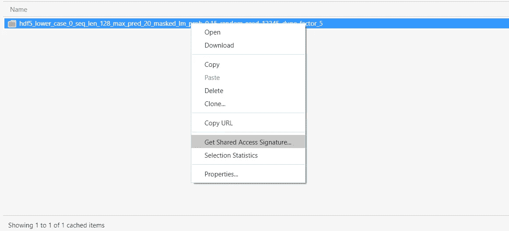
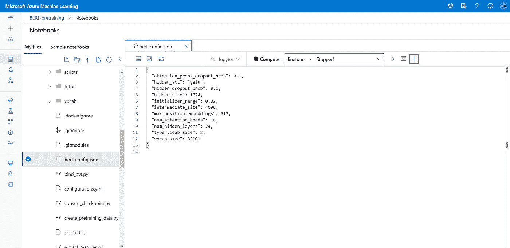
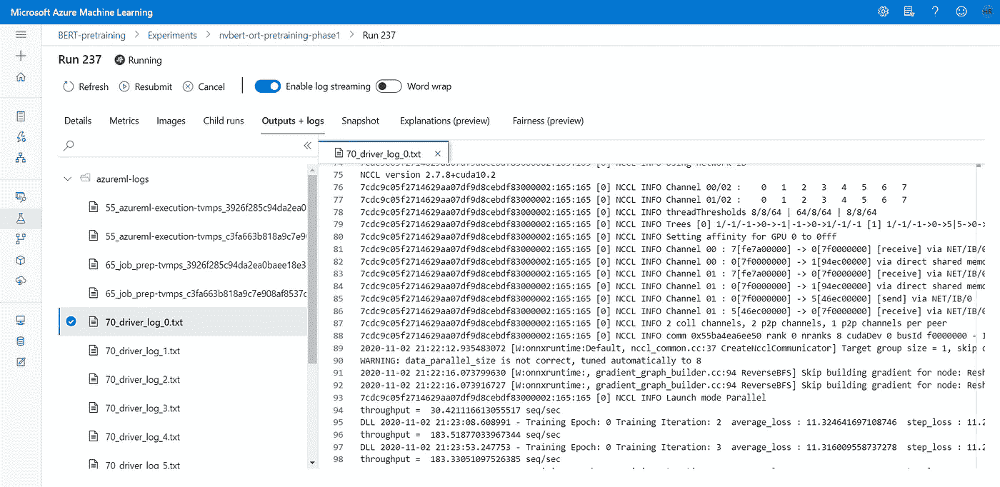

# 用你自己的语言训练 BERT-Large

> 原文：<https://towardsdatascience.com/train-bert-large-in-your-own-language-7685ee26b05b?source=collection_archive---------27----------------------->

## 此时训练自己的 BERT 模型最有效的解决方案

BERT-Large 是近年来自然语言处理领域真正的“游戏规则改变者”技术。通过迁移学习扩展基本模型，我们可以为问答、命名实体识别或文本摘要等任务提供最先进的解决方案。该模型目前存在于大约 10 种语言中，在本文中，我们将分享我们的培训经验，以便可以用您自己的语言相对容易和有效地培训新模型。

在培训方面，微软的 [ONNX 运行时](https://github.com/microsoft/onnxruntime-training-examples/tree/master/nvidia-bert)库和 [DeepSpeed](https://www.deepspeed.ai/) 优化提供了最快的(也是最便宜的！)训练模型的解决方案，所以我们在 Azure Machine Learning platform 的实验中使用了它(不过，您可以随意查看上面的 ONNX 运行时链接，了解本地/不同环境的运行情况)。请注意，在 4x Tesla V100 节点上，培训大约需要 200 小时才能完成。

该指南涵盖了培训流程，包括两个主要部分:

*   数据准备
*   培养

# **数据准备**

原始的 BERT-Large 使用了 34 亿个单词的文本语料库，因此值得用这样大小的数据集进行训练。一个显而易见的解决方案可能是使用维基百科语料库，可以从[这里](https://dumps.wikimedia.org/)下载目标语言。单独的 wikicorpus 很可能不会包含足够的数据，但它绝对值得添加到现有的语料库中，因为它是一个高质量的语料库，它提高了训练和使用的效率。数据预处理可能是计算密集型操作，根据训练文件的大小，可能需要大量 RAM。为此，我们在 AzureML 中使用了标准的 D14 V2(16 个内核，112 GB 内存，800 GB 磁盘)虚拟机。

OnnxRuntime 使用 NVIDIA 的 [BERT-Large](https://github.com/NVIDIA/DeepLearningExamples/tree/master/PyTorch/LanguageModeling/BERT) 解决方案。如果有必要，原始数据集首先需要清理，并且所需的格式必须满足两个标准:

*   每个句子都在单独的一行。
*   相关条目(文章、段落)由空行分隔。

对于 wiki 数据集，我创建了一个来自 NVIDIA BERT 数据准备脚本的定制解决方案，并上传到我自己的[存储库](https://github.com/roberthajdu92/nvidia-bert-wiki-preprocess)。让我们来看看这个过程:

## 正在下载 WikiDump:

维基百科转储可在此[链接](https://dumps.wikimedia.org/backup-index.html)获得。您甚至可以使用 wget 下载转储文件。下载的文件是. bz2 格式，可以在基于 Linux 的机器上用 bunzip2(或 bzip2 -d)命令提取。

提取的文件在。xml 格式。 [WikiExtractor](https://github.com/attardi/wikiextractor) Python 包从输入的 wiki 文件中提取文章，为转储清理提供有用且必要的帮助。

当我们完成这些后，脚本创建了一个包含提取文本的文件夹结构。在这种情况下，我们需要采取以下步骤将数据集变成与训练脚本兼容的形式:

*   格式化
*   符号化
*   过滤
*   创建 vocab
*   分片
*   创建二进制文件

## **格式化(仅维基****)**

对于格式化，让我们使用以下脚本:

```
python3 formatting.py --input_folder=INPUT_FOLDER --output_file=OUTPUT_FILE
```

它将提取的文本分类到一个文件中，每行一篇文章。

## 符号化

此后，我们需要将我们的文章标记为每行一句(spl)格式，因为我们的训练脚本和进一步的操作(如过滤和分片)需要它。这是一个相当容易的工作，然而标记化的质量是绝对重要的，所以如果你不知道一个适合你的语言的好的句子标记器，现在是时候做一些研究工作了。在我们的标记化脚本中，我们将给出几个示例并实现几个方法:

*   NLTK 是一个非常常见的库，它使用一个名为 punkt 的包来进行标记化。在此检查支持的语言[。](https://github.com/teropa/nlp/tree/master/resources/tokenizers/punkt)
*   [UDPipe (v1)](http://ufal.mff.cuni.cz/udpipe/1) 有很多支持语句标记化的语言。在这里检查它们[。](https://ufal.mff.cuni.cz/udpipe/1/models#universal_dependencies_12_models)
*   [StanfordNLP](https://github.com/stanfordnlp/stanfordnlp) 在这种情况下也是一个公共库。在此检查预训练(语言)模型[。注意，这个库也有一个 spacy](https://stanfordnlp.github.io/stanfordnlp/models.html) [包装器](https://github.com/explosion/spacy-stanza)，如果你觉得这样更舒服的话。
*   Spacy (最后但并非最不重要)是一个非常简单而强大的 NLP 库。可用的语言可以在[这里](https://spacy.io/usage/models)找到。

请注意，在这一点上，我强烈建议对您的语言中可用的句子分词器做一些研究，因为这可能关系到您的模型性能。因此，如果您的文本不是 spl 格式，请测试一个正确的标记器，并在您的文本上使用它。确保文本的每一段都用空行隔开。

## 过滤

因为我们是芬兰 [TurkuNLP](https://turkunlp.org/) 团队的忠实粉丝(他们已经用多种语言完成了 [wikiBERT-base](https://github.com/TurkuNLP/wikibert) 模型)，我们想分享一个来自他们[管道](https://github.com/spyysalo/wiki-bert-pipeline)的定制过滤方法。这种过滤方法具有基于 TurkuNLP 团队经验的默认参数值，但是可以根据您的数据集随意调整这些值(如果您愿意)。要运行(使用默认工作目录):

```
python filtering.py INPUT_SPL_FILE \
    --word-chars abcdefghijklmnopqrstuvwxyz (replace with your alphabet) \
    --language en (replace with your lang) \
    --langdetect en (replace with your lang) \
    > OUTPUT_FILE
```

在这一点上，确保你的文本是干净的，它没有不必要的或太多的重复行(更可能是在抓取的数据中),并且每一段都有它的意思，文本是连续的。对于预制字母，请参考 TurkuNLP 管道报告。

清理文本的另一种方法是转换成较小的字符集，如 Latin1(然后转换回 UTF-8)，以删除不必要的符号。

## 创建词汇库

为了创建 vocab 文件，我们派生了 TurkuNLP group 的解决方案(它源自 Google)。

现在，您可以在整个数据集上运行词汇训练方法(注意，根据我们的设置，它将从大型语料库文件中随机抽取行)。根据您的经验和语言，随意增加您的 vocab 大小，但请注意，较大的 vocab 大小将需要更多的 VRAM，这意味着您必须使用较低的微批处理大小来训练您的模型，这可能会降低您的模型在 16GB 大小的 GPU 上的有效性。在 32 GB 的 GPU 上真的不算太多。

```
python3 spmtrain.py INPUT_FILE \
    --model_prefix=bert \
    --vocab_size=32000 \
    --input_sentence_size=100000000 \
    --shuffle_input_sentence=true \
    --character_coverage=0.9999 \
    --model_type=bpe
```

因此，在此之后，我们需要将我们的句子片段 vocab 转换为 BERT 兼容的单词片段 vocab，发出以下脚本:

```
python3 sent2wordpiece.py bert.vocab > vocab.txt
```

Tadaa！您已经基于您的文本语料库创建了一个 BERT 兼容的 vocab。

## 分片:

建议使用分片，因为在 512 seq len 二进制文件创建时，一个 500 兆字节的原始文本文件可能会占用高达 50GB 的 RAM，所以建议创建大小在 50-100 兆字节之间的分片。

```
python3 sharding.py \
    --input_file=INPUT_FILE \
    --num_shards=NUMBER_OF_SHARDS_TO_MAKE
```

## **创建二进制文件**

对于二进制文件(. hdf5)的创建，我们需要一个与 BERT 兼容的词汇表文件。如果你有，那很好，如果你没有，那么请查看下面的[文章](https://dzlab.github.io/dltips/en/tensorflow/create-bert-vocab/)来创建你自己的 vocab 文件。您可以并行处理这些文件，但是对于一个 100 兆字节的文件，它可能会占用高达 10GB 的 RAM。你可以在 128 seq len run 中尝试更多的碎片，因为它占用的内存更少。

要创建. hdf5 文件，请运行:

```
python3 create_hdf5_files.py --max_seq_length 128 --max_predictions_per_seq 20 --vocab_file=vocab.txt --n_processes=NUMBER_OF_PROCESSES
```

对于 128 序列长度训练，以及

```
python3 create_hdf5_files.py --max_seq_length 512 --max_predictions_per_seq 80 --vocab_file=vocab.txt --n_processes=NUMBER_OF_PROCESSES
```

用于 512 序列长度预处理。这两者都是训练过程所需要的，这将在后面解释。

完成. hdf5 创建后，您应该有两个文件夹，命名如下:

```
hdf5_lower_case_0_seq_len_128_max_pred_20_masked_lm_prob_0.15_random_seed_12345_dupe_factor_5/
```

和

```
hdf5_lower_case_0_seq_len_512_max_pred_80_masked_lm_prob_0.15_random_seed_12345_dupe_factor_5
```

## 移动到 BLOB

为了将转换后的文件用于训练，您需要将它们上传到 BLOB 容器中。我们推荐使用 [Azure Storage Explorer](https://docs.microsoft.com/hu-hu/azure/vs-azure-tools-storage-manage-with-storage-explorer?tabs=windows) 和 [AzCopy](https://docs.microsoft.com/hu-hu/azure/storage/common/storage-use-azcopy-v10) 命令行工具。

在 Azure Storage Explorer 中，您可以轻松地创建 BLOB 容器(使用上面的指南),并且使用 AzCopy，您可以将转换后的文件复制到 BLOB 容器，格式如下:

```
azcopy.exe cp --recursive "src" "dest"
```

注意:您可以在您的 Azure 存储帐户下创建一个 BLOB(在资源管理器中的左侧),并且您可以使用“获取共享访问签名”选项导航到并右键单击您的. hdf5 文件夹来获取源代码。对于作为目标的 BLOB 容器也是如此。



# 培养

训练过程有两个部分:序列长度为 128 和 512 的阶段。这大大加快了训练，因为它首先需要大约。128 上的 7，000 步和 512 上的 1，500 步，这使得训练速度大大加快。这是基于这样一个事实，即 128 序列长度的训练要快得多，但是我们希望我们的模型能够处理 512 标记长度的文本。

对于训练，我们使用基于 ONNX 运行时的解决方案，它现在包含了 DeepSpeed 训练优化。这提供了目前最快，当然也是最便宜的解决方案(SOTA)。存储库在这里[可用](https://github.com/microsoft/onnxruntime-training-examples/tree/master/nvidia-bert)。ONNX 运行时团队还准备了一个 docker [映像](http://mcr.microsoft.com/azureml/onnxruntime-training:0.1-rc2-openmpi4.0-cuda10.2-cudnn7.6-nccl2.7.6-for-bert)用于使用必要的组件进行培训，如 openMPI、CUDA、cuDNN、NCCL 和所需的 Python 包。

如前所述，我们在 AzureML 中运行培训，因此指南也遵循这种方法。如果所需的资源(GPU)可用，这并不一定需要在 AzureML 中运行。上面的微软知识库也包括本地执行的方法。

## 让我们更深入地了解火车

首先，我们需要创建一个 compute [实例](https://docs.microsoft.com/en-us/azure/machine-learning/how-to-create-attach-compute-studio#compute-instance)来从 GitHub 存储库中获取代码。这个实例(虚拟机)不一定是昂贵的，例如，我们使用标准 _D1_V2 (1 个内核，3.5 GB 内存，50 GB 磁盘)。要创建计算实例，请打开笔记本选项卡上的任何文件，然后单击+按钮:



现在打开一个终端，您可以在同一个选项卡上完成。

在 VM 的终端中，您需要使用以下命令(根据上面的 ONNX 运行时训练示例库)来获取训练代码。

要获得 ONNX 运行时代码，对于增强 BERT 训练:

```
git clone https://github.com/microsoft/onnxruntime-training-examples.git
cd onnxruntime-training-examples
```

要获得 NVIDIA 的 BERT 大型训练解决方案:

```
git clone --no-checkout https://github.com/NVIDIA/DeepLearningExamples.git
cd DeepLearningExamples/
git checkout 4733603577080dbd1bdcd51864f31e45d5196704
cd ..
```

让他们聚在一起:

```
mkdir -p workspace
mv DeepLearningExamples/PyTorch/LanguageModeling/BERT/ workspace
rm -rf DeepLearningExamples
cp -r ./nvidia-bert/ort_addon/* workspace/BERT
```

## 准备

在开始培训之前，您需要执行几个步骤:

*   将你的 *vocab.txt* 文件复制到 *workspace/BERT/vocab* 目录下
*   修改*NVIDIA _ Bert/ort _ addon/ort _ supplement/ort _ supplement . py*[行中的 vocab 大小:55](https://github.com/microsoft/onnxruntime-training-examples/blob/c26424e9ebd470aa2a8bed8077a8a81d19d666d6/nvidia-bert/ort_addon/ort_supplement/ort_supplement.py#L55)
*   [下载](https://github.com/roberthajdu92/nvidia-bert-wiki-preprocess/blob/master/bert_config.json)并将 *bert_config.json* 复制到 *workspace/BERT*
*   修改*workspace/BERT/BERT _ config . JSON*中的 vocab 大小

现在，您可以访问*NVIDIA-Bert/azure ml-notebooks/*中的培训笔记本。打开它。

## AzureML 工作区设置

首先你需要解决你的

*   工作区名称
*   订阅 ID
*   资源组

在笔记本里。

## 注册数据存储

接下来，必须授予访问 BLOB 容器的笔记本的权限，我们之前在那里上传了转换后的数据集。它包括

*   数据存储名称
*   帐户名
*   账号[键](https://docs.microsoft.com/en-us/azure/machine-learning/how-to-access-data#storage-access-and-permissions)
*   容器名称

参数。

## 创建 AzureML 计算群集

在下一步中，我们需要为培训创建一个计算目标。在培训过程中，我们使用了包含 4 个 Tesla V100 16GB GPU 的 *Standard_NC24rs_v3* 。此设置大约需要。200-220 小时的训练。

你想使用哪个虚拟机，这完全取决于你。你主要可以选择

*   标准 _ NC24rs _ v3(4 个特斯拉 V100 16GB)
*   standard _ nd 40 RS _ v2(8x Tesla V100 32GB)

虚拟机的。

## 创建评估者

也许这是你训练中最激动人心的一步。在这里，您需要配置培训脚本，笔记本将启动该脚本作为 AzureML 实验。注意，我们将针对 128 和 512 次列车运行两次实验(和脚本)。

您需要设置以下基本参数:

*   每个节点的进程计数(2x)
*   节点计数
*   输入目录
*   输出目录
*   训练 _ 批量 _ 大小
*   梯度 _ 累积 _ 步数
*   gpu _ 内存 _ 限制

*process_count_per_node:* 每个虚拟机的 GPU 数量(4/8)。

*node_count:* 您使用的虚拟机总数。

*输入 _ 方向:*斑点内 128 个预训练数据的位置。

*output_dir:* 检查点的任意目录。注意:512 次列车将使用此目录加载最后一个阶段 1 检查点。

*训练批次大小:*训练批次大小。根据笔记本中的上表进行设置。

*gradient _ accumulation _ steps:*根据笔记本上表设置这个。微批量将通过训练批量和该参数进行计算。

*gpu_memory_limit:* 根据您使用 16 或 32GB GPU 的情况设置此值。

最后，别忘了补充一点

```
'--deepspeed_zero_stage': ''
```

使用 [DeepSpeed ZeRO](https://www.deepspeed.ai/news/2020/05/27/fastest-bert-training.html) 优化器加速训练的参数。

注意:在使用此参数进行预训练期间，您可能还希望禁用进度条:

```
'--disable_progress_bar': ''
```

注意，微量批次应通过批次大小和梯度累积步骤最大化。

提交。

因此，当您开始将 pretraining 作为 AzureML 实验时，您应该会在您的实验选项卡中找到类似这样的内容:



## 转换检查点

我还在我的 repo 中包含了一个名为 *convert_checkpoint.py* 的小脚本，以使您的检查点兼容 transformers 库的微调。

## 经过 128 次列车

在您的集群完成第 1 阶段后，您可以使用与上面相同的方法设置第 2 阶段脚本。使用相同的输出目录很重要，这样第二阶段运行将在该目录中找到第一阶段的检查点。

跑步将始终保持最后 3 个检查点，您可以设置检查点的训练步数。我们推荐大约 100 个步骤，因此您可以下载大约 100 个步骤的检查点，并使用微调脚本对它们进行基准测试。

## 512 次列车后

恭喜你，你有了一个用你自己的语言编写的 BERT-Large 模型！请在这里分享您的经验或通过电子邮件联系我，因为我们渴望听到您在匈牙利佩奇大学应用数据科学和人工智能小组的经历。