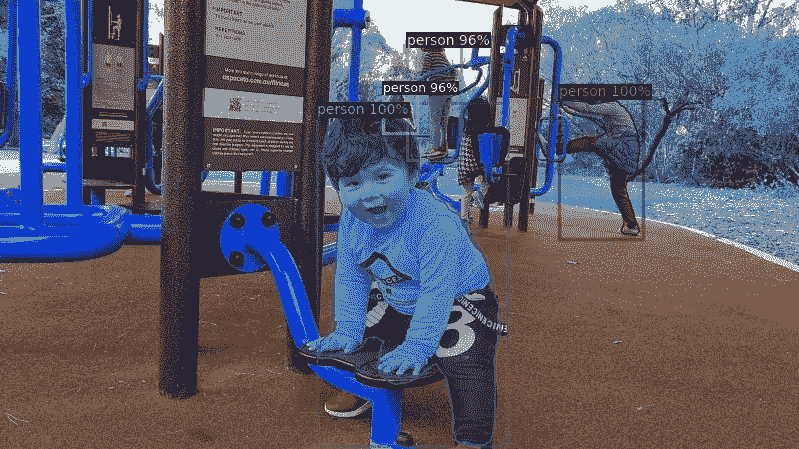

# 使用 Detectron2 分 4 步在自定义数据集上训练 MaskRCNN

> 原文：<https://towardsdatascience.com/train-maskrcnn-on-custom-dataset-with-detectron2-in-4-steps-5887a6aa135d?source=collection_archive---------1----------------------->

## 对自定义数据集应用对象检测的最简单方法



照片作者

[0 detector 2](https://github.com/facebookresearch/detectron2)是 AI 脸书研究团队最新发布的用于物体检测的 Python 库。与火炬视觉相比，它的主要优势是你可以更快地训练。此外，我相信它更容易使用，因为他们已经提供了一个默认的训练器，其中包含了许多可配置的对象检测模型，如 FasterRCNN，MaskRCNN，Retinatet 等。在本教程中，我解释了使用 Detectron2 在自定义数据集上逐步训练 MaskRCNN，因此您可以在一分钟内看到它有多简单。

# 第一步:准备好注释

注释必须是下面的 COCO 格式，和这里[介绍的 COCO 格式](https://www.immersivelimit.com/tutorials/create-coco-annotations-from-scratch#:~:text=The%20COCO%20dataset%20is%20formatted,%E2%80%9D%20(in%20one%20case).)有点不同。对于每个图像，包括关于图像路径、宽度、高度、id 和注释的信息。

**注意:**如果已经有了 [COCO 格式](https://www.immersivelimit.com/tutorials/create-coco-annotations-from-scratch#:~:text=The%20COCO%20dataset%20is%20formatted,%E2%80%9D%20%28in%20one%20case%29.)的数据集，可以跳过这一步，进入下一步。唯一的区别是，你应该用`register_coco_instances()`而不是`register()`来注册你的数据。

请记住，`filename`应该是一个图像路径，并且`image_id`在数据集的图像中必须是唯一的。`segmentation`是一个有`n`个点的多边形，`(x_i, y_i)`。对于边界框，你有多种选择`[x_0, y_1, x_1, y_1]`、`[x_0, y_0, width, height]`或这里呈现的[的任何其他表示。然而，`bbox_mode`应该与`bbox`表示一致。](https://github.com/facebookresearch/detectron2/blob/master/detectron2/structures/boxes.py)

例如，我将`bbox_mode`设置为`XYWH_ABS`，即`[x_0, y_0, width, height]`。

Detectron2 数据集的模板

# 第二步:加载数据

假设您的数据集已经是上面的格式，并且在本地保存为`.json`。为了加载数据，我们应该在 Detectron2 数据集目录中注册数据集，为此我们需要一个数据加载器函数:

加载数据集

# 第三步:定制配置

Detectron2 提供了一个默认配置，包括许多超参数。要定制默认配置，首先导入`get_cfg`，这将返回一个超参数字典。

我们可以从`detectron2.model_zoo`得到配置文件。此外，我们也可以通过从`model_zoo`加载重量来使用预训练模型。此外，我们可以设置其他配置，就像我在下面对我的 desire 模型所做的那样。

*   默认情况下，遮罩是关闭的。要训练一个 MaskRCNN，打开它:`MODEL.MASK_ON = True`
*   骨干网络默认为`build_resnet_backbone`，但预训练模型使用 ResnetFPN。我更喜欢保持默认，用`resnet34`代替`resnet101`，降低模型的复杂度；`MODEL.BACKBONE.NAME = "build_resnet_backbone"`和`cfg.MODEL.RESNETS.DEPTH = 34`。
*   我通过设置`cfg.INPUT.MIN_SIZE_TRAIN = (800,)`均等地缩小所有图像的尺寸
*   因为我知道每幅图像中只有很少的物体，所以我减少了区域提议网络中的预处理和后处理 NMS。
*   您还可以根据您的 GPU 设备`cfg.SOLVER.IMS_PER_BATCH = 4`设置每批图像的数量。
*   在本地设置数据集和输出目录。

自定义配置

# 最后一步:训练

现在，训练很简单。只需几行代码就可以完成。创建标签列表的是`thing_classes`。在这里，我创建了三个标签:人、狗和猫。

使用检测器 2 训练 MaskRCNN

# 预测和可视化

可视化对于呈现对象检测结果是方便的，并且它也有助于评估。

最终的模型已经保存在输出目录中。我们可以从最终模型中加载权重，从测试集中逐个读取图像，运行预测器，并在本地保存带有遮罩和边界框的输出图像。

测试集应该包含图像路径的`file_name`和`image_id`。举个例子，

```
test_data = [{'file_name': '.../image_1.jpg',
              'image_id': 10},
             {'file_name': '.../image_2.jpg',
              'image_id': 20}
             ]
```

`visualization()`接受定制配置、元数据和测试集。它获取最终的模型，并将边界框和遮罩添加到图像中。最后，它在输出目录中创建一个目录，并将结果保存在那里。

可视化步骤

# 结论

Detectron2 使物体检测变得简单快捷。在本教程中，我解释了如何通过几个步骤运行 MaskRCNN。此外，Detectron2 在这里创建了一个对象检测的初学者教程[。](https://colab.research.google.com/drive/16jcaJoc6bCFAQ96jDe2HwtXj7BMD_-m5)

# 参考

[1] [Detectron2 Github 库](https://github.com/facebookresearch/detectron2)

[2] [探测器 2 教程](https://colab.research.google.com/drive/16jcaJoc6bCFAQ96jDe2HwtXj7BMD_-m5)

<https://sciencenotes.medium.com/membership> 