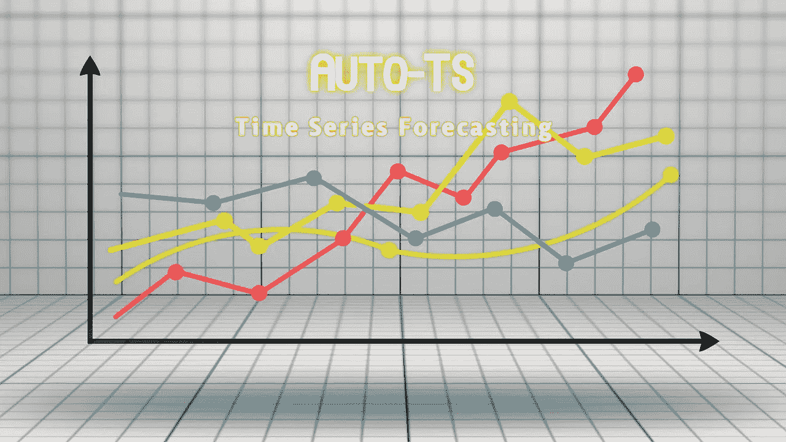
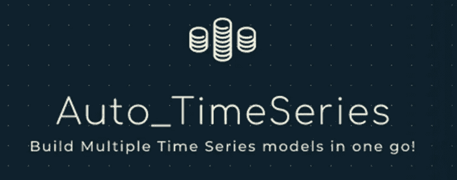
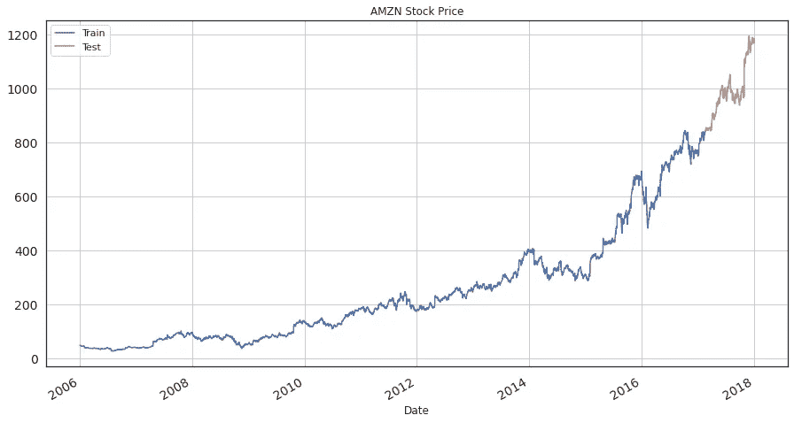
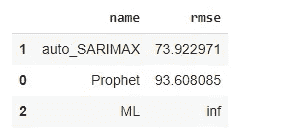
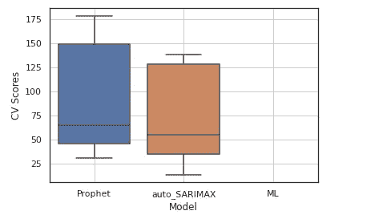
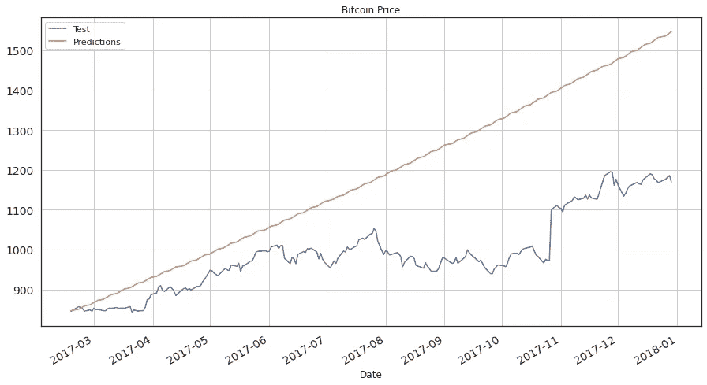

# 在一行 Python 代码中训练多个时间序列预测模型

> 原文：<https://towardsdatascience.com/train-multiple-time-series-forecasting-models-in-one-line-of-python-code-615f2253b67a?source=collection_archive---------0----------------------->

## 使用 Auto-TS 库开发 ARIMA、SARIMAX、FB Prophet、VAR 和 ML 模型



图片由 [Mediamodifier](https://pixabay.com/users/mediamodifier-1567646/?utm_source=link-attribution&amp;utm_medium=referral&amp;utm_campaign=image&amp;utm_content=3033203) 来自 [Pixabay](https://pixabay.com/?utm_source=link-attribution&amp;utm_medium=referral&amp;utm_campaign=image&amp;utm_content=3033203)

自动机器学习(AutoML)指的是将机器学习管道的一些组件自动化。AutoML 通过自动化一些模型开发过程来加速数据科学家的工作流程。自动化允许非专家在没有太多领域知识的情况下训练基本的机器学习模型。

有[各种 Auto-ML 开源 Python 库](https://medium.com/swlh/8-automl-libraries-to-automate-machine-learning-pipeline-3da0af08f636)包括 TPOT、MLBox、Auto-Sklearn 等，可以自动化一个分类或回归机器学习模型。为了自动化 NLP 问题，可以使用 [AutoNLP 库](https://medium.com/swlh/autonlp-sentiment-analysis-in-5-lines-of-python-code-7b2cd2c1e8ab)。

在本文中，我们将讨论如何使用开源模型 Auto-TS 来自动化时间序列预测模型的实现。

# 什么是自动 TS:



(图片由作者提供)

Auto-TS 是一个带有时间序列预测实现的开源 Python 库。它可以在一行 Python 代码中训练多个时间序列预测模型，包括 ARIMA、SARIMAX、FB Prophet、VAR 等，然后从中选择最佳的一个进行预测。

Auto-TS 库的一些特性是:

*   利用遗传规划优化寻找最优时间序列预测模型。
*   利用所有可能的超参数配置和交叉验证，训练朴素模型、统计模型、机器学习模型和深度学习模型。
*   通过学习最佳 NaN 插补和异常值剔除，执行数据转换以处理杂乱数据。
*   模型选择的度量组合选择。

## 安装:

可以使用 PyPl 安装 Auto-TS，使用命令:

```
**pip install autots**
```

使用以下方式导入库:

```
**from auto_ts import auto_timeseries**
```

## 用法:

> 本案例研究中使用的数据集是从 [Kaggle](https://www.kaggle.com/szrlee/stock-time-series-20050101-to-20171231?select=AMZN_2006-01-01_to_2018-01-01.csv) 下载的从 2006 年 1 月到 2017 年 12 月的[亚马逊股价](https://www.kaggle.com/szrlee/stock-time-series-20050101-to-20171231?select=AMZN_2006-01-01_to_2018-01-01.csv)。

这个库只提供训练时间序列预测模型。数据集应该有一个时间或数据格式列。

*   使用时间/日期列加载时序数据集

```
**df = pd.read_csv("AMZN.csv", usecols=['Date', 'Close'])
df['Date'] = pd.to_datetime(df['Date'])
df = df.sort_values('Date')**
```

*   将整个数据分成训练和测试数据

```
**train_df = df.iloc[:2800]
test_df = df.iloc[2800:]**
```

*   可视化列车测试值以供参考

```
**train_df.Close.plot(figsize=(15,8), title= 'AMZN Stock Price', fontsize=14, label='Train')
test_df.Close.plot(figsize=(15,8), title= 'AMZN Stock Price', fontsize=14, label='Test')
plt.legend()
plt.grid()
plt.show()**
```



(图片由作者提供)、训练测试分割、AMZN 股价可视化

*   初始化 Auto-TS 模型对象，并拟合定型数据。

```
**model = auto_timeseries(forecast_period=219, score_type='rmse', time_interval='D', model_type='best')
model.fit(traindata= train_df, ts_column="Date", target="Close")**
```

*   比较不同型号的得分

```
**model.get_leaderboard()
model.plot_cv_scores()**
```



(图片由作者提供)，不同车型的 RMSE 评分

*   预测测试数据

```
**future_predictions = model.predict(testdata=219)**
```

*   可视化测试数据值和预测。



(图片由作者提供)，测试与预测，AMZN 股价可视化

# 结论:

在本文中，我们讨论了如何用一行 Python 代码实现时间序列建模。Auto-TS 对数据进行预处理，因为它通过学习最佳 NaN 插补从数据中移除异常值并处理杂乱数据。只需一行代码，通过初始化 Auto-TS 对象并拟合训练数据，您就可以训练多个时间序列模型，包括 ARIMA、SARIMAX、FB Prophet、VAR，并得出性能最佳的模型。

模型的结果看起来确实令人满意，但如果我们尝试增加数据集的大小，结果可能会有所改善。

除了为时序数据集训练模型的 Auto-TS 库之外，我们还有各种 AutoML 库，可以通过自动化模型开发管道来加快数据科学家的工作流程。阅读下面提到的文章中的[，了解 8 个 AutoML 库。](https://medium.com/swlh/8-automl-libraries-to-automate-machine-learning-pipeline-3da0af08f636)

<https://medium.com/swlh/8-automl-libraries-to-automate-machine-learning-pipeline-3da0af08f636>  

# 参考资料:

[1] Auto-TS 文档:【https://pypi.org/project/AutoTS/ 

> 感谢您的阅读