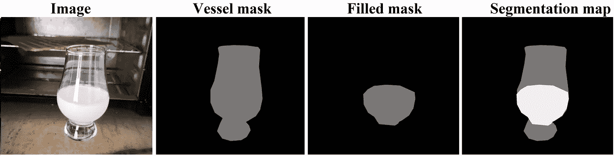

# 用 Pytorch 在 50 行代码中训练一个用于语义分段的神经网络

> 原文：<https://towardsdatascience.com/train-neural-net-for-semantic-segmentation-with-pytorch-in-50-lines-of-code-830c71a6544f?source=collection_archive---------0----------------------->

如何用不到 50 行代码(排除导入的话 40 行)训练一个语义切分的神经网络？这里的目标是给出如何使用内置的 Torchvision 神经网络(DeepLabV3)在 PyTorch 中训练语义分割神经网络的最快最简单的概述。

代码可用:[https://github . com/sagie ppel/Train-Semantic-Segmentation-Net-with-py torch-In-50-Lines-Of-Code](https://github.com/sagieppel/Train-Semantic-Segmentation-Net-with-Pytorch-In-50-Lines-Of-Code)

语义分割的目标是获取图像并识别属于特定类别的区域。这是通过卷积神经网络处理图像来完成的，卷积神经网络输出每像素一类的映射。这些类别是以一组数字的形式给出的。例如，在这种情况下，我们将使用带有三个类的 [LabPics V1](https://zenodo.org/record/3697452/) 数据集(如下图所示):


图像，相应的分割掩模:黑色(0) =背景，灰色(1) =空容器，白色(2) =填充区域。图片由作者提供。

0 类:不是血管(黑色)，
1 类:血管的空区域(灰色)，
2 类:血管的填充区域(白色)。

网络的目标是接收一幅图像，并预测每个像素的三个类别之一。

第一步从这里下载 [LabPics](https://zenodo.org/record/3697452/) 数据集:[https://zenodo.org/record/3697452/files/LabPicsV1.zip?下载=1](https://zenodo.org/record/3697452)

你还需要安装 [Pytorch](https://pytorch.org/) 和 OpenCV 来读取图像。

OpenCV 可以通过以下方式安装:

`pip install opencv-python`

首先，让我们导入包并定义主要的训练参数:

```
import os
import numpy as np
import cv2
import torchvision.models.segmentation
import torch
import torchvision.transforms as tfLearning_Rate=1e-5width=height=800 # image width and height
batchSize=3
```

*Learning_Rate* :训练时梯度下降的步长。

*宽度*和*高度*是用于训练的图像尺寸。训练过程中的所有图像都将调整到这个大小。

*batchSize: i* s 将用于每次训练迭代的图像数量。

*批次大小*宽度*高度* t 将与训练的内存需求成比例。根据您的硬件，可能有必要使用较小的批处理大小来避免内存不足的问题。

请注意，由于我们只使用单一的图像大小进行训练，因此训练后的网络很可能仅限于使用这种大小的图像。在大多数情况下，你想做的是改变每个训练批次之间的大小。

接下来，我们创建数据集中所有图像的列表:

```
TrainFolder="LabPics/Simple/Train//"
ListImages=os.listdir(os.path.join(TrainFolder, "Image")) 
```

Were *TrainFolder* 是 LabPics 数据集的 train 文件夹。
图片存储在 TrainFolder 的“image”子文件夹中。

接下来，我们定义一组将使用 TorchVision 变换模块在图像上执行的变换:

```
transformImg=tf.Compose([tf.ToPILImage(),tf.Resize((height,width)), tf.ToTensor(),tf.Normalize((0.485, 0.456, 0.406), (0.229, 0.224, 0.225))])transformAnn=tf.Compose([tf.ToPILImage(),tf.Resize((height,width)), tf.ToTensor()])
```

这定义了一组将应用于图像和注释映射的转换。这包括转换为 PIL 格式，这是转换的标准格式。调整大小并转换为 PyTorch 格式。对于图像，我们还通过减去平均值并除以像素强度的标准偏差来归一化图像中的像素强度。预先计算大量图像的平均值和偏差。

接下来，我们创建一个函数，该函数允许我们加载一个随机图像和相应的用于训练的注释图:

```
def ReadRandomImage():   idx=np.random.randint(0,len(ListImages)) # Pick random image   Img=cv2.imread(os.path.join(TrainFolder, "Image",ListImages[idx])) Filled =  cv2.imread(os.path.join(TrainFolder,   "Semantic/16_Filled", ListImages[idx].replace("jpg","png")),0)       

  Vessel =  cv2.imread(os.path.join(TrainFolder, "Semantic/1_Vessel", ListImages[idx].replace("jpg","png")),0) AnnMap = np.zeros(Img.shape[0:2],np.float32) # Segmentation map  
  if Vessel is not None:  AnnMap[ Vessel == 1 ] = 1    
  if Filled is not None:  AnnMap[ Filled  == 1 ] = 2 Img=transformImg(Img)
  AnnMap=transformAnn(AnnMap) return Img,AnnMap
```

在第一部分中，我们从图像列表中选择一个随机索引，并加载对应于该索引的图像。

```
idx = np.random.randint(0,len(ListImages)) # Pick random imageImg = cv2.imread(os.path.join(TrainFolder, "Image",ListImages[idx]))
```

接下来，我们要加载图像的注释遮罩:

```
Filled =  cv2.imread(os.path.join(TrainFolder,   "Semantic/16_Filled", ListImages[idx].replace("jpg","png")),0)       

Vessel =  cv2.imread(os.path.join(TrainFolder, "Semantic/1_Vessel", ListImages[idx].replace("jpg","png")),0)
```

这些注释被存储为覆盖属于特定类别(填充/脉管)的区域的图像/遮罩。每个类别掩码存储在单独的*中。png* 图像文件。其中属于该类的像素值为 1(灰色)，其他像素值为 0(黑色)。



图像、填充和血管区域的遮罩以及统一的注释图(灰色=1，白色=2，黑色=0)。作者的形象。

为了训练网络，我们需要创建一个分割图，其中属于空血管区域的像素值为 1(灰色)，属于填充区域的像素值为 2(白色)，其余为 0(黑色)。

首先，我们创建一个在图像形状中充满零的分割图:

```
AnnMap = np.zeros(Img.shape[0:2],np.float32)
```

接下来，我们将在血管掩模中具有值 1 的所有像素设置为在分割掩模中具有值 1。并且在填充掩模中值为 1 的所有像素在分割掩模中具有值 2:

```
if Vessel is not None:  AnnMap[ Vessel == 1 ] = 1    
if Filled is not None:  AnnMap[ Filled  == 1 ] = 2 
```

其中" *AnnMap[ Filled == 1 ] = 2"* 表示填充遮罩中值为 1 的每个位置在 AnnMap 中都将得到值 2。

如果没有血管和填充类的注释文件(如果图像中没有出现类，就会出现这种情况)，cv2.imread 将返回 None，并且遮罩将被忽略。

最后，我们使用前面定义的转换将注释转换成 PyTorch 格式:

```
Img=transformImg(Img)
AnnMap=transformAnn(AnnMap)
```

为了训练，我们需要使用一批图像。这意味着几幅图像以 4D 矩阵的形式堆叠在一起。我们使用以下函数创建批处理:

```
def LoadBatch(): # Load batch of images
    images = torch.zeros([batchSize,3,height,width])
    ann = torch.zeros([batchSize, height, width])

    for i in range(batchSize):
        images[i],ann[i]=ReadRandomImage()

    return images, ann
```

第一部分创建一个空的 4d 矩阵，它将存储具有维度的图像:[批次大小，通道，高度，宽度]，其中通道是图像的层数；这对于 RGB 图像是 3，对于注释图是 1。

下一部分使用我们之前定义的 ReadRandomImage()将一组图像和注释加载到空矩阵中。

```
for i in range(batchSize):
        images[i],ann[i]=ReadRandomImage()
```

现在我们可以加载数据了，是时候加载神经网络了:

```
device = torch.device(‘cuda’) if torch.cuda.is_available() else torch.device(‘cpu’)Net = torchvision.models.segmentation.deeplabv3_resnet50(pretrained=True)Net.classifier[4] = torch.nn.Conv2d(256, 3, kernel_size=(1, 1), stride=(1, 1)) # Change final layer to 3 classesNet=Net.to(device)optimizer=torch.optim.Adam(params=Net.parameters(),lr=Learning_Rate,weight_decay=Weight_Decay) # Create adam optimizer
```

第一部分是识别计算机是否有 GPU 或 CPU。如果有 Cuda GPU，培训将在 GPU 上进行:

```
device = torch.device(‘cuda’) if torch.cuda.is_available() else torch.device(‘cpu’)
```

对于任何实际的数据集，使用 CPU 进行训练都是极其缓慢的。

接下来，我们加载深度实验室网络语义分割:

```
 Net = torchvision.models.segmentation.deeplabv3_resnet50(pretrained=True)
```

包含许多有用的语义分割模型，如 UNET 和 FCN。我们选择 Deeplabv3，因为它是最好的语义分割网络之一。通过设置 *pretrained=True* ，我们在 COCO 数据集上加载预训练的权重。当学习一个新问题时，从预先训练的模型开始总是更好，因为它允许网络使用以前的经验并更快地收敛。

我们可以通过编写以下内容来查看我们刚刚加载的网络的所有层:

*打印(网)*

> ….
> 
> (1): Conv2d(256，256，kernel_size=(3，3)，stride=(1，1)，padding=(1，1)，bias = False)
> (2):batch norm 2d(256，eps=1e-05，momentum=0.1，affine=True，track _ running _ stats = True)
> (3):ReLU()
> (4):conv 2d(256，21，kernel_size=(1，1)，stride=(1，1))

这将按使用顺序打印层的网络。网络的最后一层是具有 256 层输入和 21 层输出的卷积层。21 代表输出类的数量。因为我们的数据集中只有 3 个类，所以我们想用一个具有 3 个输出的新卷积层来替换它:

```
Net.classifier[4] = torch.nn.Conv2d(256, 3, kernel_size=(1, 1), stride=(1, 1)) 
```

公平地说，这部分是可选的，因为具有 21 个输出类的网络可以简单地通过忽略剩余的 18 个类来预测 3 个类。但这样更优雅。

接下来，我们将网络加载到我们的 GPU 或 CPU 设备中:

```
Net=Net.to(device)
```

最后，我们加载一个优化器:

```
optimizer=torch.optim.Adam(params=Net.parameters(),lr=Learning_Rate) # Create adam optimizer
```

优化器将在训练的反向传播步骤中控制梯度率。亚当优化器是最快的优化器之一。

最后，我们开始训练循环:

```
for itr in range(20000): # Training loop
   images,ann=LoadBatch() 

   images=torch.autograd.Variable(images,requires_grad=False)
   .to(device)    

   ann = torch.autograd.Variable(ann,requires_grad=False).to(device)              

   Pred=Net(images)[‘out’] # make prediction
```

LoadBatch 是前面定义的，加载批量的图像和标注图。*图像*和 *ann* 将存储加载的图像和注释。

torch . autograded . variable:将数据转换成网络可以使用的梯度变量。我们设置 *Requires_grad=False* ,因为我们不想将渐变应用于图像，只应用于网络的层。 *to(device)* 将张量复制到与网络相同的设备(GPU/CPU)中。

最后，我们将图像输入网络，得到预测。

```
Pred=Net(images)[‘out’] # make prediction
```

一旦我们做出了预测，我们就可以将其与真实(地面实况)注释进行比较，并计算损失:

```
criterion = torch.nn.CrossEntropyLoss() # Set loss function
Loss=criterion(Pred,ann.long()) # Calculate cross entropy loss
Loss.backward() # Backpropogate loss
Optimizer.step() # Apply gradient descent change to weight
```

首先，我们定义损失函数。我们使用标准的交叉熵损失:

```
criterion = torch.nn.CrossEntropyLoss()
```

我们使用此函数来计算使用预测和真实注释的损失:

```
Loss=criterion(Pred,ann.long())
```

一旦我们计算出损失，我们就可以应用反向传播并改变净重。

```
Loss.backward() # Backpropogate loss
Optimizer.step() # Apply gradient descent change to weight
```

这涵盖了整个训练阶段，但是我们还需要保存训练好的模型。否则，一旦程序停止，它就会丢失。
保存非常耗时，所以我们希望每 1000 步保存一次:

```
if itr % 1000 == 0: 
   print(“Saving Model” +str(itr) + “.torch”)
   torch.save(Net.state_dict(), str(itr) + “.torch”)
```

在运行这个脚本大约 3000 步之后，网络应该会给出不错的结果。

完整代码可在此处找到:

[](https://github.com/sagieppel/Train-Semantic-Segmentation-Net-with-Pytorch-In-50-Lines-Of-Code) [## GitHub-sagieppel/Train-Semantic-Segmentation-Net-with-py torch-In-50-line Of-Code:Train neural…

### 用 pytorch 在不到 50 行代码中训练语义分割的神经网络(deep lab V3)

github.com](https://github.com/sagieppel/Train-Semantic-Segmentation-Net-with-Pytorch-In-50-Lines-Of-Code) 

总共 50 行代码，不包括空格，40 行代码，不包括导入:-)

最后，一旦网络被训练，我们想申请分割真实的图像，看看结果。我们使用一个单独的推理脚本来实现这一点，该脚本使用训练网络来分割图像:

```
import cv2
import torchvision.models.segmentation
import torch
import torchvision.transforms as tf
import matplotlib.pyplot as pltmodelPath = "3000.torch"  # Path to trained model
imagePath = "test.jpg"  # Test image
height=width=900transformImg = tf.Compose([tf.ToPILImage(), tf.Resize((height, width)), tf.ToTensor(),tf.Normalize((0.485, 0.456, 0.406),(0.229, 0.224, 0.225))])  

device = torch.device('cuda') if torch.cuda.is_available() else torch.device('cpu') 
Net = torchvision.models.segmentation.deeplabv3_resnet50(pretrained=True) Net.classifier[4] = torch.nn.Conv2d(256, 3, kernel_size=(1, 1), stride=(1, 1)) Net = Net.to(device)  # Set net to GPU or CPUNet.load_state_dict(torch.load(modelPath)) # Load trained modelNet.eval() # Set to evaluation modeImg = cv2.imread(imagePath) # load test imageheight_orgin , widh_orgin ,d = Img.shape # Get image original size plt.imshow(Img[:,:,::-1])  # Show imageplt.show()
Img = transformImg(Img)  # Transform to pytorchImg = torch.autograd.Variable(Img, requires_grad=False).to(device).unsqueeze(0)with torch.no_grad():
    Prd = Net(Img)['out']  # Run net# resize to orginal size
Prd = tf.Resize((height_orgin,widh_orgin))(Prd[0])#Convert probability to class map
seg = torch.argmax(Prd, 0).cpu().detach().numpy() plt.imshow(seg)  # display image
plt.show()
```

这里的大部分代码与训练脚本相同，只有几处不同:

```
Net.load_state_dict(torch.load(modelPath)) # Load trained model
```

从*模型路径*中的文件加载我们之前训练并保存的网络

```
Net.eval()
```

将网络从培训模式转换为评估模式。这主要意味着不会计算批量标准化统计数据。

```
with torch.no_grad():
```

这意味着网络运行时不收集梯度。梯度仅与训练相关，并且收集它们是资源密集型的。

请注意， *Pred* 中的输出将被映射为每幅图像 3 个通道，每个通道代表 3 个类别之一的非标准化概率。为了找到每个像素所属的类，我们使用 argmax 函数取具有 3 的最高值的通道(类):

```
seg = torch.argmax(Prd[0], 0)
```

我们对输出图中的每个像素都这样做，并为每个像素获得 3 个类中的一个。

结果是:

输入图像:


输出预测:

