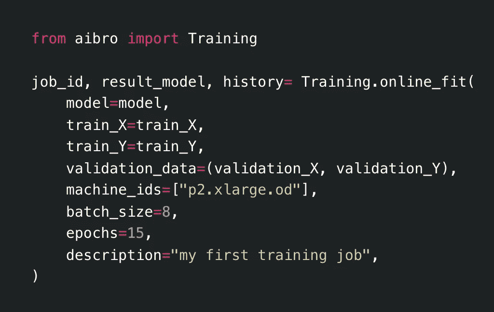

# 用一行代码在云上训练神经网络

> 原文：<https://towardsdatascience.com/train-neural-network-on-cloud-with-one-line-of-code-8ae2e378bc98?source=collection_archive---------19----------------------->

## 你可能见过的最简单的无服务器模型训练工具



在自动气象站上训练张量流模型

大家好大家好，

我是 Aipaca 公司的 Yuki，是滑铁卢大学计算机工程专业的四年级学生。当我作为一名数据科学家实习时，我发现在云上设置基础设施和训练模型非常耗时。因此，我与 Cody、Xin、Lounan 和 Sam 合作开发了一个无服务器模型培训工具——**ai bro。**从上面的代码片段中可以观察到，Aibro 让云模型训练像一行 python 代码一样简单。这篇文章将带你一步一步地使用这个工具。

[Colab 演示链接](https://colab.research.google.com/drive/19sXZ4kbic681zqEsrl_CZfB5cegUwuIB) & [我们的网站](https://aipaca.ai)

**注:目前 Aibro 版本仅支持基于 Tensorflow 的模型训练。我们将在不久的将来添加更多像 Pytorch 和 Sklearn 这样的框架。**

# 关于 Aibro

Aibro 是一个将机器学习模型连接到任何云服务器的 MLOps API。它帮助数据科学家和机器学习研究人员轻松地在云平台上训练和部署模型，而无需担心基础设施的设置。

# 工作流程

## 步骤 1:准备模型和数据

例如，我们使用 MNIST 作为训练数据，然后将其处理成适合以下 CNN 的形状。

```
from tensorflow.keras.datasets import mnist
import tensorflow as tf#load data
TRAINING_SIZE = 10000
(train_X, train_Y), (test_X, test_Y) = mnist.load_data()validation_X = train_X[TRAINING_SIZE:(TRAINING_SIZE + 40)].reshape((40, 28, 28, 1))
validation_Y = train_Y[TRAINING_SIZE:(TRAINING_SIZE + 40)]#process data
train_X = train_X[:TRAINING_SIZE].reshape((TRAINING_SIZE, 28, 28, 1))
train_Y = train_Y[:TRAINING_SIZE]
train_Y = tf.keras.utils.to_categorical(train_Y, 10)validation_Y = tf.keras.utils.to_categorical(validation_Y, 10)
```

CNN 模型:

```
from tensorflow.keras import layers, modelsmodel = models.Sequential()
model.add(layers.Conv2D(32, (3, 3), activation="relu", input_shape=(28, 28, 1)))
model.add(layers.MaxPooling2D((2, 2)))
model.add(layers.Conv2D(64, (3, 3), activation="relu"))
model.add(layers.MaxPooling2D((2, 2)))
model.add(layers.Conv2D(64, (3, 3), activation="relu"))
model.add(layers.Flatten())
model.add(layers.Dense(64, activation="relu"))
model.add(layers.Dense(10, activation="softmax"))
model.compile(
    optimizer="adam",
    loss=tf.keras.losses.CategoricalCrossentropy(from_logits=False),
    metrics=[tf.keras.metrics.CategoricalAccuracy()],
)
```

您可以尝试在 Colab 演示中即插即用任何基于 Tensorflow 的模型和数据。请记住，如果您的模型使用`*度量=[" accuracy "]【T11 ]'进行编译，那么由于 Tensorflow 的模型[保存和重新加载问题，度量可能会被错误地传输。为了避免这个问题，请在编译模型时指定您的指标，如演示中所示。](https://github.com/keras-team/keras/issues/4875)*

## 步骤 2:安装 Aibro 库

公共 Aibro 的版本是 1.1.0。您可以使用以下命令安装它。在调用它的方法时，我们可能需要您的电子邮件地址，这有助于我们回溯作业日志并改进未来的开发。

```
!pip install aibro
https://test.pypi.org/simple
```

## 第三步:选择一个云机器

在启动训练机之前，你需要选择一个云机来训练模型。目前，Aibro 仅支持 AWS 上的 [spot 实例](https://docs.aws.amazon.com/AWSEC2/latest/UserGuide/using-spot-instances.html)，因为它们比按需深度学习实例(如 Sagemaker)便宜 4 倍。

顺便说一下，不要担心 spot 实例的中断问题，Aibro 有一个专门的系统来自动重新连接中断的培训工作。

现在，让我们回到演示。通过调用 available_machines()，可以查看每台机器的租赁限额及其**可用性**。可用性被定义为成功启动指定的 spot 实例类型的概率(因为 spot 实例请求不能保证被 AWS 满足)。一般来说，更强大的实例不太可能可用。

```
from aibro.train import available_machinesavailable_machines()
```

样本输出:

```
Available Resources: 
Machine Id: g4dn.4xlarge   GPU Type: 1xT4     num_vCPU: 16    cost: $0.36/hr  limit: 4   availability: 96.0% 
Machine Id: g4dn.8xlarge   GPU Type: 1xT4     num_vCPU: 32    cost: $0.67/hr  limit: 2   availability: 84.0% 
Machine Id: p2.8xlarge     GPU Type: 8xK80    num_vCPU: 32    cost: $2.16/hr  limit: 2   availability: 49.0% 
Machine Id: p2.xlarge      GPU Type: 1xK80    num_vCPU: 4     cost: $0.27/hr  limit: 23  availability: 61.0% 
Machine Id: p3.2xlarge     GPU Type: 1xV100   num_vCPU: 8     cost: $0.92/hr  limit: 11  availability: 24.0% 
Machine Id: p3.8xlarge     GPU Type: 4xV100   num_vCPU: 32    cost: $3.67/hr  limit: 2   availability: 12.0%
```

**好消息**:由于我们想在更多的边缘情况下测试该工具，您产生的任何机器租赁费用将由我们支付。但是，请不要循环使用它！学生的口袋很脆弱😳。

## 步骤 4:启动培训工作

最上面的代码片段显示了培训作业是如何启动的。在设计方法时，我们试图保持通常适合张量流模型的相同风格。在 extra 中，你只需要通过 *model* ，cloud *machine_id* 来填充函数 args 并添加一个*描述*来帮助你识别工作。

```
from aibro import Trainingjob_id, trained_model, history = Training.online_fit(
    model=model,
    train_X=train_X,
    train_Y=train_Y,
    validation_data=(validation_X, validation_Y),
    machine_id=machine_id,
    description='Demo Run 0.0.41',
    epochs=10
)
```

培训工作开始后有 7 个有序阶段:

1.  **【启动】:**向云平台发送打开实例的请求
2.  **【发送】:**向实例发送模型和数据
3.  **【镜像】:**将你本地的深度学习环境克隆到云端
4.  **【训练】:**模型开始训练
5.  【**总结】:**返回培训工作的简要总结
6.  **【接收】:**将训练好的模型和其他结果返回给用户
7.  [ **关闭]:** 销毁用户培训数据，终止实例

在**【训练】**阶段，会显示一个 tensorboard 地址供你实时跟踪进度。

培训作业完成后，将返回 *job_id* 、 *trained_model* 和 *history* 对象。

您还可以通过 *list_trial()* 查看您的历史作业，并通过使用*get _ Tensorboard _ logs(job _ id)下载 tensor board 日志来检查相应的详细信息。*

# 设计原则——通过打开和关闭来实现节能


图片由来自 Pexels 的 Luis Quintero 提供

云机器就像一个水龙头，当“水”运行时，你按秒计费，这是一种能源和金钱的浪费。Aibro 的设计不仅可以帮助数据科学家在云上训练模型，还可以最大限度地减少浪费。所以，每推出一个新的培训工作，Aibro 都会打开一个新的云服务器。一旦作业完成或取消，服务器将自动终止。代价是您可能需要 2-3 分钟的耐心来等待实例启动。

**注意:我们正在添加多个功能以缩短发布时间；例如，在下一个版本中，我们将允许服务器在作业完成后保留一段时间，以便快速调试和修改模型。这样，如果在等待期间提交了新作业，该作业将直接跳过[启动]阶段。**

# 什么即将到来

演示之后，我们正在为 Aibro 开发一个 alpha 版本，将于 10 月初推出。在下一版本中，您将看到以下更新:

*   用户注册:开放给用户注册和管理账户。
*   文档:解释更多关于库的细节。
*   保持期:在培训作业开始之前预打开服务器(预热期)，在培训作业之后保持保持服务器(冷却期)。
*   离线 fit:启动一个培训任务，稍后通过 job_id 获取。
*   重新培训:从检查点恢复暂停的培训作业。
*   大数据:支持大数据传输和训练。

# 联系我们

如果你发现 Aibro 是有用的，请加入我们来自 [aipaca.ai](https://aipaca.ai) 的等候名单。我们将分享 Aibro 的最新更新。同时，我们欢迎您的任何反馈。您可以通过从 [aipaca.ai](https://aipaca.ai) 加入 AIpaca 社区、发送电子邮件至 [hello@aipaca.ai](http://hello@aipaca.ai) 或使用*ai bro . comm . send _ message()*向我们发送直接消息来联系我们！