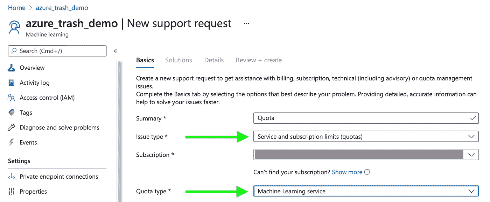

# 使用 Azure Machine Learning SDK for Python 在云 GPU 上进行培训

> 原文：<https://towardsdatascience.com/train-on-cloud-gpus-with-azure-machine-learning-sdk-for-python-967c99418df1?source=collection_archive---------11----------------------->

## 在 Azure Machine Learning Studio cloud 中的 GPU 驱动的计算实例上运行机器学习模型的入门指南


在 [Unsplash](https://unsplash.com?utm_source=medium&utm_medium=referral) 上由 [Daniel Páscoa](https://unsplash.com/@dpascoa?utm_source=medium&utm_medium=referral) 拍照

我最近在做一个项目，需要快速训练一组神经网络。这不能在我的笔记本电脑上完成，因为培训是连续的，没有足够的时间。另外，我不能忍受我的 3.1 GHz 2017 MacBook Pro 在用 tensorflow 训练模型时有多迟钝。

开始使用 Azure 机器学习有一个相当大的障碍。微软的文档很好，但没有提供上下文，所以拼凑必要的组件来运行这个项目最终有点痛苦。为了减轻你的痛苦，这里有一个在 Azure cloud 中使用 GPU 计算实例运行机器学习模型的入门指南。

# 数据

在本教程中，我将使用来自 [Mindy Yang](http://github.com/yangmindy4) 和 [Gary Thung](https://github.com/garythung/) 的论文[垃圾可回收性分类](http://cs229.stanford.edu/proj2016/report/ThungYang-ClassificationOfTrashForRecyclabilityStatus-report.pdf)中的数据可以从 google drive 文件夹下载原始尺寸和缩减采样尺寸的图像，或者从 [kaggle 下载缩减采样尺寸的图像。](https://www.kaggle.com/asdasdasasdas/garbage-classification)

为了对数据有一个概念，这里有一些图片和它们的文件名。


图片由作者在麻省理工学院许可下使用 M. Yang 和 G. Thung 的组件制作

我将数据分为训练集和验证集。分割的代码与使用 Azure 没有直接关系，所以我没有在这里包括它；然而，用于创建这个项目的所有代码都可以在相关的 [github 资源库](https://github.com/benbogart/getting_started_with_azure_for_ml)中找到。

 [## benbogart/getting _ started _ with _ azure _ for _ ml

### 中型文章《Azure 机器学习入门》附带的笔记本…

github.com](https://github.com/benbogart/getting_started_with_azure_for_ml/blob/master/1_Getting_started_with_Azure_for_Machine_Learning.ipynb) 

至此，是时候设置 Azure 环境了！

# Azure 设置

## 请求 GPU 配额

如果你还没有 Azure 帐户，你可以注册一个，并获得 200 美元的免费点数(截至本文撰写之时)。但是，为了在支持 GPU 的实例上运行以下培训，您必须将您的帐户升级为“现收现付”，并请求增加 GPU 计算实例类型的配额。在您切换到“现收现付”后，您的点数将保持有效

GPU 将显著加快训练速度(例如，将我的笔记本电脑与我进行基准测试的模型上支持 GPU 的计算实例进行比较，每个时期从 18 分钟缩短到 40 秒)，并且由于速度的提高还节省了资金。

要请求增加配额，请单击“？”(问号)并选择“新建支持请求”。"


*   对于`Issue type`,选择`Service and Subscription Limits (quotas)`
*   对于`Quota type`,选择`Machine Learning services`



在下面的屏幕上

*   选择`Enter Details`
*   选择您首选的数据中心位置。请记住您选择的位置，以后会用到它。我在这个演示中使用了`East US`。
*   从 VM 系列下拉菜单中选择`NCPromo`。
*   为此计算类型选择您希望能够并发运行的 CPU 内核数量。在这种计算类型中，每个 GPU 有 6 个 CPU 内核，因此对于一个 GPU，您应该输入 6，对于两个 GPU，输入 12，依此类推。
*   点击`Save and continue`
*   点击下一步:`Review + create >>`


> 注意:该笔记本可以在配备了新帐户的标准 DSv2 虚拟机上运行，您的模型将需要相当长的时间来训练。

## 安装 AzureML python sdk。

尽管仍有可能安装 AzureML sdk，但当前推荐的最佳实践是仅将您需要的组件安装到您的环境中。

对于这个项目，我们只需要 azureml.core，它可以用 pip 安装，如下所示:

```
pip install azureml.core
```

## 设置 Azure 环境

在我们将模型传递给 Azure 进行训练之前，需要进行一些设置。它们是:

1.  创建工作区
2.  定义计算机目标
3.  创建运行环境
4.  将您的数据上传到数据存储(可选)
5.  定义数据集

我将一步一步地介绍它们，并简要解释它们是什么以及它们如何适应整体架构。

## 创建工作区

Azure 上的机器学习工作区就像一个项目容器。它位于一个资源组中，包含您将在项目中使用的任何其他资源，如存储或计算。好消息是，可以使用 azureml python sdk 轻松地创建工作空间及其资源组。

像这个设置部分中的所有内容一样，工作区只需要创建一次。把`[your-subscription-id]`换成，嗯……你能想出来。如果您愿意，您还可以将资源组名称和工作区名称更改为类似于`test123`这样有创意的名称。

这将要求您进行身份验证，然后将您的连接信息存储在。azureml 子目录，这样你就不用再次认证了。

## 定义计算目标

计算目标定义了将运行您的培训脚本的虚拟机的类型。

*   `compute_name`是用户定义的，可以是对你有意义的任何东西。这是您将来引用计算集群的方式。
*   `vm_size`是您想要在计算集群中使用的计算类型的 Azure 特定名称。我们正在使用`Standard_NC6_Promo`，它对应于我们在上面请求配额的计算类型。它有 6 个 CPU 核心和一个特斯拉 K80 GPU。
*   `min_nodes`是即使没有要处理的内容也将保持活动状态的节点数。这可以减少培训的启动时间，但无论您是否使用这些节点，您都需要付费。我推荐 0 入门。
*   `max_nodes`是该计算目标中一次可以运行的最大节点数。`max_nodes`必须小于您的 cpu 配额/每个节点的 CPU 数量，否则配置将失败。

## 创建运行环境

运行环境定义了脚本和要使用的基本 docker 映像的依赖关系。微软提供了几个[策划环境](https://docs.microsoft.com/en-us/azure/machine-learning/resource-curated-environments)，但是因为 ImageDataGenerator 需要`Pillow,`而`Pillow`不包含在策划环境中，所以我们必须创建自己的容器。

*   `name`传递给`Environment`的是用户为您的环境定义的名称。我们稍后将使用它来访问环境。
*   `CondaDependencies`为您的脚本定义 pip、conda 和 pip 包依赖关系。
*   `env.docker.base_image`定义 docker 容器用作基本图像。这可以来自于 [AzureML-Containers repo](https://github.com/Azure/AzureML-Containers) 。(您也可以使用一个定制容器[但是这超出了本文的范围)](https://docs.microsoft.com/en-us/azure/machine-learning/how-to-deploy-custom-docker-image#use-an-image-with-the-azure-machine-learning-sdk)

## 将数据上传到数据存储

AzureML Studio 架构中需要理解的一个重要细节是数据存储和数据集之间的区别。*一个* ***数据存储*** *是存储*。它有多种类型，但是它存储你的数据。

****数据集*** *是对存储在数据存储或任何可公开访问的 url 中的数据*的引用。*

*每个工作区都有一个默认的 blob 数据存储，这就是我们将在本演示中使用的。*

*   *我们用`get_default_datastore()`获取对默认工作区数据存储的引用*

*然后我们通过调用数据存储对象上的`upload`来上传文件，方法是:*

*   *`src_dir`是上传的本地路径*
*   *`target_path`是您的数据将被上传到数据存储的路径*

## *定义数据集*

*现在我们已经上传了数据，我们需要创建指向数据的数据集定义。*

*   *要创建数据集，调用`Dataset.File.from_files`并传入一个带有我们的`datastore`对象和数据存储中数据的路径的元组。*
*   *然后我们注册数据存储区，这样我们就可以在以后访问它，而不必重新创建它。*

*这是一次性设置的结束。现在我们有了一个工作区，我们可以在[ml.azure.com](https://ml.azure.com/)查看它，它包含一个`compute_target`，以及一个注册的`Environment`和`Dataset`。*

# *训练模特*

*此时，在 github 库中，我创建了一个新的 jupyter 笔记本。这是为了展示加载我们已经创建的所有资产是多么简单。看看这个:*

## *定义一个实验名称*

*模型的每次运行都存在于一个实验中。实验就像你跑步的文件夹，让你保持跑步有条理。例如，您可以为 CNN 迭代创建一个实验，为 LSTM 迭代创建另一个实验。在这个演示中，我们将创建一个名为“回收”的实验你可以用任何对你有意义的方式对你的跑步进行分组。*

## *创建控制脚本*

*控制脚本是一个独立的 python 文件(或多个文件)，它被上传到 Azure，并在 AMLcompute 实例上运行以训练您的模型。您可以将参数作为命令行参数发送到您的脚本，我们将在下面看到。*

*这是我在这个演示中使用的控制脚本。它执行以下操作:*

*   *解析传递给脚本的参数*
*   *为数据创建 ImageDataGenerators*
*   *建立一个模型*
*   *符合模型*
*   *保存模型及其历史*

## *发给 Azure！*

*现在我们将它发送到 Azure 以在云中运行！*

***一个重要的细节**是控制脚本如何获得数据路径。我们将带有挂载类型的`Dataset`对象传递给脚本。它将自动为您装载，并且装载路径将代替您的参数中的数据集。这是非常方便的，也没有解释在哪里(至少我找不到)。*

*参数按照您在命令行中编写的顺序传递。参数名和值分别传递，但作为一个列表按顺序传递。*

> *第一次运行模型时，Azure 会构建它的计算容器。这可能需要相当长的时间，但 azure 会缓存容器，因此后续运行会更快。*

# *检查培训情况*

*要查看培训并监控培训日志，您可以登录 Azure Machine Learning Studio。*

1.  *前往[https://portal.azure.com/](https://portal.azure.com/)并登录*
2.  *搜索“机器学习”，选择“机器学习”*

**

1.  *选择“azure_trash_demo”*

**

*   *选择“启动工作室”*

**

*   *从左侧菜单中选择`Experiments`*
*   *选择`recycling`*

**

*你的模型在云中运行。*

*此时，我们没有记录存储任何指标，因此您在这里看到的只是运行时间。在另一篇文章中，我将深入探讨如何使用这个仪表板实时监控你的跑步。*

**

## *监控机器学习工作室中的日志*

*要在模型训练时实时查看日志，请单击运行 ID，然后单击输出+日志。*

**

*你可以通读所有的 tensorflow 控制台吐槽，看看我们确实是在 GPU 上训练。日志将定期更新，无需您的参与。*

***下载您的模型和日志***

*这个模型对我们没有太大的帮助。最后一步是将训练好的模型和模型历史放回我们的本地计算机，这样我们就可以用惊人的回收预测给我们的朋友留下深刻印象。*

*一旦模型训练完成，我们可以下载训练过程中生成的所有文件，包括日志，以及由我们的训练脚本保存到`outputs/`路径的任何内容，代码如下。*

***加载模型***

*现在我们已经有了可以加载到模型中的文件和训练好的权重。*

```
*Model: "sequential"
_________________________________________________________________
Layer (type)                 Output Shape              Param #   
=================================================================
conv2d (Conv2D)              (None, None, None, 32)    416       
_________________________________________________________________
max_pooling2d (MaxPooling2D) (None, None, None, 32)    0         
_________________________________________________________________
flatten (Flatten)            (None, None)              0         
_________________________________________________________________
dense (Dense)                (None, 6)                 3096774   
=================================================================
Total params: 3,097,190
Trainable params: 3,097,190
Non-trainable params: 0
_________________________________________________________________*
```

***绘制训练历史***

*我们可以绘制训练历史。*

**

*或者任何你想要的东西。*

# *包装它*

*我希望这能让你在未来更快的训练！弄清楚这一切可能会很麻烦，但是希望这篇文章能加快你的速度。*

*你知道你可以不止一次为媒体上的文章鼓掌吗？来吧，试试看！给它一些掌声，就像你真的在鼓掌一样。我会听到它，并感谢掌声。*

## *Github 回购*

*您可以查看完整的 [github 资源库](https://github.com/benbogart/getting_started_with_azure_for_ml/)或者直接跳到下面的第一个笔记本:*

 *[## benbogart/getting _ started _ with _ azure _ for _ ml

### 中型文章《Azure 机器学习入门》附带的笔记本…

github.com](https://github.com/benbogart/getting_started_with_azure_for_ml/blob/master/1_Getting_started_with_Azure_for_Machine_Learning.ipynb)* 

*现在去做好事吧。*