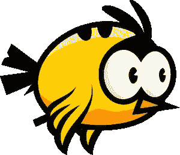
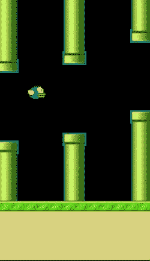
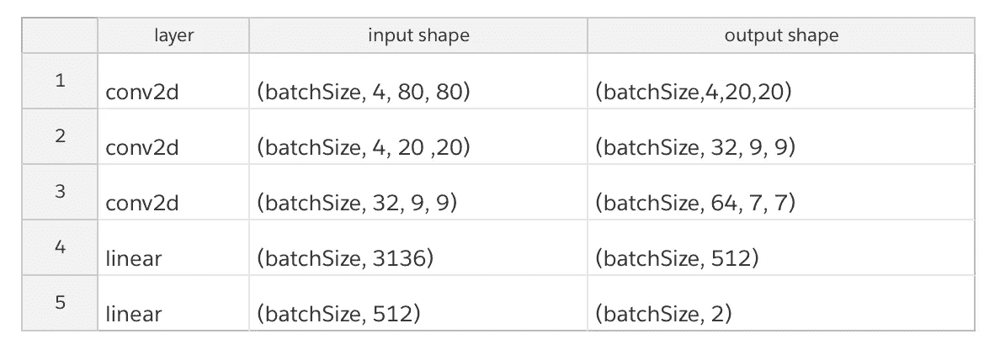

# 基于 Java 的强化学习训练“不朽”的 Flappy Bird

> 原文：<https://towardsdatascience.com/train-undying-flappy-bird-using-reinforcement-learning-on-java-98ff68eb28bf?source=collection_archive---------25----------------------->

## 拍打还是不拍打？让人工智能代理决定。



图片来自 [Pixabay](https://pixabay.com/vectors/animal-bird-flapping-flying-1299933/)

Flappy Bird 是一款于 2013 年推出的手机游戏，因其简单的玩法(拍打/不拍打)而变得超受欢迎。随着深度学习(DL)和强化学习(RL)的发展，我们现在可以训练一个 AI 智能体来控制 Flappy Bird 的行动。今天，我们将看看使用 Java 创建人工智能代理的过程。对于游戏本身，我们使用了一个简单的使用 Java 的[开源 Flappy Bird 游戏](https://github.com/kingyuluk/FlappyBird)。对于训练，我们使用了[深度 Java 库(DJL)](https://djl.ai/) ，一个基于 Java 的深度学习框架，来构建训练网络和 RL 算法。

在本文中，我们将从 RL 的基础开始，通过关键组件来构建培训架构。如果在任何时候你不能遵循我们的代码，并希望尝试游戏，你可以参考我们的 [RL 报告](https://github.com/kingyuluk/RL-FlappyBird)。



作者图片

# RL 架构

在本节中，我们将介绍一些主要的算法和网络，以帮助您更好地了解我们如何训练模型。这个项目使用了类似于 [DeepLearningFlappyBird](https://github.com/yenchenlin/DeepLearningFlappyBird) 的方法，这是一个 Python Flappy Bird RL 实现。主要的 RL 架构是 [Q-Learning](https://en.wikipedia.org/wiki/Q-learning) ，卷积神经网络(CNN)。在每个游戏动作阶段，我们存储鸟的当前状态、代理采取的动作以及鸟的下一个状态。这些被视为 CNN 的训练数据。

# CNN 培训概述

用于训练的输入数据是连续的四帧图像。我们将这四幅图像叠加起来，形成对这只鸟的“观察”。这里的观察是指由一系列图像表示的时间序列数据。图像本身是灰度的，以减少训练负荷。图像的数组表示为(批量大小，4(帧)，80(宽度)，80(高度))。数组的每个元素代表每帧的像素值。这些数据被输入 CNN 并计算出一个输出(批量大小，2)。输出的第二维表示下一个动作(拍打，不拍打)的置信度。

我们使用记录的实际动作对照输出置信度来计算损失。之后，通过[反向传播](https://en.wikipedia.org/wiki/Backpropagation)和[参数优化](https://en.wikipedia.org/wiki/Hyperparameter_optimization)来更新模型。代理会不断更新用于训练的数据，以获得更好的结果。

# 培训用数据

在行动阶段之后，我们创建预观察和当前观察。如前所述，这些只是代表一系列运动的图像。之后，我们只需将 preObservation、currentObservation、action、reward 和 terminal 放在一起，作为一个步骤存储到 replayBuffer 中。replayBuffer 是具有有限大小的训练数据集，并且用最新的动作动态更新。

```
public void step(NDList action, boolean training) {
    if (action.singletonOrThrow().getInt(1) == 1) {
        bird.birdFlap();
    }
    stepFrame();
    NDList preObservation = currentObservation;
    currentObservation = createObservation(currentImg);
    FlappyBirdStep step = new FlappyBirdStep(manager.newSubManager(),
            preObservation, currentObservation, action, currentReward, currentTerminal);
    if (training) {
        replayBuffer.addStep(step);
    }
    if (gameState == GAME_OVER) {
        restartGame();
    }
}
```

# RL 的三个阶段

有三个不同阶段的 RL 用于生成更好的训练数据:

*   观察阶段:大多数动作是随机的，只有一小部分动作来自人工智能代理
*   探索阶段:随机行动和人工智能代理行动相结合
*   训练阶段:动作主要由人工智能代理产生

在探索阶段，我们将在随机行动和人工智能代理行动之间选择。在训练开始时，主要使用随机动作，因为人工智能代理生成的动作通常很差。在这之后，我们逐渐增加采取 AI 智能体行动的概率，直到它最终成为唯一的决策者。用于调整随机和人工智能代理动作之间的比率的参数称为ε。它会在训练过程中不断变化。

```
public NDList chooseAction(RlEnv env, boolean training) {
    if (training && RandomUtils.random() < exploreRate.getNewValue(counter++)) {
        return env.getActionSpace().randomAction();
    } else return baseAgent.chooseAction(env, training);
}
```

# 训练逻辑

首先，我们对存储在 ReplayBuffer 中的步骤进行一些随机选择，以形成一个批处理。之后，预观测值被用于馈入 CNN 以获得预测回报(Q)。

```
NDList QReward = trainer.forward(preInput);
NDList Q = new NDList(QReward.singletonOrThrow()
        .mul(actionInput.singletonOrThrow())
        .sum(new int[]{1}));
```

然后后观察也被用来和 CNN 一起向前跑。遵循[马尔可夫决策过程](https://en.wikipedia.org/wiki/Markov_decision_process)和[贝尔曼方程](https://en.wikipedia.org/wiki/Bellman_equation)(一个评估决策质量的过程)，我们可以计算实际报酬(targetQ)作为期望输出。

```
NDList targetQReward = trainer.forward(postInput);
NDArray[] targetQValue = new NDArray[batchSteps.length]; 
for (int i = 0; i < batchSteps.length; i++) {
    if (batchSteps[i].isTerminal()) {
        // game over after the action
        targetQValue[i] = batchSteps[i].getReward();
    } else {
        targetQValue[i] = targetQReward.singletonOrThrow().get(i)
                .max()
                .mul(rewardDiscount)
                .add(rewardInput.singletonOrThrow().get(i));
    }
}
NDList targetQBatch = new NDList();
Arrays.stream(targetQValue).forEach(value -> targetQBatch.addAll(new NDList(value)));
NDList targetQ = new NDList(NDArrays.stack(targetQBatch, 0));
```

在训练结束时，我们所做的就是从 Q 和 targetQ 计算损失值，进行反向传播并更新 CNN 中的权重。

# CNN 架构

我们使用三个卷积层作为 ReLU 激活函数，两个全连接层形成神经网络。这里的架构被许多处理简单 CV 问题的 RL 应用所使用。



# 培训程序

DJL 提供了三个关键的 RL 组件:RlEnv、RlAgent 和 ReplayBuffer。

*   你可以实现 RlAgent 来构建一个可训练的 AI。
*   将 RlEnv 添加到现有的游戏环境中，作为数据馈送器。
*   构建一个 ReplayBuffer 来存储和动态更新训练数据

实现接口后，我们需要做的就是调用`step`函数:

```
RlEnv.step(action, training);
```

它将输入一个由 RlAgent 决定的动作，并传递给环境以使其生效。为了运行它，RlEnv 还提供了一个叫做`runEnvironment`的方法。当我们不断调用这个方法时，它会产生新的动作和状态。

```
public Step[] runEnvironment(RlAgent agent, boolean training) {
    // run the game
    NDList action = agent.chooseAction(this, training);
    step(action, training);
    if (training) {
        batchSteps = this.getBatch();
    }
    return batchSteps;
}
```

对于 ReplayBuffer，我们将大小设置为 50k。在观察阶段，我们将从随机动作中存储 1000 个观察值到缓冲区。这将有助于人工智能代理从随机尝试中快速学习。

在探索和训练阶段，AI 智能体会随机形成一批，喂给模型进行训练。我们使用 Adam 优化器和 MSE 损失函数来改进 CNN。

# 预处理输入

首先，将原始图像的大小调整为 80x80，并更改为灰度。这将有助于在不丧失许多功能的情况下加快训练速度。

```
public static NDArray imgPreprocess(BufferedImage observation) {
    return NDImageUtils.toTensor(
            NDImageUtils.resize(
                    ImageFactory.getInstance().fromImage(observation)
                    .toNDArray(NDManager.newBaseManager(),
                     Image.Flag.GRAYSCALE) ,80,80));
}
```

然后，我们形成一个四图像输入。为了保持连续的图像序列，我们创建了一个全局图像队列来存储游戏线程中的图像。之后，四个图像将被堆叠到单个 NDArray 中。

```
public NDList createObservation(BufferedImage currentImg) {
    NDArray observation = GameUtil.imgPreprocess(currentImg);
    if (imgQueue.isEmpty()) {
        for (int i = 0; i < 4; i++) {
            imgQueue.offer(observation);
        }
        return new NDList(NDArrays.stack(new NDList(observation, observation, observation, observation), 1));
    } else {
        imgQueue.remove();
        imgQueue.offer(observation);
        NDArray[] buf = new NDArray[4];
        int i = 0;
        for (NDArray nd : imgQueue) {
            buf[i++] = nd;
        }
        return new NDList(NDArrays.stack(new NDList(buf[0], buf[1], buf[2], buf[3]), 1));
    }
}
```

一旦这一部分完成，我们就可以开始训练了。

# 培训优化

为了获得最佳的训练性能，我们关闭了 GUI 以加快样本生成速度。Java 多线程也被用来分离训练循环和样本生成循环。

```
List<Callable<Object>> callables = new ArrayList<>(numOfThreads);
callables.add(new GeneratorCallable(game, agent, training));
if(training) {
    callables.add(new TrainerCallable(model, agent));
}
```

# 摘要

我们花了大约 4 个小时在亚马逊 EC2 g4dn.2xlarge 实例(英伟达 T4 GPU)上进行训练，每步 3 米。这只鸟最终可以在隧道间飞行。最终的模型也被[上传到 repo](https://github.com/kingyuluk/RL-FlappyBird#build-the-project-and-run) 供你尝试和微调。

在我们 RL 旅程的开始，我们不知道我们是否真的可以用 Java 构建一切。经过几周的研究和测试，我们终于有了可以开始工作的东西。我们仍然记得那次我们让笔记本电脑日夜开着来训练这只鸟。经过大约 3，000，000 步的训练，人工智能代理可以通过 8000 多个管道而不会死亡！在未来，我们计划为 DJL 开发更多的 RL 应用，比如超级马里奥兄弟和一些有更多动作选择的游戏。