# 无需代码即可训练、可视化和检查计算机视觉模型

> 原文：<https://towardsdatascience.com/train-visualize-and-inspect-computer-vision-models-on-a-no-code-mlops-platform-6e26ea9c6fef?source=collection_archive---------30----------------------->

## 计算机视觉

## 看看 Nexus 和 Portal，这是一个无代码的 MLOps 平台，允许您训练、测试和部署最先进的 cv 模型

法尔汉·阿扎姆在 [Unsplash](https://unsplash.com?utm_source=medium&utm_medium=referral) 上拍摄的照片

A 你是一个对训练计算机视觉模型感兴趣的计算机视觉爱好者，但是本地机器的局限性或花费数小时编写大量代码阻止了你吗？

或者你是一个 ML 从业者，希望简化你的 ML 堆栈，而不是仅仅为了可视化和验证你的模型而与 cv2 或 matplotlib 代码争论？

这篇文章是给你的。

介绍由初创公司 [**Datature**](https://datature.io/) 打造的开源无代码 app[**Nexus**](https://datature.io/)和 [**Portal**](https://datature.io/portal) ，一个无代码的 MLOps 平台。

## 什么是 Nexus 和 Portal？

*   Nexus 是构建计算机视觉应用的最快方法，无需代码(也不会牺牲准确性)
*   **门户** ( [最近发布](https://www.producthunt.com/posts/datature-portal)！)是一款针对视觉模型的开源视觉检测工具。

为了测试这两个应用程序，我决定使用 Kaggle 的[人脸面具检测](https://www.kaggle.com/andrewmvd/face-mask-detection)数据集，包含属于三个类别的 853 张图像——无面具、面具和面具佩戴不当，并训练一个简单的面具检测模型。

# 用 Nexus 训练掩模检测模型

## 上传图像

首先，我把图片上传到图片区；这一部分是不言自明的。

我取出了 10%的图像，并保存下来，以便在 Portal 中进行检查，从而验证我的模型。

## 上传注释

数据集带有 PASCAL VOC 格式的注释，因此将它们上传到 Nexus 只需要选择正确的格式。

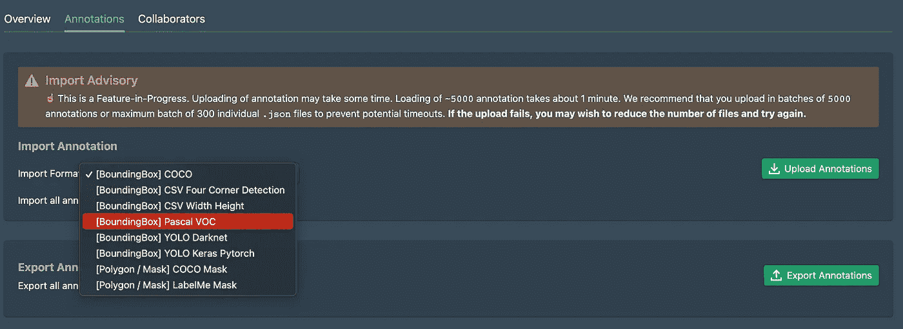

上传注释

## 注释图像

如果你没有注释或者想要编辑和添加更多注释，Nexus 有一个圆滑而丰富的界面可供你使用。一个很酷的功能是，你可以实时地给它们贴标签。

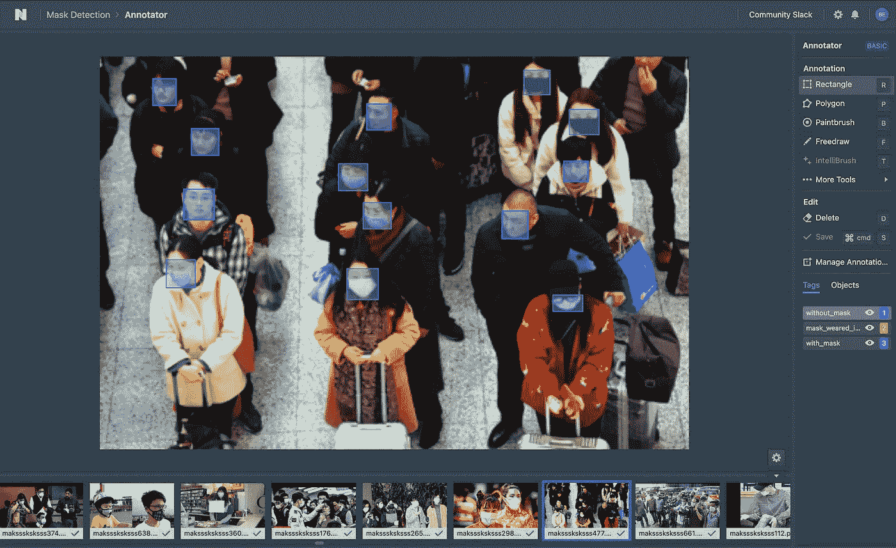

完成图像和注释后，您会在主页上看到一个漂亮的小摘要。

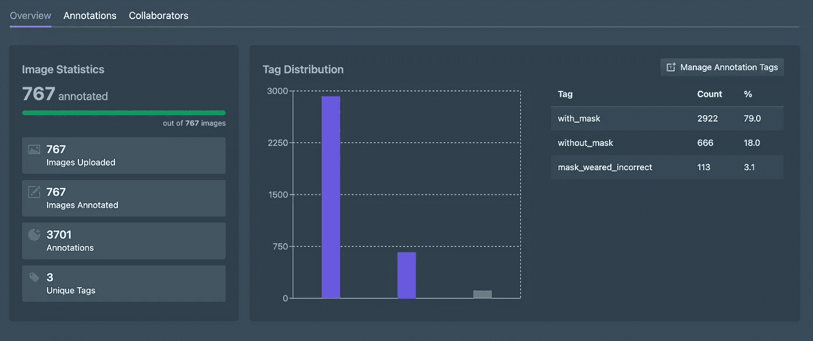

标签的分布，图像和注释的良好统计。

## 创建工作流

构建工作流的可视化方式非常直观。基本的想法是:

> 数据集→扩充→选择模型架构

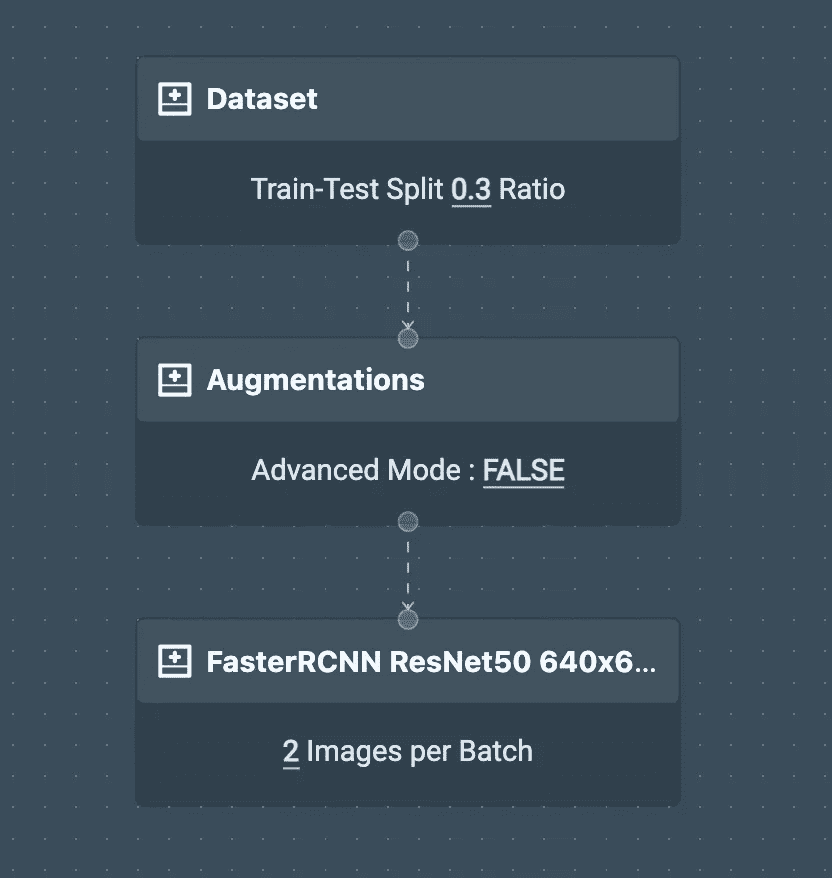

我的遮罩检测模型的简单工作流程

对于数据集，我使用默认值`0.3`作为训练-测试分割比，您也可以选择一个特定的随机种子来实现可重复性。

我选择了一些基本的随机位置增强——中心裁剪、水平和垂直翻转。在色彩空间增强中还有许多其他选项，切换到高级模式可以让你选择这些增强的概率。

对于该模型，我选择了 FasterRCNN ResNet50 640x640，并使用每批 2 个图像和 1000 个训练时期的默认值，因此训练不会花费太多时间，因为这只是一个有趣的小项目。

还有一个预览增强功能，这是有用的测试选定的增强。

## **超参数调谐**

在工作流启动之前，您将能够看到您选择的所有参数的预览，我发现这很有用，因为它可以作为神经网络初始化之前的最后一分钟检查。

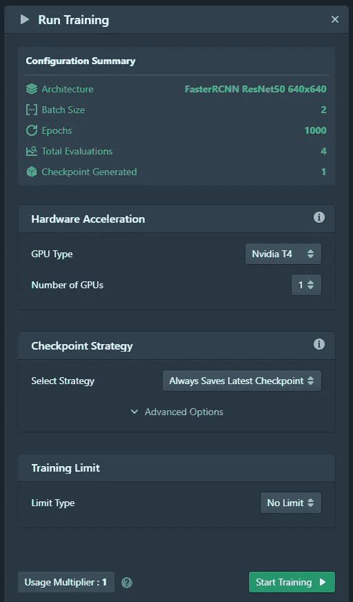

训练前调整超参数

## 培训的实时监控

在 Nexus 上训练一个模型最酷的事情是，你可以看到**你的模型在图表上的实时进度**，如果你决定停止，你可以点击一个按钮。

NVIDIA k80 引擎上的模型训练只花了大约 30 分钟，但根据你训练的模型的大小和类型，有不同的 GPU 设置供你选择。

完成后，您会得到一个关于您的模型的所有重要指标的很好的摘要。

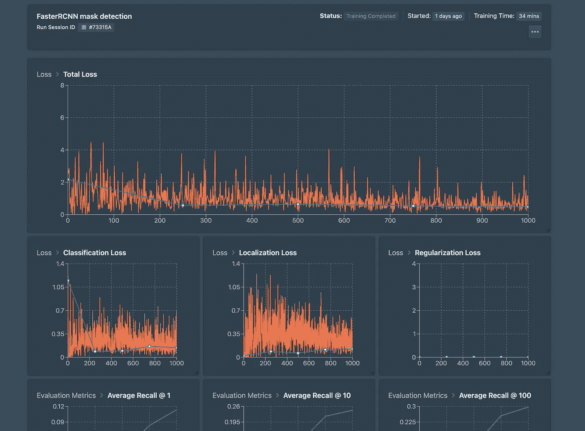

完成后，我前往工件部分生成我的 TensorFlow 模型并下载它。

准备好模型后，我前往门户网站开始可视化和检查它。

# 使用门户网站检查

## 加载训练好的模型和图像

加载模型非常容易。我所要做的就是选择 TensorFlow 选项，然后提供我下载的模型的路径。

然后，我将我的验证图像上传到门户网站。

准备好图像后，我可以开始测试我的模型了！

## 分析图像

分析图像只需点击一个按钮，如果您想一次性分析所有图像，只需点击`Bulk Analysis`

您可以为每个分析设置您想要的置信度阈值，甚至可以过滤您想要查看的标签。

在对我的验证图像进行批量分析时，我发现我的掩模检测模型出现了一些小问题。

以下是我的模型在相当高的置信阈值下的预测，这产生了错误的预测。

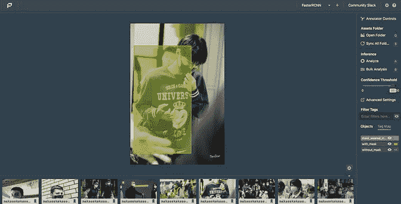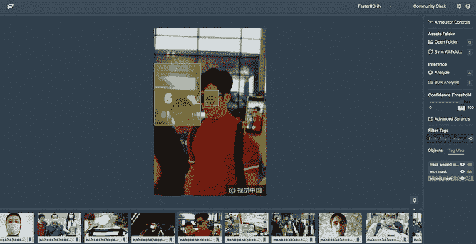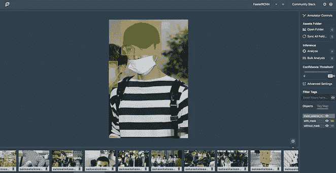

(右)模型应预测带面罩，(中)模型应预测不带面罩，(左)模型应预测面罩佩戴不正确

检查表明，该模型将一片单一颜色(帽子、太阳镜、衬衫)混淆为一个面罩，导致错误预测。

此外，检查显示该模型在头部转向左侧或右侧时表现不佳。

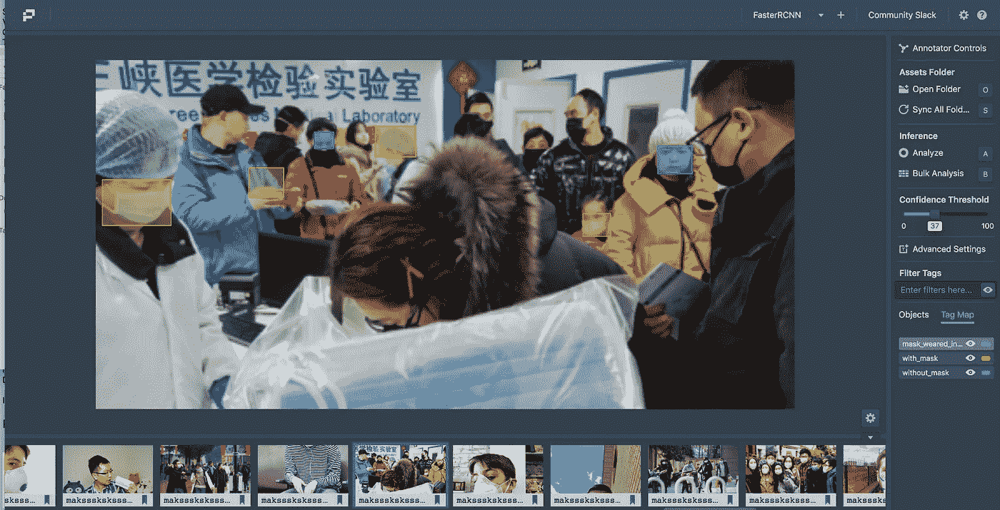

头部朝左或朝右时，模型表现不佳

该模型的另一个问题是，该模型没有像它应该的那样预测`mask_worn_incorrectly`。下面的图片正好说明了这一点。

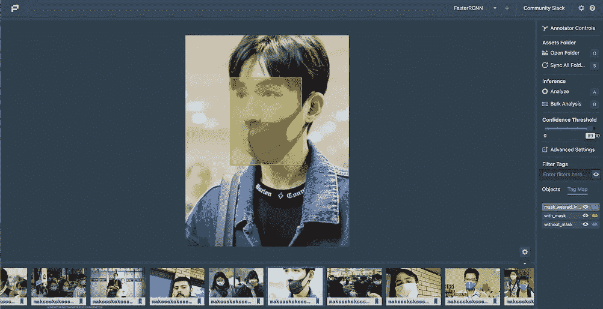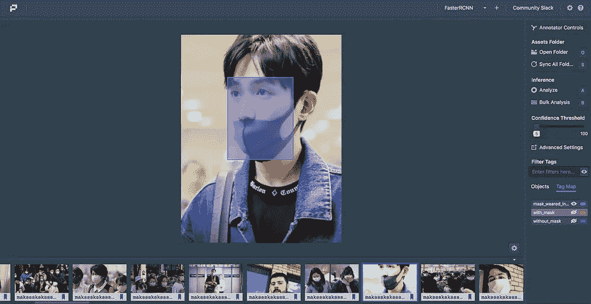

图像清楚地显示了没有正确佩戴的面具，因为鼻子暴露在外，但我们的模型只能在 5%的置信水平下预测正确的标签。

发生这种情况有两个可能的原因。首先，与其他两个标签相比，`mask_weared_incorrectly`标签的样本量很小，另一个原因是该模型需要更多的训练或调整。

检查完成后，我现在可以继续调整我的注释，添加更多的数据，添加更多的扩充以捕获更多的信息，甚至使用不同的模型来改进我的掩码检测模型。

所以你走吧！我训练了一个更快的 R-CNN 模型，并使用 Nexus 和 Portal 在没有代码的情况下对其进行了检查。

# 关于连接和门户的思考

*   **设计** —令人敬畏的设计和圆滑的界面。很明显他们在设计上下了很多功夫。
*   **性能**——对我来说，Nexus 和 Portal 都运行得很流畅，尽管 Nexus 有时在工作流部分滞后，我不得不刷新 web 应用程序。
*   易用性 —我惊讶于这些平台的易用性。我没有发现应用程序令人困惑的任何部分，每一步都很直观。

Portal 的最终目标是简化可视化和检查模型的过程，我认为它肯定实现了这一点，尤其是对于那些没有技术背景的人。

作为一个狂热的计算机视觉爱好者，我发现 Nexus 和 Portal 是两个非常直观的应用程序，可以旋转 cv 模型并测试模型。

我认为这两个无代码应用的革命性之处在于，它简化了整个计算机视觉管道，消除了对多个工具或平台的需求，更不用说无需编写任何代码，这肯定会占用大量时间。

Datature 的平台正在推动无代码人工智能革命，并无疑是计算机视觉行业的游戏规则改变者。

还有很多我没有在本文中介绍的特性，您可以使用 Portal 来完成，比如进行视频推理和通过 API 部署模型的能力(即将推出)。推荐你去他们网站自己试试！

构建您自己的模型@ [Nexus](http://nexus.datature.io) →使用[门户](https://github.com/datature/portal)检查您的模型！

## Datature 的 Nexus 和 Portal 视频教程

*   [使用 Portal 检查计算机视觉模型](https://www.youtube.com/watch?v=dTaqVkr8re0)
*   [用#NoCode](https://www.youtube.com/watch?v=KA4RGtnabDk) 训练一个自定义对象检测模型
*   [用自定义数据集训练实例分割模型](https://youtu.be/uLVWanPjGp0)

欲了解更多关于数据的信息，请访问👉[网站](https://datature.io/)或[联系他们](https://datature.io/contact)！

我尽可能地撰写与数据科学和机器学习相关的文章，并经常在 [bitgrit 数据科学出版物](https://medium.com/bitgrit-data-science-publication)上发表文章。

[订阅我的时事通讯](https://benedictxneo.medium.com/subscribe)以便在我发布时获得更新。

感谢阅读👋！