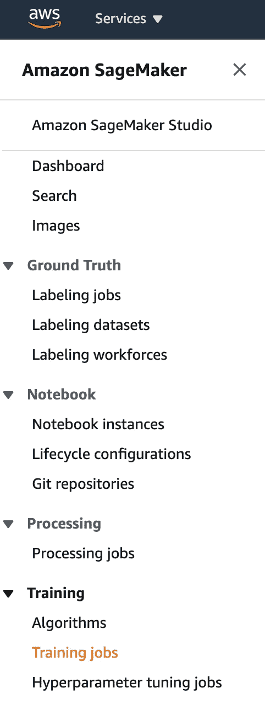
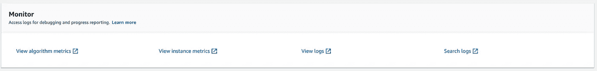

# 在 AWS SageMaker 中训练您的定制深度学习模型

> 原文：<https://towardsdatascience.com/train-your-custom-deep-learning-model-in-aws-sagemaker-4e8674dd196e?source=collection_archive---------19----------------------->

## 使用 boto3 APIs 的可重复过程

# 概观

如果你像我一样，不想在家里设置服务器来训练你的深度学习模型，那么这篇文章就是为你准备的。很可能，基于云的机器学习基础设施是你的选择。我将在 [AWS SageMaker](https://aws.amazon.com/sagemaker/) 中一步一步介绍如何做到这一点。


图片由来自 Pixabay 的 chenspec 提供

# 为什么我们需要定制模型

亚马逊 SageMaker 附带了大量的[预训练模型](https://github.com/aws/amazon-sagemaker-examples/tree/master/introduction_to_amazon_algorithms)。这些模型是 AWS 中预先构建的 docker 映像。如果符合您的需求，您可以使用这些型号。这里有一个使用 SageMaker XGBoost 算法解决回归问题的[例子。但是在很多情况下，您需要构建自己的定制模型。](https://github.com/aws/amazon-sagemaker-examples/blob/master/introduction_to_amazon_algorithms/xgboost_abalone/xgboost_abalone.ipynb)

有不同的 SageMaker SDKs 可用于此目的。在这个例子中，我将向您展示如何使用 sage maker`boto3`API 来实现这一点。就我个人而言，我发现`boto3`API 比其他 SageMaker SDKs 更全面、文档更完善、更容易理解。在互联网上，我看到 SageMaker 的例子缺乏一致性，因为他们使用了各种不同的方法。我希望这篇文章对那些正在寻找使用`boto3`的一致例子的人有所帮助。

# 如何训练你的定制模型

SageMaker 使用 Docker [1] image 允许用户*训练*和*部署*自定义算法。Docker 使用一个名为`Dockerfile`的文件来指定如何组装图像。

## 了解 AWS SageMaker 的 Docker 图像

因为您可以在培训和服务中运行相同的 docker 映像，SageMaker 使用参数`train`或`serve.` 运行您的容器。您的容器如何处理该参数取决于容器。

*   您可以在`Dockerfile`中指定一个程序作为`ENTRYPOINT`。该程序将在启动时运行，它的第一个参数将是`train`或`serve`。然后，程序可以查看该参数并决定要做什么。
*   在这个例子中，我们没有在`Dockerfile.` 中定义一个`ENTRYPOINT`，因此 Docker 在训练时间运行命令`[train](https://docs.aws.amazon.com/sagemaker/latest/dg/your-algorithms-training-algo.html)` [，在服务时间](https://docs.aws.amazon.com/sagemaker/latest/dg/your-algorithms-training-algo.html)运行命令`[serve](https://docs.aws.amazon.com/sagemaker/latest/dg/your-algorithms-inference-code.html)` [。在这个例子中，我们将它们定义为可执行的 Python 脚本，但是它们可以是我们想要在那个环境中启动的任何程序。](https://docs.aws.amazon.com/sagemaker/latest/dg/your-algorithms-inference-code.html)
*   如果您为培训和托管构建单独的容器(或者只为其中一个构建)，您可以在`Dockerfile` 中将程序定义为一个`ENTRYPOINT`，并忽略(或验证)传入的第一个参数。

## AWS SageMaker 的 Docker 图像布局

当 Amazon SageMaker 运行训练时，您的`train`脚本将作为常规 Python 程序运行。在 Docker 映像中，在`/opt/ml`目录[2]下有许多文件供您使用:

```
/opt/ml
|-- input
|   |-- config
|   |   |-- hyperparameters.json
|   |   `-- resourceConfig.json
|   `-- data
|       `-- <channel_name>
|           `-- <input data>
|-- model
|   `-- <model files>
`-- output
    `-- failure
```

**输入**

*   `/opt/ml/input/config`包含控制程序如何运行的信息。`hyperparameters.json`是一个 JSON 格式的超参数名称到值的字典。这些值总是字符串，所以您可能需要转换它们。`resourceConfig.json`是一个 JSON 格式的文件，描述了用于分布式培训的网络布局。
*   `/opt/ml/input/data/<channel_name>/`(文件模式)包含该通道的输入数据。通道是基于对 CreateTrainingJob 的调用而创建的，但是通道与算法预期相匹配通常是很重要的。每个频道的文件都从 S3 复制到这个目录，保留了 S3 关键字结构指示的树形结构。
*   `/opt/ml/input/data/<channel_name>_<epoch_number>`(管道模式)是给定时期的管道。纪元从零开始，每读一次就加一。您可以运行的 epoch 数量没有限制，但是您必须在读取下一个 epoch 之前关闭每个管道。

**输出**

*   `/opt/ml/model/`是您编写算法生成的模型的目录。您的模型可以是您想要的任何格式。它可以是单个文件，也可以是整个目录树。SageMaker 将这个目录中的所有文件打包成一个压缩的 tar 归档文件。该文件在`DescribeTrainingJob`结果中返回的 S3 位置可用。
*   `/opt/ml/output`是一个目录，算法可以在其中写入一个描述作业失败原因的文件`failure`。该文件的内容返回到`DescribeTrainingJob`结果的`FailureReason`字段中。对于成功的作业，没有理由写入该文件，因为它会被忽略。

# 建造一个容器

在这里参考 github 库[并克隆它。您可以将它克隆到您的本地机器上(确保您安装了 AWS CLI 和 Docker ),或者在 SageMaker notebook 实例中获得这个 repo。在 SageMaker 中运行这些命令的好处是，它将比您的本地机器运行得快得多。](https://github.com/nahidalam/blog/tree/master/AWS_SageMaker/custom_model)

*   确保您已经登录到您的`ECR`。将目录切换到存储库中的`docker`目录。然后创建一个`ECR`存储库

```
$cd docker
$aws ecr create-repository --repository-name A-REPO-NAME
```

*   一旦运行了上面的命令，您应该会得到如下所示的 JSON 输出

```
{
    "repository": {
        "repositoryArn": "arn:aws:ecr:us-west-1:149363165341:repository/A-REPO-NAME",
        "registryId": "149363165341",
        "repositoryName": "nahid-sagemaker-tf-repo",
        "repositoryUri": "149363165341.dkr.ecr.us-west-1.amazonaws.com/A-REPO-NAME",
        "createdAt": 1619175745.0,
        "imageTagMutability": "MUTABLE",
        "imageScanningConfiguration": {
            "scanOnPush": false
        },
        "encryptionConfiguration": {
            "encryptionType": "AES256"
        }
    }
}
```

*   注意上面的`repositoryUri`。我们将在接下来的两步中使用那个`repositoryUri`

```
$docker build -t repositoryUri .
$docker push repositoryUri
```

# 训练你的模型

假设我们在上面的步骤中创建了一个定制的 docker 图像`training-image`。让我们也给我们的培训工作起个名字`job_name`。

现在您已经有了使用您的定制训练脚本的定制 docker 映像，我们可以使用它来训练 AWS SageMaker 中的模型。在开始训练之前，我们需要为训练我们的模型定义一组配置。下面是一个示例培训配置

```
training_config = {
    "TrainingJobName": job_name,
    "AlgorithmSpecification": {
        "TrainingImage": training_image,
        "TrainingInputMode": "File"
    },
    "RoleArn": role,
    "OutputDataConfig": {"S3OutputPath": training_output_path,
    "InputDataConfig": [
        {
            "ChannelName": "train",
            "DataSource": {
                "S3DataSource": {
                    "S3DataType": "S3Prefix",
                    "S3Uri": training_input_path,
                    "S3DataDistributionType": "FullyReplicated",
                }
            },
            "ContentType": "text/csv"
        }
    ],
    "ResourceConfig": {
        "InstanceType": "ml.m5.2xlarge",
        "InstanceCount": 1,
        "VolumeSizeInGB": 75,
     },
    "StoppingCondition": {
        "MaxRuntimeInSeconds": 86400
    }
}
```

以上`training_config`中的几个要点

*   `TrainingJobName`是 SageMaker `Training job`帮助你唯一识别你的培训工作*亚马逊 SageMaker >培训工作*
*   `TrainingImage`是您刚刚创建的自定义 docker 图像
*   在`ResourceConfig`中，您正在指定您想要训练模型的机器的配置。因此，如果您有一个复杂的模型和更大的数据集，您将需要一台配置更高的机器。
*   在`OutputDataConfig`中，您指定了在训练完成后您将在哪里存储您的模型。
*   密切注意`InputDataConfig`键。注意，我们在里面有一个名为`channelName`的键。这是指我们是为`train`还是`validation`指定数据集。在这个例子中，我们在不经过任何类型的验证数据集的情况下进行训练。因此，我们这里没有`validation`通道。实际上，你很可能也有一个`validation`数据集。在这种情况下，您也必须指定`validation`通道。

关于`training_config`的完整列表，你可以参考 boto3 文档[这里](https://boto3.amazonaws.com/v1/documentation/api/latest/reference/services/sagemaker.html#SageMaker.Client.create_training_job)

现在我们可以使用这个`training_config`来创建一个培训工作

```
client = boto3.client("sagemaker", region_name=region)
client.create_training_job(**training_config)
```

# 检查培训状态

根据数据集的大小，训练作业可能需要一些时间。你可以通过查看*亚马逊 SageMaker >培训工作*来监控你的培训工作状态，如下图所示



一旦您进入`Training jobs`，您将会看到到目前为止您运行的培训任务列表。您可以在此示例中单击正在运行的特定培训作业，并检查各种配置(输入/输出配置、超参数等。)和工作状态。如果作业由于任何原因失败，您可以转到`Monitor`部分的`View logs`，它将带您到`Cloudwatch`查看详细日志。



您还可以通过编程方式监控培训作业状态

```
import time

status = client.describe_training_job(TrainingJobName=job_name)["TrainingJobStatus"]
print(status)
while status != "Completed" and status != "Failed":
    time.sleep(60)
    status = client.describe_training_job(TrainingJobName=job_name)["TrainingJobStatus"]
    print(status)
```

# 主持模型

托管模型需要 3 个步骤

## 将模型导入宿主

我们需要使用存储在`create_model` API 内`s3`中的模型工件`model.tar.gz`来使您的模型准备好托管。

```
%%time
import boto3
from time import gmtime, strftime

model_name = f"{job_name}-model"

info = client.describe_training_job(TrainingJobName=job_name)
model_data = info["ModelArtifacts"]["S3ModelArtifacts"]

primary_container = {"Image": container, "ModelDataUrl": model_data}

create_model_response = client.create_model(
    ModelName=model_name, ExecutionRoleArn=role, PrimaryContainer=primary_container
)

print(create_model_response["ModelArn"])
```

## 定义端点配置

在 SageMaker 中，您可以为不同的目的创建模型托管端点——A/B 测试、开发与生产版本等。我们将在端点配置中指定这些，并使用`create_endpoint_config` API 创建端点配置。

```
endpoint_config_name = f"my-custom-model-endpointconfig-{strftime('%Y-%m-%d-%H-%M-%S', gmtime())}"

create_endpoint_config_response = client.create_endpoint_config(
    EndpointConfigName=endpoint_config_name,
    ProductionVariants=[
        {
            "InstanceType": "ml.m5.xlarge",
            "InitialVariantWeight": 1,
            "InitialInstanceCount": 1,
            "ModelName": model_name,
            "VariantName": "AllTraffic",
        }
    ],
)

print(f"Endpoint Config Arn: {create_endpoint_config_response['EndpointConfigArn']}")
```

## 创建端点

最后，我们使用`create_endpoint` API 创建端点。根据您的数据集，此任务大约需要 5-10 分钟。因此，监视端点创建过程是一个好主意。

```
endpoint_name = f'my-custom-model-Endpoint-{strftime("%Y-%m-%d-%H-%M-%S", gmtime())}'

create_endpoint_response = client.create_endpoint(
    EndpointName=endpoint_name, EndpointConfigName=endpoint_config_name
)
print(create_endpoint_response["EndpointArn"])

resp = client.describe_endpoint(EndpointName=endpoint_name)
status = resp["EndpointStatus"]
while status == "Creating":
    print(f"Status: {status}")
    time.sleep(60)
    resp = client.describe_endpoint(EndpointName=endpoint_name)
    status = resp["EndpointStatus"]

print(f"Arn: {resp['EndpointArn']}")
print(f"Status: {status}")
```

## 测试预测

最后，您可以测试您的模型端点并检验预测。

```
file_name = "test.csv" 
with open(file_name, "r") as f:
    payload = f.read().strip()
response = runtime_client.invoke_endpoint(
    EndpointName=endpoint_name, ContentType="text/csv", Body=payload
)
result = response["Body"].read()
result = result.decode("utf-8")
result = result.split(",")
result = [math.ceil(float(i)) for i in result]
label = payload.strip(" ").split()[0]
print(f"Label: {label}\nPrediction: {result[0]}")
```

本文的完整源代码在[这里](https://github.com/nahidalam/blog/tree/master/AWS_SageMaker/custom_model)。

# 参考:

[1].[Docker](https://docs.docker.com/get-started/)入门。

[2].自带【Tensorflow 模型。

[3].亚马逊 SageMaker [概述这里](https://www.youtube.com/watch?v=ym7NEYEx9x4&t=426s)。

[4].用亚马逊 [SageMaker XGBoost 算法](https://github.com/aws/amazon-sagemaker-examples/blob/master/introduction_to_amazon_algorithms/xgboost_abalone/xgboost_abalone.ipynb)回归。