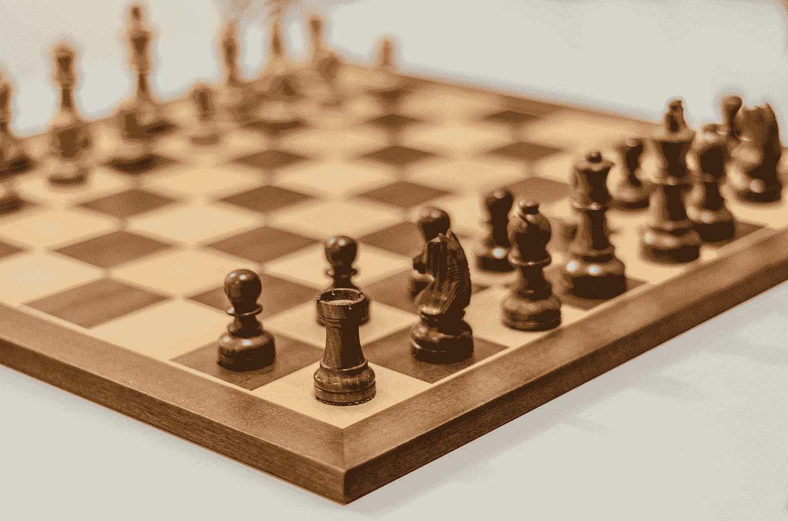
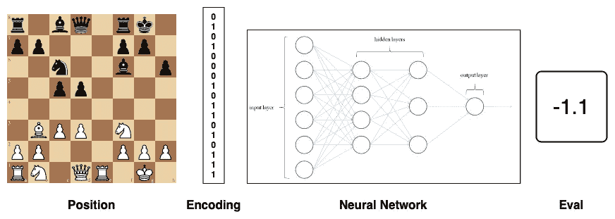
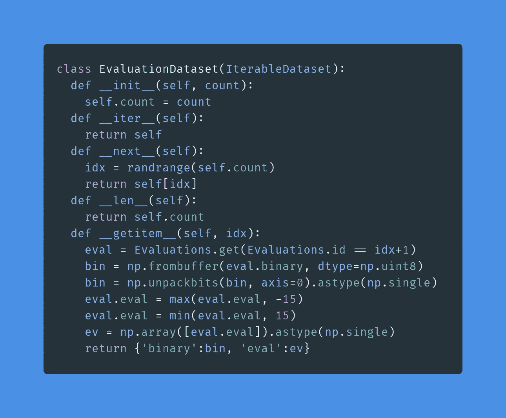
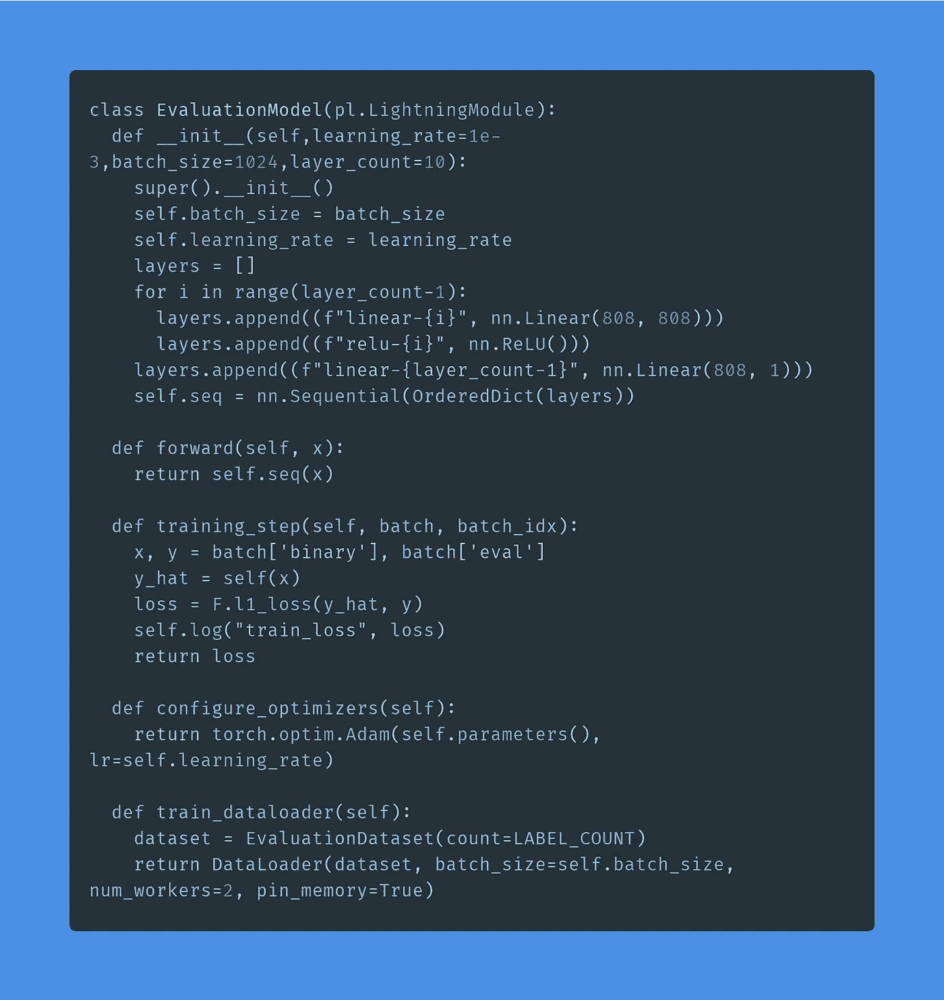
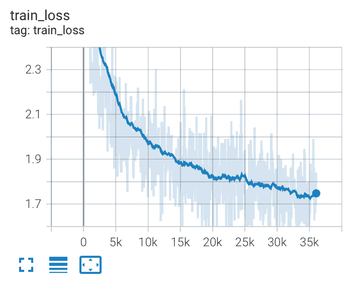
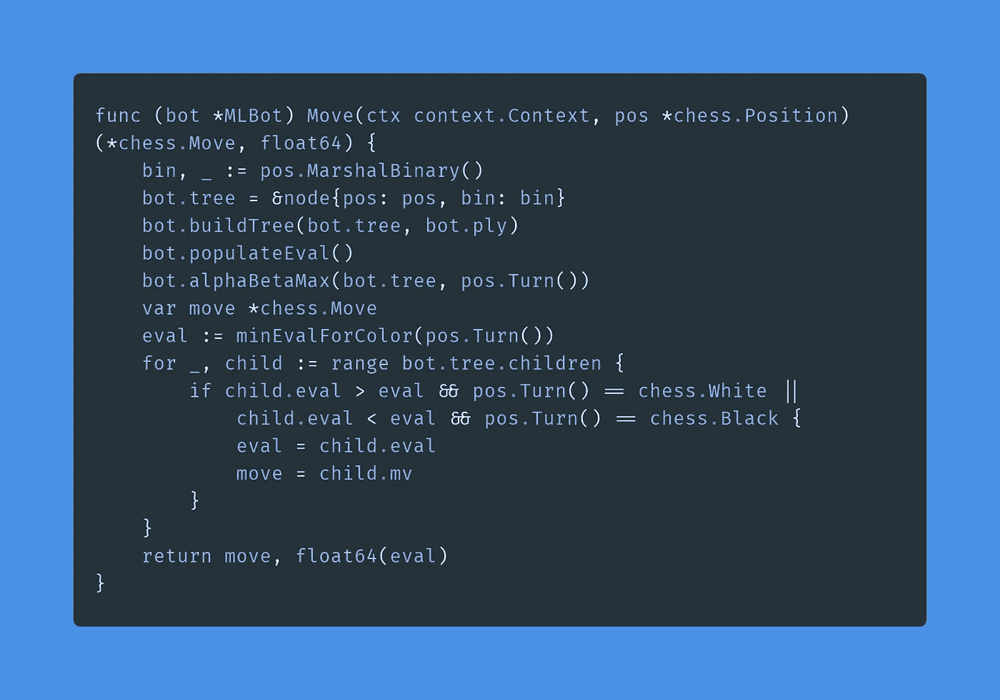
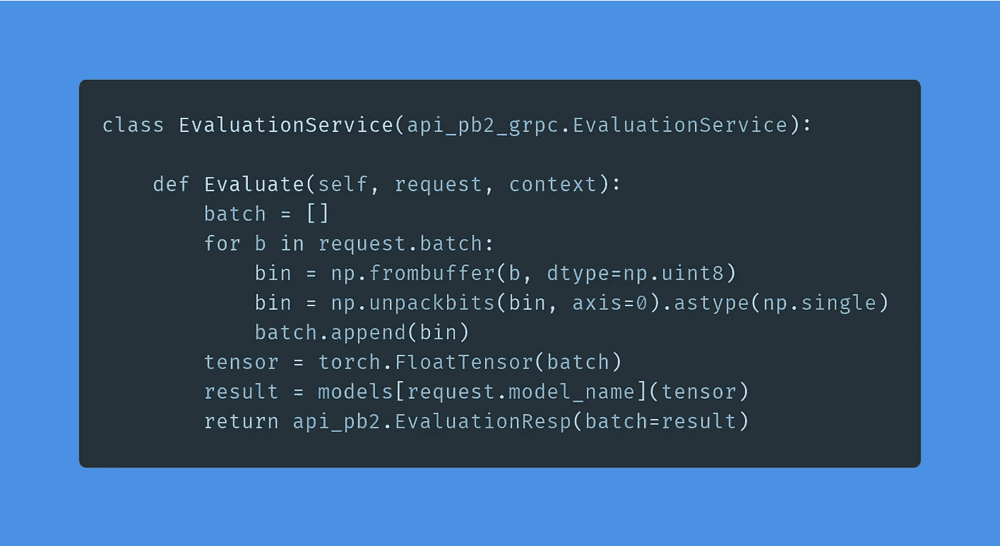
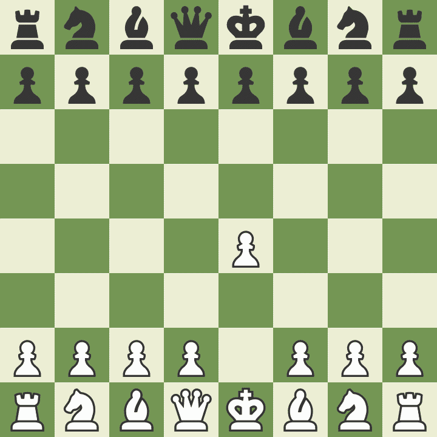
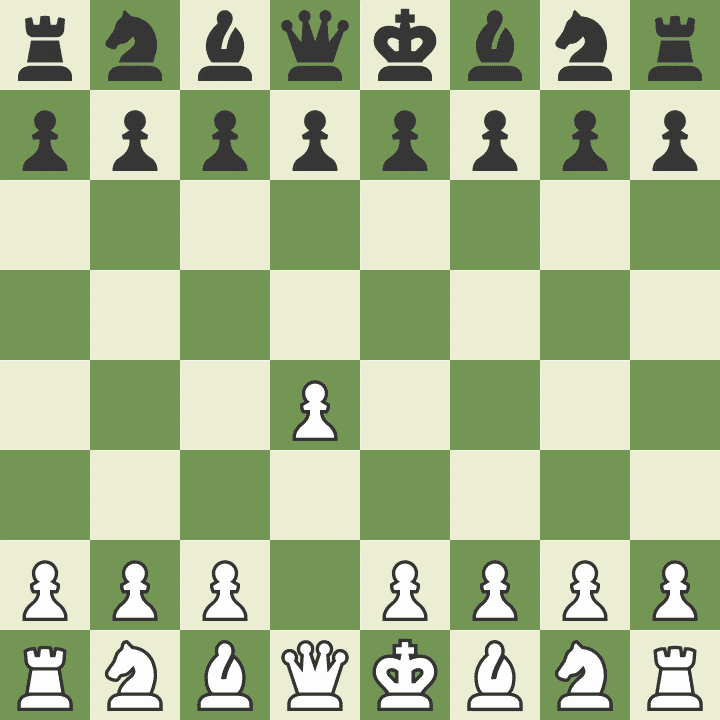

# 训练你自己的象棋人工智能

> 原文：<https://towardsdatascience.com/train-your-own-chess-ai-66b9ca8d71e4?source=collection_archive---------0----------------------->

## 看着你的作品打败你



迈克尔在 [Unsplash](https://unsplash.com?utm_source=medium&utm_medium=referral) 上的照片

# 介绍

TLDR: [Colab 链接](https://colab.research.google.com/drive/1smI2B7kiwzkr43TqnCYOpxocZlI0kPUh?usp=sharing)

深度学习已经接管了计算机象棋世界。2017 年 [AlphaZero](https://deepmind.com/blog/article/alphazero-shedding-new-light-grand-games-chess-shogi-and-go) ，AlphaGo 针对国际象棋的迭代，通过轻松击败 Stockfish 迷住了国际象棋迷。该领域的新发展，如 [Leela Zero](https://lczero.org) (一个开源的 AlphaZero 实现，碰巧使用了 [my chess lib](https://github.com/notnil/chess) )和 [Stockfish NNUE](https://stockfishchess.org/blog/2020/introducing-nnue-evaluation/) (可高效更新的反向神经网络)表明，在可预见的未来，神经网络将继续主导国际象棋。

作为一名国际象棋爱好者和人工智能实践者，我开始创造自己的国际象棋人工智能，但一个令人生畏的传言让我气馁: [AlphaZero 花费 3500 万美元训练](https://www.yuzeh.com/data/agz-cost.html)。AlphaZero 完全通过强化学习和自我游戏进行训练，以避免外部依赖。虽然明显有效，但从成本角度来看，自我游戏的效率低得令人难以置信。今天的引擎已经可以区分好位置和坏位置。这种先验知识可以用来引导学习过程，并使以非常有限的成本(或在 [Colab](http://colab.research.google.com/) 上免费)训练象棋 AI 成为可能。让我们试试吧！并使用来自现有引擎的数据集使用监督机器学习来训练神经网络。

# 定义模型



模型图，图片由作者提供

引擎如何决定一个位置好不好？给定一个位置，引擎返回从白色角度看这个位置有多好的分数。这个分数被称为评估，通常简称为 eval，eval 函数是国际象棋引擎的核心。eval 是一个以卒当量为单位的真实实力衡量标准。例如，如果白棋是一个棋子，评估将是+1。如果黑棋是骑士，评估将是-3。原材料不是决定评估的唯一因素，位置信息和未来的移动也会被考虑在内。

传统上，eval 功能是通过手工算法实现的，这些算法定量测量材料不平衡、工件移动性和国王安全等概念。这些直接测量，结合[迭代加深](https://www.chessprogramming.org/Iterative_Deepening)单独产生超人的结果。神经网络可以取代这些手工算法，并直接返回评估结果，无需专门编码。总的来说，eval 函数接受一个位置并返回一个评估分数。我们如何把它变成一个模型？

输出 eval 可以由单个基于浮点的神经元来表示。代表棋盘位置的输入可以使用每种棋子类型的[位棋盘](https://www.chessprogramming.org/Bitboards) (64 位，棋盘上的每个方格一个)进行编码，剩余的几个位用于移动索引、要移动的颜色和路过的方格。这些输入数据一起形成了一个 808 位(1 和 0)的字符串，可以转换成浮点数并直接输入到模型中。

现在我们已经计划好了输入、输出和一般模型概念，让我们开始构建数据集。

# **建立数据集**

我在[Lichess.com](http://Lichess.com)上玩，因为它是免费的，开源的，由开发者运营。Lichess [拥有网站上所有游戏的每月下载片段](https://database.lichess.org)。2021 年 7 月包含 9200 多万场比赛。在注释部分，它提到了一个非常重要的细节:“大约 6%的游戏包括 Stockfish 分析评估”，在这种情况下，这将是 550 多万个游戏。一般的国际象棋游戏持续大约 40 步，80 个位置(每一方每“步”得到一个回合)，七月应该包含 441，600，000 个非唯一位置。这似乎足以创建我们的初始数据集。

Lichess 的每月碎片编码为. pgn.bz2 文件。文件扩展名. bz2 是一种压缩形式。pgn 是“[可移植游戏符号](https://en.wikipedia.org/wiki/Portable_Game_Notation)”，这是一种基于文本的格式，用于将国际象棋游戏编码为[代数符号](https://en.wikipedia.org/wiki/Algebraic_notation_(chess))中的一系列移动。以下是单个 PGN 文件记录的文本:

```
[Event "Rated Bullet tournament https://lichess.org/tournament/yc1WW2Ox"]
[Site "https://lichess.org/PpwPOZMq"]
[Date "2017.04.01"]
[Round "-"]
[White "Abbot"]
[Black "Costello"]
[Result "0-1"]
[UTCDate "2017.04.01"]
[UTCTime "11:32:01"]
[WhiteElo "2100"]
[BlackElo "2000"]
[WhiteRatingDiff "-4"]
[BlackRatingDiff "+1"]
[WhiteTitle "FM"]
[ECO "B30"]
[Opening "Sicilian Defense: Old Sicilian"]
[TimeControl "300+0"]
[Termination "Time forfeit"]

1\. e4 { [%eval 0.17] [%clk 0:00:30] } c5 { [%eval 0.19] [%clk 0:00:30] }
2\. Nf3 { [%eval 0.25] [%clk 0:00:29] } 2... Nc6 { [%eval 0.33] [%clk 0:00:30] }
3\. Bc4 { [%eval -0.13] [%clk 0:00:28] } 3... e6 { [%eval -0.04] [%clk 0:00:30] }
4\. c3 { [%eval -0.4] [%clk 0:00:27] } 4... b5? { [%eval 1.18] [%clk 0:00:30] }
5\. Bb3?! { [%eval 0.21] [%clk 0:00:26] } 5... c4 { [%eval 0.32] [%clk 0:00:29] }
6\. Bc2 { [%eval 0.2] [%clk 0:00:25] } 6... a5 { [%eval 0.6] [%clk 0:00:29] }
7\. d4 { [%eval 0.29] [%clk 0:00:23] } 7... cxd3 { [%eval 0.6] [%clk 0:00:27] }
8\. Qxd3 { [%eval 0.12] [%clk 0:00:22] } 8... Nf6 { [%eval 0.52] [%clk 0:00:26] }
9\. e5 { [%eval 0.39] [%clk 0:00:21] } 9... Nd5 { [%eval 0.45] [%clk 0:00:25] }
10\. Bg5?! { [%eval -0.44] [%clk 0:00:18] } 10... Qc7 { [%eval -0.12] [%clk 0:00:23] }
11\. Nbd2?? { [%eval -3.15] [%clk 0:00:14] } 11... h6 { [%eval -2.99] [%clk 0:00:23] }
12\. Bh4 { [%eval -3.0] [%clk 0:00:11] } 12... Ba6? { [%eval -0.12] [%clk 0:00:23] }
13\. b3?? { [%eval -4.14] [%clk 0:00:02] } 13... Nf4? { [%eval -2.73] [%clk 0:00:21] } 0-1
```

每次移动后，在注释部分，基于 Stockfish 的评估以定制的文本格式编写。

```
1\. e4 { [%eval 0.24] [%clk 0:05:00] }
```

这给了我们与位置配对的 eval(从一系列移动中计算)。2021 年 7 月的原始压缩月度碎片为 25.2 GB，因此单个 CSV 文件很可能是不可能的。带有适当索引的 SQLite 数据库似乎更合适。该架构包括 FEN(用于调试的位置的文本编码)、供模型直接使用的二进制以及对定型输出的评估:

```
> select * from evaluations limit 7;id|fen|binary|eval
1|rnbqkbnr/pppppppp/8/8/3P4/8/PPP1PPPP/RNBQKBNR b KQkq d3 0 1|0.0
2|rnbqkbnr/ppp1pppp/8/3p4/3P4/8/PPP1PPPP/RNBQKBNR w KQkq d6 0 2|0.27
3|rnbqkbnr/ppp1pppp/8/3p4/2PP4/8/PP2PPPP/RNBQKBNR b KQkq c3 0 2|0.0
4|rnbqkbnr/ppp2ppp/4p3/3p4/2PP4/8/PP2PPPP/RNBQKBNR w KQkq - 0 3|0.09
5|rnbqkbnr/ppp2ppp/4p3/3P4/3P4/8/PP2PPPP/RNBQKBNR b KQkq - 0 3|0.1
6|rnbqkbnr/ppp2ppp/8/3p4/3P4/8/PP2PPPP/RNBQKBNR w KQkq - 0 4|0.0
7|rnbqkbnr/ppp2ppp/8/3p4/3P4/2N5/PP2PPPP/R1BQKBNR b KQkq - 1 4|0.09
```

现在我们有了数据，让我们开始训练吧！

# 培养

对于这个项目，让我们使用 [Pytorch Lightning](https://www.pytorchlightning.ai) ，它是 Pytorch 上面的一个便利层。为了训练，我们必须首先实现两个类:Dataset 和 LightningModule。由于数据集的规模很大(数据库最终有 37 毫米的位置)，IterableDataset 最有意义，它将数据视为无限流。__next__ 方法只需要返回随机的一行数据。因为我们不担心在数千万个位置上过度拟合，所以我们不需要将数据分成训练集、验证集和测试集。



Pytorch 数据集的实现，使用 [https://carbon.now.sh](https://carbon.now.sh) 创建

EvaluationDataset 从 SQLite 表中随机提取一行，并通过提取原始字节中的二进制值对其进行预处理，使用 numpy 的 frombuffer 和 unpackbits 函数将这些字节转换为浮点型，并形成所需的 808 长度的浮点型数组作为输入。评估值 is 被提取并限制在-15 和 15 之间。边界保护防止极端赢的位置支配损失函数(例如+45 白)。+-15 是非常肯定的胜利，每一方，并评估过去，这是不必要的，我们的目的，将减缓训练收敛。



Pytorch 模型的实现，用 [https://carbon.now.sh](https://carbon.now.sh) 创建

该模型由 808 个神经元的 N 层(初始设置为 4)组成，直到直接输出评估的 1 个神经元的最终输出层。使用 L1 损失，或标签和预测之间的绝对平均差异，因为输出是直观的。例如，如果 L1 损失是 2.0，那么平均而言，该模型与 stockfish 的评估相差 2 个卒。



Tensorboard 的训练损失，图片由作者提供

成功了，失败了！最终我们的模型的两个版本被训练。四层的一个达到 1.29 的损耗，六层的一个达到 1.06 的损耗。

# **测试**


JESHOOTS.COM 在 [Unsplash](https://unsplash.com?utm_source=medium&utm_medium=referral) 上[的照片](https://unsplash.com/@jeshoots?utm_source=medium&utm_medium=referral)

测试我们 AI 最好的方法就是玩！使用阿尔法贝塔搜索，换位表，和一些其他标准的国际象棋人工智能技术，我们可以创建一个完整的国际象棋引擎来对抗。AI 客户端在 Go ( [中实现，所以我可以使用我的象棋库](https://github.com/notnil/chess))，模型托管在一个基于 python 的 gRPC 服务器上，该服务器为我家里的 Nvidia 2080 加速 linux 服务器上的模型提供服务。

基于围棋的象棋引擎少于 300 LOC，这里是主要走法的代码。



Go 客户端的实现

这是服务于该模型的 pthon gRPC 服务器实现。它接受成批的编码位置并返回评估结果。



Python 服务器的实现

现在，我们已经连接了我们的机器人和我们的模型服务板评估，我们已经准备好玩了！这个机器人的对手(我自己)在快速、闪电战和子弹上只有可怜的 1200 左右的平均等级。这些游戏没有时间限制。我花了我需要的时间，a I 每一步花了大约 20 秒。在我与机器人的两场比赛中，我仁慈地给了自己白。

不幸的是，Medium 不允许嵌入，所以我在 Lichess 上放了一张整个游戏的 Gif 和一个完整游戏的链接，还有一个 Stockfish 分析。

# 第一场:洛根·斯皮尔斯(白)对切斯·博特·DNN-4 层-损失-1.29(黑)



洛根斯皮尔斯(白)诉国际象棋机器人 DNN-4 层-损失-1.29(黑)。画吧。完整游戏:[https://lichess.org/rh7jL6rL](https://lichess.org/rh7jL6rL)

<https://lichess.org/rh7jL6rL>  

我玩 E4(我总是玩 E4)，人工智能选择了被称为“西西里防御”的 C5。黑棋的第一步很吸引人，因为人工智能没有打开的书，也没有玩游戏的经验，却为黑棋选择了一个最受欢迎的防御。开局相当平衡，没有一方获得明显的优势，直到我用我的黑暗广场主教换了移动中的黑骑士。事后看来，这揭开了布莱克的黑暗广场主教，暴露了 B2 广场上的弱点。然后我在移动 [13](https://lichess.org/rh7jL6rL#25) 时与另一个骑士交易的主教复合了这个错误，他掉了一个兵，让黑方女王的攻击线通过。我蹲下身子，尽我最大的努力防守，通过移动 [25](https://lichess.org/rh7jL6rL#49) 让比赛接近平手。由于忽略了拿走我的兵，黑棋低估了 E8 的潜在升级，并在移动 [26](https://lichess.org/rh7jL6rL#52) 时犯了个错误，让骑士去 B3，他认为如果骑士拿走了我可以强迫车交易，主教不能保护 A 的兵不被升级。不幸的是，我也没有看到这一点，我让我暂时的优势溜走了。游戏以一系列平淡无奇的举动结束，我同意和棋(斯托克菲什同意双方势均力敌)。

# 第二场:洛根·斯皮尔斯(白)对切斯·博特·DNN-6 层-损失-1.06(黑)


洛根斯皮尔斯(白)诉国际象棋机器人 DNN-6 层-损失-1.06(黑)。黑棋赢了。完整游戏:[https://lichess.org/rh7jL6rL](https://lichess.org/K5OEAa3w)

<https://lichess.org/K5OEAa3w>  

以法国开局，黑棋允许我通过移动 [8](https://lichess.org/K5OEAa3w#15) 占据中心位置，导致白棋的 stockfish 评估为+1.1。有趣的是 Stockfish 想让我站在城堡女王一边，把我的优势推到中间。我有一个王侧易位的习惯，以更安全的方式玩，以避免不熟悉的游戏。在移动中 [11](https://lichess.org/K5OEAa3w#22) ，黑棋提供了一个女王交易，我接受了这个交易，把女王从棋盘上拿走，减少了可能有利于人工智能的战术机会。我做得很好，直到我在移动 [16](https://lichess.org/K5OEAa3w#31) 时出错。我看不出黑棋可以用它的方形象串我的车并赢得交换。由于移动中的兵推 [32](https://lichess.org/K5OEAa3w#63) 没有导致获胜的机会(即使平衡了车)，黑棋逐渐吃掉我的兵，迫使我放弃。

虽然人工智能赢了，但我不知道是计算机变得更好了，还是我的失误让比较变得不公平。解决这个问题的最公平的方法是让人工智能版本互相比赛。

# 第三场:切斯博特 DNN-6 层-损失-1.06(白)对切斯博特 DNN-4 层-损失-1.29(黑)



象棋机器人 DNN-6 层-损失-1.06(白)对象棋机器人 DNN-4 层-损失-1.29(黑)。白棋赢了。完整游戏:[https://lichess.org/es0pajXC](https://lichess.org/es0pajXC)

<https://lichess.org/es0pajXC>  

最初我给了 4 层人工智能白色，但它以一个平淡无奇的画结束，所以我尊重颜色的分配。第二场比赛导致了一场令人难以置信的精彩比赛。快节奏的行动开始于第 12 步,主教拿走了 G7 的兵，并分别叉走了 H6 和 H8 的骑士和车。黑棋回应了一个狂野的牺牲，使用了黑方主教，然后是女王检定。白棋冷静地偏转，最终拿到了悬车。在移动中 [16](https://lichess.org/es0pajXC#32) 黑棋牺牲了另一个棋子，这次是一个骑士，为了保住对白棋国王的攻击。在防守并掷出自己的皇后检查牌后，白棋自信地检查了黑王的移动 [22](https://lichess.org/es0pajXC#43) 。这是非常危险的，因为如果给黑棋自由移动的话，它可以一步就将死！怀特发现了原力交配序列，在一场令人兴奋的将死中获胜，并证明了其较低的训练损失会导致更好的象棋。

# 分析

分析这些游戏最显著的方面是人工智能感觉有多“像人”。常见的开局，等待失误，以及用疯狂的牺牲来试图卷土重来是在线人类游戏中的标准公平。

我们的方法当然有改进的余地。许多众所周知的技术没有被使用，以保持这个项目的复杂性易于管理，并专注于人工智能部分:

*   移动排序优先搜索“感兴趣的”移动序列
*   [Endgame Tablebase](https://en.wikipedia.org/wiki/Endgame_tablebase) 用于预先计算的获胜残局位置
*   [预计算开口的开口书](https://en.wikipedia.org/wiki/Chess_opening_book)
*   只搜索 4 层[的几十万个位置](https://en.wikipedia.org/wiki/Ply_(game_theory))
*   许多其他人

我们过于简单的模型和训练程序也存在一些缺陷

*   移动计数以位的形式输入到模型中，而不是以浮点数的形式输入
*   模型架构是第一个没有优化的设计
*   学习率和批量大小调度器可以导致较低的总损失
*   象棋位置在数据库中是唯一的，因此更可能是唯一的较后位置在数据集中被过度表示
*   大多数游戏都是业余玩家玩的，高级游戏的搜索空间可能没有得到充分的体现
*   该模型可以被训练更长时间

总的来说，这很有趣！对现有发动机评估的监督训练是一种比自玩和蒙特卡罗树搜索(a la AlphaZero)更快和更经济的权重初始化方法，并且一个可玩的模型可以在几个 GPU 小时内生成。希望你喜欢这篇文章，我期待在评论中看到你的 AI 游戏的链接！