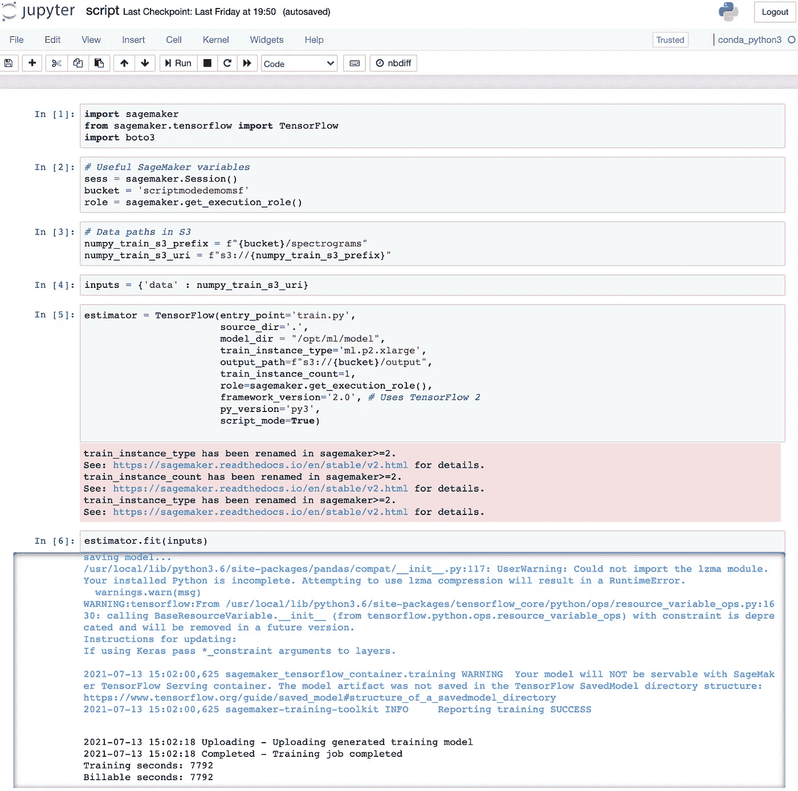

# 使用 AWS SageMaker 训练您自己的声音生成可变自动编码器

> 原文：<https://towardsdatascience.com/train-your-own-variational-auto-encoder-for-sound-generation-with-aws-sagemaker-1ecb82918695?source=collection_archive---------34----------------------->

## 在脚本模式下使用 AWS SageMaker 训练您的定制 TensorFlow 模型的简单方法。

经过 10 个小时的训练，我进入了 150 个纪元中的第 22 个，我意识到 3000 wav 文件数据集对于我 5 岁的 MacBook Pro 来说有点难以接受。[自由口述数字数据集](https://github.com/Jakobovski/free-spoken-digit-dataset)包含来自 6 个说话者的录音，每个说话者 50 个 8kHz *的数字。wav* 格式。当我在跟踪 Valerio Velardo 的关于神经网络 声音生成的优秀视频系列时，我发现自己陷入了一个无休止的训练阶段。目标是训练一个定制的可变自动编码器来生成声音数字。


Pawel Czerwinski 在 [Unsplash](https://unsplash.com?utm_source=medium&utm_medium=referral) 上拍摄的照片

FSDD wav 文件的预处理在本地进行，并在*中生成 3000 个光谱图的训练数据集。npy* 格式(我的 TensorFlow 模型的预期输入格式)。虽然 SageMaker 现在支持各种数据源，如*亚马逊 FSx* 和*亚马逊 EFS* ，但我将训练数据集上传到了位于美国东一区(N. Virginia)的 *S3* 的一个桶中。请注意这一点，因为 SageMaker 需要与您的铲斗在同一区域。

我的源代码由两个文件组成:

*   *autoencoder.py* —自动编码器“ *VAE* ”类定义:具有镜像编码器/解码器和潜在空间的深度卷积自动编码器。包含所有 TensorFlow 库导入。
*   *train.py* —训练初始化:访问训练数据，实例化模型，定义所有参数(输入形状、滤波器、核、步幅、潜在空间维度和各种超参数)。包含从 *autoencoder.py* 导入的 *VAE* 类

这两个文件在本地培训时在我的本地硬盘上协同工作，但是如何转移到云中呢？

# 与 SageMaker 一起训练

SageMaker 主要提供了 5 种训练模型的方法:

*   内置算法
*   脚本模式
*   码头集装箱
*   市场
*   笔记本实例

在我们的特殊情况下，脚本模式是可行的，因为我们提供了在 TensorFlow 兼容的容器(由 AWS 管理)中执行的源代码。

选择一个基本的 SageMaker 笔记本配置(一个 *ml.t2.medium* 就可以了)，确保附加的 *IAM-execution-role* 允许访问您的 S3 bucket，并从管理控制台启动实例(与 bucket 在同一区域)。在脚本模式下，注意这个 SageMaker 笔记本实例只用于脚本启动，不用于培训。

我将我的源代码上传到 SageMaker 笔记本实例存储的工作目录中，在那里我还创建了自己的 *script.ipynb* 来编排培训过程。在这个脚本中，我包含了以下导入:

```
import sagemaker
from sagemaker.tensorflow import TensorFlow
import boto3
```

然后，我将所有有用的 SageMaker 变量定义如下:

```
bucket = 'mytrainingdatabucket'
role = sagemaker.get_execution_role()numpy_train_s3_prefix = f"**{**bucket**}**/spectrograms"
numpy_train_s3_uri = f"s3://**{**numpy_train_s3_prefix**}**"inputs = {'data' : numpy_train_s3_uri}
```

最重要的是，*估算器*处理所有端到端的 SageMaker 训练任务。以下是需要特别注意的参数:

*   *入口点*:你的训练代码的路径(在我的例子中是 *train.py* )
*   *source_dir* :剩余源代码的路径(依赖、库等)。
*   *model_dir* :指定你的代码将你的算法生成的模型写入容器的预期位置，通常为' *opt/ml/model* '。在训练结束时，SageMaker 获取它在' *opt/ml/model* '中找到的任何东西，并将其输出给 S3。
*   去找一个强大的，因为它只会用于训练。
*   *output_path* :保存模型工件和输出文件的 S3 路径。
*   *script_mode* : boolean，在这种情况下选择 *True* 。

下面是我如何为 AWS 管理的 TensorFlow 兼容容器初始化我的 *estimator* 实例:

```
estimator = TensorFlow(entry_point='train.py',
                       source_dir='.',
                       model_dir = "/opt/ml/model",
                       train_instance_type='ml.p2.xlarge',
                       output_path=f"s3://**{**bucket**}**/output",
                       train_instance_count=1,
                       role=sagemaker.get_execution_role(), 
                       framework_version='2.0',
                       py_version='py3',
                       script_mode=**True**)
```

然后，将通过调用估计器上的 *fit()* 来启动训练，如下所示，但在此之前，我们需要定义下一段中描述的所有环境变量。

```
estimator.fit(inputs)
```

# 环境变量

我在我的 *train.py* 文件中实现了 *parse_args()* 函数来收集所有必要的 SageMaker 环境变量，比如路径和超参数:

```
def parse_args(): parser = argparse.ArgumentParser() parser.add_argument('--epochs', type=int, default=150)
 parser.add_argument('--batch_size', type=int, default=64)
 parser.add_argument('--learning_rate', type=float, default=0.0005)       # data directories    
 parser.add_argument('--data', type=str,
 default=os.environ.get('SM_CHANNEL_DATA'))     parser.add_argument('--output', type=str,
 default=os.environ.get('SM_CHANNEL_OUTPUT'))     parser.add_argument('--train', type=str,
 default=os.environ.get('SM_CHANNEL_TRAIN'))        parser.add_argument('--model_dir', type=str,
 default=os.environ.get('SM_MODEL_DIR')) return parser.parse_known_args()
```

因此，我可以加载训练数据:

```
x_train = get_train_data(args.data)
```

然后我可以实例化 *VAE* 类，并相应地调用训练方法:

```
autoencoder = train(x_train, args.learning_rate, args.batch_size, args.epochs)
```

最后，一旦模型训练完毕，我就可以从 *VAE* 类中调用 *save()* 方法来将我的模型工件( *parameters.pkl* 和 *weights.h5* )存储在' *opt/ml/model* '中。这一步是必不可少的，因为 SageMaker 不会自动保存你的模型，而是简单地获取容器文件夹中的内容。因此，请明确执行此操作:

```
autoencoder.save(args.model_dir)
```

就是这样！下面是我的 *script.ipynb* 的执行快照:



# 结论

如上所述，培训工作需要大约 2 个小时才能完成，费用大约为。根据我在自由层帐户上的 *AWS 计费仪表板*，3.20 美元(计算+存储)。

新生成的模型存储在我的“*输出/* 文件夹的 *S3* 桶中，并以 8.4 MB*model.tar.gz*档案的形式出现。下载并解压后，我能够使用 *VAE* 类的 *load()* 方法，并成功地做出推理来生成声音。以下是我的模型生成的“*零*”声音数字的示例:

 [## 零

### 流零由 msaintfelix 在桌面和移动。在 SoundCloud 上免费播放超过 2.65 亿首歌曲。

soundcloud.com](https://soundcloud.com/msaintfelix/zero) 

查看我的 [GitHub 资源库](https://github.com/msaintfelix/Training_Custom_VAE_Model_in_AWS_SageMaker)这个项目，感谢阅读！