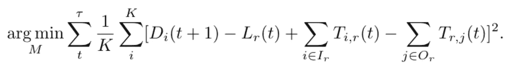

# 使用随机矩阵的可训练宏观交通建模

> 原文：<https://towardsdatascience.com/trainable-macroscopic-traffic-modeling-using-stochastic-matrices-e5fc4dedf259?source=collection_archive---------24----------------------->

## 通过用真实世界的数据训练交通模型来获得真实的交通模拟。


图片由[大卫·马克](https://pixabay.com/users/12019-12019/?utm_source=link-attribution&utm_medium=referral&utm_campaign=image&utm_content=1990268)从[皮克斯拜](https://pixabay.com/?utm_source=link-attribution&utm_medium=referral&utm_campaign=image&utm_content=1990268)拍摄

在这篇文章中，我将讨论我如何定义一个交通网络，一个交通模型，以及我如何用我收集的流量数据来训练它。

交通网络可以表示为有向图，道路上的车辆负载可以表示为图边上的负载数值。微观交通模型阐述了单个车辆之间的相互作用，而宏观交通模型则考虑了交通流量。通过定义一个交通模型，将在图上形成一个动态系统，并且可以模拟交通行为。

收集和预处理好的真实世界交通流数据可用于**训练**交通模型。然后，可以使用该模型来研究交通网络的拓扑薄弱部分，以修改网络来改善较低的拥塞水平。

# 交通网络

让我们给出我们需要的初步定义。


特殊类型的矩阵可以用来保存图的属性信息。


图形是保存节点间关系信息的对象。图的线图直观地展示了图的边的关系。由于交通网络的动力学，如交通流，考虑了道路之间的关系，我们需要考虑交通网络的线图。


交通网络可以被认为是有向图 G，其中每个节点 r 是一条边，每个交叉点 j 可以被认为是一个节点。


为了获得真实的结果，我们需要关于道路类型和道路长度的信息。然后，我们可以根据这些值为每个图定义一个容量常数。设 *H_r* 为道路类型， *l_r* 为道路 *r* 的道路长度，定义一个函数 *λ(H_r)* 为道路类型 *H_r.* 的车道数然后定义 r 的通行能力为 *C_r = λ(H_r)l_r* 。

容量是一条道路所能承受的最大交通负荷。设每条道路持有一个荷载值 *L_r(t)∈[0，C _ r】*。此外，道路的拥挤程度被定义为 *L_r(t)Cr。*

使用 Python 的 **osmnx** 包，我们能够将真实世界的交通网络导入到**网络 x** 图中。该软件包从*开放街道地图*中收集真实的空间信息，并使用它生成一个网络。图书馆给了我们以下信息:名称、长度和道路类型。

对于这篇文章，我选择了伊斯坦布尔的交通网络 *Kadikoy。*

```
import osmnx as oxfrom networkx import *# Defining the map boundaries
#Kadikoy kordinatlarinorth, east, south, west = 40.9939, 29.0346, 40.9786, 29.0146# Downloading the map as a graph objectG = ox.graph_from_bbox(north, south, east, west, *network_type* = 'drive')draw(G, *linewidths*=1, *node_color*='w', *node_size*=15, *arrowsize*=5, *pos*=pos)ax = plt.gca() # to get the current axisax.collections[0].set_edgecolor("#000000")
```


现在，让我们创建这个网络的线图。

```
L = nx.line_graph(G)draw(L, *linewidths*=1, *node_color*='w', *node_size*=15, *arrowsize*=5, *pos*=pos2)ax = plt.gca() # to get the current axisax.collections[0].set_edgecolor("#000000")
```


# 通信模型

在前面的部分中，生成了一个交通网络。要模拟该网络中的流量，需要一个流量模型。我们需要定义一个模型，它可以获得每个节点持有的信息，并给我们结果。通常，流行的宏观模型，如 METANET，不考虑较小的市内道路，而只关注高速公路。

我们将要定义的模型将考虑网络中的每一条道路。这些模型是用随机过程和随机行走的思想来表述的。


设 *P* 是一个 *n×n* 概率转移矩阵，设 *π(t)* 是一个 *n 维*非负向量，它保存在时间 *t* 节点上的初始负载分布。那么下一个时间步的分布就是 *π(t+ 1) =(π(t)^T)P，*其中 *x^T* 定义 *x* 的转置。

我们有两个假设。第一个假设是，在每个时间步，每个交通灯是同步的，在每个路口，在每个时间步变绿一次。第二个假设是总负载不变。第二个假设是临时假设，稍后将引入基于时间的负载控制机制。

通常，最常见的随机游走是根据度数定义的。

设 *G* 为图，设 *A* 为邻接矩阵，设 *D* 为图的度矩阵。基于度的概率转移矩阵定义为 *P = D^(-1)A，*其中 P_(i，j)=A_(i，j)/deg(i)。

但是这个模型不考虑道路的通行能力，所以我们不能模拟交通的级联效应。

为了防止这种情况，并能够优化模型，稍后，公路关系矩阵 M 出现，其中 M(H_i，H_j)是从公路类型为 H _ I 的公路到公路类型为 H_j 的公路的流量常数。假设有一个从道路 r 到 p 的流量，如果λ(Hr)> λ(Hp)随着汽车的行驶，道路变得更窄，我们就面临一个瓶颈。瓶颈使汽车在不减速的情况下更难继续行驶，因为车道的数量减少了，汽车不得不变道，这导致了机动性的整体下降。随着道路类型的差异越来越大，流量变得越来越慢。所以，M(H _ r，H_p)应该很小。然而，如果λ(Hr)< λ(Hp)，那么流量不会减慢，因为车道实际上是在增加的，汽车不必为了变道而减速。道路 r 上的载荷计算如下


概率转移矩阵是:


# 优化模型

我们希望模型以现实的方式行动。在建模阶段，模型被赋予一个道路型流量常数。在本节中，我们将使用这些参数优化模型。从这里，一家使用他们的 API 提供交通流量数据的导航公司，以 20 分钟的间隔收集 1080 步的真实世界交通数据。收集的数据用于优化模型。对未处理的数据进行处理，使其成为保持 Eminonu 地区主要道路拥堵程度的时间序列数据。之所以选择 Eminonu，而不是 Kadikoy，是因为它是这里最大的地区，有许多不同的道路类型。

设 D_i(t)表示时间 t 时道路 I 的真实世界拥堵水平，设所选成本函数为 MSE。设 N 是数据实例的数量，K 是道路的数量。因为 L(t)是递归函数，随着 t→ ∞，求导会越来越难。此外，考虑到现实世界的数据取决于实时性，这意味着在一天中的某些时候，流量水平会更高或更低。为了训练模型，在每个时间步 t+1，取 L_i(t)为 D_i(t)，并对 L_i(t+ 1)进行优化，因此 L_i(t)被视为常数而不是函数，优化过程变得更容易。

假设时间序列数据为:

D(0)，D(1)，D(2)，D(3)，D(4)，D(5)，D(6)…

数据将被分组为(X，Y ),其中 X 是特征，Y 是预测值。将时间序列数据分组如下:

(D(0)，D(1))，(D(1)，D(2))，(D(2)，D(3))，…

我们试图找到 8×8 M 矩阵，它给出了在总模拟时间τ上求和的成本函数的最小值。所以每 64 个变量都应该进行优化。对于时间 t+ 1，我们希望优化以下成本函数:



在哪里，


对于每个 M_，其中 a，b ∈[1，8]，用梯度下降法进行优化。


现在，当我们求梯度时，我们需要计算每个时间步的最小值函数，并对最小值部分求导。因此我们有下面的梯度，


优化进行了 30 个时期。在每个时期，我们获取不同的矩阵 M。这 30 个不同的 M 矩阵用于预测下一个时间步中的流量负载值。

左图显示了前 10 代 M 矩阵的不同成本值，右图显示了后 10 代的成本值。对于这两个图，线形图是训练前的成本值，这些值是我直观给出的，所以理想的结果是成本值保持在线形图以下。可以观察到，在用 20 个数据对/数据实例训练模型 30 个时期之后，低于线图的成本值的数量增加了。


因此，我们可以看到，在预测下一次迭代中的负载分布时，经过训练的模型比未经训练的模型表现得更好。目前，正在以更短的时间间隔收集另一个真实世界的数据，以更高的精度训练模型。