# 训练 CNN 在没有任何人工注释图像的情况下检测停车标志

> 原文：<https://towardsdatascience.com/training-a-cnn-to-detect-stop-signs-without-any-manually-annotated-images-715a91954006?source=collection_archive---------25----------------------->

## [实践教程](https://towardsdatascience.com/tagged/hands-on-tutorials)

## 额外游戏:这篇文章中有一句话是故意错误的。你能找到它吗？

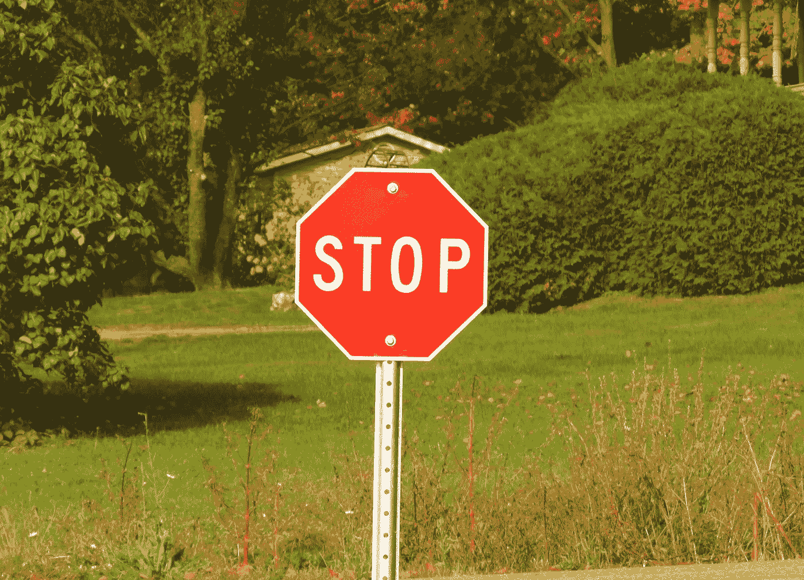

一个停车标志。图片由作者提供。

注释大型影像数据集是一项劳动密集型工作，因此成本高昂。在某些情况下，只有大公司才有资源来构建数据集，这将使他们的卷积神经网络(CNN)在给定的应用中具有优势。

解决这个问题的一个可能方法是*图像合成*。当 object 类如此简单，以至于我们可以以编程方式创建逼真的示例时，我们可以生成带有相应目标热图的图像。这些对将用作完全卷积神经网络(FCNN)的训练观测值，该网络将图像作为输入，并预测相应的热图。

## 当你看到一个红色的八角形时，必须停下来

作为一个简单的例子，**我们将为停止标志**的单色图像创建一个生成器，这是自动驾驶汽车必须处理的许多信号之一。忽略颜色信息会给训练带来额外的困难，但是如果我们成功了，得到的 FCNN 就不太可能被例如圆形的红斑所混淆。

你可以在这里找到本文[中使用的代码。](https://github.com/sebastiengilbert73/synthetic_heatmap)

发生器从随机背景图像开始。它将绘制一个内部带有“停止”字样的八边形。添加噪声、模糊和应用仿射变换将完成在随机背景上渲染合理逼真的停车标志图像的过程。在某些情况下，生成器会绘制一个额外的随机均匀八边形。这个八角形模拟了停车标志的背面，FCNN 人必须学会忽略它。生成器有时还会在八边形之外写“停止”这个词。通过仿射变换变形的八边形表面将成为 FCNN 需要学习生成的目标热图。

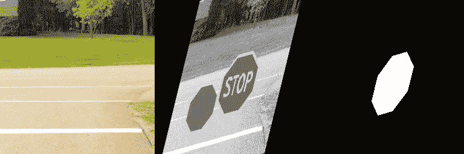

左图:随机背景图片。中心:合成图像。右图:对应的热图。图片由作者提供。

使用合成图像的主要优点之一是实际上无限的训练数据集。即使可用的背景图像的数量是有限的，各种变换、随机位置和绘制对象的比例也向我们保证了神经网络在训练期间将不会两次看到相同的图像。

训练图像是按需合成的，但是验证图像只生成一次并被保留，以提供从一个时期到另一个时期的损失的公平比较。

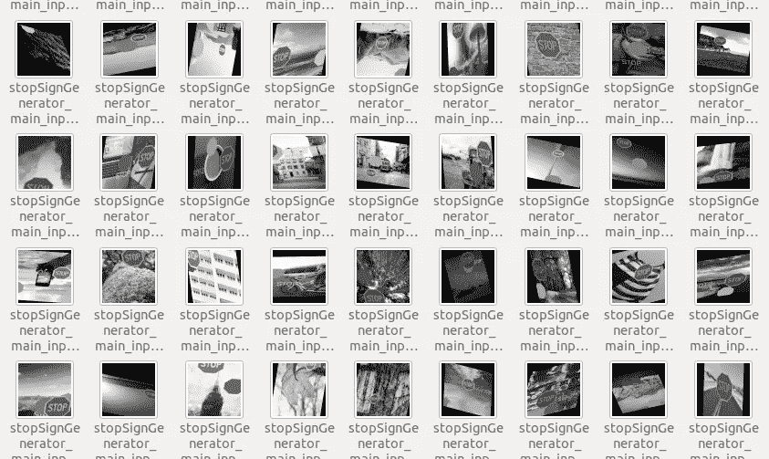

验证图像的样本。图片由作者提供。从 [Picsum](https://picsum.photos) 中获得随机背景。

## FCNN 建筑

我选择的架构(在令人尴尬的多次失败迭代之后)是三个卷积层的堆叠，后面是一系列三个转置卷积。

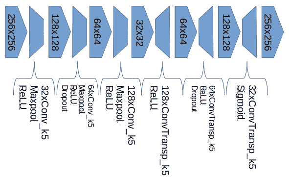

FCNN 建筑。图片由作者提供。

这个 FCNN 架构的实现接受*一列输入张量*，并返回每个张量输出的像素最大值作为其最终输出。这项功能的动机是观察到**训练有素的 FCNN 倾向于对应用于输入图像的模糊水平**非常敏感。在某些情况下，当输入图像没有模糊时，输出热图不会突出显示停车标志。当输入图像有点模糊时，热图会突出显示停车标志。在某些情况下，情况正好相反:当输入图像没有模糊时，停止标志会被检测到，但当输入图像模糊时，停止标志不会被检测到。这种观察导致提交越来越模糊的图像，并保留每个输出的像素最大值。这种机制被集成到神经网络的 forward()函数的定义中。

通过提供两个图像的列表来训练 FCNN:未模糊的图像和用 3×3 内核模糊的图像。

## 培养

使用二元交叉熵损失似乎对这类任务很有效。

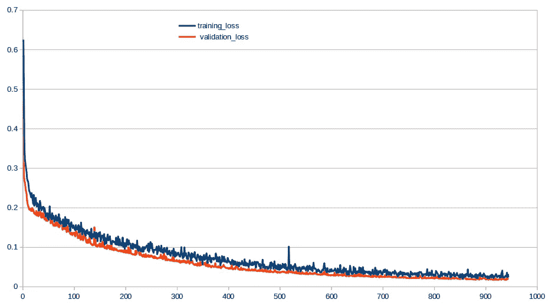

作为时代函数的训练和验证损失。图片由作者提供。

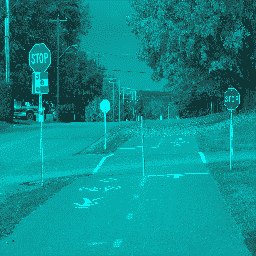

真实场景图像的热图(编码在红色通道中)的演变，如 FCNN 正在训练。图片由作者提供。

## 测试训练有素的 FCNN

在使用合成图像进行训练之后，我们可以在真实场景图像上进行测试。这些图像中的一些包括停止标志，而另一些没有。一些场景以停止标志的背面为特色，这不应该激活热图。

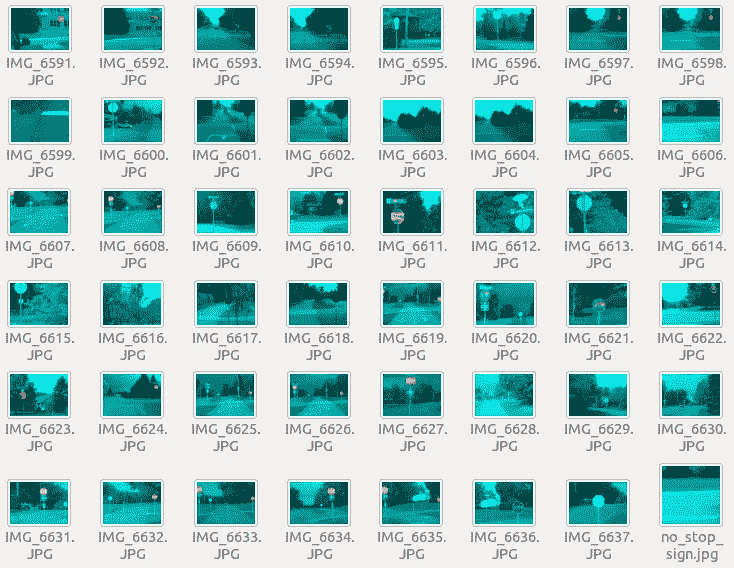

神经网络的输出，用于真实场景图像(512 x 512)。红色通道对热图进行编码。图片由作者提供。

用于训练的合成图像的大小是 256 x 256，但是根据推断，当真实场景图像在被传递到 FCNN 之前被调整到 512 x 512 时，结果是最好的。

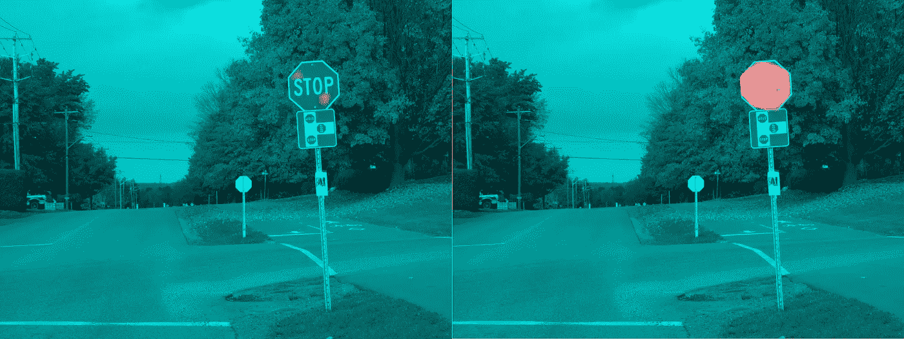

左图:调整为 256 x 256 后真实场景的热图(红色通道中)。右图:调整为 512 x 512 后同一图像的热图。热图被调整回原始图像的大小以便显示。图片由作者提供。

我们观察到，我们没有获得假阳性(即，当场景不包括停车标志时，热图不会显示高强度的区域)，但发生了一些假阴性(即，错过了一些停车标志)。用合成图像观察不到这种现象。

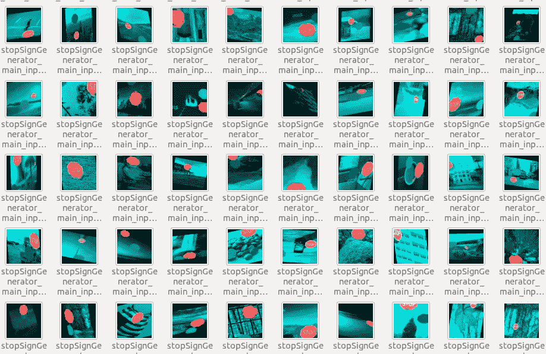

经过训练的神经网络的输出，用于验证合成图像(256 x 256)。红色通道对热图进行编码。图片由作者提供。从 [Picsum](https://picsum.photos) 中获得随机背景。

## 遗漏病例研究

对于神经网络，故障原因的识别通常是困难的。我们可以做的一件事是改变有问题的输入图像，并观察输出是否有所改善。

## 多重模糊

两个未能生成良好热图的案例被提交了多种模糊尺寸:1x1(即无模糊)，高达 9x9:

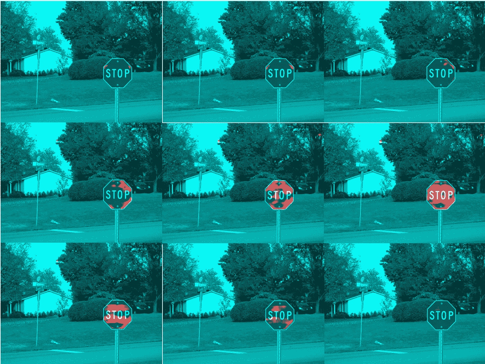

模糊输入图像的效果，从 1x1(左上)到 9x9(右下)。当模糊度为 6x6(中间偏右)时，此特定图像会产生更好的效果。作者图片

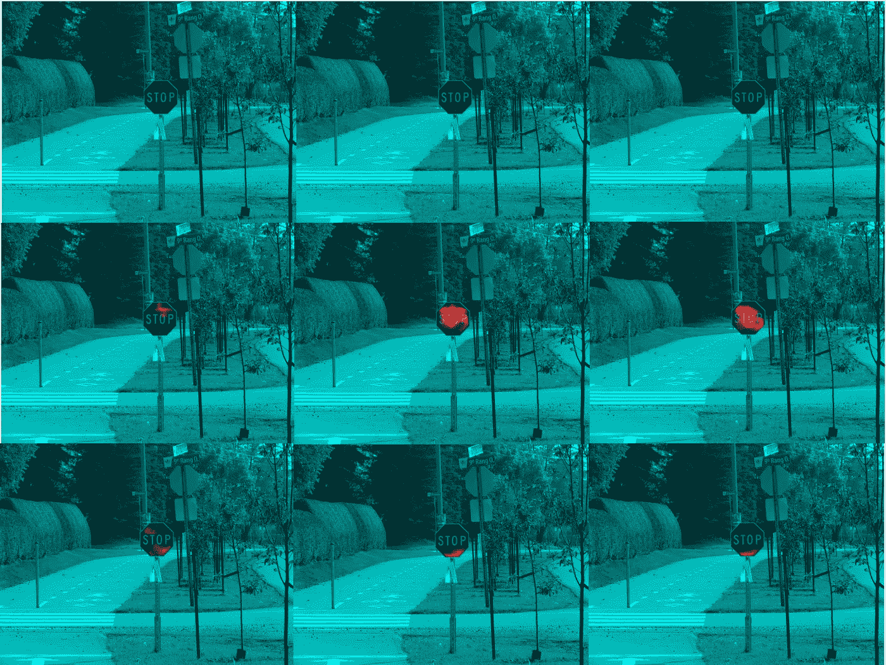

模糊输入图像的效果，从 1x1(左上)到 9x9(右下)。当模糊度为 5x5(中间)或 6x6(中间偏右)时，此特定图像会产生更好的效果。图片由作者提供。

## 调整大小

使用全卷积神经网络可以将输入图像的大小调整为各种分辨率，因为它们的架构不包括输入和输出维度固定的全连接层。这种灵活性允许我们在通过 FCNN 之前选择应用于原始图像的调整尺寸。在通过神经网络之前，同样的有问题的图像被调整到不同的大小。

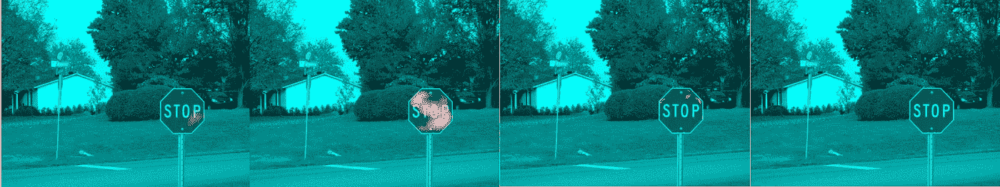

在通过 FCNN 之前，将图像调整到(128，128)(左)、(256，256)、(512，512)和(1024，1024)(右)的效果。在这种情况下，(256，256)给出了更好的结果。图片由作者提供。

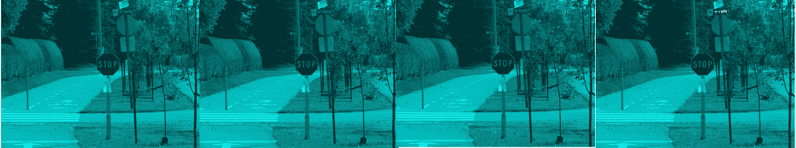

在通过 FCNN 之前，将图像调整到(128，128)(左)、(256，256)、(512，512)和(1024，1024)(右)的效果。在这种情况下，这些尺寸都没有给出好的结果。图片由作者提供。

## 印刷文字的重要性

对于训练图像，单词“停止”出现在八边形的中心。我们可以测试这个词的出现是否是一个必要的特征。下图显示了提交不带任何文本的八边形合成图像的结果。

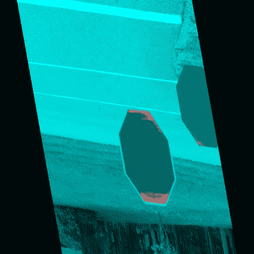

八边形内没有任何文本的合成图像的结果。图片由作者提供。

对于八角形表面的大部分，FCNN 没有激活。我们可以得出结论，文本的存在是必要的。

下图显示了打印文本是从[牛津英语词典](https://www.oed.com/)中随机选择的单词时的热图。

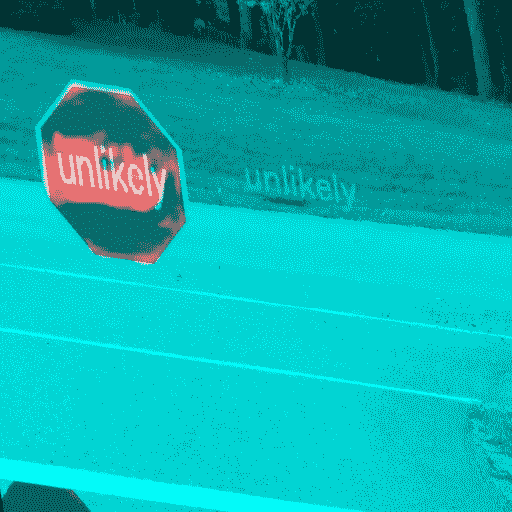

合成图像的结果，带有“停止”以外的单词。图片由作者提供。

## 结论

我们在随机背景上生成了停车标志的合成图像。这些图像用于训练一个完全卷积的神经网络，以生成停车标志八角形的热图。

最初观察到 FCNN 对输入图像中的模糊程度非常敏感，这一点通过对有问题的案例的分析得到了加强。虽然 FCNN 训练使用大小为 1 和 3 的模糊图像，但这对于一些真实场景输入来说是不够的。我会推荐模糊大小为[1，3，5，7]的训练。

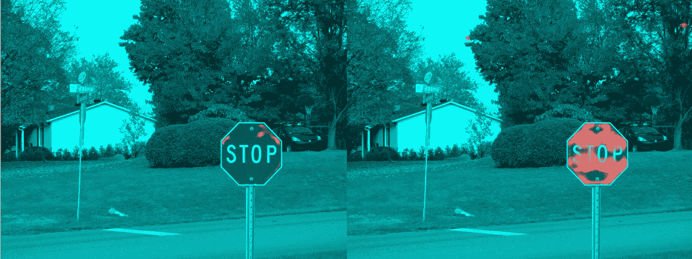

左图:模糊尺寸为[1，3]时的结果。右图:模糊尺寸为[1，3，5，7]时的结果。图片由作者提供。

至于调整大小，在两个被研究的丢失物体的案例中，只有一个在特定维度上有所改善，而另一个没有改善。出于这个原因，我建议将调整大小保持为(512，512)，这样总体来说效果不错。

最后，经过训练的 FCNN 似乎对写在八角形内部的单词不敏感，只要在深色背景上至少有一个浅色字母。虽然这个功能没有被明确地设计出来，但是它很有用，尤其是如果你像我一样，生活在一个停车标志可以显示“停止”、“arrêT”或“arrêT STOP”的地方。

这个项目既有挑战性又有趣！用简单的编程技巧就能弥补昂贵的手动注释图像数据集的不足，这是一种极大的满足感。让我知道你的想法！

[1]模糊是用相邻像素值的加权平均值替换图像中每个像素值的过程。在典型的场景中，邻域将是围绕中心像素的小正方形(例如:5×5)，并且加权将是均匀的。在本文的剩余部分中，“N 的模糊大小”是指围绕中心像素的 N×N 个像素的邻域上的均匀平均值。

[2]通过利用从 [https://picsum.photos](https://picsum.photos) 下载的随机背景图像来合成训练和验证图像。根据 [Picsum](https://picsum.photos) 网站，这些图片是从[https://unsplash.com/](https://unsplash.com/)获得的