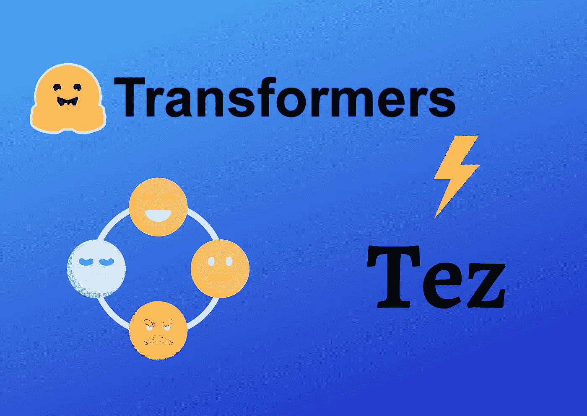
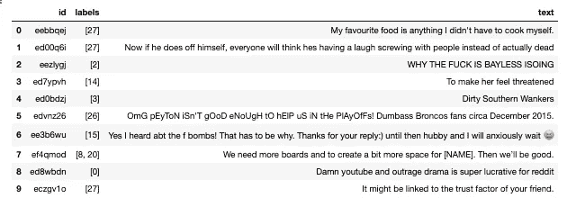
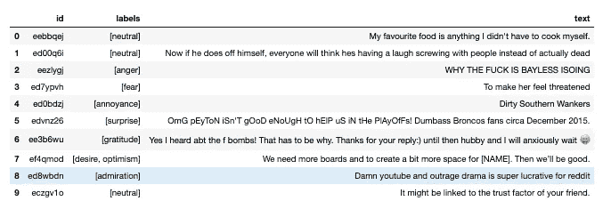
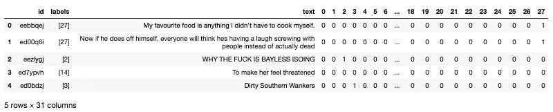
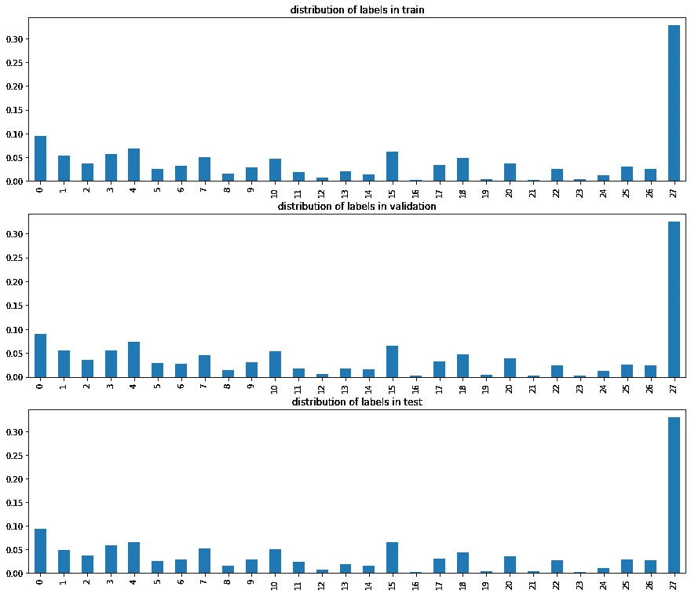
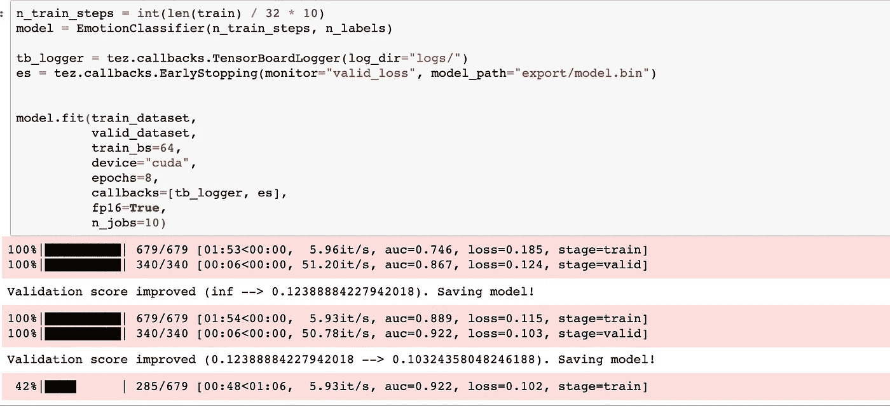
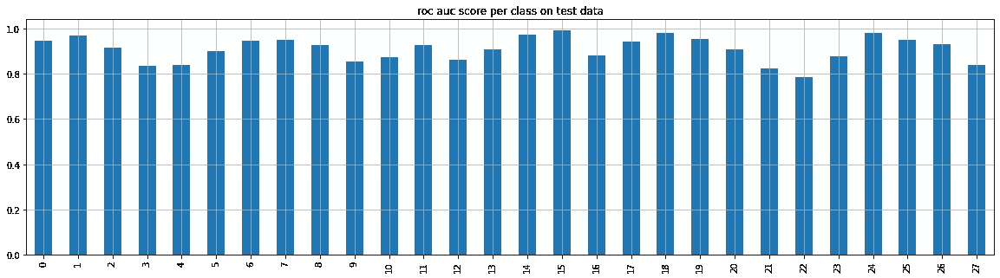

# 用 Tez 和 PyTorch 训练多标签情感分类器

> 原文：<https://towardsdatascience.com/training-a-multi-label-emotion-classifier-with-tez-and-pytorch-af04c899a63a?source=collection_archive---------19----------------------->

## 让您的培训脚本更上一层楼



作者图片

如果您厌倦了在 PyTorch 中重写相同的培训管道样板代码，我发现了一个非常简洁的解决方案，可以让您的生活更加轻松。别担心，这不是一个会改变你做事方式的沉重的库。

它是一个轻量级的包装器，将训练逻辑封装在一个类中。它是基于 PyTorch 之上构建的，虽然是最近才有的，但是我已经测试过了，我认为它确实做到了它所承诺的。

它叫做 [Tez](https://github.com/abhishekkrthakur/tez/) ，我们今天将看到它在一个有趣的多标签文本分类问题上的应用。以下是我们将要介绍的内容:

*   使用**🤗数据集**库，用于加载和操作数据
*   用 **Tez 和变形金刚**定义培训管道
*   针对多标签分类问题训练一个 **SqueezeBert** 轻量模型，并在验证和测试数据上达到+0.9 AUC

让我们直接跳进来吧！

***【PS *:****在继续本教程之前，我要向*[*Abhishek tha kur*](https://www.youtube.com/channel/UCBPRJjIWfyNG4X-CRbnv78A?pbjreload=102)*致敬，他为构建 Tez 并使深度学习能够为更大的社区所用付出了努力和精力。*

***PS***** *:所有代码以及训练好的模型在我的 Github*[*repo*](https://github.com/ahmedbesbes/multi-label-sentiment-classifier/)*上都有。*

# 在 GoEmotion 🧱上构建一个不寻常的情感分类器

您可能熟悉基于二进制(例如 IMDB 电影评论)或多类数据(例如亚马逊产品评论)构建情感分析模型。

我们今天仍将关注情绪分析，但我们会做一些稍微不同的事情。

在搜索 Huggingface 的[网站](https://huggingface.co/datasets/go_emotions)寻找数据集时，我遇到了一个有趣的数据集，叫做 **GoEmotions:** 它包含了 58k 条精心策划的 Reddit 评论，分为 28 个类别，包括中性类别。

这些数据来自英语，旨在进行多标签分类，用有趣的类别描述社交网络上的人类行为。我不得不尝试这个数据集！

以下是 28 种不同的情绪:

```
[‘admiration’, ‘amusement’, ‘anger’, ‘annoyance’, ‘approval’, ‘caring’, ‘confusion’, ‘curiosity’, ‘desire’, ‘disappointment’, ‘disapproval’, ‘disgust’, ‘embarrassment’, ‘excitement’, ‘fear’, ‘gratitude’, ‘grief’, ‘joy’, ‘love’, ‘nervousness’, ‘optimism’, ‘pride’, ‘realization’, ‘relief’, ‘remorse’, ‘sadness’, ‘surprise’, ‘neutral’]
```

我发现这个数据集很有趣，因为它提供了详细情绪的标记数据，如好奇、感激或惊讶，这些情绪很难用典型的数据集来检测。

我也发现这样一个数据集的影响。部署将文本数据分类为这些情绪的模型可以有多种应用:

*   通过对客户评论的精细分析来评估客户行为
*   检测社交媒体上的有害评论或仇恨言论
*   建立一个代理来评估你的文章(电子邮件、报告、博客帖子)的语气
*   用元数据丰富数据集:例如，在通过模型进行分析之后，您可以使用这个模型用标签来补充电影概要

这样的例子不胜枚举。在评论区告诉我你还能想到哪些应用。

# 1 —设置您的环境💻

要重现本教程，您需要安装 python 3。我会选择 [Anaconda](https://www.anaconda.com/products/individual) ，但是你可以使用任何你想要的软件包管理器。

然后，您必须安装:

*   [PyTorch](https://pytorch.org/get-started/locally/) (最好是最新版本)
*   [🤗transformers](https://huggingface.co/transformers/) :一个库，提供了数千个预训练的模型来执行文本任务，如分类、翻译、100 多种语言的文本生成
*   [🤗Datasets](https://github.com/huggingface/datasets) :一个轻量级库，为许多公共数据集(包括 GoEmotions)提供一行数据加载器和预处理
*   [Tez](https://github.com/abhishekkrthakur/tez):py torch 的超简单轻量训练器

您还需要`scikit-learn`和`pandas`来进行通常的数据处理和操作。

你应该准备好了:让我们开始编码吧！

同样的老进口先:

# 2-从获取数据🤗数据集

数据可以很容易地从🤗数据集库，在训练中提取，验证和测试分割并转换为熊猫数据帧。

下面先来看一下数据:每个评论都有一个对应的 id 列表，这些 id 映射到 28 种情绪中的一种。



作者图片

将每个标签转换为原始值，我们可以获得更全面的视图。



为了将数据正确地输入到分类器中，我们需要将标签转换成一个热点向量。



作者图片

快速查看目标在训练、验证和测试之间的分布表明，它遵循相同的模式。(id 27 对应于中性情绪，该中性情绪恰好在 30%的数据中被标记)



作者图片

在训练一个模型之前，让我们先快速浏览一些根据他们的情绪取样的评论:

**钦佩**

```
Wow, your posting history is a real... interesting ride.
---
I've never heard the insult 'Galaxy-Brain' before, but it's a wonderful! I'm gonna have to use it more often.
---
That or spot up shooting. I like the confidence though, he’s not scared to expand his game.
---
Congratulations!! Colorado is an amazing place! I just moved away a year ago and miss it terribly :) Best of luck to you!
---
Your artwork is amazing.
---
```

**游乐**

```
A stork bite your baby?!?! *kidding*
---
I like how because it’s on topic you assume everyone involved is making it their entire being. Lmao.
---
It's funny cause you say socialists have an "ignorance of economics" while posting on an anarcho-capitalist sub :) I think you clearly fundamentally misunderstand socialism. 
---
Oh hahaha, is it a reputable vendor?
---
This just made my day! Thanks for the laugh!!
---
```

**愤怒**

```
[NAME], don't f**king front the pass if your help defender is [NAME] he will not help you
---
I will kill you all
---
How aren’t you in f**king school
---
I hate betting unders.
---
How dare you disrespect [NAME].
---
```

**关爱**

```
Yes. One of her fingers is getting a sore on it and there’s concern it may push her into needing braces.
---
Most important!!! ALWAYS AIM THE HEAD! [NAME] arrows are pretty fat woodsticks, so keep aiming on the head on long distance. Thats it
---
special for you my dude :)
---
you did drug her though, and assault her by undressing her and taking her photo. you committed multiple crimes. you need professional help.
---
Sure, they can help nurse [NAME] back to health. 
---
```

# 3-定义 PyTorch 数据集🗂

这不会改变:您仍然需要定义如何加载和预处理数据。

我们将在类的构造函数中定义记号赋予器。每次访问样本时都会调用标记器，将文本转换成标记 id 和注意掩码。

令牌 id 和注意力屏蔽稍后将被提供给模型以生成预测。

*   令牌 id 是令牌索引:它们只是构建将被模型用作输入的序列的令牌的数字表示。
*   注意掩码是一个可选参数，在将序列批处理在一起时使用。该参数向模型指示哪些令牌应该被关注，哪些不应该被关注。

请注意:

1.  我们使用了一个 SqueezeBertTokenizer，因为我们将使用的模型是一个 SqueezeBert(更多细节见下文)
2.  最大长度是 35，因为它对应于注释的最大长度

# 4——奇迹发生的地方:定义⚡️模式

使用 Tez 时，只需将代码定义为从 tez.Model 继承的类。

这个类实现了你必须重写的特殊方法。

填写每个方法都相当容易。让我们一个一个来做:

构造函数 __init__ 将定义我们将使用的主干模型。在尝试了功能强大但非常大的型号，如**Bert-base-unc cased**和 **roberta-base** 后，我决定选择 **SqueezeBERT** ，它比 Bert-base-unc cased 快 4.3 倍，但性能相同。剩下的参数都很标准:dropout layer，带有类的数量和训练步骤的数量的输出层。

*   关于 **fetch_optimizer** 和 **fetch_scheduler** 方法，我使用了我在 [repo](https://github.com/abhishekkrthakur/tez/blob/main/examples/text_classification/binary.py) 中找到的例子。如果这些设置对您不起作用，请随意尝试其他设置

*   **损失**:由于我们正在处理多标签分类，我们将在每个输出神经元使用二进制交叉熵。这对应于 PyTorch 中的 BCEWithLogitsLoss。

*   **monitor_metrics** :关于指标，我们可以分别计算每个目标的 F1 或 AUC 分数，但由于这会导致显示大量指标，所以我只选择了微 AUC。这里的技巧是在一维向量中展开目标和输出的批次，并计算它们之间的 AUC。由于目标是相互独立的，这非常有意义。

*   **forward:** 这是我们定义模型如何对输入数据执行正向传递的地方。这个方法应该返回一个由输出、损失和度量组成的元组。

# 5 —开始培训⏱

我们快到了！现在我们开始训练。如果您熟悉 Keras API，这看起来非常相似:训练模型是一行程序。

Tez 还提供了回调，允许您在模型训练时引入一些功能。我们将使用其中的两个:

1.  TensorBoardLogger 在 Tensorboard 中记录训练和验证指标
2.  提前停止检查最佳模型并过早停止训练

**嘭**！在短短两个时期内，该模型达到了惊人的 **0.922 AUC** 分数或验证数据。



作者图片

在 8 个时期的训练后，模型在训练数据上达到 **0.97 AUC，在验证数据**上达到 **0.95。**

现在让我们看看模型在测试数据上的得分，并评估它在每个类中的表现。



作者图片

很神奇吧？该模型在除类别 21(对应于 **pride** )之外的所有类别上都有+0.8 的 AUC 分数。

## **在一些自由文本上测试模型**

让我们在一些自由文本上测试这个模型。(你会在我的[回购](https://github.com/ahmedbesbes/multi-label-sentiment-classifier)上找到 score_sentence 的实现)

```
**score_sentence("i miss my friends")** #sadness 0.863369 
#disappointment 0.20503707 
#neutral 0.05794677 
#remorse 0.02818036 
#annoyance 0.023128381 **score_sentence("i miss my friends")** #sadness 0.863369 
#disappointment 0.20503707 
#neutral 0.05794677 
#remorse 0.02818036 
#annoyance 0.023128381**score_sentence("you might have a point, but i strongly disagree with you")** #disapproval 0.77016926 
#annoyance 0.11454596 
#approval 0.08423975 
#disappointment 0.04763091 
#disgust 0.04497903**score_sentence("i'm feeling very confident about this situation") ** #optimism 0.456496 
#approval 0.43606034 
#admiration 0.1233574 
#caring 0.096342765 
#realization 0.07383881**score_sentence("try to be safe my friend")** #caring 0.73572147 
#optimism 0.0856328 
#neutral 0.071999945 
#sadness 0.06158314 
#approval 0.038069934
```

# 结论和未来工作🔜

本教程提供了一个机会，在一个多标签数据集上应用一个名为 SqueezeBert 的最先进的语言模型，该数据集包含 50K 条评论和 28 个类别。

使用 Tez 非常有效地组织了培训渠道，同时保留了很大程度的定制化。在几行代码之后，经过训练的模型在测试数据上达到了惊人的 0.95 AUC 分数。

但是旅程并没有到此为止:现在是时候将模型部署到互联网上，以便其他人可以通过 API 端点与之交互:如果您对这个主题感兴趣，可以看看我以前的文章中的[一篇](/building-and-deploying-cartoonify-b4786b382d7e)，在那里我使用 AWS Lambda 在无服务器架构上部署了一个生成模型。

感谢阅读！如果你有问题，请不要犹豫，尽管来找我。

如果你对代码感兴趣，你可以在我的[回购](https://github.com/ahmedbesbes/multi-label-sentiment-classifier)上找到。
如果你喜欢 Tez 你可以查看一下[这里](https://github.com/abhishekkrthakur/tez)！