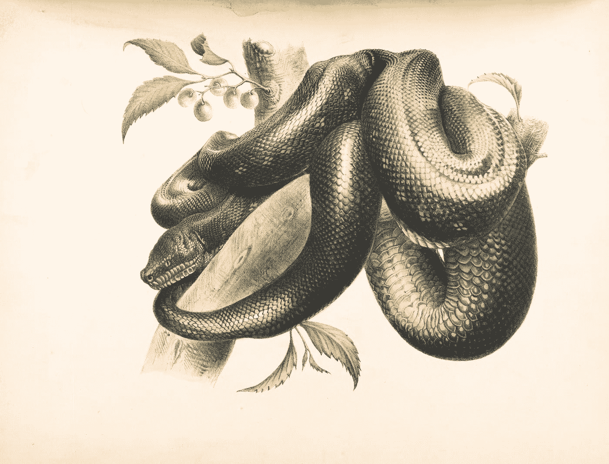
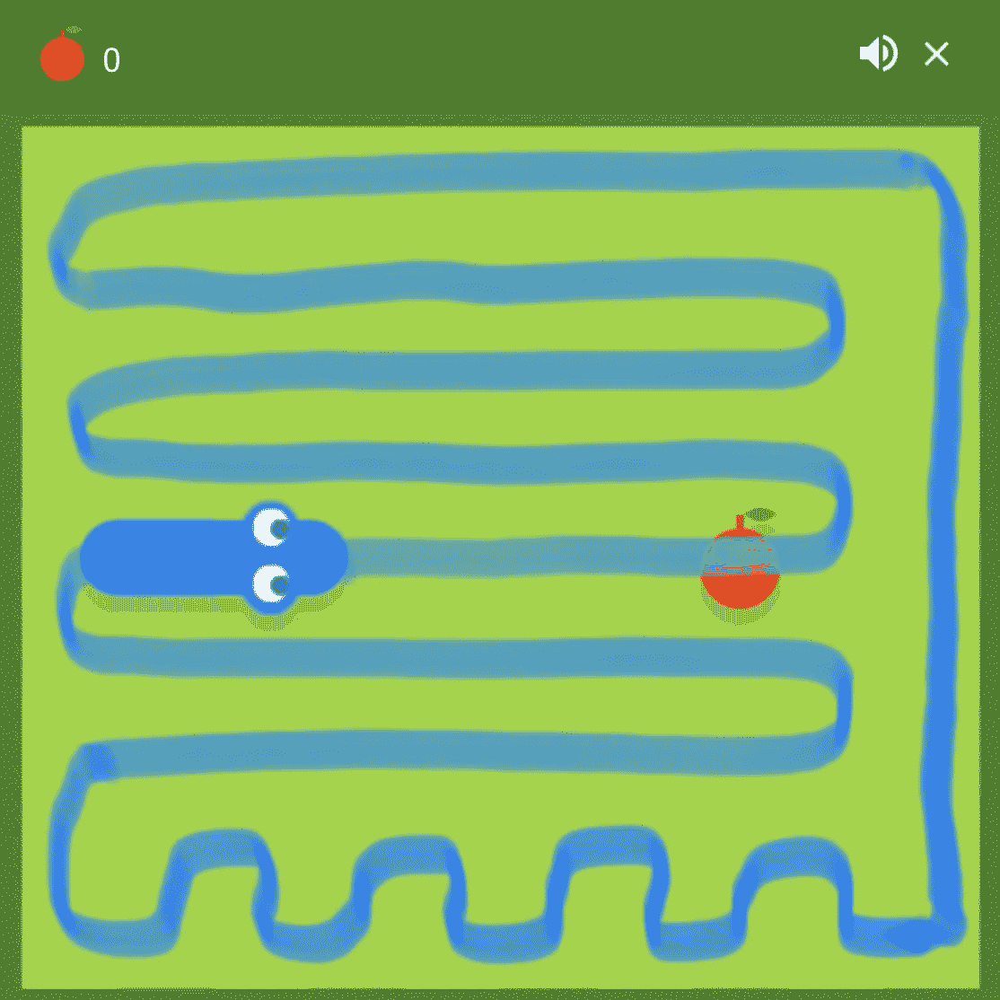
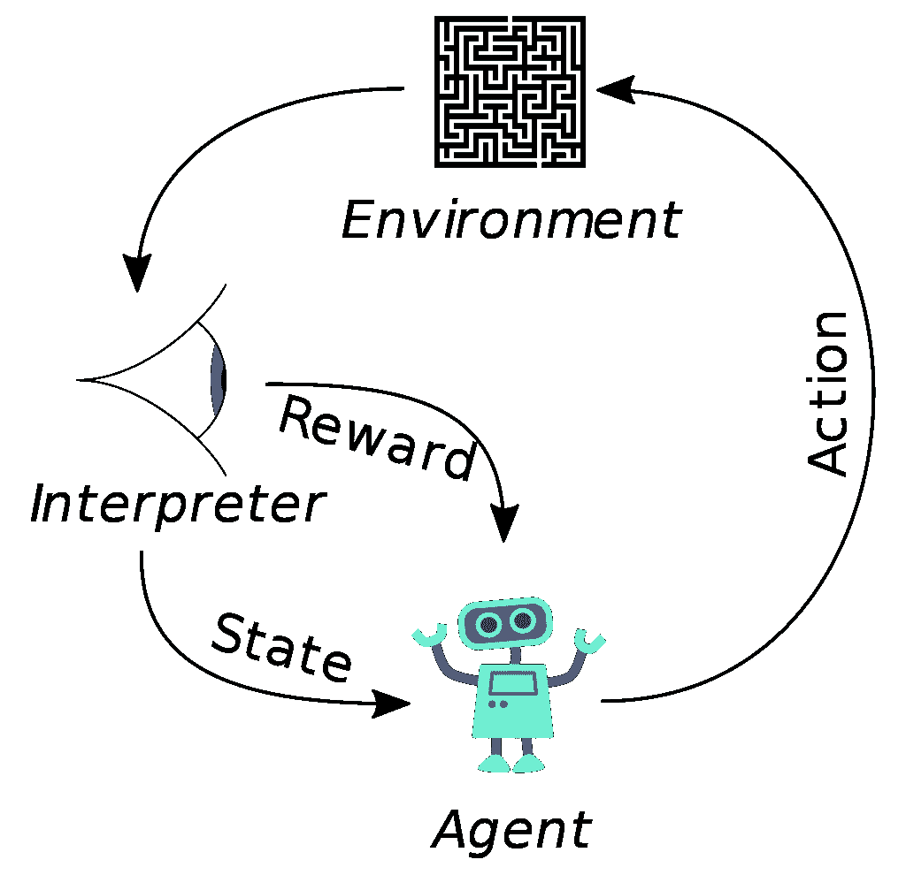

# 训练蛇游戏人工智能:文献综述

> 原文：<https://towardsdatascience.com/training-a-snake-game-ai-a-literature-review-1cdddcd1862f?source=collection_archive---------7----------------------->

## 方法综述，从非最大似然技术到遗传算法到深度强化学习



维多利亚博物馆在 [Unsplash](https://unsplash.com?utm_source=medium&utm_medium=referral) 拍摄的照片

# 0.介绍

你可能玩过，或者至少看过，蛇的游戏。玩家通过按箭头键控制一条蛇，蛇必须在屏幕上移动，吃苹果。每吃一个苹果，尾巴上的蛇就长一个单位。目标是在不碰到墙或蛇不断增长的尾巴的情况下吃尽可能多的苹果。

构建一个人工智能代理来玩 Snake 是一个经典的编程挑战，YouTube 上的许多视频显示了使用**广泛技术**的各种尝试。在本文中，我回顾了各种方法的优缺点，并提供了原始资料的链接。广义地说，人工智能蛇智能体的方法属于三类之一:**非最大似然方法，遗传算法和强化学习。从这些主题中可以学到很多东西，所以让我们开始吧！**

# 1.非 ML 技术

蛇的游戏实际上有一个微不足道的，无与伦比的解决方案。创建一个循环路径，该路径穿过棋盘上的每个方格，但不与自身交叉(这被称为[哈密顿循环](https://en.wikipedia.org/wiki/Hamiltonian_path))，然后继续沿着这个循环路径，直到蛇头与整个路径一样长。这样每次都会奏效，但是很无聊，也浪费了很多招式。在一个 NxN 网格中，大约需要 N 个苹果才能长出一条足够长的尾巴来填满棋盘。如果苹果随机出现，我们预计蛇将需要穿过一半当前开放的方块才能从当前位置到达苹果，或者在游戏开始时大约 N /2 步。由于这个数字随着蛇变长而减少，我们预计平均来说，蛇将需要~N⁴/4 移动来击败使用这种策略的游戏。对于 20x20 的棋盘来说，这大约是 40，000 步。



通过棋盘上所有点的哈密尔顿圈。如果蛇只是停留在这个循环上，那就保证赢。图片由作者基于谷歌 Snake 截图(合理使用)。

我在互联网上找到的几种方法本质上只是对这种幼稚的第一种方法的优化，找到聪明的方法来缩短周期而不困住蛇，这样就可以用更少的动作够到苹果。这包括动态地切割和重切哈密尔顿循环以快速到达苹果。[有一种方法](https://youtu.be/kLU5Wv2DgWs)甚至在一部旧的诺基亚手机上实现了这一点！玩贪吃蛇还有其他非 ML 的技巧，比如使用 [A*算法](https://en.wikipedia.org/wiki/A*_search_algorithm)寻找食物的最短路径，但是不像哈密尔顿循环方法，这不能保证打败游戏。

优点:保证最终击败游戏。

**缺点:**不涉及机器学习——算法必须手工编码。需要对图论有所了解。对于大型游戏板可能会很慢。

下面的例子来自 YouTube 上的 AlphaPhoenix。

视频来源:AlphaPhoenix (YouTube)。

# 2.遗传算法

遗传算法是解决这类问题的另一种流行方法。这种方法是模仿生物进化和自然选择的。机器学习模型(例如，可以是神经网络，但不是必须的)将**感知输入**映射到**动作输出**。输入可以是蛇在四个主要方向(上、下、左、右)到障碍物的距离。输出将是类似左转或右转的动作。模型的每个实例对应于自然选择类比中的一个有机体，而**模型的参数对应于有机体的基因**。

首先，一组随机模型(例如，具有随机权重的神经网络)在环境中被初始化并被释放。一旦所有的蛇(即模型)死亡，**一个适应度函数**从给定的一代中选择最好的个体。在蛇的情况下，适应度函数将只挑选得分最高的蛇。然后，通过添加**随机突变**(例如，随机调整网络权重)，从最佳个体中培育出新一代。这些突变有些会造成伤害，有些不会有任何影响，有些是有益的。随着时间的推移，进化的压力会选择越来越好的模型。要通过遗传算法来体验和可视化学习，请看 Keiwan 的[这个工具](https://keiwan.itch.io/evolution)。

**优点:**概念简单易懂。一旦模型被训练，预测下一步行动是很快的。

**缺点:**收敛慢，因为突变是随机的。性能取决于模型可用的输入。如果输入仅仅描述了在蛇的附近是否有障碍物，那么蛇不会意识到“大局”,并且容易被自己的尾巴困住。

下面的例子来自 Code Bullet，而 Greer Viau 的另一个例子也可以在 [YouTube](https://www.youtube.com/watch?v=zIkBYwdkuTk) 上找到。

视频来源:代码子弹(YouTube)

# 3.强化学习

强化学习是人工智能的一个快速发展和令人兴奋的领域。在一个非常基础的层面上，强化学习包括**一个代理、一个环境、代理可以采取的一组动作****，以及一个奖励函数**，奖励代理的好动作或者惩罚代理的坏动作。当代理探索环境时，它更新它的参数以最大化它自己的期望回报。在蛇的情况下，代理人显然是蛇。环境是 NxN 板(根据食物和蛇的位置，该环境有许多可能的状态)。可能的行动是左转、右转和直行。

深度强化学习(DRL)将强化学习的上述思想与深度神经网络相结合。DRL 最近被用来建造超人的[国际象棋和围棋系统](http://Mastering Atari, Go, Chess and Shogi by Planning with aLearned Model)，学习只用屏幕上的像素作为输入来玩雅达利游戏，以及[控制机器人](https://ieeexplore.ieee.org/document/8961517)。



强化学习示意图。来源:维基百科(公共领域)。[https://en . Wikipedia . org/wiki/reinforce _ learning #/media/File:Reinforcement _ learning _ diagram . SVG](https://en.wikipedia.org/wiki/Reinforcement_learning#/media/File:Reinforcement_learning_diagram.svg)

深度 Q 学习是 DRL 的一种特殊类型。虽然一开始有点难以理解，但其背后的推理极其优雅。神经网络学习“Q 函数”，它将当前的环境状态作为输入，并输出一个包含每个可能行为的预期回报的向量。然后代理可以选择最大化 Q 函数的动作。基于该动作，游戏然后将环境更新到新的状态并分配奖励(例如，吃苹果+10，撞墙-10)。在训练开始时，Q 函数只是由一个随机初始化的神经网络来近似。现在，你可能会问:为了产生损失并更新权重，我们将输出与什么进行比较？

这就是**[**贝尔曼方程**](https://en.wikipedia.org/wiki/Bellman_equation) 的用武之地。该等式用于提供 Q 的近似值，以将神经网络引导到正确的方向。随着网络的改进，贝尔曼方程的输出也会改进。至关重要的是，在 Q 函数的定义中有递归(这是我在程序中使用的 Bellman 变体):**

```
Q(state, action) = 
    reward(state, action) + discount * max(Q(next_state, actions))
```

**因此，Q 函数被递归定义为这步棋 *的**奖励加上下一步棋**的最佳可能 Q 函数* **。该项将扩展到下一个奖励加上下一个最佳行动的 Q 函数，以此类推。随着训练的进行，这个 Q 函数(有希望)接近给定移动的真实预期未来回报。(请注意折扣系数的存在，它给予即时回报比预期更大的权重，但不确定未来的回报)。****

**观看 Snake AI 使用深度 Q-Learning 训练自己的酷之处在于，你可以看到它的**探索和利用**的过程，现场发生。在一些游戏中，蛇走了 5 步就死了。这一开始可能会令人失望，但请记住，这将招致惩罚，网络将自我更新，以避免将来出现类似的举动。在一些游戏中，蛇会存活很长时间，并聚集一条长尾巴，获得大量奖励。无论哪种方式，这些动作都是**积极或消极的强化**来教会蛇如何在未来玩得更好。**

**为了了解更多关于 Q-learning 的知识，我强烈推荐计算机科学家在 YouTube 上的介绍视频。我还推荐 Lex Fridman 的麻省理工学院强化学习讲座，也可以在 YouTube 上看到。**

**优点:这是一个非常酷又优雅的概念。RL 也可以应用于许多其他任务，除了建立环境和奖励系统之外，不需要监督。根据我的经验，它比遗传算法收敛得更快，因为它可以利用梯度下降而不是随机变异。**

****缺点:**一开始有点挠头去理解。与遗传算法一样，模型的性能取决于网络可用的输入，输入越多意味着模型参数越多，这意味着训练时间越长。**

**下面的视频是 Python 工程师在 YouTube 上制作的**惊人的** 4 部分教程的第 1 部分，我强烈推荐。相应的代码可以在 [GitHub](https://github.com/python-engineer/snake-ai-pytorch/blob/main/model.py) 上找到。**

**视频来源:Python 工程师(YouTube)。**

# ****结论****

**最好的学习方法是边做边学。跟随上面链接的教程/解释并实现我自己的 Snake AI 教会了我更多关于手边主题的东西，这是任何数量的阅读或观看都无法做到的。我鼓励你自己尝试一下，并考虑将这些方法应用到不同的游戏中，例如 Pong、Asteroids 或 Breakout。感谢阅读！**

# **参考**

**[1]哈密顿路径，[https://en.wikipedia.org/wiki/Hamiltonian_path](https://en.wikipedia.org/wiki/Hamiltonian_path)**

**[2]格里尔·维亚乌，*神经网络学会玩蛇*，[https://www.youtube.com/watch?v=zIkBYwdkuTk](https://www.youtube.com/watch?v=zIkBYwdkuTk)**

**[3]贝尔曼方程，[https://en.wikipedia.org/wiki/Bellman_equation](https://en.wikipedia.org/wiki/Bellman_equation)**

**[4]进化论由基万著，[https://keiwan.itch.io/evolution](https://keiwan.itch.io/evolution)**

**[5] *通过学习模型规划掌握雅达利、围棋、国际象棋和日本象棋*、[https://arxiv.org/pdf/1911.08265.pdf](https://arxiv.org/pdf/1911.08265.pdf)**

**【Python 工程师，*教 AI 打蛇*，[https://www.youtube.com/watch?v=PJl4iabBEz0&t = 3s](https://www.youtube.com/watch?v=PJl4iabBEz0&t=3s)**

**[7]代码子弹， *AI 利用遗传算法和深度学习学习打蛇*，[https://www.youtube.com/watch?v=3bhP7zulFfY&t = 18s](https://www.youtube.com/watch?v=3bhP7zulFfY&t=18s)**

***机器人控制*在人类环境中使用深度强化学习[，https://ieeexplore.ieee.org/document/8961517](https://ieeexplore.ieee.org/document/8961517)**

**[9]莱克斯·弗里德曼，*麻省理工学院 6。S091:深度强化学习介绍(Deep RL)* ，[https://www.youtube.com/watch?v=zR11FLZ-O9M&t = 3036s](https://www.youtube.com/watch?v=zR11FLZ-O9M&t=3036s)**