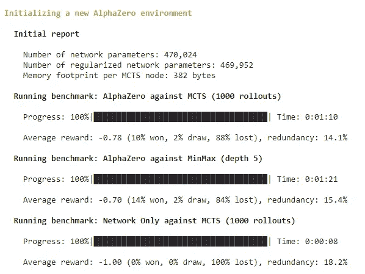
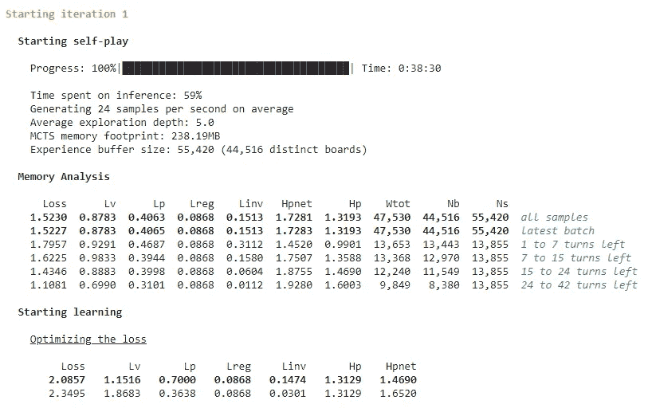

# 在 Google Colab 中训练 AlphaZero

> 原文：<https://towardsdatascience.com/training-alphazero-in-google-colab-cc2f1d6bd0ba?source=collection_archive---------25----------------------->

## 借助朱莉娅的力量在短短 5 小时内


训练如此之快，你甚至不会意识到它已经打败了你(图片:杰克·吉文斯， [Unsplash](https://unsplash.com/photos/iR8m2RRo-z4)

随着 Kaggle 对强化学习(RL)的推进，我一直在深入研究 RL 算法，同时研究哪些算法可以实际训练(我们并不都有一大群 GPU！).在这篇文章中，我讨论了如何使用 Google 的在线笔记本系统 Collaboratory，在不到 4 小时的时间内训练一个代理人玩人类级别的 connect four。

这篇文章是完全可复制的，你可以在这里找到笔记本，训练你自己的代理人，亲眼看看 AlphaZero + Colab + Julia 的力量是多么惊人！

> [AlphaZero 谷歌合作实验室笔记本链接](https://colab.research.google.com/drive/1UbL2A-56rxr4UwxLk-uWyZ2i88nNmyQk?usp=sharing)

向 [Alphazero.jl](https://github.com/jonathan-laurent/AlphaZero.jl) 的所有者以及那些努力让 Julia 起床并在 Google Colab 中运行的人们大声疾呼，这一切才成为可能。

# 背景

在深入研究之前，先了解一些关键组件的背景知识，如果您对此不感兴趣，请跳到下一部分。

## 阿尔法零

AlphaZero 是 Deepmind 在 2017 年首次分享的强化学习程序。它能够玩围棋、日本兵棋和国际象棋，这三种独特的复杂策略游戏。它完全通过自我游戏来学习如何做到这一点，当它发现和开发策略时，不断地与自己玩游戏。它是世界著名的 [AlphaGo](https://www.youtube.com/watch?v=WXuK6gekU1Y&ab_channel=DeepMind) 的继任者，AlphaGo 作为第一个在围棋比赛中击败人类大师的系统而成为头条新闻。

该算法的一大卖点是它可以被训练的速度，Deepmind 报告说，在训练的一天内就达到了超人的水平。当然，这是在一台超级计算机上训练出来的，但是我们要用少得多的东西来管理。

## 谷歌合作实验室


本文使用的 Google Collaboratory 笔记本——眼熟吗？(作者创作)

想象一个 Jupyter 笔记本，现在想象你不需要设置任何东西，你不需要担心资源，你做的任何工作都可以在你的设备上和其他人即时共享——这就是 Google Collaboratory。这是一项基于云的服务，它复制了我们喜爱的 Jupyter 笔记本电脑，其工作方式与常规桌面安装相同。

这里的主要好处是，您不再受到您个人设置的计算资源的限制。您可以在云中运行这些笔记本电脑的多个实例，特别是对于我们的用例，您甚至可以使用 GPU 资源！

## 朱莉娅

Julia 是一种灵活的动态语言(易于使用)，适用于科学和数值计算(不慢)，其性能可与传统的静态类型语言相媲美( [Julia Docs](https://docs.julialang.org/en/v1/) )。

茱莉亚于 2012 年推出，从那以后知名度慢慢增长。它在投资公司的时间序列分析和保险业的风险建模中得到了应用。最值得注意的是，纽约美联储银行使用 Julia 制作美国经济模型，并指出该语言使模型估计比之前的 MATLAB 实现“快大约 10 倍”([维基百科](https://en.wikipedia.org/wiki/Julia_(programming_language)#History))。

由于其高性能的能力，它对 ML 项目特别有用，允许网络训练比在 Python 中本地运行快得多。

## 连接四个

Connect Four(也有许多其他名字，我最喜欢的名字是 *Gravitrips* )是一款双人游戏，玩家选择一种颜色，然后轮流将彩色圆盘投入 7x6 的格子中。碎片垂直下落，占据塔内最低的可用空间。游戏的目标是第一个形成自己的四个圆盘的水平线、垂直线或对角线。

Connect Four 实际上是在 1995 年解决的，这意味着我们知道如果第一个玩家采取正确的行动，他们总是能赢(完美的行动需要 41 步)，但要在我们的大脑中存储所有可能的 5 万亿步并不容易，所以我们改为使用一些策略来解决游戏，导致有趣的游戏方式，使游戏在发布时受到欢迎。


连接四个游戏([维基共享](https://commons.wikimedia.org/wiki/File:Connect_Four.gif))

现在，所有的部分都固定好了(看到我做了什么吗？)，我们继续任务吧。

# 任务

概括一下，在本文中，我们将实现 AlphaZero 来玩简单的连接四个的游戏。我们将使用 Julia 作为基础语言，利用其惊人的速度，在云中这样做，使用 Colab 笔记本在云中训练。

> 提醒如果你想跟进: [AlphaZero 谷歌合作实验室笔记本链接](https://colab.research.google.com/drive/1UbL2A-56rxr4UwxLk-uWyZ2i88nNmyQk?usp=sharing)

第一步，设置环境。Google Colab 通常用于 Python，但实际上也可以在其中设置不同的环境。为了快速训练我们的神经网络，我们将安装 Julia 并默认启用 IJulia 运行时。在附带的笔记本中，这意味着运行第一个单元，然后使用启用的新环境进行刷新。

下一步是从 git 安装 Alphazero 的 Julia 实现。这可以通过运行下一部分来完成。笔记本将连接到 git 并获取该项目的文件。然后我们将把这个包加载到 Julia 中，并确保我们已经安装了所有需要的依赖项。

```
run(`git clone --branch v0.3.0 [https://github.com/jonathan-laurent/AlphaZero.jl.git`)](https://github.com/jonathan-laurent/AlphaZero.jl.git`))
cd("AlphaZero.jl")
run(`julia --project -e "import Pkg; Pkg.instantiate()"`)
```

安装好库后，我们就可以开始训练网络了。这可以用另一个简单的一行程序来执行，它启动了一个运行 Alphazero 核心算法的脚本。

```
run(`julia --project --color=yes scripts/alphazero.jl --game connect-four train`)
```

这将从列出网络的参数开始，用初始化的参数运行一个基准，然后进入第一轮自我游戏。每一轮自我游戏应该持续 30 分钟到 1 小时。这将取决于初始化的参数。



参数初始化(作者创建)

考虑到这需要多长时间，最好现在就离开这个会话，几个小时后再回来。在之前的测试中，我发现它会在 5-10 次迭代中表现良好，这取决于你初始化的运气。

当你准备好了，你可以停止运行单元，它会在最近一次迭代时切断训练。这样做的最佳时机是当您看到您的代理在所有基准代理中表现良好时(或者您已经没有耐心了)。注意:如果您决定继续提高代理的能力，也可以随时使用以下单元格重新开始培训。



一轮自我发挥(作者创作)

下一步是最有趣的——和你的经纪人比赛！希望现在你已经训练出了下一个世界排名前四的玩家，你已经做好了被打败的准备。理想情况下，运行下一个单元将加载您训练过的代理，然后启动一个交互环境，但是…我实际上很难让这部分工作起来。或者，您可以从您的培训工作中下载数据，并在您本地的 Julia 环境中运行(代理仍然是在云中培训的！).

您可以通过运行笔记本中的最后一个单元格来下载数据，这将压缩所有数据。或者，您可以导航到 sessions/connect-four 中的数据，其中包含已学习的网络参数以及用于训练的数据。

一旦你在本地完成设置，你就可以按照[有用的维基](https://jonathan-laurent.github.io/AlphaZero.jl/dev/tutorial/connect_four/#Examining-the-current-agent)上的说明进行操作。我和我的经纪人玩了很多游戏，但只有一两次能赢——你玩得怎么样？


接下来连接四颗星([来源](https://github.com/jonathan-laurent/AlphaZero.jl)

# 后续步骤

在本文中，我们看到了如何在几个小时内使用 AlphaZero 代理训练 connect four 代理。所使用的 AlphaZero 库可以访问其他游戏，你可能想用它们来进行训练实验。你也可以尝试实现不同的游戏，比如 Snake(这是我目前正在尝试的 Kaggle 比赛的一部分！).

希望这是明确的，任何问题或反馈都欢迎在评论中。