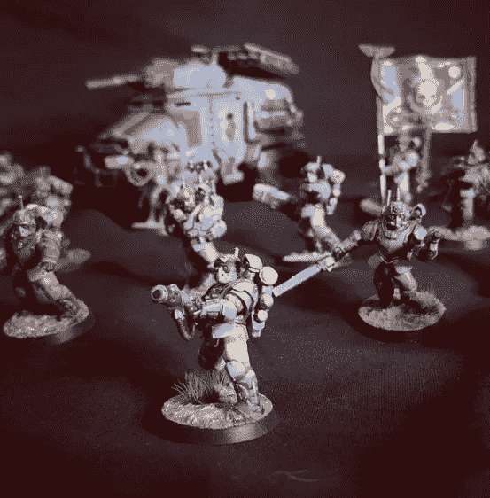
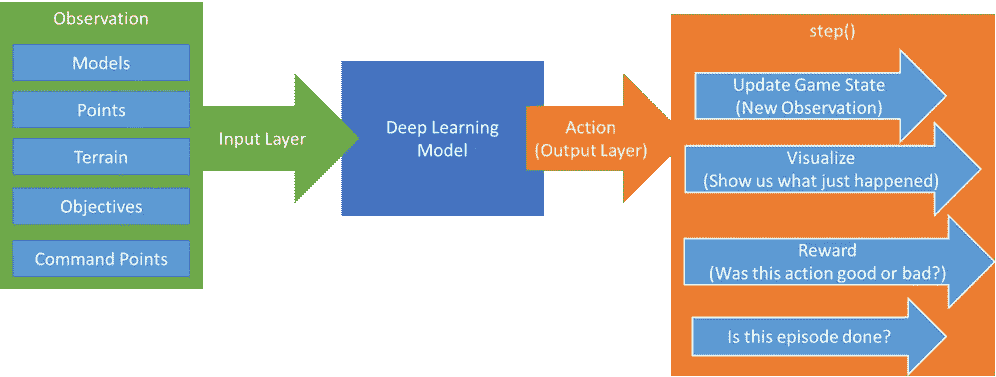
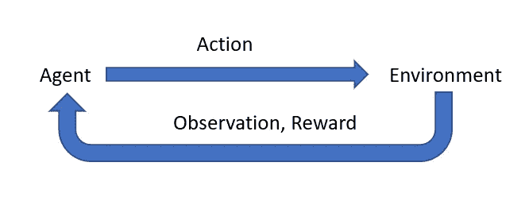
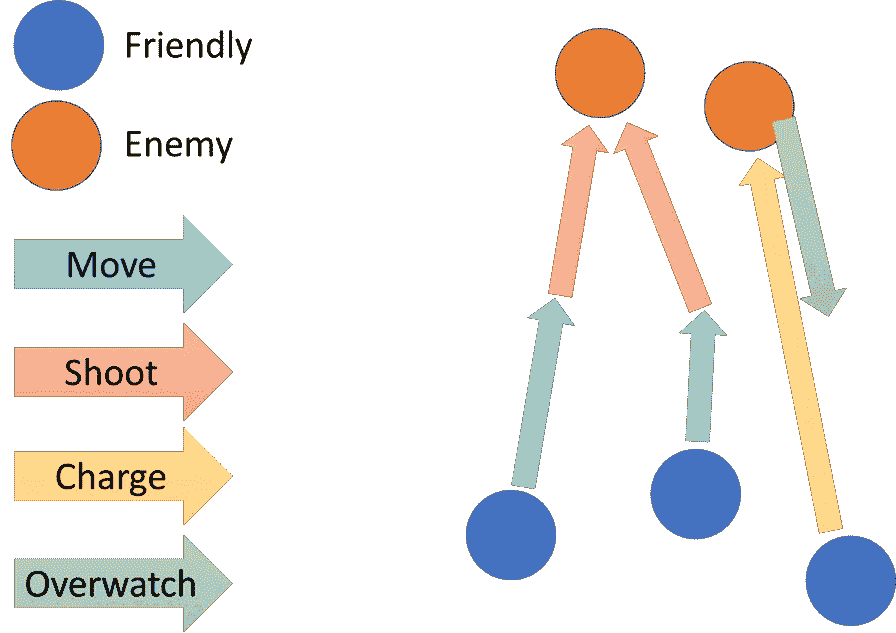
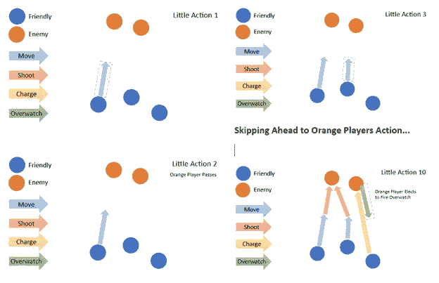
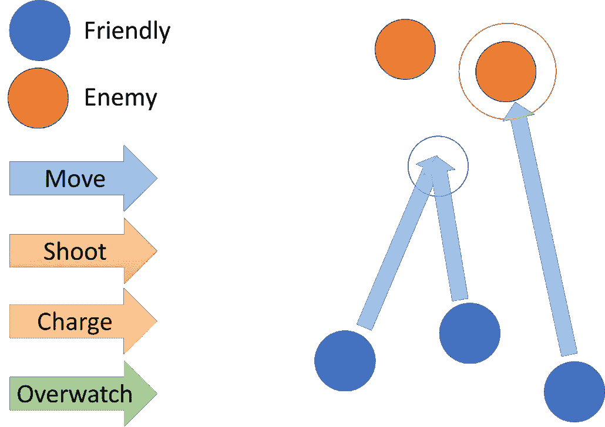
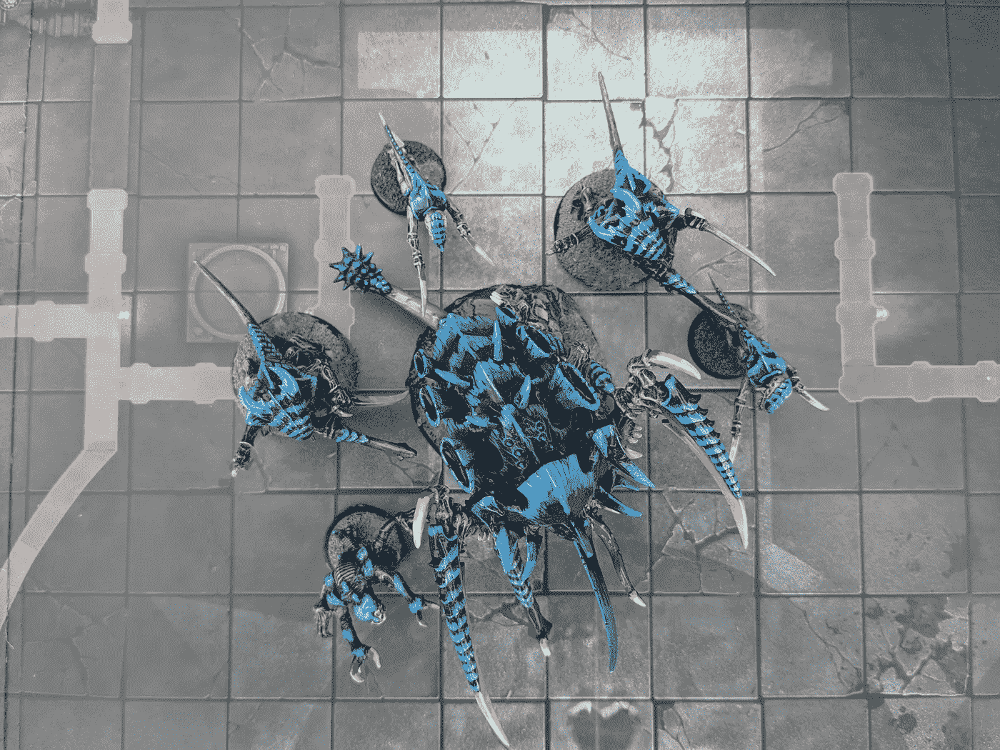

# 训练人工智能玩战锤 40k:第一部分

> 原文：<https://towardsdatascience.com/training-an-ai-to-play-warhammer-40k-part-one-planning-78aa5dfa888a?source=collection_archive---------11----------------------->

## [实践教程](https://towardsdatascience.com/tagged/hands-on-tutorials)

## 我们如何以一种人工智能友好的方式构建一个像战锤一样复杂的游戏？

https://www.instagram.com/p/CR7zpt2tHK-*图片*[*由大卫·梅耶授权给本·威廉姆斯*](https://www.instagram.com/p/CR7zpt2tHK-/)

你是否曾经想玩战锤，但发现设置游戏和与其他玩家一起玩太累了？你希望你可以一遍又一遍地与人工智能对抗，磨练你的技能并尝试其他策略吗？如果是这样，你来对地方了。在本文中，我，一个谦逊的软件工程师和战锤迷，开始了一个新项目，训练一个战锤 40k 第 9 版 AI。

为什么，你会问吗？为什么有人会训练人工智能在游戏中打人？可能是因为这很有趣，然后我就可以宣称自己比他们都好。等等，我的意思是为了人类的利益推进深度学习领域(总是把那些事情搞砸。)另外，谁不想和一些可恶的 AI 一起进入一个美好的 ole 技术黑暗时代呢？

我的意思是，我创造了人工智能，人工智能打败了他们，就好像是我做的一样，对吗？

# **强化学习——是什么？**

视频游戏 AI 等控制任务最知名的训练方法是*强化学习*。*强化学习*，简称 RL，是一种深度学习技术，多智能体在竞争环境中执行任务。随着时间的推移，这些代理被奖励和*加强*以诱导期望的行为。有了足够的计算能力和一个结构良好的奖励方案，不可思议的行为就会出现。

必须训练才能有结果！在 [Unsplash](https://unsplash.com?utm_source=medium&utm_medium=referral) 上 [Karsten Winegeart](https://unsplash.com/@karsten116?utm_source=medium&utm_medium=referral) 拍照

这与监督学习有很大不同，在监督学习中，大量带标签的数据被输入到 ML 模型中，输出与基础事实进行比较。游戏人工智能代理在如此动态的环境中运行，几乎不可能生成和标记如此大量的数据，更不用说理解这些数据了。不断变化的输入会影响短期和长期规划，强化学习提供了完成工作的工具。

对于任何成功的强化学习项目，所有数据科学的通用原则都适用:

*   大量的好数据会产生更好的结果。
*   模拟的质量对于代理学习任何东西都是至关重要的
*   不惜一切代价避免偏差(人口过多或过少)
*   如果你知道一个信号对问题很重要，直接输入。当你可以加快速度的时候，不要等着人工智能去抓东西。
*   更新的神经网络拓扑、训练技术或其他方法会有所帮助，但最终好的、净化过的数据会得到更好的结果

# 那么，我们该怎么做呢？

我不是深度学习研究者。当谈到神经网络、训练方法或其他方面时，我不太了解任何事情的相对好处。幸运的是，我不需要！有一个很棒的项目就是为像我这样的人准备的——开放健身房。Gym 是一个 RL 框架——本质上是一组最流行的深度学习模型插入的公共 API。

它的明确目的是创建标准的虚拟环境，强化学习在其中进行。这方面的一些例子包括 Atari 游戏、平衡摆、国际象棋环境等等。

开放式健身环境范例——钢管舞。按作者分类的源视频

OpenAI 健身房挺简单的。在其核心，它是一个容易构建或消费标准环境的框架，因此我们可以测量不同的 ML 模型在同一任务上的表现如何(基准测试)。)我们程序的顶层将继承基本的**环境**类，在未来的某一天，它将被世界上每一个人工智能研究者所使用。

*还有，需要朋友的 40k 玩家。*

# **量化板卡状态**

游戏的整个状态需要被存储，通过动作更新，然后再次反馈给我们的强化学习代理。在 OpenAI 健身房的世界中，这被称为*观察*—*观察*被反馈到模型中，以理解刚刚发生的事情。这意味着我需要模拟与游戏性相关的一切——棋盘的大小、地形的位置、模型底座的大小、剩余的伤口、模型是否是交通工具、它是否会爆炸等等。

人工智能模型输入和输出— ( *作者图片)*

为了使数据能够被*健身房*代理理解，必须使用*空格*来组织数据。*空格*是框架可以理解的标准类型。它们本质上可以归结为:

*   离散值(枚举或整数)
*   盒子(N 维空间，连续或离散)
*   布尔运算
*   将上述类型组织成有意义的块的方法，比如字典和元组

按照我的说法，游戏状态是一种分层的、面向对象的模式，其中每个不同的项目都包含在一个对象中。我目前的计划是开发自己的 Warhammer 40k 引擎(目前正在开发中，将在后续文章中概述)，并简单地维护一个翻译层，其中包含我自己的动态模式与 OpenAI Gym 使用的固定模式之间的任何差异。

# **步骤和动作类型**

*健身房*环境最重要的作用就是*步()*。代理调用*步骤()*告诉程序消费它的*动作*，模拟结果，并更新*观察*。

*step()* 是单个时间步，动作之间的周期。这是战锤 40k 的实际游戏进行的地方，给出代理指定的*动作*。

OpenAI Gym step()函数—图片由作者提供

为了让我正确设计 *step()* ，我必须先知道什么是*动作*！在现实生活战锤，行动可以从选择一个目标射击的所有方式，以中断战斗使用战略。既然我们人类如此善于处理模糊性，我们就可以合理地凭直觉判断何时需要执行某个动作，以及如何理解它。对人工智能来说，事情变得更加棘手！

所有神经网络的输出层都是固定的。它们将永远是相同的维度。这使得将网络输出与战锤 40k 的动态动作联系起来变得棘手。游戏有很多来回的互动。策略是一个突出的痛苦的例子——一些可以在掷骰子之前或之后使用，甚至可以用来中断战斗解决的顺序。

即使在正常的回合顺序中，也有几个反复的决定——否定心灵力量，或者分配攻击给单位中的哪个模型，等等。掷骰子的结果通常会影响玩家随后做出的决定，这也可能随时发生。

让我们考虑下面的操作序列，如下所示:

40K AI 动作示例序列— *作者图片*

在这种情况下，轮到蓝色玩家了。蓝色玩家选择向前移动两个单位，用远程武器射击第一个橙色敌人。他们选择用不同的敌人模式来攻击他们的第三个单位。橙色玩家选择向第三个蓝色单位发射警戒。

让我们探讨一下在这种情况下如何组织*行动*的不同可能性。

## **1。** **小动作(真实动作)**

对于我提议的*小动作*，一个*动作*正是游戏规则中定义的一个动作——这将是战锤规则到代码的最直译。任何时候一个玩家可以合法地对一种情况做出行动或反应，人工智能代理也将被允许这样做。这将意味着从移动命令，到宣布射击目标，到决定战斗顺序的任何事情都将是人工智能做出的独特动作。这为代理提供了最大限度的信息，以便在所有时间点做出最佳决策。这也是人工智能可以不受任何限制地玩 40K 的完整游戏的唯一方式(取决于那些讨厌的开发人员正确编码！)

动作序列示例—每个玩家交替动作和反应— *作者图片*

以我自己不专业的观点来看，这样做最大的缺点是，这将变得难以置信地难以为人工智能建模。几乎所有的 OpenAI 健身房项目都倾向于只有一种*类型的*动作可以发出——他们在平台上平衡横梁(向左、向右、停止)或击败吃豆人(向上、向右、向下、向左或停止)。)通过*的小动作，*我们的模型现在必须了解它处于哪个阶段，它处于哪个环境中(瞄准、传球、移动、分配伤口等)。)甚至*开始*做出好的决定。本质上，它必须学习游戏规则，同时也要学习游戏中的最佳策略——也就是说，它很可能会有一大堆动作，当它们不相关时，它可以发出来。这意味着算法有很多模糊性——传统的学习算法可能无法很好地处理这一点。我们人类学习规则已经够辛苦了，我们还有参考文本要通读！

形成良好的输出图层模式在这里也很困难-我们要么为不同的操作重用相同的输出字段，要么创建一个大规模的输出表面来同时处理所有可能的操作。这可能会导致难以置信的漫长和困难的学习时间，因为学习过程会对大面积的不连续输出进行实验。

## **2。** **大动作**

有了*大动作*，一个*动作*就是战锤的一个完整回合——玩家回合的每一个集体动作、射击、冲锋命令都在一个巨大的输出中完成。对于我们上面概述的场景，所有蓝色命令(移动、射击和冲锋)在蓝色玩家的回合开始时同时输出。

样本*大动作——所有蓝色订单同时提交*——作者本人*法师*

这样做的最大好处是每个*步骤()*都是一样的——得到一组动作，然后玩完整个回合。这使得训练代理比*小动作*更容易一些，因为它不需要担心不同的“模式”或动作类型。只有一个*动作*的内容每个*步骤()*。这也使得开发变得容易——我们只需要大规模的动作输出，然后一举完成回合。

这种方法最大的缺点是代理人丢失了信息——它必须在任何决定执行之前做出决定，不像游戏的实际参与者。虽然我们人类玩家倾向于在每个回合开始时都有一个计划，但拙劣的射击或冲锋的结果会导致计划的改变。这可能发生得非常突然，如果可能的话，我不想妨碍人工智能这么做。随着*大动作*，人工智能无法利用我们都爱的战锤的动态来回方面。它还阻止了人工智能玩完整的游戏——无序的动作是规则的一部分。

## **3。** **每型号或每单位动作**

这是第三个概念，其中人工智能交替激活模型，在更像杀戮团队的模式下玩战锤，而不是完全成熟的桌面战争游戏。人工智能将被允许选择一个模型，并采取一系列行动，如*站立和射击、* *前进和射击、* *冲锋、正常移动、*等。这将防止*大动作*的一些问题——当激活一个模型时，AI 有更多的信息，随后将能够以近乎完美的信息玩游戏。

*逐模式动作*的主要缺点是 40k 不是这么玩的。很接近，但不是完全匹配。这可以通过缓存模型/单位的订单得到部分缓解，这样引擎就可以等到射击阶段再解决射击问题，直到充电阶段再充电，等等。它仍然有一个问题，即人工智能在对玩家的行为做出反应的方式上是有限的——它通常仍然只能使用标准的命令，而不是反动的策略。

# **以神经网络兼容的方式格式化 40k 的规则**

如果我不小心，代理将有可能提交不合法的行动。没有真正的方法来告诉代理一个他们不能做的动作。我们有办法告诉他们*不应该*做这样的输出，但这不会阻止他们仍然不时地这样做。迫使代理人遵守 40k 规则的唯一真正方法是将行动空间限制在纯粹有效的移动范围内。

无效移动动作示例— *作者图片*

例如，让我们使用上面的同一个示例图。我们的三个蓝队都在前进。我们给 AI 代理浮点 X 和 Y 位置输出来表示移动的目的地。如果我们想让一个警卫班几乎完全控制移动位置，它可以有几乎无限的非法移动:重叠基地，移动到无法通行的地形，离开单位一致性，移动到合格距离之外，或移动到交战范围内。

一种解决方案是净化代理的输出。如果代理人的行动会导致非法游戏状态，使用启发式后处理器来做出下一个允许的最佳决策。净化代理输出的缺点是，它只能达到我们的后处理器代码允许的程度。

如果我们想要一个具有卓越的微观和定位的代理，如果我们离开这种“训练轮”，我们并不总是能得到它——它们限制了代理的灵活性和控制力。

我想到的另一个解决方案是让代理人自由支配将模型放在无效的位置上，但是对这样做给予负面的奖励。这样，代理人就不愿意做非法的动作，而愿意做合法的动作。理论上，随着时间的推移，代理人会了解 40k 的规则，通常不会做出违反游戏规则的举动。这里的一个大风险是过度奖励移动的合法性，而低估我们试图训练的实际东西——40k 控制算法！

这可能会导致模型认为它做得很好，而执行愚蠢的动作，如在一条线上来回移动模型。这将导致我们只能成功地训练一个知道 40k 的*规则*但不知道*策略*的人工智能。

我们能想到的另一个简单的策略是，当无效的移动被指定时，不采取任何行动，或者将违规的模型移出游戏。这将作为一个有效的强制函数来惩罚 AI 的无效移动，而不必以某种方式计算奖励。这样做的主要风险是再次暴露了不是有效动作的动作空间——它似乎引入了各种各样的问题。

最后一个选项是我们提到的第一件事——将动作空间限制在纯粹有效的移动。虽然原则上很棒，但我对实现每一步可能的*动作的巨大复杂性不感兴趣。*

# **部署**

渴望离开部署区的大虫子——图片由作者提供

部署是战锤 40k 战略的关键部分。然而，完成部署阶段与游戏的常规回合有很大不同。在我看来，训练一个机器学习模型以某种方式理解部署期间采取的行动和游戏流程中采取的行动之间的差异是相当困难的。

因此，我决定跳过第一次构建的部署阶段。相反，我计划使用一个基本的布局算法来开始。随着这个引擎的其他部分走到一起，我们可以开始考虑让 AI 也可以进行部署。

# **奖励代理**

我想谈的最后一个话题是一个棘手的问题(我猜他们都是，不是吗。)OpenAI 健身房的模特在每走完*步()*后，都会从我们的环境中收到一个介于-无穷大和+无穷大之间的数字。这被称为*奖励*，为了从强化学习中获得好的结果，我们必须提供一个好的奖励指标。

一般来说，从一个小的奖励开始，随着时间的推移，随着模型的训练逐渐增加，这被认为是好的。通过这种方式，模型不会在训练开始时过度奖励自己的行为，因为它不太可能是正确的，并且随着训练的进行，开始更多地奖励自己，以磨练真正积极的行为。

对于我们所关心的，在每个*步骤()*之后返回一个奖励是很棘手的——在我之前提到的任何情况下，手写的算法都不可能知道模型采取的行动是好是坏！如果这*是*可能的，那么我们就不会使用深度学习来解决这个该死的问题了！我们可以尝试使用某些东西，比如:

*   这个动作是否导致敌方模型被移出桌面？
*   这一行动是否导致我的团队得分？

但这两者都有可能返回误报——在一天结束时，我们只关心人工智能是否赢得了比赛。正因为如此，我们应该只根据胜利和失败进行奖励。达到这一点的所有其他任务都是高度主观和视情况而定的。因此，在*步骤()*结束时(导致权重不变，中立)，不会向 AI 提供奖励，直到确定游戏是否获胜(在*集*结束时)。)

## 插曲

一个*情节*是一系列相关的步骤。它们通常属于一个连续的序列，如战锤 40k 的单个游戏。一集结束后，我们可以决定要么结束训练，要么开始新的训练。

# **我的决策概述**

经过深思熟虑，以下是我为本文中讨论的这个项目的第一个版本(称为 V0)所做的高层决策:

*   最后的可交付成果是一个*开放式人工智能健身房环境*。我将把这个环境插入到各种 RL 模型中，看看最终什么会做得好。
*   代理商将在每一集*结束*时根据胜负获得奖励
*   我将用 *Python* 编写这个环境，用 *PyGame* 中的可视化工具
*   我将*动作*定义为每个单元的*动作，尽力模拟完整的规则集。*
*   我将通过输入一个离散观察(enum)空间来处理动作变化，告诉代理我希望它执行哪个动作。
*   我省略了许多高级规则，如战略、部署、攻击分配和我的第一版引擎的精神阶段——这简直太多了。
*   除了移动之外，我通过不采取任何行动来处理非法输出——这比编写一大堆代码来试图辨别代理的意图要容易得多。对于移动，我将沿直线移动模型，尽可能靠近所需的位置。

# **下一步**

嗯，说了很多，但没写多少代码。我敢肯定，你们都很兴奋地看到人工智能*做*什么的一些漂亮的可视化效果——在正义的荣耀中玩 40K。我们会到达那里，但是现在基本的决定已经决定了——为了我自己！