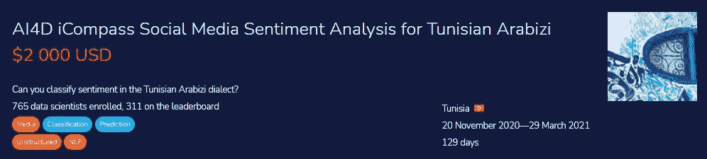
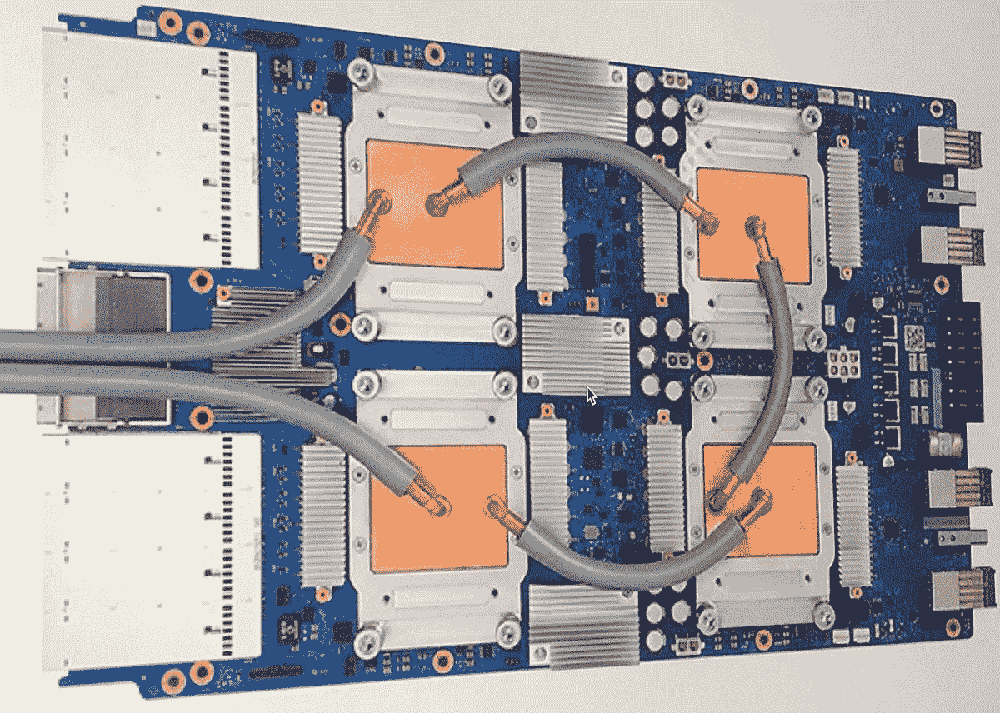
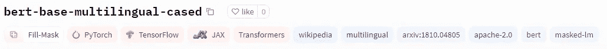
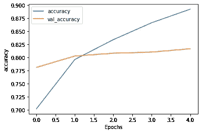
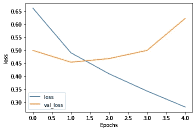
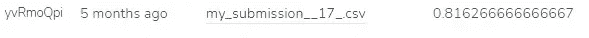

# 在张量处理器上训练 BERT 文本分类器

> 原文：<https://towardsdatascience.com/training-bert-text-classifier-on-tensor-processing-unit-ce0adc8ae449?source=collection_archive---------37----------------------->

## 为突尼斯阿拉比齐社交媒体情感分析培训拥抱 TPU 最著名的模特


由作者设计|元素由 [cookie-studio](https://www.freepik.com/cookie-studio) ， [rawpixel-com](https://www.freepik.com/rawpixel-com)

# 介绍

说阿拉伯语的人通常在社交媒体上用当地方言表达自己，所以突尼斯人使用*突尼斯阿拉伯语*，它由以拉丁字母形式书写的阿拉伯语组成。**情感分析*依靠文化知识和带上下文信息的词义。我们将使用阿拉伯方言和情感分析来解决这个项目中的问题。*

*比赛在[津迪](https://zindi.africa/)举行，由 [AI4D](https://ai4d.ai/) 组织。在这场比赛中，我们获得了训练和测试数据集。训练数据集由阿拉伯文文本和该文本的情感组成。我们需要建立一个模型，并改进我们的指标，以便在竞争领先者排行榜中获得第一名。*

*数据集是从不同的社交媒体平台收集的，这个项目的目标是预测测试数据集的标签。标签将决定我们的句子是积极的、消极的还是中性的。*

**

# *描述*

*在这个项目中，我们将使用 TPU 训练多语言 BERT 模型。*

# *TPU*

*张量处理单元(TPU)是谷歌开发的人工智能加速器专用集成电路(ASIC)，有助于减少深度学习模型的训练时间，尤其是谷歌自己的 TensorFlow 包[张量处理单元](https://en.wikipedia.org/wiki/Tensor_Processing_Unit)。与 PyTorch 相比，在 TensorFlow python 库中在 TPU 上训练深度学习模型要简单得多。*

**

***张量处理单元|** [维基百科](https://en.wikipedia.org/wiki/Tensor_Processing_Unit)*

*云 TPUs 资源最大限度地减少了计算线性代数问题的时间，并且使用大多数线性代数来开发机器学习应用。以前，用庞大的数据集训练一个复杂的深度学习模型需要几周时间，但使用 TPUs，训练时间减少到几个小时。[谷歌云](https://cloud.google.com/tpu/docs/tpus)。*

# *伯特*

*BERT(来自变形金刚的双向编码器表示)是 Google Research 的研究人员在 2018 年提出的 NLP(自然语言处理模型)。BERT 基本上是 transformer 架构的编码器栈 [analyticsvidhya](https://www.analyticsvidhya.com/blog/2021/06/why-and-how-to-use-bert-for-nlp-text-classification/) 。最初，当 BERT 发布它时，在许多 NLP 任务的准确性方面采用了其他模型，不久之后，其他研究人员开始使用 BERT 架构，并在不同语言中发布更新更好的模型版本。这就是我们基于 BERT 的多语言封装模型的由来，它在新的低资源语言上表现得相当好。我们的模型是使用最大的维基百科多语言数据语料库对前 104 种语言进行预训练的，要了解更多关于这个模型的信息，请阅读[的论文](https://arxiv.org/abs/1810.04805)。研究人员使用掩蔽语言建模(MLM)使其对多种语言有效。要了解更多关于该型号的信息，请查看型号卡[Bert-base-多语言环境](https://huggingface.co/bert-base-multilingual-cased)。*

**

*伯特多语模式| [拥抱脸](https://huggingface.co/bert-base-multilingual-cased)*

# *密码*

*我们将首先设置我们的模型在 TPU 上训练，然后我们将设置我们的超参数来提高性能。我们将加载和训练突尼斯阿拉伯语方言情感分析数据，然后在 [ai4d.ai](https://ai4d.ai/) 提供的测试数据集上进行预测。*

# *导入库*

*我们已经导入了所有必要的库，以便对 BERT 模型进行实验或预训练。*

```
*import tensorflow as tf
import logging
from tensorflow.keras.layers import (
    Dense,
    Flatten,
    Conv1D,
    Dropout,
    Input,
)
from tensorflow.keras.models import Sequential
from tensorflow.keras.optimizers import Adam
from tensorflow.keras import Model
from tensorflow.keras import regularizers
from transformers import BertTokenizer, TFBertModel
import os
import pandas as pd
import numpy as np
from sklearn.model_selection import train_test_split
from tqdm import tqdm
tqdm.pandas()
import re
import random*
```

# *为 TPU 做准备*

*该代码尝试检查 TPU 集群，然后初始化 TPU，最后创建一个 TPU 策略，稍后我们将使用该策略在云上训练我们的模型。如果你没有 TPU，代码将根据你的机器转移到 GPU 或 CPU。*

```
*try:
    tpu = tf.distribute.cluster_resolver.TPUClusterResolver()
    tf.config.experimental_connect_to_cluster(tpu)
    tf.tpu.experimental.initialize_tpu_system(tpu)
    strategy = tf.distribute.experimental.TPUStrategy(tpu)
except ValueError:
    strategy = tf.distribute.get_strategy() # for CPU and single GPU
    print('Number of replicas:', strategy.num_replicas_in_sync)*
```

# *设置超参数*

*这些超参数是用于实验的，以便我们可以做出改变并获得更好的结果。目前，这些参数产生了迄今为止最好的结果。*

```
*max_length = 140
batch_size = 16
dev_size = 0.1
num_class = 4*
```

# *正在加载 BERT 标记器*

*使用变形金刚库从拥抱脸下载 BERT tokenizer。*

```
*model_name = "bert-base-multilingual-cased"
tokenizer = BertTokenizer.from_pretrained(model_name)Downloading: 100% 996k/996k [00:00<00:00, 5.62MB/s]Downloading: 100% 29.0/29.0 [00:00<00:00, 950B/s]Downloading: 100% 1.96M/1.96M [00:00<00:00, 11.8MB/s]*
```

# *读取列车数据集*

> *数据集可以在[这里](https://github.com/iCompass-ai/TUNIZI)找到，并且是在麻省理工学院的许可下。*

*训练数据集包含 70，000 个样本，而我们的测试数据集包含 30，000 个样本。火车数据集有一个包含唯一标识符的 **id** 列、**文本**列，其中包含用阿拉伯语写的推文**、**和**标签**列，其中包含情感 **{-1，0，1}。***

*   ***读取数据:**使用熊猫读取 CSV 文件*
*   ***删除重复的推文:**这提高了模型的性能*
*   ***重新映射标签:**这使得编码和解码-1 情感变得容易，并最终提高了我们的性能指标。*
*   ***培训开发分割:**用于培训和评估。*

```
*train_df = pd.read_csv('../input/aranizi-dailect-training-data/Arabizi-Dailect-Train.csv')

train_df.text = train_df.text.astype(str)
train_df.drop_duplicates(subset=['text'],inplace=True)
train_df.label=train_df.label.map({-1:0,1:2,0:1})
train, dev = train_test_split(train_df, test_size=dev_size, random_state=42)*
```

# *加载数据并进行处理*

*我们使用 transformers batch encode plus 来编码文本数据，并将最大长度限制为 150。我们使用 TensorFlow 函数将我们的标签转换为分类类型，并将其加载到 TensorFlow 数据集，该数据集为模型使用我们的数据做准备。我认为缓存有助于 TPU 存储数据，但你可以删除它或添加它，你的模型将在任何情况下工作。*

```
*def bert_encode(data):
    tokens = tokenizer.batch_encode_plus(
        data, max_length=max_length, padding="max_length", truncation=True
    )
    return tf.constant(tokens["input_ids"])
train_encoded = bert_encode(train.text)
dev_encoded = bert_encode(dev.text)
train_labels = tf.keras.utils.to_categorical(train.label.values, num_classes=num_class)
dev_labels = tf.keras.utils.to_categorical(dev.label.values, num_classes=num_class)
train_dataset = (
    tf.data.Dataset.from_tensor_slices((train_encoded, train_labels))
    .shuffle(100)
    .batch(batch_size)
).cache()
dev_dataset = (
    tf.data.Dataset.from_tensor_slices((dev_encoded, dev_labels))
    .shuffle(100)
    .batch(batch_size)
).cache()*
```

# *模型*

*这个模型受到了卡格尔的笔记本的影响，他使用了 LSTM，而我只是使用了辍学的密集层。Kaggle 还提供 30 小时的免费 TPU，这使得任何人都可以更容易地免费使用云计算。*

*我们的模型非常简单，我们使用了相同的 BERT 架构，并添加了 3 个密集层，丢失率= *0.3* 。我使用了前两层的 relu 激活，对于输出层，我们使用了在 TPU 上表现惊人的 soft plus。*

*我也试验过双向密集 LSTM 层和简单 LSTM，但这些模型表现不佳。*

```
*def bert_tweets_model():
    bert_encoder = TFBertModel.from_pretrained(model_name, output_attentions=True)
    input_word_ids = Input(
        shape=(max_length,), dtype=tf.int32, name="input_ids"
    )
    last_hidden_states = bert_encoder(input_word_ids)[0]
    clf_output = Flatten()(last_hidden_states)
    net = Dense(512, activation="relu")(clf_output)
    net = Dropout(0.3)(net)
    net = Dense(440, activation="relu")(net)
    net = Dropout(0.3)(net)
    output = Dense(num_class, activation="softplus")(net)
    model = Model(inputs=input_word_ids, outputs=output)
    return model*
```

# *编译模型*

*您需要添加 with strategy.scope():并运行我们的模型，该模型将从 Hugging Face 服务器下载模型并将其加载到模型变量中。您的模型、优化器和模型编译应该在 strategy.scope()下完成，以便在云 TPU 上进行训练。*

```
*with strategy.scope():
    model = bert_tweets_model()
    adam_optimizer = Adam(learning_rate=1e-5)
    model.compile(
        loss="categorical_crossentropy", optimizer=adam_optimizer, metrics=["accuracy"]
    )
    model.summary()Downloading: 100% 625/625 [00:00<00:00, 19.9kB/s]Downloading: 100% 1.08G/1.08G [00:38<00:00, 29.6MB/s]*
```

# *模型结构*

*你可以看到我们用 Dropout 添加的模型结构和密集层。*

```
*Model: "model_1"
_________________________________________________________________
Layer (type)                 Output Shape              Param #   
=================================================================
input_ids (InputLayer)       [(None, 140)]             0         
_________________________________________________________________
tf_bert_model_1 (TFBertModel TFBaseModelOutputWithPool 177853440 
_________________________________________________________________
flatten_1 (Flatten)          (None, 107520)            0         
_________________________________________________________________
dense_3 (Dense)              (None, 512)               55050752  
_________________________________________________________________
dropout_76 (Dropout)         (None, 512)               0         
_________________________________________________________________
dense_4 (Dense)              (None, 440)               225720    
_________________________________________________________________
dropout_77 (Dropout)         (None, 440)               0         
_________________________________________________________________
dense_5 (Dense)              (None, 4)                 1764      
=================================================================
Total params: 233,131,676
Trainable params: 233,131,676
Non-trainable params: 0
_________________________________________________________________*
```

# *培训模式*

*终于到了我们在 TPU 上训练模型的时候了。该模型在 TPU 上训练需要 17 分钟，在 GPU 上训练需要 45 分钟，在 CPU 上训练需要 2.5 小时。你可以清楚地看到性能差异。通过使用 *model.fit* ，我们在训练数据集上训练了我们的模型，并使用 *dev_dataset* 作为验证。我们训练精度随着每个时期以及我们的验证精度而提高。*

```
*history = model.fit(
    train_dataset,
    batch_size=batch_size,
    epochs=5,
    validation_data=dev_dataset,
    verbose=1,
)Epoch 1/5
4166/4166 [==============================] - 313s 60ms/step - loss: 0.7691 - accuracy: 0.6309 - val_loss: 0.4994 - val_accuracy: 0.7810
Epoch 2/5
4166/4166 [==============================] - 246s 59ms/step - loss: 0.5092 - accuracy: 0.7870 - val_loss: 0.4541 - val_accuracy: 0.8027
Epoch 3/5
4166/4166 [==============================] - 248s 59ms/step - loss: 0.4232 - accuracy: 0.8271 - val_loss: 0.4680 - val_accuracy: 0.8081
Epoch 4/5
4166/4166 [==============================] - 247s 59ms/step - loss: 0.3577 - accuracy: 0.8606 - val_loss: 0.4994 - val_accuracy: 0.8103
Epoch 5/5
4166/4166 [==============================] - 247s 59ms/step - loss: 0.2980 - accuracy: 0.8849 - val_loss: 0.6219 - val_accuracy: 0.8166*
```

# *节省重量*

*让我们保存或建模，以便我们可以再次使用它或将其部署为 streamlit web 应用程序。*

```
*model.save_weights('weights.h5', overwrite=True)*
```

# *显示损失和准确性*

*我们可以在下面的线图中看到结果，每个时期我们的训练和验证准确性都有所提高。损失线情节中的故事是非常不同的，在纪元 3 之后损失开始增加。为了在测试数据集上获得更好的结果，我们应该将历元的数量保持在 3。*

```
*import matplotlib.pyplot as plt
def plot_graphs(history, string):
    plt.plot(history.history[string])
    plt.plot(history.history["val_" + string])
    plt.xlabel("Epochs")
    plt.ylabel(string)
    plt.legend([string, "val_" + string])
    plt.show()
plot_graphs(history, "accuracy")
plot_graphs(history, "loss")*
```

****

# *预测测试数据集并保存提交*

*是时候使用我们的微调模型来预测测试数据集上的标签了。我们将重复用于训练数据集和预测标签的步骤。*

1.  *读取测试数据*
2.  *编码*
3.  *TF 数据集*
4.  *批量预测*
5.  *熊猫提交的数据框*
6.  *重新映射标签*
7.  *保存 CSV*

```
*test = pd.read_csv("../input/arabizi-dialect/Test (1).csv")
test.text = test.text.astype(str)
test_encoded = bert_encode(test.text)##Loading Test Data
test_dataset = tf.data.Dataset.from_tensor_slices(test_encoded).batch(batch_size)## Prediction on test Datasets
predicted_tweets = model.predict(test_dataset, batch_size=batch_size)
predicted_tweets_binary = np.argmax(predicted_tweets, axis=-1)## Submisssion 
my_submission = pd.DataFrame({"ID": test.ID, "label": predicted_tweets_binary})
my_submission.label = my_submission.label.map({1: -1, 3: 1, 2: 0})
my_submission.to_csv("/kaggle/working/my_submission.csv", index=False)*
```

# *检查课程和结果*

*我们的模型在测试数据集上表现得相当好，并且仅用很少的实验我们就得到最好的结果。你可以尝试嵌入和其他深度学习架构，以产生更好的结果。你也可以尝试集成多个模型来提高你的准确率。*

**

*图片作者| Zindi 测试分数*

*通过使用值计数，我们可以检查预测标签的分布。*

```
*my_submission.label.value_counts() 1    15356
-1    14208
 0      436*
```

> *我希望你喜欢我的工作，请♥并与你的朋友和同事分享它，如果你想阅读更多关于数据科学/机器学习的文章，请在 [LinkedIn](https://www.linkedin.com/in/1abidaliawan/) 和 [Polywork](https://www.polywork.com/kingabzpro) 上关注我。*

**原载于 2021 年 8 月 4 日 https://www.analyticsvidhya.com*<https://www.analyticsvidhya.com/blog/2021/08/training-bert-text-classifier-on-tensor-processing-unit-tpu>**。***