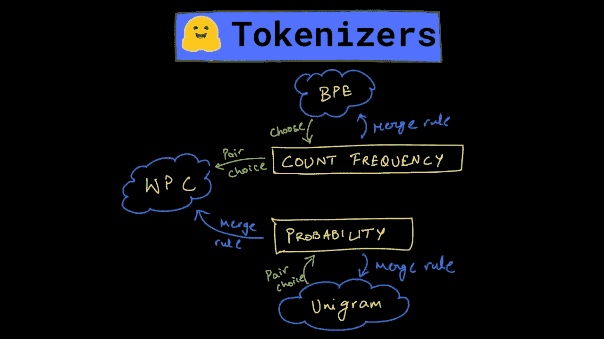
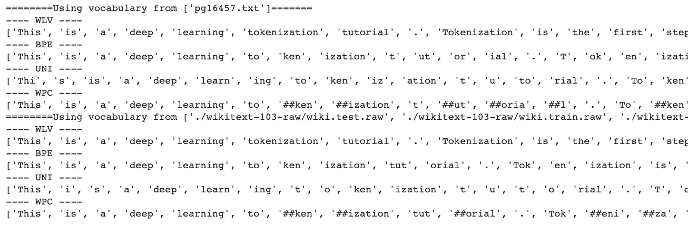
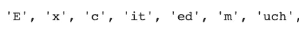
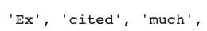
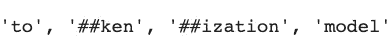
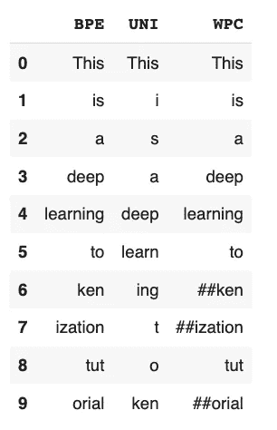
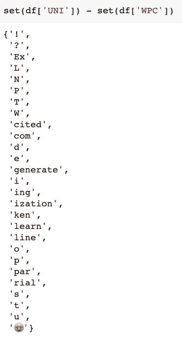

# 使用拥抱脸从头开始训练 BPE、单词块和单字标记器

> 原文：<https://towardsdatascience.com/training-bpe-wordpiece-and-unigram-tokenizers-from-scratch-using-hugging-face-3dd174850713?source=collection_archive---------13----------------------->

## 使用 Hugging Face 的 tokenizers 包比较 SOTA 标记化算法生成的标记



作者图片

继续深入 NLP 的海洋，这篇文章是关于利用**humping Face 的 tokenizers 包从头开始训练 tokenizers。**

标记化通常被认为是 NLP 的一个子领域，但它有自己的[进化故事](https://dswharshit.substack.com/p/the-evolution-of-tokenization-byte)，以及它是如何达到当前阶段的，它正在支撑最先进的 NLP 模型。

在我们开始训练和比较不同的记号赋予器的有趣部分之前，我想给你一个算法之间的关键区别的简要总结。

主要区别在于**选择要合并的字符对**和**合并策略**，这些算法中的每一个用来生成最终的令牌集。

# BPE——基于频率的模型

*   字节对编码使用子字模式的频率将它们列入合并的候选名单。
*   使用频率作为驱动因素的缺点是，最终可能会产生模糊的最终编码，这对新的输入文本可能没有用。
*   在生成明确的令牌方面，它仍有改进的余地。

# unigram——基于概率的模型

*   Unigram 模型通过计算每个子词组合的可能性来解决合并问题，而不是选择最常见的模式。
*   它计算每个子词标记的概率，然后根据损失函数将其丢弃，该损失函数在本研究论文的[中有所说明。](https://arxiv.org/pdf/1804.10959.pdf)
*   基于损失值的特定阈值，您可以触发模型丢弃底部 20–30%的子词标记。
*   Unigram 是一种完全概率算法，它根据概率选择字符对，并最终决定在每次迭代中合并(或不合并)。

# 文字片

*   随着 2018 年 BERT 的发布，出现了一种新的子词标记化算法，称为 WordPiece，可以认为是 BPE 和 Unigram 算法的中介。
*   WordPiece 也是一种贪婪算法，它利用似然性而不是计数频率来合并每次迭代中的最佳配对，但配对字符的选择是基于计数频率的。
*   因此，在选择要配对的字符方面，它类似于 BPE，在选择要合并的最佳字符对方面，它类似于 Unigram。

考虑到算法上的差异，我尝试实现这些算法中的每一个(不是从头开始)，以比较它们各自生成的输出。

# 训练 BPE、Unigram 和 WordPiece 算法

现在，为了对输出进行无偏见的比较，我不想使用预先训练的算法，因为这会将数据集的大小、质量和内容带入图片中。

一种方法可能是使用研究论文从头开始编写这些算法，然后测试它们，这是一种很好的方法，以便真正理解每个算法的工作原理，但你可能会花费数周时间来完成这项工作。

相反，我使用了[拥抱脸的记号赋予器](https://huggingface.co/docs/tokenizers/python/latest/quicktour.html)包，它提供了所有当今最常用的记号赋予器的实现。它还允许我在我选择的数据集上从头开始训练这些模型，然后标记我们自己选择的输入字符串。

## 训练数据集

我选择了两个不同的数据集来训练这些模型，一个是来自古腾堡的免费书籍，作为一个小数据集，另一个是 [wikitext-103](https://blog.einstein.ai/the-wikitext-long-term-dependency-language-modeling-dataset/) ，它是 516M 的文本。

在 Colab 中，您可以先下载数据集并解压缩(如果需要的话)，

```
!wget [http://www.gutenberg.org/cache/epub/16457/pg16457.txt](http://www.gutenberg.org/cache/epub/16457/pg16457.txt)!wget [https://s3.amazonaws.com/research.metamind.io/wikitext/wikitext-103-raw-v1.zip](https://s3.amazonaws.com/research.metamind.io/wikitext/wikitext-103-raw-v1.zip)!unzip wikitext-103-raw-v1.zip
```

## 导入所需的模型和训练器

浏览文档，你会发现这个包的主要 API 是类`Tokenizer.`

然后，您可以用您选择的模型(BPE/ Unigram/ WordPiece)实例化任何记号化器。

在这里，我导入了主类，所有我想测试的模型，以及它们的训练器，因为我想从头开始训练这些模型。

```
## importing the tokenizer and subword BPE trainer
from tokenizers import Tokenizer
from tokenizers.models import BPE, Unigram, WordLevel, WordPiece
from tokenizers.trainers import BpeTrainer, WordLevelTrainer, \
                                WordPieceTrainer, UnigramTrainer## a pretokenizer to segment the text into words
from tokenizers.pre_tokenizers import Whitespace
```

## 自动化培训和令牌化的 3 步流程

因为我需要为三个不同的模型执行有些相似的过程，所以我将这些过程分成三个函数。我只需要为每个模型调用这些函数，我在这里的工作就完成了。

那么，这些函数是什么样子的呢？

## 步骤 1 —准备标记器

准备 tokenizer 需要我们用我们选择的模型实例化 tokenizer 类，但是因为我们有四个模型(还添加了一个简单的单词级算法)要测试，我们将编写 if/else 案例来用正确的模型实例化 Tokenizer。

为了在小型和大型数据集上训练实例化的记号赋予器，我们还需要实例化一个训练器，在我们的例子中，它们是`[**BpeTrainer**](https://huggingface.co/docs/tokenizers/python/latest/api/reference.html#tokenizers.trainers.BpeTrainer)**, WordLevelTrainer, WordPieceTrainer, and UnigramTrainer.**`

实例化和训练将需要我们指定一些特殊的令牌。这些是未知单词的标记和其他特殊标记，我们以后需要使用它们来增加我们的词汇。

您还可以在此指定其他训练参数的词汇大小或最小频率。

```
unk_token = "<UNK>"  # token for unknown words
spl_tokens = ["<UNK>", "<SEP>", "<MASK>", "<CLS>"]  # special tokensdef prepare_tokenizer_trainer(alg):
    """
    Prepares the tokenizer and trainer with unknown & special tokens.
    """
    if alg == 'BPE':
        tokenizer = Tokenizer(BPE(unk_token = unk_token))
        trainer = BpeTrainer(special_tokens = spl_tokens)
    elif alg == 'UNI':
        tokenizer = Tokenizer(Unigram())
        trainer = UnigramTrainer(unk_token= unk_token, special_tokens = spl_tokens)
    elif alg == 'WPC':
        tokenizer = Tokenizer(WordPiece(unk_token = unk_token))
        trainer = WordPieceTrainer(special_tokens = spl_tokens)
    else:
        tokenizer = Tokenizer(WordLevel(unk_token = unk_token))
        trainer = WordLevelTrainer(special_tokens = spl_tokens)

    tokenizer.pre_tokenizer = Whitespace()
    return tokenizer, trainer
```

我们还需要添加一个预标记器来将我们的输入拆分成单词，因为没有预标记器，我们可能会得到重叠几个单词的标记:例如，我们可以得到一个`**"there is"**`标记，因为这两个单词经常相邻出现。

> 使用预标记器将确保没有标记大于预标记器返回的单词。

该函数将返回 tokenizer 及其 trainer 对象，可用于在数据集上训练模型。

这里，我们对所有模型使用相同的预标记器(`Whitespace`)。可以选择用[其他](https://huggingface.co/docs/tokenizers/python/latest/api/reference.html#module-tokenizers.pre_tokenizers)来测试。

## 步骤 2 —培训分词器

准备好记号赋予者和训练者之后，我们就可以开始训练过程了。

这里有一个函数，它将获取我们打算用来训练我们的标记器的文件以及算法标识符。

*   `‘WLV’` -词级算法
*   `‘WPC’` -计件算法
*   `‘BPE’` -字节对编码
*   `‘UNI’` -单字

```
def train_tokenizer(files, alg='WLV'):
    """
    Takes the files and trains the tokenizer.
    """
    tokenizer, trainer = prepare_tokenizer_trainer(alg)
    tokenizer.train(files, trainer) # training the tokenzier
    tokenizer.save("./tokenizer-trained.json")
    tokenizer = Tokenizer.from_file("./tokenizer-trained.json")
    return tokenizer
```

这是我们在训练分词器时需要调用的主要函数，它将首先准备分词器和训练器，然后用提供的文件开始训练分词器。

训练之后，它将模型保存在一个 JSON 文件中，从该文件中加载它，并返回经过训练的标记器，开始对新输入进行编码。

## 步骤 3 —对输入字符串进行标记

最后一步是开始对新的输入字符串进行编码，并比较每个算法生成的标记。

这里，我们将编写一个嵌套的 for 循环，首先在较小的数据集上训练每个模型，然后在较大的数据集上训练，并标记输入字符串。

**输入字符串—** “这是一个深度学习的记号化教程。标记化是深度学习 NLP 管道的第一步。我们将比较每个令牌化模型生成的令牌。很兴奋吗？！😍"

```
small_file = ['pg16457.txt']
large_files = [f"./wikitext-103-raw/wiki.{split}.raw" for split in ["test", "train", "valid"]]for files in [small_file, large_files]:
    print(f"========Using vocabulary from {files}=======")
    for alg in ['WLV', 'BPE', 'UNI', 'WPC']:
        trained_tokenizer = train_tokenizer(files, alg)
        input_string = "This is a deep learning tokenization tutorial. Tokenization is the first step in a deep learning NLP pipeline. We will be comparing the tokens generated by each tokenization model. Excited much?!😍"
        output = tokenize(input_string, trained_tokenizer)
        tokens_dict[alg] = output.tokens
        print("----", alg, "----")
        print(output.tokens, "->", len(output.tokens))
```

**# #输出:**



作者图片

# 输出分析:

查看输出，您将看到令牌生成方式的差异，这反过来导致生成不同数量的令牌。

*   一个简单的**单词级算法**创建了 35 个标记，不管它是在哪个数据集上被训练的。
*   **BPE** 算法在较小数据集上训练时创建了 55 个令牌，在较大数据集上训练时创建了 47 个令牌。这表明，当在更大的数据集上训练时，它能够合并更多的字符对。
*   **Unigram 模型**为两个数据集创建了数量相似(68 和 67)的令牌。但是您可以看到生成的令牌之间的差异:



作者图片

对于更大的数据集，合并更接近于生成更适合编码我们经常使用的真实世界英语语言的标记。



作者图片

*   在较小的数据集上训练时，WordPiece 创建了 52 个令牌，在较大的数据集上训练时，创建了 48 个令牌。生成的标记有两个##，表示标记用作前缀/后缀。



由作者制作的图像

*   当在更大的数据集上训练时，这三种算法都生成了更少和更好的子词标记。

# 比较令牌

为了比较标记，我将每个算法的输出存储在一个字典中，并将它转换成一个数据帧，以便更好地查看标记的差异。

由于每个模型生成的令牌数量不同，我添加了一个<pad>令牌来使数据呈矩形并适合一个数据帧。</pad>

<pad>基本上是数据帧中的 nan。</pad>

```
import pandas as pdmax_len = max(len(tokens_dict['UNI']), len(tokens_dict['WPC']), len(tokens_dict['BPE']))
diff_bpe = max_len - len(tokens_dict['BPE'])
diff_wpc = max_len - len(tokens_dict['WPC'])tokens_dict['BPE'] = tokens_dict['BPE'] + ['<PAD>']*diff_bpe
tokens_dict['WPC'] = tokens_dict['WPC'] + ['<PAD>']*diff_wpcdel tokens_dict['WLV']df = pd.DataFrame(tokens_dict)
df.head(10)
```

**# #输出:**



作者图片

您还可以使用集合来查看标记的差异:



作者图片


作者图片作者图片

所有的代码都可以在这个 [Colab 笔记本里找到。](https://colab.research.google.com/drive/10gwzRY55JqzgeEQOX6nwFs6bQ84-mB9f?usp=sharing)

# 结束想法和后续步骤！

根据生成的标记的种类，WPC 似乎确实生成了在英语中更常见的子词标记，但我并不认为这是一种观察结果。

这些算法彼此略有不同，但在开发一个像样的 NLP 模型方面做得有些类似。但是大部分性能取决于语言模型的用例、词汇量、速度和其他因素。

这些算法的进一步发展是 [SentencePiece 算法](https://arxiv.org/pdf/1808.06226.pdf)，这是一种解决整个标记化问题的有益方法，但这个问题的大部分通过 HuggingFace 得以缓解，甚至更好的是，他们在单个 GitHub repo 中实现了所有算法。

这就结束了标记化算法，下一步是理解什么是嵌入，标记化如何在创建这些嵌入中发挥重要作用，以及它们如何影响模型的性能。

# 参考文献和注释

如果你不同意我的分析或我在这篇文章中的任何工作，我强烈建议你查看这些资源，以准确理解每个算法的工作原理:

1.  [子词正则化:改进神经网络翻译模型](https://arxiv.org/pdf/1804.10959.pdf)使用拥抱脸从头开始训练 BPE、单词块和单字标记器
2.  [具有子词单元的稀有词的神经机器翻译](https://arxiv.org/pdf/1508.07909.pdf) —讨论基于 BPE 压缩算法的不同分割技术的研究论文。
3.  [拥抱脸的 tokenizer 包。](https://huggingface.co/docs/tokenizers/python/latest/quicktour.html)

# 和我联系！

如果你想在数据科学或 ML 领域起步，请查看我的课程 [**数据科学基础& ML**](https://www.wiplane.com/p/foundations-for-data-science-ml) 。

如果你想看到更多这样的内容，并且你不是订阅者，可以考虑订阅[我的简讯](https://dswharshit.substack.com/)。

如有任何补充或建议，您可以通过以下方式联系我:

*   [YouTube](https://www.youtube.com/channel/UCH-xwLTKQaABNs2QmGxK2bQ)
*   [推特](https://twitter.com/dswharshit)
*   [领英](https://www.linkedin.com/in/tyagiharshit/)