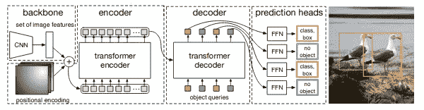
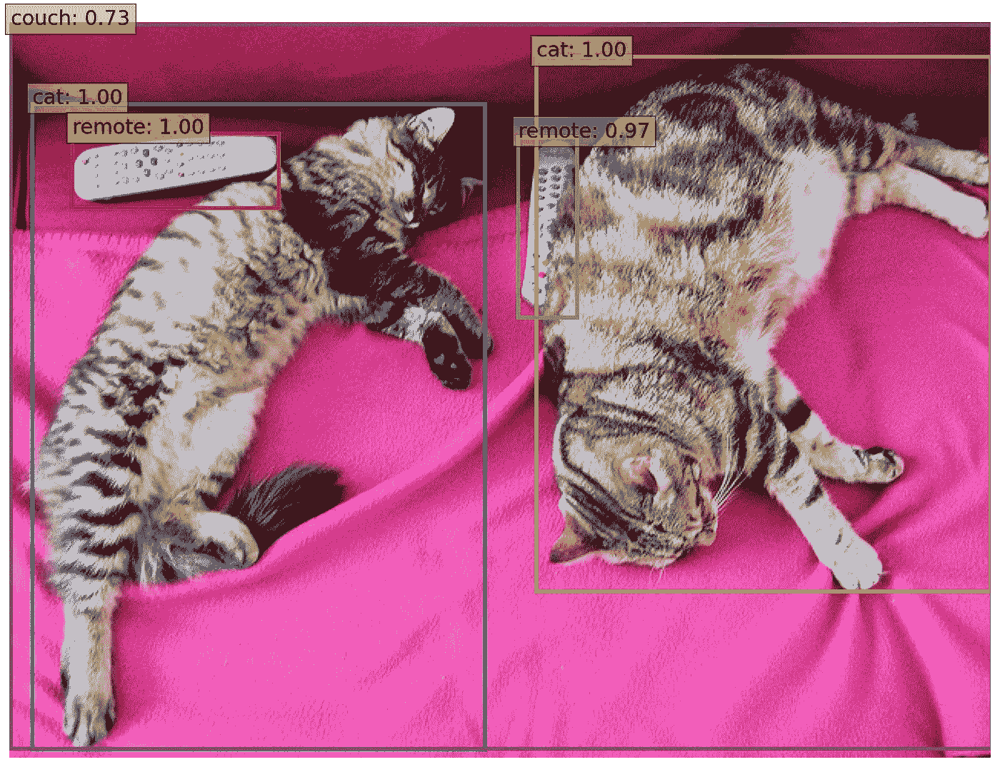
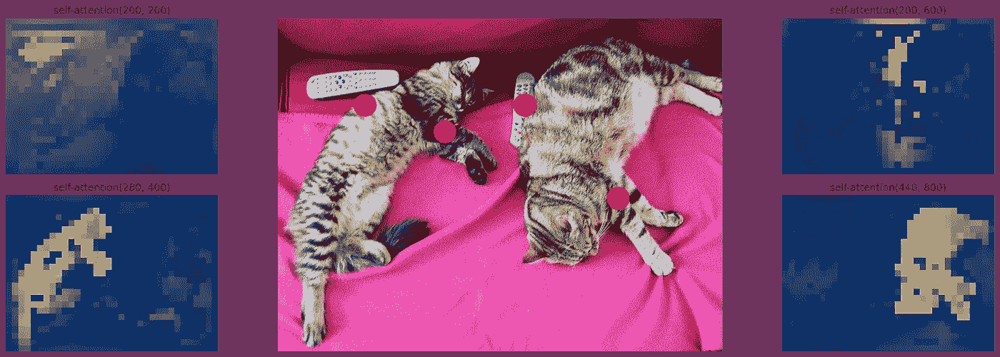
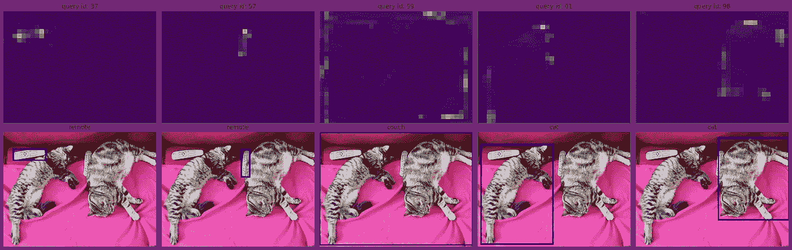
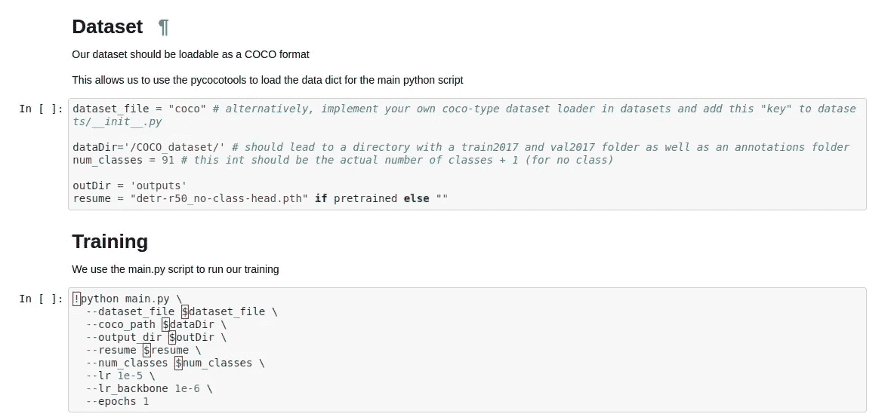

# 在您自己的数据集上训练 DETR

> 原文：<https://towardsdatascience.com/training-detr-on-your-own-dataset-bcee0be05522?source=collection_archive---------8----------------------->

## 什么是 DETR？是什么让它在对象检测算法的世界中脱颖而出？而你是怎么用自己的数据训练它的？

照片由 [note thanun](https://unsplash.com/@notethanun?utm_source=medium&utm_medium=referral) 在 [Unsplash](https://unsplash.com?utm_source=medium&utm_medium=referral) 上拍摄

[DETR](https://ai.facebook.com/research/publications/end-to-end-object-detection-with-transformers)——或检测变压器——是脸书基于深度学习的物体检测解决方案市场的最新成员。简单地说，它利用 transformer 架构来预测图像中的对象及其位置。

## 什么是 DETR？

来源:[https://s content . fbll 1-1 . FNA . FBC dn . net/v/t 39.8562-6/101177000 _ 245125840263462 _ 1160672288488554496 _ n . pdf？_ NC _ cat = 104&CCB = 1-3&_ NC _ sid = ae5e 01&_ NC _ OHC = oki PD 6 ovnkkax 968 fln&_ NC _ ht = s content . fbll 1-1 . FNA&oh = ab 6 dcdc 2307471 a 56 fdbe 2 ebb 98 faf 6b&OE = 606 Abd 47](https://scontent.fbll1-1.fna.fbcdn.net/v/t39.8562-6/101177000_245125840263462_1160672288488554496_n.pdf?_nc_cat=104&ccb=1-3&_nc_sid=ae5e01&_nc_ohc=OKIPD6OvNkkAX968FLn&_nc_ht=scontent.fbll1-1.fna&oh=ab6dcdc2307471a56fdbe2ebb98faf6b&oe=606ABD47)

DETR 是一个联合卷积神经网络(CNN)和变压器，以前馈网络为头。这种架构允许网络使用由 CNN 提取的特征，使用 Transformer 架构中固有的强大多头注意力机制，可靠地推理图像中的对象关系。

来源:[https://colab . research . Google . com/github/Facebook research/detr/blob/colab/notebooks/detr _ demo . ipynb](https://colab.research.google.com/github/facebookresearch/detr/blob/colab/notebooks/detr_demo.ipynb)

简单地说，网络能够估计图像中任何一点与图像其余部分的关系。给定一个样本点，自我注意地图显示周围区域与该点正相关的可能性。在上面的例子中，这意味着尽管有两只猫和两个遥控器，网络的注意力可以通过观察每个区域与其他区域的关系来区分不同的情况。

来源:[https://colab . research . Google . com/github/Facebook research/detr/blob/colab/notebooks/detr _ attention . ipynb](https://colab.research.google.com/github/facebookresearch/detr/blob/colab/notebooks/detr_attention.ipynb)

上图显示了四个样本点和它们的自我关注地图。这些表示网络假定与每个点相关的区域。最终，每个注意力头可以被聚集在一个包含多个边界框和匹配概率分布的解决方案中。该解决方案基于大量的*对象查询*，或自动提供这些样本点的学习位置嵌入。每个输出嵌入通过一个共享的前馈网络，该网络估计上述检测(包围盒和分类概率)或*无对象。*流程结果如下所示:

来源:[https://colab . research . Google . com/github/Facebook research/detr/blob/colab/notebooks/detr _ attention . ipynb](https://colab.research.google.com/github/facebookresearch/detr/blob/colab/notebooks/detr_attention.ipynb)

## DETR 与其他物体探测器有何不同？

所有对象检测算法都有其优点和缺点；R-CNN (及其衍生)是一个两步算法，需要区域提议计算和检测计算。最近的进展，如 [SSD](https://arxiv.org/pdf/1512.02325.pdf) (单次多盒检测器)和 [YOLO](https://arxiv.org/pdf/1506.02640.pdf) (你只看一次)被称为单级物体检测器，因为它们在单次向前传递中计算它们的估计。他们如何实现这一点的细节各不相同，但这些网络的一个共同点是要求“先验知识”。

先验是锚盒、标度、网格大小、重复检测识别算法以及用于降低问题维度的类似技术。它们最终用于对输入进行下采样，或者在某些情况下，用于避免计算量大的区域提议步骤。通过应用这些技术，问题从计算问题转变为人类观察者的问题，因为他们必须在训练开始之前估计和提供这些先验。

相比之下，DETR 是对象检测问题的直接集合解决方案。基于上述学习到的位置嵌入，网络提供了许多估计的边界框和类得分。然而，DETR 并非没有先验信息。例如，在开始训练之前，需要手动设置置信度阈值之前的估计边界框的数量，并且应该“明显大于图像中对象的典型数量”。

## 我如何为自己训练 DETR？

DETR 通常需要非常密集的训练计划。在原始论文中，作者使用 16 个 Nvidia V100 GPUs 在 300 个时期内训练他们的模型，总共超过 3 天的训练时间(在 AWS 大约 4000 美元)。您可以自己尝试一下，但这不是本节的内容。我们对在个人数据集上微调预训练的 DETR 模型感兴趣，可能使用不同于 COCO 的类别数。

我们的 DETR 分叉(在这里找到:[https://github.com/aivclab/detr](https://github.com/aivclab/detr))允许我们通过改变一些关键元素来做到这一点。首先，我们改变模型构建结构以支持任意数量的类。然后，我们将预训练模型的权重(没有类嵌入)提供给构建器。此外，我们将随机变换中图像的最大宽度改为 800 像素。这应该允许在大多数 GPU 上进行训练，但如果您的 GPU 可以处理它，建议改回原来的 1333。默认情况下，我们会将头部的学习速度和主干的学习速度分别降低到 1e-5 和 1e-6，但是您可以自行调整。

根据数据集中的样本数量，最好从头开始重新训练模型。原始 COCO 数据集有超过 200，000 个带注释的图像，超过 150 万个实例，分布在 90 多个类中，因此如果您的数据集具有可比性，它可能会改进您的培训计划，以便在笔记本中设置`pretrained = False`。

笔记本在这里找到:[https://github . com/aivclab/detr/blob/master/fine tune _ detr . ipynb](https://github.com/aivclab/detr/blob/master/finetune_detr.ipynb)

下面的示例参数显示了如何简单地为自己微调这样一个模型:

微调 DETR 很容易。来源:[https://github . com/aivclab/detr/blob/master/fine tune _ detr . ipynb](https://github.com/aivclab/detr/blob/master/finetune_detr.ipynb)

## 结论

DETR 是物体探测领域令人激动的一步。它标志着先验知识的显著减少和简单、易于配置的网络架构。在大多数任务中，它的表现优于速度更快的 R-CNN，而不需要太多专门的额外工作，尽管它仍然比可比的单级对象检测器慢。其简单的结构使其易于根据研究人员提供的强大基线进行重建、实验和微调。

我在 Alexandra Institute 工作，这是一家丹麦非营利公司，专门研究最先进的 it 解决方案。在视觉计算实验室，我们专注于利用最新的计算机视觉和计算机图形研究。我们目前正在探索技术，以允许较小的公司和个人开始深度学习。我们永远欢迎合作！