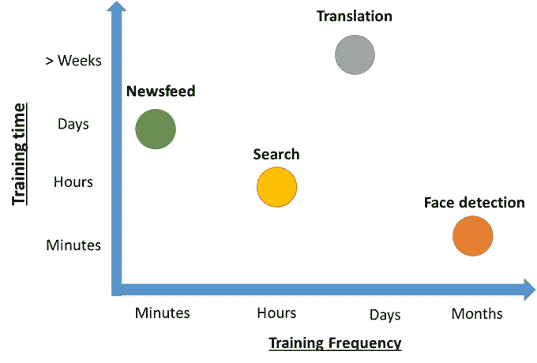
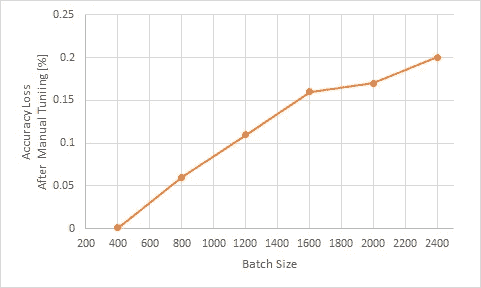

# 脸书深度学习模型的训练效率

> 原文：<https://towardsdatascience.com/training-efficiency-of-deep-learning-models-from-facebook-862816cd20da?source=collection_archive---------56----------------------->

## 影响深度学习推荐模型的关键因素

沙哈达特·拉赫曼在 [Unsplash](https://unsplash.com?utm_source=medium&utm_medium=referral) 上拍摄的照片

在脸书人工智能研究所发表的一项研究中，讨论了深度学习模型的训练效率，展示了与行业和学术界相关的模型架构和物理基础设施的数据。

## 深度学习模型效率的重要性

深度学习模型被科技巨头广泛使用。根据脸书人工智能研究公司的数据，以下公司利用深度学习推荐模型:谷歌、微软、网飞、阿里巴巴、脸书/Instagram。此外，像[特斯拉汽车](https://medium.com/u/24413768aadb?source=post_page-----862816cd20da--------------------------------)和 [Waymo 团队](https://medium.com/u/1e12980dc791?source=post_page-----862816cd20da--------------------------------)这样的公司正在与 [PyTorch](https://medium.com/u/ee766b3488b5?source=post_page-----862816cd20da--------------------------------) 和 [TensorFlow](https://medium.com/u/b1d410cb9700?source=post_page-----862816cd20da--------------------------------) 一起做令人印象深刻的工作。从 Andrej Karpathy 关于特斯拉工作的视频中可以看到特斯拉的一瞥。该视频强调了用海量数据集训练深度学习模型的重要挑战。

## 从脸书人工智能研究看深度学习模型的效率

在论文“[理解深度学习推荐模型在规模上的训练效率](https://ai.facebook.com/research/publications/understanding-training-efficiency-of-deep-learning-recommendation-models-at-scale/)”中，脸书 AI Research 讨论了训练深度学习推荐模型的关键方面和挑战。我绝对鼓励读者深入研究那篇论文。然而，这篇文章似乎是强调那篇论文中发现的几个关键方面的最佳和合适的地方，这些方面可能对机器学习工程师和数据科学家有用。

首先，“并非所有的培训工作流都是相同的”，这直接来自论文，因为它们强调了培训持续时间的差异，这取决于输入模型的数据类型。下图描述了各种工作负载的培训持续时间和培训频率，即新闻馈送、搜索数据、语言翻译和人脸检测。

图片由作者提供，灵感来自[脸书人工智能研究](https://scontent-lht6-1.xx.fbcdn.net/v/t39.8562-6/131560406_687901835242701_1917739773206788224_n.pdf?_nc_cat=108&ccb=2&_nc_sid=ae5e01&_nc_ohc=yZyu43HRcaAAX8cwwc4&_nc_ht=scontent-lht6-1.xx&oh=54cd68df23aba080383370da4fb20c05&oe=602BC3CF)

可以看出，并非所有的训练工作流都是相同的，尽管这是一个相当直观的说法，但理解深度学习模型如何工作的特殊性是有用的。例如，语言翻译比搜索和新闻提要更难训练。

深度学习推荐模型的一个关键挑战是嵌入表格。脸书人工智能研究强调，嵌入表格有很大的内存需求，这激励了行业进一步开发他们的分布式训练系统。如果术语“嵌入表格”不清楚，我推荐读者查看这篇论文以获得进一步的解释([链接到期刊论文](https://research.fb.com/publications/training-with-low-precision-embedding-tables/))。此外，谷歌机器学习速成班提供了一个关于嵌入的很好的教程([链接此处](https://developers.google.com/machine-learning/crash-course/embeddings/video-lecture)

另一个要考虑的重要特征是批量大小。根据 [Goyal 等人(2018)](https://arxiv.org/pdf/1706.02677.pdf%5B3%5D%20ImageNet) 的说法，这是一个关键的超参数，直接影响训练表现和模型质量。总体而言，下图显示了批量大小如何影响[脸书研究](https://medium.com/u/25aae929dbb1?source=post_page-----862816cd20da--------------------------------)的深度学习推荐模型的准确性损失。

图片作者，灵感来自[脸书人工智能研究](https://scontent-lht6-1.xx.fbcdn.net/v/t39.8562-6/131560406_687901835242701_1917739773206788224_n.pdf?_nc_cat=108&ccb=2&_nc_sid=ae5e01&_nc_ohc=yZyu43HRcaAAX8cwwc4&_nc_ht=scontent-lht6-1.xx&oh=54cd68df23aba080383370da4fb20c05&oe=602BC3CF)

可以看出，批量越大，损失值越高。尽管 0.2%的损失看起来微不足道，但该期刊论文已经证明了 0.1-0.2%的损失对于推荐模型来说是不可容忍的(特别是在脸书的规模下)。

## 结束语

最后，我想鼓励读者通读这篇期刊论文，因为它有更多关于深度学习模型的其他挑战的数据，如硬件和系统配置。

总而言之，让我们记住批处理大小和嵌入表是需要记住的事情，至少对于大型数据集是如此。另外，请记住“并非所有的培训工作流程都是相同的”。

感谢您的阅读，感谢您对本文的任何反馈。你可以在我的 [GitHub 页面](https://github.com/manuelsilverio)上看到我在机器学习方面的公开工作，并随时关注我或通过 [LinkedIn](https://www.linkedin.com/in/manuelsilverio/) 联系我。