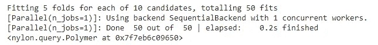
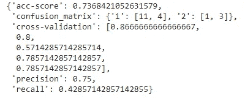

# 仅使用 JSON 训练 ML 模型

> 原文：<https://towardsdatascience.com/training-ml-model-using-just-json-d69eb5d147c4?source=collection_archive---------20----------------------->

## 用尼龙创建自然语言表示的机器学习模型


阿瑟尼·托古列夫在 [Unsplash](https://unsplash.com?utm_source=medium&utm_medium=referral) 上的照片

机器学习建模是一项艰巨的任务，因为首先，我们需要准备数据，执行特征工程，为建模做好准备，然后创建不同的机器学习模型，以找出性能最佳的模型。但是，如果我告诉您，您可以使用 JSON 文件用几行代码完成所有这些工作，会怎么样呢？是的，你没看错。

我们只需要创建一个 JSON 文件，在其中定义目标变量和运行数据所需的模型列表。同样，我们也可以对数据进行预处理，在将数据传递给模型之前对其进行操作。在 JSON 文件中，我们只需要传递我们需要执行的操作的自然语言表示。

Nylon 是一个开源的 Python 库，它使用普通英语以 JSON 语法轻松构建机器学习模型。在这篇文章中，我们将探索尼龙及其功能。

让我们开始吧…

# 安装所需的库

我们将从使用 pip 安装尼龙开始。下面给出的命令可以做到这一点。

```
!pip install nylon
```

# 导入所需的库并创建尼龙对象

在这一步中，我们将导入创建 ML 模型所需的库。在执行任何操作之前，我们只需要初始化一个对象，并传递我们将要处理的数据的路径。在这里，我将向您展示如何创建一个对象并将数据传递给它。

```
from nylon import Polymer
nylon_object = Polymer('/content/diabetes.csv')
```

在这里，您可以看到我已经将数据集的路径作为参数传递给了对象。

# 创建 JSON 代码/文件

我们可以创建一个 JSON 文件或 JSON 风格的代码，用于建模。下面给出的代码创建了这个模型。模型的名称可以用作随机森林的“rf”，梯度下降的“sgd”，等等。

```
json_file = {
    "data": {
        "target": "Outcome"
    },
    "preprocessor": {
        "fill": "ALL",

    },
    "modeling": {
        "type": ["svms", "neighbors", "rf", "mlp","sgd"]
    }
}
```

在这里，您可以看到我们已经传递了目标变量、预处理器和我们需要创建的所有模型。如果我们没有通过任何预处理程序，它会自动处理。通过运行这段代码，我们将能够创建 JSON 文件/代码，之后，我们可以通过传递 JSON 文件来运行 nylon 对象，这将运行模型。

```
nylon_object.run(json_file)
```



来源:作者

# 分析结果

在最后一步中，我们将分析我们创建的所有模型的结果，并查看哪个模型的性能最好。

```
nylon_object.results
```



结果(来源:作者)

在这里，我们可以分析所有模型的结果，并选择性能最佳的模型。尼龙非常容易使用，可以很容易地集成到机器学习工作流中。

继续尝试不同的数据集，并执行机器学习模型。如果您发现任何困难，请在回复部分告诉我。

本文是与 [Piyush Ingale](https://medium.com/u/40808d551f5a?source=post_page-----d69eb5d147c4--------------------------------) 合作完成的。

# 在你走之前

***感谢*** *的阅读！如果你想与我取得联系，请随时联系我在 hmix13@gmail.com 或我的* [***LinkedIn 简介***](http://www.linkedin.com/in/himanshusharmads) *。可以查看我的*[***Github***](https://github.com/hmix13)**简介针对不同的数据科学项目和包教程。还有，随意探索* [***我的简介***](https://medium.com/@hmix13) *，阅读我写过的与数据科学相关的不同文章。**