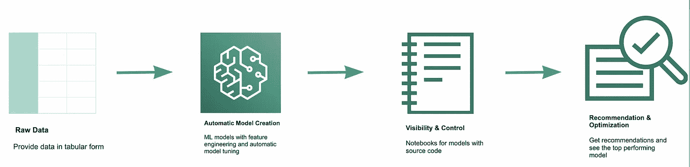
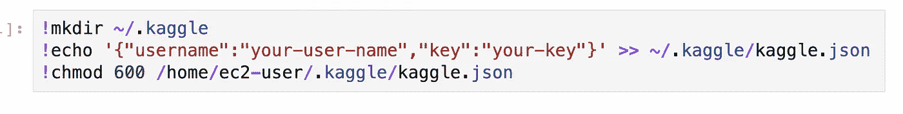
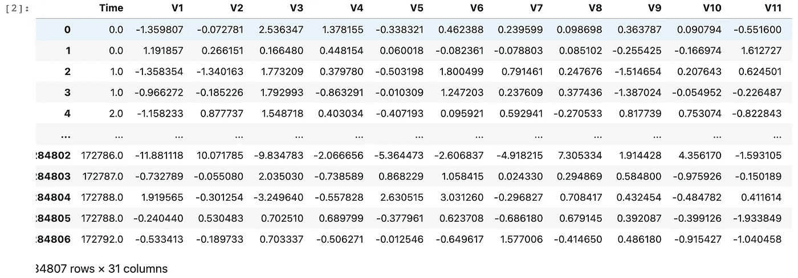
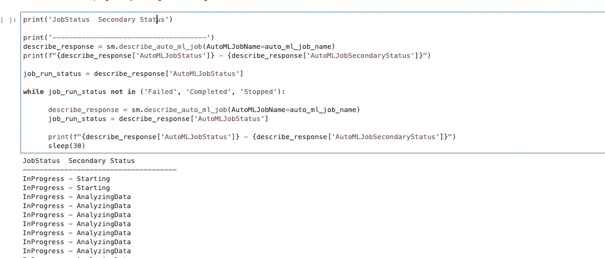
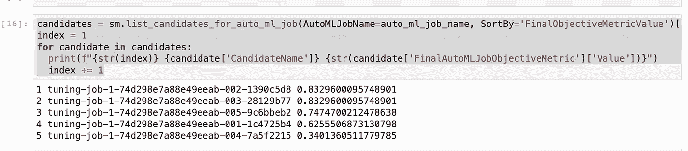
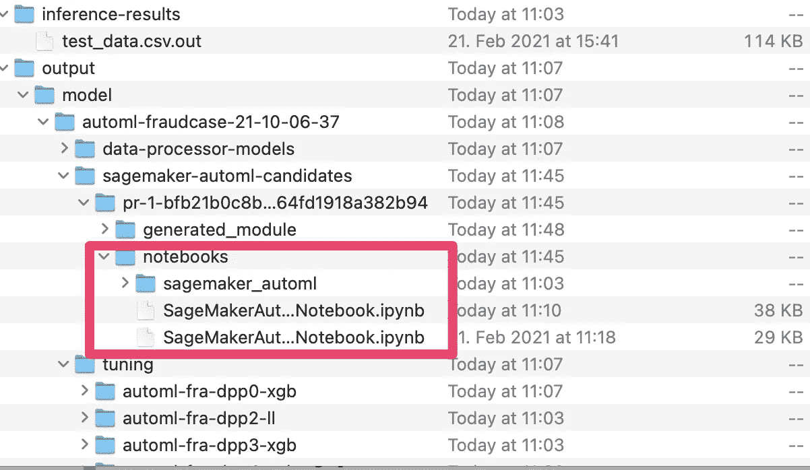

# 使用亚马逊 SageMaker 自动驾驶仪检测信用卡欺诈的训练模型

> 原文：<https://towardsdatascience.com/training-models-to-detect-credit-card-frauds-with-amazon-sagemaker-autopilot-d49a6b667b2e?source=collection_archive---------14----------------------->

## 亚马逊 Sagemaker Autopilot 如何帮助你快速训练模型


米卡·鲍梅斯特在 [Unsplash](https://unsplash.com?utm_source=medium&utm_medium=referral) 上的照片

典型的数据科学项目生命周期经历许多阶段。第一阶段是理解业务和数据，随后是数据准备、模型训练、模型评估和生产部署。这些阶段并不简单。它们乏味、重复，并且仅限于少数有技能的个人，如研究人员、数据科学家和 ML 工程师。

实际上，数据科学家[花大量时间做重复性的](https://cloudzone.io/what-is-automl-and-why-consider-it/)任务，比如清理、寻找和准备用于训练模型的数据。其中一些重复性的任务可以自动化。

对智能系统的需求持续增长，然而大多数组织缺乏资源来满足需求。许多企业都在争夺人工智能(AI)领域的稀缺人才，这一事实只会让情况变得更糟。

所有这些结合在一起使 AutoML 变得必不可少。AutoML 允许你将 ML 自动化并应用于商业问题。它为那些没有理论知识的人提供了 AI 开发的途径。

这篇文章将着眼于亚马逊的 AutoML 产品(亚马逊 SageMaker Autopilot ),并应用它来训练一个检测信用卡欺诈的模型。

如果你正在寻找这篇文章所用代码的 Jupyter 笔记本的链接，请点击[这里](https://github.com/abiodunjames/CreditCardFraudWithSageMakerAutopilot/blob/master/FraudCaseNotebook.ipynb)。

# 亚马逊 SageMaker 自动驾驶仪

[2019 年宣布](https://aws.amazon.com/about-aws/whats-new/2019/12/introducing-amazon-sagemaker-autopilot/)， [SageMaker Autopilot](https://medium.com/@samuelabiodun/training-a-model-to-detect-credit-card-fraud-with-amazon-sagemaker-autopilot-d49a6b667b2e) 是亚马逊的 AutoML 产品，允许你建立、训练端到端的 ML 模型。它通过浏览数据来简化您的任务，找到最适合您的数据的最佳算法，并为模型调整和训练准备数据。

自动驾驶仪为每次试验生成笔记本，因为它试图为你的数据选择最佳算法。这些笔记本显示了数据是如何争论的，以及模型选择过程的细节。这些笔记本还提供指导材料，教你关于训练过程和如何训练你自己的实验。



## 亚马逊 SageMaker 自动驾驶仪的一些好处

SageMaker Autopilot 的一些额外优势包括:

*   ML 模型的自动训练
*   自动特征工程
*   提供培训过程的可见性
*   如何挑选候选人的逐步说明
*   如果需要，您可以灵活地手动调整您的模型
*   您可以从 UI 和 SDK 中使用它，从而为自动化留出空间。

虽然您可以使用 AutoML 来自动化机器学习(ML)过程以实现各种目的，如价格预测、流失预测、风险评估等。在本教程中，我们将使用亚马逊 SageMaker 自动驾驶仪来训练一个检测欺诈交易的模型。

# 亚马逊 SageMaker 自动驾驶仪的自动模型训练

欺诈交易有一些具体特征，可以通过学习将它们与合法交易区分开来。我不会在这篇文章中深入探讨这些特征。我们将使用托管在 [Kaggle](https://www.kaggle.com/mlg-ulb/creditcardfraud) 上的现有公共数据集。该数据集包含 2013 年 9 月欧洲持卡人的信用卡交易。

对于本教程的其余部分，我们将遵循下列步骤:

1.  在亚马逊 SageMaker 上创建一个笔记本
2.  获取数据
3.  检查数据
4.  准备数据
5.  创建一个亚马逊 SageMaker 自动驾驶作业
6.  探索培训结果

## 在亚马逊 SageMaker 上创建新笔记本

登录 AWS 云，创建一个新的笔记本。如果您没有帐户，您可以在这里创建一个新帐户[。](https://aws.amazon.com/resources/create-account/)

## 获取数据

要将数据集下载到您的笔记本，请按照以下说明授予您的笔记本对 Kaggle 的访问权限。

*   登录 [Kaggle](https://www.kaggle.com/)
*   单击您的个人资料图片，然后从下拉菜单中单击帐户。
*   向下滚动到 API 部分。
*   单击“创建新的 API 令牌”按钮，以 JSON 文件的形式下载一个新的令牌，该文件包含用户名和 API 密钥。
*   将 JSON 文件复制到~/。kaggle/该目录如下面的代码示例所示

```
!mkdir ~/.kaggle!echo '{"username":"your-user-name","key":"your-key"}' >> ~/.kaggle/kaggle.json !chmod 600 /home/ec2-user/.kaggle/kaggle.json
```



授予 Kaggle 笔记本访问权限

## 检查数据

用 panda 加载 CSV 数据并检查数据。

```
!kaggle datasets download -d  "arockiaselciaa/creditcardcsv"dataset_path = './creditcard.csv'import pandas as pddf = pd.read_csv(dataset_path)
pd.set_option('display.max_columns', 500)
pd.set_option('display.max_rows', 10)
df
```



## 准备数据集

我们将做一些预处理。在此步骤中，我们将执行以下操作:

*   将数据分成训练和测试数据集
*   将拆分上传至 s3 时段

测试数据将用于稍后执行推理。

```
df = df.drop(['Amount', 'Time'], axis = 1)
train_data = df.sample(frac=0.8, random_state=200)
test_data = df.drop(train_data.index)test_data_no_y = test_data.drop(columns=['Class'])
test_data_no_y.head()
```

将训练数据集上传至 s3

```
train_file = 'train_data.csv'
train_data.to_csv(train_file, index=False, header=True)
train_path = session.upload_data(path=train_file, key_prefix=prefix + "/train")
print(f"Upload file to {train_path}")
```

我们将对测试数据集做同样的事情

```
test_file = 'test_data.csv'
test_data_no_y.to_csv(test_file, index=False, header=False)
test_path = session.upload_data(path=test_file, key_prefix=prefix + "/test")
print(f"Upload file to {test_path}")
```

## 创建亚马逊 SageMaker 自动驾驶作业

为了找到性能最佳的模型，我们首先需要配置自动驾驶仪的工作、输入数据和输出数据。

我们使用下面的代码片段配置自动驾驶仪的工作

```
auto_ml_job_config = {
        'CompletionCriteria': {
            'MaxCandidates': 5
        }
    }input_data_config = [{
      'DataSource': {
        'S3DataSource': {
          'S3DataType': 'S3Prefix',
          'S3Uri': 's3://{}/{}/train'.format(bucket, prefix)
        }
      },
      'TargetAttributeName': 'Class'
    }
  ]output_data_config = {
    'S3OutputPath': 's3://{}/{}/output/'.format(bucket, prefix)
  }from time import gmtime, strftime, sleep
timestamp_suffix = strftime('%d-%H-%M-%S', gmtime())auto_ml_job_name = f'automl-fraudcase-{timestamp_suffix}'
print(f"AutoMLJobName:{auto_ml_job_name}")
```

现在，我们创建实际的自动驾驶仪的工作

```
role = get_execution_role()
sm = boto3.Session().client(service_name='sagemaker',region_name=region)
sm.create_auto_ml_job(AutoMLJobName=auto_ml_job_name,
                      InputDataConfig=input_data_config,
                      OutputDataConfig=output_data_config,
                      AutoMLJobConfig=auto_ml_job_config,
                      RoleArn=role)
```

SageMaker Autopilot 分析数据集，以开发一个应在数据上尝试的 ML 管道列表。它还对数据执行要素工程，例如对每个数据集要素执行要素变换。最后，它执行模型调整，选择性能最好的管道。

您可以使用[*describe _ auto _ ml _ job*API](https://boto3.amazonaws.com/v1/documentation/api/latest/reference/services/sagemaker.html#SageMaker.Client.describe_auto_ml_job)将信息返回给 SageMaker 自动驾驶仪的作业。

我们将利用 *describe_auto_ml_jon* API 来监控正在运行的作业的进度，如下面的代码所示:

```
print('JobStatus  Secondary Status')print('-------------------------------------')
describe_response = sm.describe_auto_ml_job(AutoMLJobName=auto_ml_job_name)
print(f"{describe_response['AutoMLJobStatus']} - {describe_response['AutoMLJobSecondaryStatus']}")job_run_status = describe_response['AutoMLJobStatus']

while job_run_status not in ('Failed', 'Completed', 'Stopped'):

      describe_response = sm.describe_auto_ml_job(AutoMLJobName=auto_ml_job_name)
      job_run_status = describe_response['AutoMLJobStatus']print(f"{describe_response['AutoMLJobStatus']} - {describe_response['AutoMLJobSecondaryStatus']}")
      sleep(30)
```



## **使用最佳候选人**进行批量推断

在训练了一些模型之后，这里，我们将使用 SageMaker 自动驾驶仪提供的最佳候选来执行批量推理工作。步骤如下:

*   从最佳候选中创建模型
*   使用 Amazon SageMaker 自动驾驶作业利用批量推理

您可以使用最佳候选项创建模型，如下所示:

```
model_name = 'automl-fraudcase-model-' + timestamp_suffixmodel = sm.create_model(Containers=best_candidate['InferenceContainers'],
                            ModelName=model_name,
                            ExecutionRoleArn=role)print('Model ARN corresponding to the best candidate is : {}'.format(model['ModelArn']))
```

创建一个匹配转换作业:

```
transform_job_name = 'automl-fraudcase-transform-' + timestamp_suffixtransform_input = {
        'DataSource': {
            'S3DataSource': {
                'S3DataType': 'S3Prefix',
                'S3Uri': test_path
            }
        },
        'ContentType': 'text/csv',
        'CompressionType': 'None',
        'SplitType': 'Line'
    }transform_output = {
        'S3OutputPath': 's3://{}/{}/inference-results'.format(bucket, prefix),
    }transform_resources = {
        'InstanceType': 'ml.m5.4xlarge',
        'InstanceCount': 1
    }sm.create_transform_job(TransformJobName = transform_job_name,
                        ModelName = model_name,
                        TransformInput = transform_input,
                        TransformOutput = transform_output,
                        TransformResources = transform_resources
)
```

最后，您可以看到 Autopilot 试图为您的数据找到最佳算法时生成的模型列表，如下所示:

```
candidates = sm.list_candidates_for_auto_ml_job(AutoMLJobName=auto_ml_job_name, SortBy='FinalObjectiveMetricValue')['Candidates']
index = 1
for candidate in candidates:
  print(f"{str(index)} {candidate['CandidateName']} {str(candidate['FinalAutoMLJobObjectiveMetric']['Value'])}")
  index += 1
```



## 生成的笔记本

亚马逊 SageMaker Autopilot 生成笔记本，让你深入了解训练过程以及模型是如何选择的，如前所述。



你可以在这里找到生成的笔记本。

## 参考

[信用卡欺诈数据集](https://www.kaggle.com/mlg-ulb/creditcardfraud)
[亚马逊 SageMaker 示例](https://github.com/aws/amazon-sagemaker-examples)