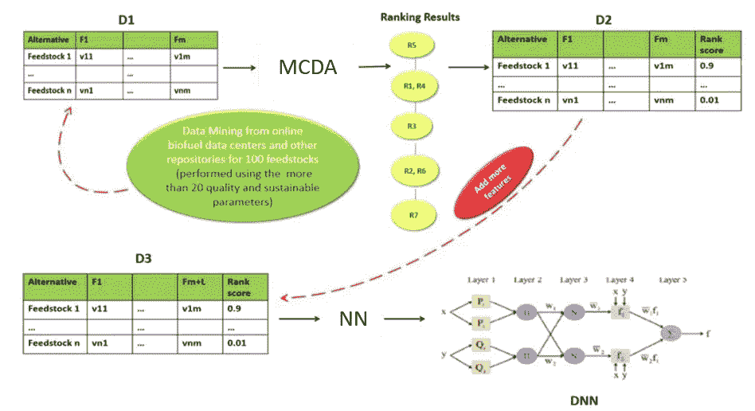
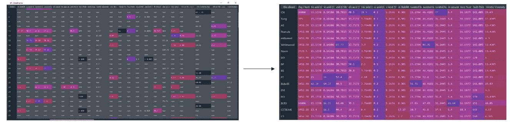
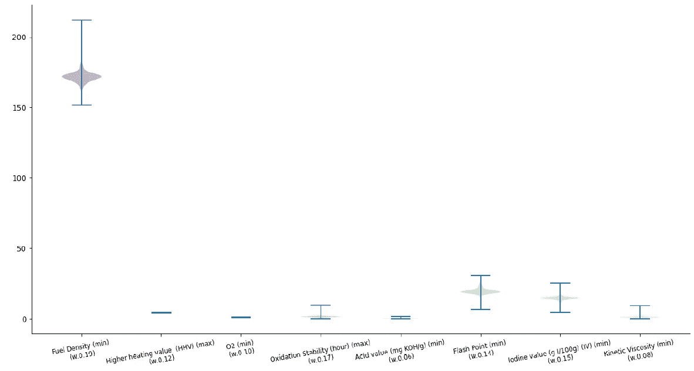
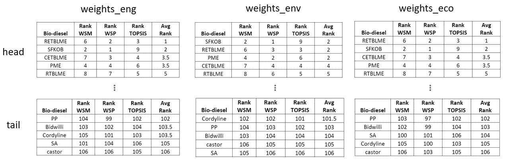
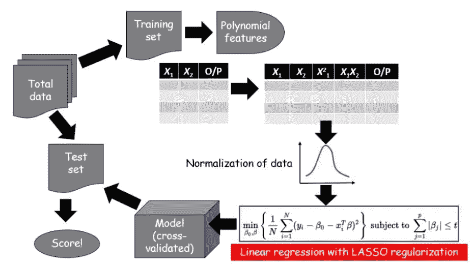
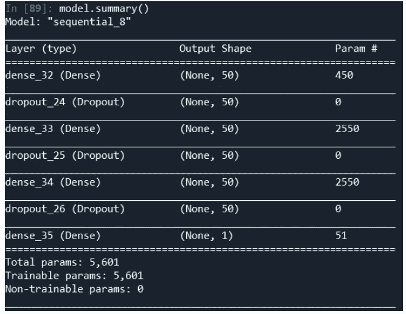
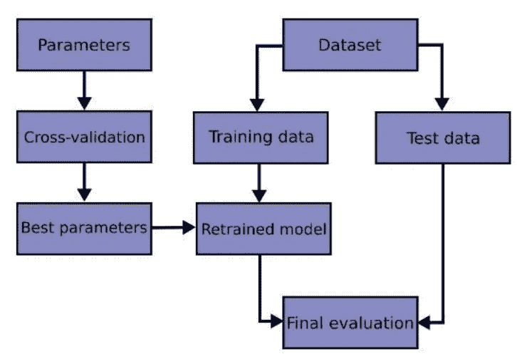
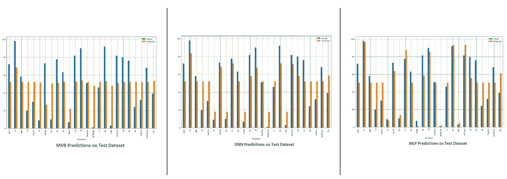
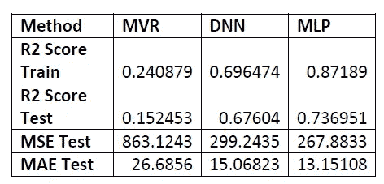

# 训练神经网络来预测排名

> 原文：<https://towardsdatascience.com/training-neural-networks-to-predict-rankings-8a3308c472e6?source=collection_archive---------4----------------------->

## 根据人工智能模型对多标准决策分析排序数据的预测做出决策

您必须处理结构化数据并对您的“选项”进行排序的情况有多常见？更困难的是，如果你的数据不完整，你只能用你仅有的少量数据来预测排名，你会如何处理这个问题？

在这篇文章中，我将与你分享我对一个迭代过程的经验，这个过程导致了一个系统的和令人满意的方法来排列选项。在这里，我向您展示了一个应用于生物燃料相关问题和数据集的例子，但是该方法可以推广到其他类型的数据集。

由[乔舒亚·戈德](https://unsplash.com/@joshgmit?utm_source=medium&utm_medium=referral)在 [Unsplash](https://unsplash.com?utm_source=medium&utm_medium=referral) 上拍摄的照片

# 介绍

人类在本世纪面临的挑战之一是从化石燃料能源转向可再生能源。生物燃料是解决油价持续上涨、温室气体减排和石油储备枯竭的少数几种方法之一。为了生产出质量合格的生物燃料，并确保其生产的可持续性，我们面临着一个挑战，即在给定的地点找到合适的原料。

如今，科学家已经报道了几种植物物种在生物燃料生产中的潜在用途。然而，到目前为止，还没有人对这些原料的所有需要测试的特性进行评估，包括燃料特性、发动机性能、排放特性、生产潜力等。用于评估生物柴油质量的参数由澳大利亚的[燃料质量标准(生物柴油)测定 2019](https://policy.asiapacificenergy.org/node/4082) 和欧洲的[欧洲标准 EN 14214](https://www.en-standard.eu/din-en-14214-liquid-petroleum-products-fatty-acid-methyl-esters-fame-for-use-in-diesel-engines-and-heating-applications-requirements-and-test-methods-includes-amendment-2019/) 建立。十六烷值、每公顷作物产量或闪点是这些重要参数的三个例子。其他重要参数是生产效率，如油转化为生物柴油的转化率、含油量或产量。然而，这些参数在很大程度上取决于原料位置，因此，一个地区的完美解决方案可能与另一个地区的不同。

 [## 多准则设计矩阵在生物柴油原料选择中的有效性

### 筛选非食用生物柴油原料的多准则决策分析。*核果仁制成的生物柴油…

www.sciencedirect.com](https://www.sciencedirect.com/science/article/abs/pii/S0196890419307721) 

总的来说，我们最终得到了一个涵盖数百个不同选项的 20 多个参数的数据集，但是我们如何为这些选项创建决策排序呢？

# 方法

本文将探索一种新颖的方法来对所谓的原料数据进行排序。使用 Scopus 和其他来源进行数据挖掘，收集的数据将被馈送到[深度神经网络](https://en.wikipedia.org/wiki/Deep_learning#:~:text=A%20deep%20neural%20network%20(DNN,weights%2C%20biases%2C%20and%20functions.) (DNN)系统，以预测原料的排名。

*这是怎么回事？*

这个想法是选择原料属性(信息最丰富的属性)，并使用选择的原料设计一个[多标准决策分析](https://en.wikipedia.org/wiki/Multiple-criteria_decision_analysis) (MCDA)排序方法来对我们的选项进行排序。该步骤的输出是数据集中代表每种原料等级的附加列。在此过程中，超过 20 个生物燃料参数(例如含油量、油特性、生物柴油特性，包括十六烷值等。)用于 106 种原料。我们使用等级数据来训练 DNN 系统，该系统可用于基于全套属性对新的(看不见的)原料集合进行分级。

如前所述，原料特性非常依赖于位置，因为它们受农业气候特征(如降雨量、温度、光照强度等)的影响很大。然后，通过替换 DNN 算法中的农业气候参数，可以将提议的方法/模型部署到其他位置，从而根据位置变化模拟产生预测。

MCDA 进程用于设置不同属性之间的优先级，它基于三个原则:

*   模型的结构
*   数据的比较判断
*   优先事项综合

三种技术用于创建排名，即[加权求和模型](https://en.wikipedia.org/wiki/Weighted_sum_model)(WSM)[加权乘积模型](https://en.wikipedia.org/wiki/Weighted_product_model) (WPM)和 [TOPSIS](https://en.wikipedia.org/wiki/TOPSIS) 。

通过使用合适的深度学习方法来预测排名输出，并且随机选择数据用于训练和测试。使用了几种递增的详细技术，包括[多变量回归](https://brilliant.org/wiki/multivariate-regression/) (MVR)、深度神经网络(DNN)和(前馈)[多层感知器](https://en.wikipedia.org/wiki/Multilayer_perceptron#:~:text=A%20multilayer%20perceptron%20(MLP)%20is,artificial%20neural%20network%20(ANN).&text=An%20MLP%20consists%20of%20at,uses%20a%20nonlinear%20activation%20function.) (MLP)，最后选择最佳执行模型。

MCDA+神经网络模型可用于对未知/看不见的原料进行排序，以测试它们在给定位置对生物燃料生产的适用性。

MCDA +神经网络系统

# 多标准决策分析(MCDA)

到这一点，如果你还和我在一起(lol)，你可能会对问题和建议的方法有清晰的认识。

现在，最有趣的是，我们可以深入了解解决方案。

要开始，需要进行一些数据清理和格式化…

数据预处理后，我们可以看到大部分 NaN 单元格(左图灰色单元格)被填充…

数据预处理

一旦对数据进行了清理和预处理，就需要选择将哪些标准包含在 MCDA 中进行排名。

换句话说，我们必须决定哪些标准会影响我们的决策。

根据我们的数据完整性和行业标准，我们选择了 8 个相关标准来创建原料等级，并为每个标准分配了一个最小值或最大值标志，以确定是最小化还是最大化每个标准。

显示所选标准分布的小提琴图

所选择的标准属于不同的类别，即生物柴油特性、发动机性能和发动机排放。为了决定如何对我们的数据进行排序，必须根据上述标准分配权重。

然而，权重可能取决于您选择用来对决策进行排序的方法。例如，基于环境友好性的分级决策可能不一定与优化发动机性能的决策相同，或者类似地，优化经济性的决策分级可能不提供发动机性能的最佳解决方案，等等。

为了考虑这些方面，需要根据我们的决策类别建立一组不同的权重。

选择三组权重，即'*发动机*'、*环境*'和'*经济*。每组优先考虑一个特定的方面，按照这种方式，排名系统是根据优先考虑发动机、环境还是经济来指定的。在下面的例子中，我们选择*权重=weights_eco* 。

此后，包括所选标准的新的“*决策*数据框架被创建。使用 WSM、WPM 和 TOPSIS 计算决策等级，最后将它们连接到我们的“*决策*数据框架中。

通过在*数据*变量中使用不同的权重重复上述过程，获得以下等级表示。

决策等级

正如所料，它们之间有一些相似之处，但是权重的选择对决策排序有影响。生成一个决策等级数据集，它将用作训练神经网络的*基础事实*。

# 神经网络

首先，通过再次选择相关标准进行一些数据准备，然后初始化精度矩阵，并在训练神经网络时填充该矩阵…

## **1。多变量回归(MVR)**

在直接进入“更深”的网络之前，尝试使用一种 MVR 方法，更具体地说是一种 [**最小绝对收缩和选择算子**](https://en.wikipedia.org/wiki/Lasso_(statistics)) ，在文献中称为 LASSO。决策标准被设置为因变量(X ),等级被设置为目标变量(Y)。进行几次迭代来调整套索参数，然后训练一个模型。R2 评分、MSQE 和 MAE 的准确性数据记录在准确性矩阵中。

MVR 的工作流程

## 2.自定义深度神经网络(DNN)

结果并不真正令人满意。为了改进我们的结果，我们对数据进行了简单的统计分析，以去除异常值。

然后，使用排除了异常值的新集合再次确定 X 和 Y 变量。数据在被送入 7 层 **DNN** 模型之前进行缩放，其架构如下所示。与 MVR 类似，模型的准确性根据 R2 评分、MSQE 和 MAE 进行评估，结果存储在准确性矩阵中。

DNN 模式总结

## 3.多层感知器(MLP)

尽管事实上 DNN 的实验是成功的，因为它显示出比 MVR 更好的性能，我试图拟合 MLP 回归到数据集。使用穷举网格搜索调谐(或交叉验证)[超参数，以找到用于训练 MLP *的*“最佳参数】*。*](https://learning.oreilly.com/library/view/mastering-predictive-analytics/9781789617740/231cc752-8164-4248-9557-26d1adb4623a.xhtml)

MLP 工作流程

# 结果

在实现和训练之后，通过对训练集和测试集的预测来评估上述三个模型的性能。来自 MVR、DNN 和 MLP 的预测条形图报告如下。接着，还报告了精度矩阵。

总的来说，所获得的结果是令人满意的，并且在该方法的发展中注意到了明显的改进。

测试集上的预测

准确度矩阵

如果你对复制我的相同结果感兴趣，你可以在我的个人 [GitHub](https://github.com/quaesito/mcda-nn) 的回购中找到完整的脚本。

给回购打个星:)

# 经验教训

通常很难找到现成的 git-ready 解决方案来满足您特定的决策科学问题。我们回顾了从结构化数据预测排名的 MCDA+神经网络方法的框架和结果。该方法可推广到任何类型的结构化数据。然而，这种方法需要对问题的解释和理解来为你的决策建立权重。我相信这是一个 *pro* ，因为它允许用户根据自己的喜好定制决策等级，但它也是一个 *con* ，因为它需要手动调整权重。

你怎么想呢?

如果你在数据科学和/或人工智能项目上需要任何帮助，请随时通过 [Linkedin](https://www.linkedin.com/in/micheledefilippo/) 或 [midasanalytics.ai](http://midasanalytics.ai/) 联系我