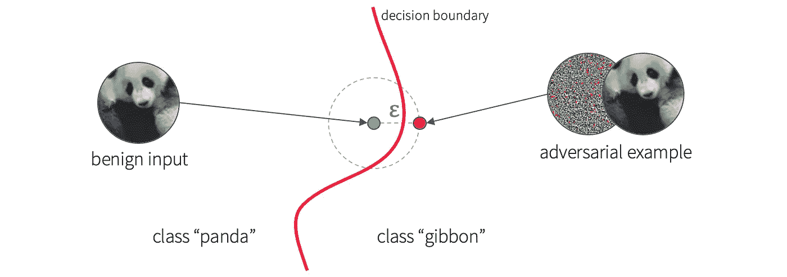
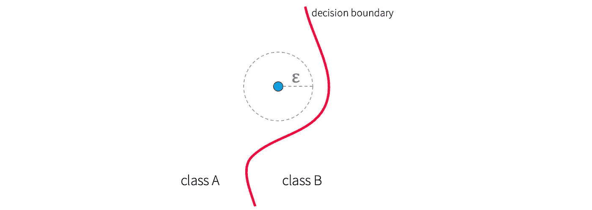
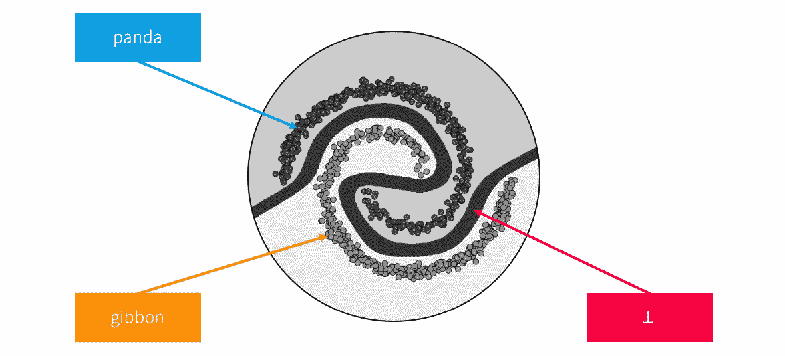
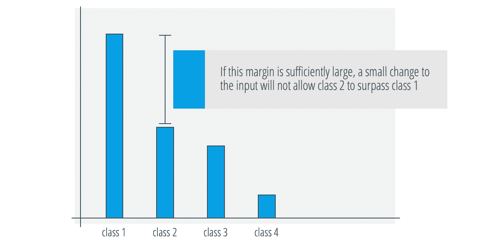
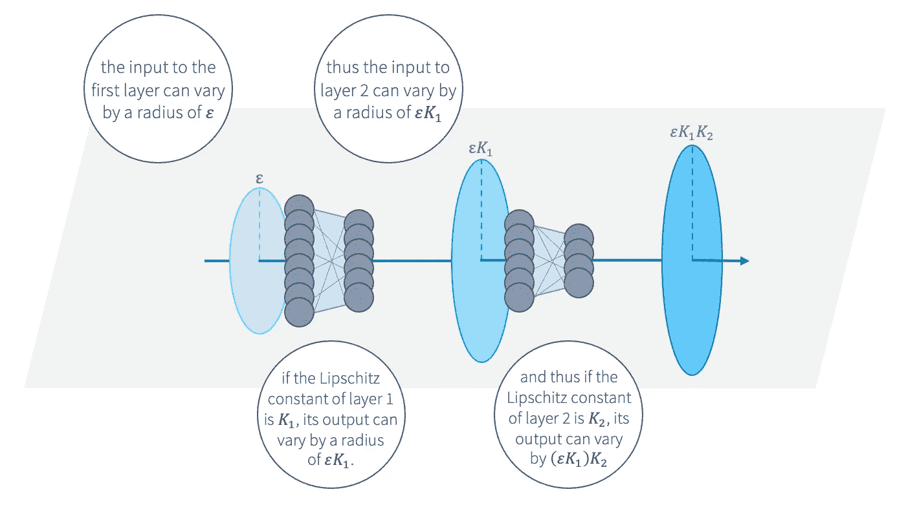

# 训练可证明鲁棒的神经网络

> 原文：<https://towardsdatascience.com/training-provably-robust-neural-networks-1e15f2d80be2?source=collection_archive---------14----------------------->

## [思想和理论](https://towardsdatascience.com/tagged/thoughts-and-theory)

## 用 GloRo 网防御对抗的例子


由[恩里克·费雷拉](https://unsplash.com/@rickpsd?utm_source=medium&utm_medium=referral)在 [Unsplash](https://unsplash.com?utm_source=medium&utm_medium=referral) 上拍摄的照片

在过去的几年中，深度网络已经被广泛地证明容易受到攻击者的攻击，攻击者可以简单地通过向网络提供恶意扰乱的输入来导致网络犯下令人困惑的错误。显然，这为部署在野外的神经网络提出了具体的安全问题，特别是在安全关键的设置中，例如在自动车辆中。反过来，这激发了大量关于实际防御的工作，从攻击检测策略到旨在产生难以(或不可能)攻击的网络的修改后的训练例程。在这篇文章中，我们将看看我和我在 CMU 的同事们设计的优雅而有效的防御(出现在 ICML 2021 中)，它修改了神经网络的架构，以自然地提供可证明的针对某些类别攻击的*鲁棒性*保证——在测试期间没有额外的成本。

我们将受我们的方法保护的神经网络家族称为“GloRo 网”(用于“ **gl** 全球- **ro** 半身像网络”)。对于那些对本文提出的想法感兴趣的人来说，一个用于构建和训练 GloRo 网的库在这里[是公开可用的](https://github.com/klasleino/gloro)。

# 动机:对立的例子

尽管深度神经网络由于其令人印象深刻的理解大量高维数据并归纳出看不见的数据点的能力而迅速成为机器学习的代表，但早在 2014 年，研究人员就开始注意到，深度网络很容易通过对其输入进行难以察觉的修改而被愚弄。这些成功导致错误行为的干扰输入被称为*对抗示例*。下面是一个典型的对抗性例子。


一个典型的对抗性例子，改编自 [Goodfellow 等人](https://arxiv.org/pdf/1412.6572v1.pdf)【2】，其中一幅熊猫的图像被不知不觉地操纵，以欺骗神经网络预测“长臂猿”。

一般来说，对于被认为是敌对示例的输入，它应该*类似于*一个类别(例如，“熊猫”)，而被网络分类为另一个类别(例如，“长臂猿”)。这表明对输入的扰动应该是语义上无意义的*。这个要求相当模糊，并且与人类的感知有着内在的联系；这可能意味着变化对人眼来说是察觉不到的，或者仅仅是在给定的上下文中它们是*不明显的*。因此，我们经常考虑更明确定义的对立例子的规范；最常见的是，*小规范对抗性例子*。*

*一个相反的例子是*小范数*，如果它与原始输入的距离(根据某种度量，例如欧几里德距离)低于某个小阈值，通常用ε表示。从几何角度来看，这意味着原始点位于模型中的决策边界附近，如下图所示。就感知而言，当ε足够小时，与原始输入ε接近的任何点都将在感知上与原始输入无法区分，这意味着小范数对立示例符合我们对对立示例的更广泛要求。*

**

*小范数对立例子的几何解释。图片作者。*

*虽然对立例子存在背后的确切原因不是本文的重点，但一些高层次的直觉可能会给出为什么这种现象在深层网络中如此普遍的一点想法。本质上，我们可以考虑网络的*决策面*，它将网络的输出映射为其输入的函数。如果决策面在某个方向上很陡，当输入在那个方向上稍有改变时，网络会迅速改变它分配给输入的标签。由于深度网络通常在非常高维的空间(通常是数千维)中运行，因此存在许多不同的方向，在这些方向上，决策面可能是陡峭的，这使得任何点都有可能接近意外的“悬崖”。*

# *防御敌人*

*已经提出了许多防御措施来处理对抗性例子的威胁——尤其是小规范对抗性例子。虽然这些方法中有许多本质上是启发式的——也就是说，它们*不*保证告诉我们模型的预测何时或是否不能被操纵——但在最安全的应用中，这可能还不够好。出于我们的目的，我们对*可证明的*防御感兴趣。*

*第一个问题是，我们到底想证明什么？在小范数对抗例子的情况下，我们所追求的性质就是所谓的*局部鲁棒性*。一个点上的局部鲁棒性， *x* 规定距离 *x* 为ε的所有点被赋予与 *x* 相同的标号。从几何学上讲，这意味着围绕 *x* 的半径为ε的球保证没有任何决策边界，如下图所示。根据这种直觉，应该清楚的是，局部鲁棒性排除了从 *x* 导出对立示例的可能性。*

**

*局部鲁棒点的几何解释(以蓝色显示)。图片作者。*

*顾名思义，局部鲁棒性是*局部*的意思，它适用于单个点的邻域 *x* 。但是，对于整个网络来说，这意味着什么呢？通过检查，我们看到任何有趣的网络不可能在所有地方都是局部鲁棒的:如果所有点都远离决策边界，将没有地方放置边界，因此网络将不得不在所有地方进行相同的预测——这不是一个非常有趣的网络。*

*这表明，我们可能需要接受网络在某些地方不够健壮；只要网络在我们关心的地方——数据覆盖的区域——是健壮的，这就不是问题。因此，我们将认为一个模型是健壮的，只要在边界上有一个宽度至少为ε的边缘，将输入空间中被赋予不同标签的区域分开。*

*下图显示了健壮模型的一个示例。边缘(以黑色显示)本质上是一个“无人区”，模型通过用一个特殊的标签⊥(“底部”，一个有时用来表示空值的数学符号)来标记这些点，从而表明这些点不是*而不是*局部鲁棒的。理想情况下，没有“真实的”数据点(例如，训练点、验证点等。)躺在这无人区。*

**

*稳健模型决策面的可视化。这些类由宽度为ε的边距(标记为⊥)分隔开。图片作者。*

# *构建全局鲁棒网络*

*GloRo Nets 背后的关键思想是，我们希望以这样一种方式构建网络，即自动在边界上强加一个边界*。**

**神经网络分类器的输出通常是所谓的 *logit* 向量，每个可能的输出类包含一个维度(即一个 logit 值)。网络通过选择对应于最高 logit 值的类来进行预测。**

**当我们跨越决策边界时，一个 logit 值将超过之前的最高 logit 值。因此，*决策边界对应于最高 logit 输出*出现平局的点。为了沿着边界创建边距，我们本质上想要加厚边界。每当两个最高的对数太接近时，我们可以通过声明平局来做到这一点；也就是说，除非一个 logit 超过其他 logit 至少δ，否则我们将认为该决定是平局。**

**我们可以让平局的情况对应于⊥类。这将创建一个无人区，根据需要将其他职业分开。但仍需确保该区域的宽度始终至少为ε(在输入空间中)。为此，我们将利用网络的*李普希兹常数*。**

## **利用 Lipschitz 常数**

**一个函数的*李普希兹常数*告诉我们当它的输入改变时，函数的输出可以改变多少。直观上，我们可以认为它是函数的最大斜率或变化率。**

**因此，如果一个函数的 Lipschitz 常数是 *K* ，那么*该函数的*输出*最多可以改变，如果其*输入*总共改变了ε，则ε *K* 。我们将利用这一事实在我们的网络决策面上强加一个正确宽度的余量。***

*由于神经网络实际上只是一个高维函数，所以我们也可以考虑神经网络的 Lipschitz 常数。为了简单起见，我们将每个 logit 值视为具有其自己的 Lipschitz 常数的不同函数(这将足以解释 GloRo 网络如何工作，但是该分析可以通过对整个网络的 Lipschitz 常数进行稍微更复杂的计算来加强；我们[论文的附录](https://arxiv.org/pdf/2102.08452.pdf)提供了这些技术细节)。*

*我们现在回到我们之前的直觉，通过一个例子来演示如何构建 GloRo 网。*

*假设我们有一个在四个类之间进行预测的网络，它产生如下所示的逻辑。如果类别 1 和类别 2 的 logits 之间的差异足够大，则类别 2 将无法超过类别 1(类似地，类别 3 和类别 4 也是如此)。*

**

*图片作者。*

*如前所述，Lipschitz 常数告诉我们，当输入在半径ε内受到扰动时，每个 logit 可以移动多少。通过考虑等级 1 可以*减少*的量，以及每个其他等级可以*增加*的量，我们可以计算每个等级在预测等级(等级 1)上可以*增加*的量。然后，我们插入一个新的 logit 值，对应于⊥类，在考虑了每个类可以移动多少后，基于最具竞争力的类将其值取为类 1。*

*因此，我们有以下重要的性质:如果⊥ logit 在给定点是*而不是*最大 logit，那么我们*保证*该模型在该点是局部稳健的。另一方面，如果⊥ logit *是*最大 logit，网络将根据需要预测⊥，指示该点位于类之间的边缘。*

**

*GloRo 网是如何构建的插图。红色箭头表示 1 级在ε半径内可以减少的最大量。橙色箭头表示类别 2、3 和 4(分别)在ε半径内可以增加的最大量。红色和橙色条结合起来给出了量δ，第 1 类必须超过其他类，以确保输入空间中的ε-余量。图片作者。*

## *近似 Lipschitz 常数*

*虽然计算神经网络的精确 Lipschitz 常数在计算上是一个非常困难的问题，但是我们可以通过分解计算一次考虑一层来相当容易和有效地获得 Lipschitz 常数的上界*。本质上，我们可以将每个单独层的 Lipschitz 常数相乘，以获得整个网络的界限。下图直观地说明了这种方法的工作原理。**

**

*如何推导网络 Lipschitz 常数的逐层上界的图示。图片作者。*

*有趣的是，虽然这个界限在典型的网络上通常会非常松散——也就是说，它会极大地高估 Lipschitz 常数——因为界限计算被合并到学习目标中(下文对此有更多描述)，但即使这个天真的逐层界限在 GloRo 网络上也相当紧密，GloRo 网络不是“典型”网络。这意味着使用 Lipschitz 常数的简单计算实际上是一种有效的方法，可以在类别之间施加足够的余量，以获得*可证明的*鲁棒性。*

*此外，在训练之后，Lipschitz 常数将保持固定。这意味着测试时认证不需要任何额外的计算来计算 Lipschitz 界限，使得认证*实质上是免费的。*与其他鲁棒性认证方法相比，这是一个主要优势，其他方法通常需要昂贵的计算来获得鲁棒性保证。*

## *自然地捕捉一个强健的目标*

*方便的是，我们将⊥区域编码为一个额外的类的方式允许我们训练 GloRo 网来非常容易地优化可证明的鲁棒性。这一事实的关键在于，在 GloRo 网络中，*鲁棒性是由精度*来捕捉的。本质上，由于⊥在我们的标记数据上从来不是正确的类，通过训练网络变得准确(正如我们通常所做的)，它避免了选择⊥，这反过来意味着它避免了不稳健。*

# *带有代码的说明性示例*

*我们现在来看一个 GloRo Nets 的例子(要互动地跟随，请查看[这个笔记本](https://colab.research.google.com/drive/1Z6Zrnfp9caRN3OPYy306MfnCdGEx5OCT?usp=sharing))。TensorFlow/Keras 中实现 GloRo Nets 的库在这里[可用](https://github.com/klasleino/gloro)；它也可以与 pip 一起安装:*

```
*pip install gloro*
```

*使用`gloro`库，我们会看到 GloRo 网构造和训练都很简单；它们为可认证的健壮模型实现了最先进的性能[1]。*

*我们将使用手写数字的 [MNIST](http://yann.lecun.com/exdb/mnist/) 数据集作为例子。这个数据集可以通过`tensorflow-datasets`轻松获得。*

```
*import tensorflow as tf
import tensorflow_datasets as tfds# Load the data.
(train, test), metadata = tfds.load(
    'mnist',
    split=['train', 'test'],
    with_info=True,             
    shuffle_files=True,
    as_supervised=True)# Set up the train and test pipelines.
train = (train
    .map(lambda x,y: (tf.cast(x, 'float32') / 255., y))              
    .cache()
    .batch(512)) test = (test
    .map(lambda x,y: (tf.cast(x, 'float32') / 255., y))              
    .cache()
    .batch(512))*
```

*我们首先定义一个简单的卷积网络。用`gloro`库构建 GloRo 网络看起来和在 Keras 中完全一样；唯一的区别是我们用`GloroNet`类(而不是默认的 Keras `Model`类)实例化它，这需要我们指定一个鲁棒性半径`epsilon`。虽然`GloroNet`模型类开箱即用地兼容任何 1-Lipschitz 激活函数(包括 ReLU)，但我们发现对相邻神经元进行排序的`MinMax`激活效果最好(原因超出了本文的范围)。*

```
*from gloro import GloroNet
from gloro.layers import MinMax
from tensorflow.keras.layers import Conv2D
from tensorflow.keras.layers import Dense
from tensorflow.keras.layers import Flatten
from tensorflow.keras.layers import Inputx = Input((28, 28, 1))z = Conv2D(
    16, 4, 
    strides=2, 
    padding='same',
    kernel_initializer='orthogonal')(x)
z = MinMax()(z)z = Conv2D(
    32, 4, 
    strides=2, 
    padding='same', 
    kernel_initializer='orthogonal')(z)
z = MinMax()(z)z = Flatten()(z)    
z = Dense(100, kernel_initializer='orthogonal')(z)
z = MinMax()(z)y = Dense(10, kernel_initializer='orthogonal')(z)g = GloroNet(x, y, epsilon=0.3)*
```

*然后我们可以编译这个模型。GloRo-Net 兼容的损失函数有几个选择，包括标准分类交叉熵，但我们通常发现`Trades`损失(在`gloro.training.losses`中找到)效果最好(不同损失函数的细节不在本文范围内)。*

*我们还发现`clean_acc`和`vra`度量对于跟踪进度很有用。*净精度*是忽略余量时模型达到的精度(即，如果我们不关心鲁棒性)。 *VRA* 或*验证稳健精度*是被正确分类并被证明为局部稳健的点的分数；这是健壮模型的典型成功标准。*

```
*# Use TRADES loss with crossentropy and a TRADES 
# parameter of 1.2.
g.compile(
    loss='sparse_trades_ce.1.2',
    optimizer='adam',
    metrics=['clean_acc', 'vra'])*
```

*最后，我们准备好让我们的模型适合我们的数据。`gloro`库包含许多有用的回调函数，用于定义各种超参数的时间表；这些有助于在训练中获得最佳表现。例如，我们发现在训练过程中缓慢提高鲁棒性半径会产生更好的结果。*

```
*from gloro.training.callbacks import EpsilonScheduler
from gloro.training.callbacks import LrSchedulerg.fit(
    train,
    epochs=50,
    validation_data=test,
    callbacks=[
        # Scale epsilon from 10% of our target value
        # (0.03) to 100% of our target value (0.3)
        # half-way through training.
        EpsilonScheduler('[0.1]-log-[50%:1.0]'),
        # Decay the learning rate linearly to 0 half- 
        # way through training.
        LrScheduler('[1.0]-[50%:1.0]-[0.0]'),
    ])*
```

*就是这样！这导致了以下干净的精度和 VRA:*

```
*test clean_acc: 99.1%
test vra:       95.8%*
```

# *摘要*

*GloRo 网通过在网络的构造中自动引入ε-margin，提供了一种优雅而有效的方式来防范小范数对抗示例。因为鲁棒性认证被自然地结合到网络的输出中，GloRo 网络可以很容易地被优化以获得验证的鲁棒性精度，并且可以在测试时执行*本质上免费的*认证。此外，因为用于证明网络的 Lipschitz 界限也被合并到网络中，GloRo 网可以使用简单、有效计算的 lip schitz 常数上限来实现最先进的 VRA。*

# *参考*

1.  *整体强健的神经网络。ICML 2021。 [ArXiv](https://arxiv.org/pdf/2102.08452.pdf)*
2.  *解释和利用对立的例子。ICLR 2015。 [ArXiv](https://arxiv.org/pdf/1412.6572v1.pdf)*