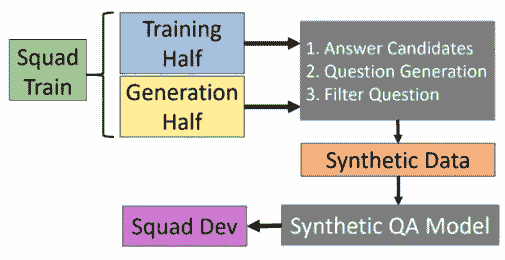
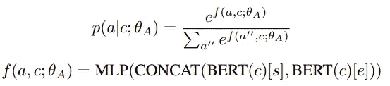
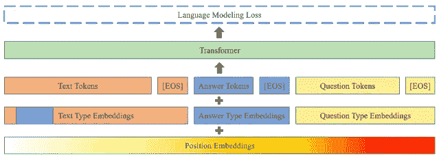
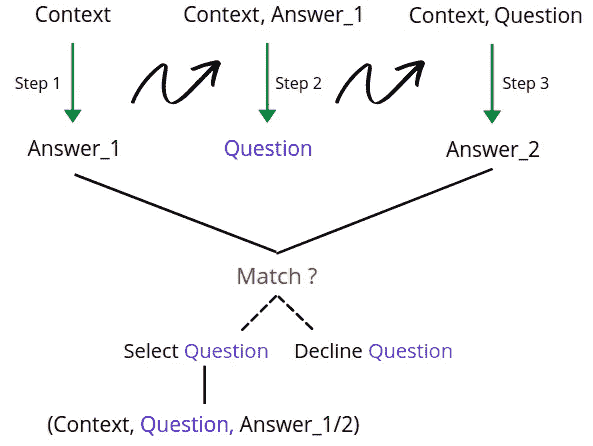

# 从合成数据训练问答模型(研究论文摘要)

> 原文：<https://towardsdatascience.com/training-question-answering-models-from-synthetic-data-research-paper-summary-2220186703f?source=collection_archive---------37----------------------->

## 一个用合成数据训练的**问答模型**能打败 SOTA 吗？？

图片来自[来源](https://unsplash.com/photos/8xAA0f9yQnE)

*在这篇博客中，我尝试根据我的理解，从合成数据* *中总结出论文* [*训练问答模型。请随时评论你的想法！*](https://arxiv.org/pdf/2002.09599.pdf)

# 问题陈述

这项研究的重点是在处理有限的人工标注数据时，通过生成合成问题和答案来改进问答模型。与来自训练集的人工注释问题相比，作者在仅使用合成数据的 SQUAD1.1 问题回答任务上实现了更好的性能。

# 提议的方法

作者提出了由**非条件答案抽取**、**问题生成**和**问题过滤**组成的*三步流水线*。他们用于训练管道中所有三个组件的数据是 SQUAD 训练分割的一部分，并使用另一半从训练的组件中生成合成数据。一旦生成合成数据，他们就训练 Q/A 模型，并在 SQUAD 的开发集上测试其性能。下图显示了整个管道—

合成质量保证模型管道流|图片来自[来源](https://arxiv.org/pdf/2002.09599.pdf)

## 答案生成— a' ~ p(a|c)

在这一步，他们提出了一个 BERT 模型，该模型学习在给定的上下文中提取答案跨度。他们只通过观察上下文而不是问题标记来训练这个模型*(这与典型的问答模型的训练方式有点不同)。通过这种方式，他们了解了数据集中答案的先验分布。如上所述，他们使用来自班的训练分割的(上下文和答案)对来训练该模型。*

他们通过联合学习开始和结束标记来对答案提取头进行建模，因为他们发现联合建模比单独对开始和结束标记进行建模的单个提取头执行得更好。*数学上可以表示为—*

答案生成模型

这里，a=(s，e)和 s，e，c 分别是开始标记、结束标记和上下文标记。首先，我们通过 BERT 模型传递上下文，并在输出端获取开始和结束令牌嵌入。然后，这两种嵌入表示被连接起来，并被传递到一个多层感知器模型，随后是 softmax，跨越可能的开始和结束跨度。目标是使这个软最大概率对于实际地面真实跨度更倾向于 1，而对于所有其他跨度减小到 0。所以，偏斜度越好，模型越好。

## 问题生成— q' ~ p(q|a '，c)

作为下一步的一部分，他们使用预训练的 GPT-2 语言模型来训练问题生成模型。它们将上下文标记、答案标记和问题标记连接成一个大的单个序列，由序列标记的结尾分隔。他们还在问题附近预先考虑并附加 ***:问题:*** 标记作为问题标记。此外，为了确保模型知道不同的输入段，他们定义了三种类型的段嵌入，每种数据类型一种。此外，他们还将答案片段嵌入到上下文嵌入中，帮助模型在上下文中定位答案跨度。*如下图所示—*

问题生成培训|图片来自[来源](https://arxiv.org/pdf/2002.09599.pdf)

在推理过程中，它们提供上下文和答案标记，后跟 ***:question:*** 作为触发词，并采样直到下一次出现相同的触发词。

## 往返问题过滤—a’？a* ~ p(a|c，q ')

往返过滤的思想建立在过度生成然后过滤事物的动机上，其中，目标是从候选集中验证和选择最终问题。为此，我们首先在来自 SQUAD 的标记数据上训练一个问题回答模型 p(a|c，q ),这里 a、c、q 分别是答案、上下文和问题。然后在推理过程中，我们传递生成的问题和上下文来生成候选答案。并且基于候选答案是否匹配生成的答案*(步骤-1)，选择或拒绝问题*。

# 推理流程

训练阶段完成后，我们继续进行推理阶段，其中，假设我们现在有了一个新的上下文，我们首先通过答案生成模型来生成答案。我们使用生成的答案和预定义的上下文，并将其传递给问题生成模型。一旦我们有了候选问题和答案，我们使用上下文和生成的问题来获得可能的候选答案。如果我们在此步骤中生成的答案与生成的答案*(步骤 1 的一部分)*匹配，我们认为生成的问题有效，而所有其他问题都被拒绝。*下图显示了整个推理流程—*

推理流程|作者图片

# 我的想法

*我发现这是一个非常有趣的阅读，我觉得在合成数据上训练 Q/A 模型的想法不仅是在数据较少的情况下采取的一个好步骤，而且也可以用作特定领域 Q/A 微调之后的预训练步骤的一部分。此外，为问题生成系统尝试编码器-解码器模型(如 T5 等)而不是仅使用解码器模型将是一个很好的实验。*

> 如果*你愿意你也可以* [*查看我写的其他研究论文摘要*](https://medium.com/analytics-vidhya/summarizing-nlp-research-papers-dbd12965aa0a) *。*

**好了，这篇博客到此为止。如果你喜欢看视频而不是文字(就像我一样的:D)，一定要去看看—**

[多看看这样的视频](https://www.youtube.com/channel/UCoz8NrwgL7U9535VNc0mRPA)

请随意阅读整篇论文，并向作者问好，感谢他们的贡献。

> ***论文标题:*** 从合成数据中训练问答模型
> 
> ***论文链接:*** [访问论文](https://arxiv.org/pdf/2002.09599.pdf)
> 
> ***作者:*** 劳尔·普里、瑞安·斯普林、莫斯托法·帕特瓦雷、穆罕默德·舒伊比、布莱恩·卡坦扎罗

*另外，如果你喜欢读这篇文章，你可以选择* ***给我买一杯【柴】***【https://www.buymeacoffee.com/TechvizCoffee】<https://www.buymeacoffee.com/TechvizCoffee>**——因为我实际上不喝咖啡:)非常感谢！完全是可选的，自愿的:)**

**