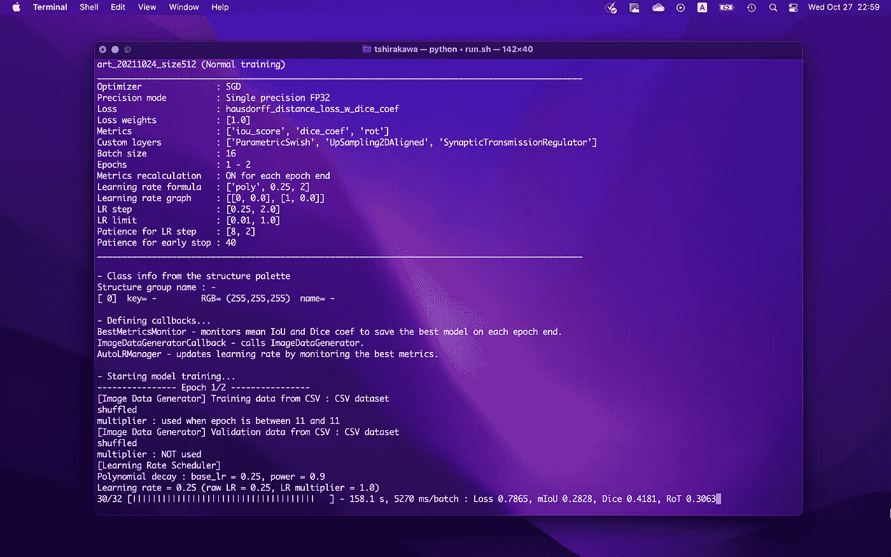
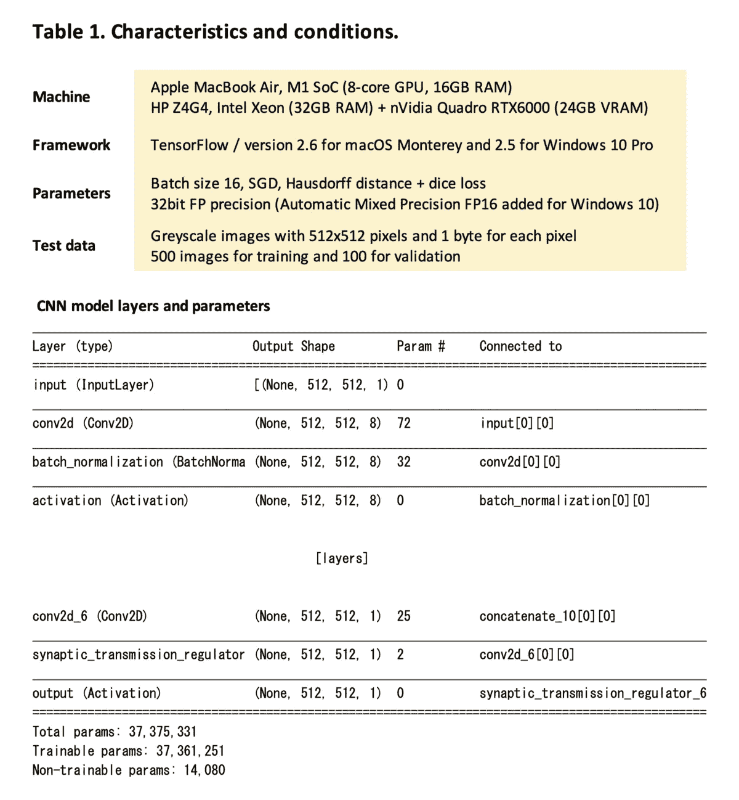
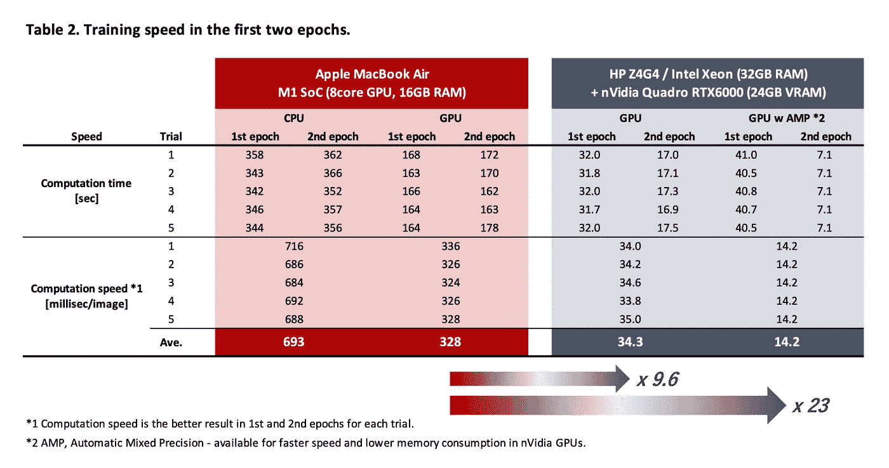
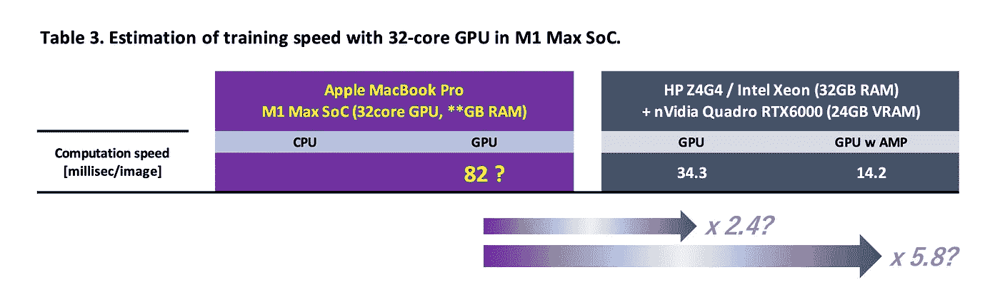
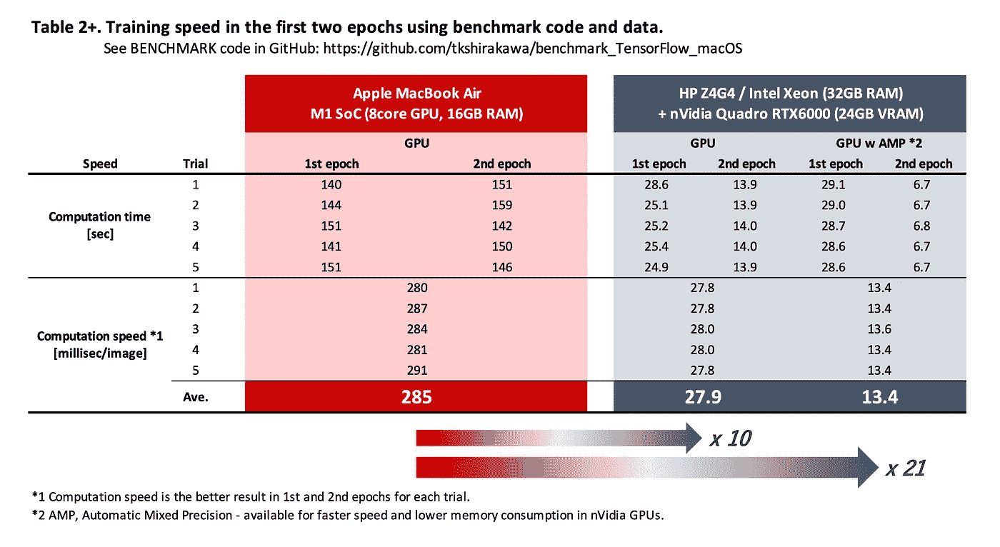

# 马科斯蒙特里的张量流训练速度

> 原文：<https://towardsdatascience.com/training-speed-of-tensorflow-in-macos-monterey-3b8020569be1?source=collection_archive---------8----------------------->

## M1 SoC 中的 GPU 训练与 Quadro RTX6000 中的结果以及 M1 Max SoC 中的评估进行比较

作者图片

> [更新]2021 年 10 月 30 日
> 
> 我上传了一组用于训练基准的 Python 代码和图片数据到[我的 GitHub](https://github.com/tkshirakawa/benchmark_TensorFlow_macOS) 。更多细节见本文底部。

## 背景

新的 OS，macOS Monterey，来了！我等这个新操作系统等了很久，因为 TensorFlow/Keras 模型的 GPU 训练(=更快的计算)将得到官方支持。这意味着我存储在 Windows 工作站中的深度学习代码将是活的，实际上在 macOS 机器中也是活的。

但是我现在不打算把我的生态系统完全转移到 Mac 上。我知道我的 MacBook Air M1(我用它来工作、学习、娱乐和处理私人事务)不够坚固，无法胜任如此繁重的任务。当然，作为一款日常使用的入门级笔记本电脑，我当然对它适当的功率和效率感到满意。此外，正如[我过去的文章“M1 SoC 中的苹果神经引擎在预测方面表现出令人难以置信的性能”](https://medium.com/macoclock/apple-neural-engine-in-m1-soc-shows-incredible-performance-in-core-ml-prediction-918de9f2ad4c)所述，M1 在我的研究所需的图像分割任务中表现出令人难以置信的预测(推理)速度。令人印象深刻的是，M1 足球在某些情况下击败了英伟达巨头 RTX。

然而，除了预测，训练任务复杂而繁重。的确，有时需要几天(不是几分钟或几小时！)用于在 Windows 工作站中使用十万幅图像进行培训。

在本文中，我将展示我的试验，在苹果的 M1 SoC 上对 TensorFlow/Keras 模型的 GPU 训练。我将速度与 Quadro RTX6000 和 M1 Max SoC 中的估计进行了比较。

> 现在，TensorFlow for macOS 支持蒙特雷的 GPU 训练！

## 方法

在 M1 SoC 的 CPU 和 GPU 上完成了图像分割的训练任务。我按照[官方的步骤安装了 TensorFlow for macOS Monterey](https://developer.apple.com/metal/tensorflow-plugin/) 。我在装有 nVidia 高端 GPU 之一 Quadro RTX6000 的 Windows 工作站上使用了相同的代码进行比较。此外，我还估算了 M1 Max SoC 的速度。我的估算很简单，将 M1 的计算时间除以 4，因为 M1 有 8 核 GPU，M1 有 32 核 GPU。

表 1。作者的特征和条件/图像

表 1 显示了测试条件，下面的屏幕电影是在 macOS Monterey 上的训练场景。

TensorFlow 2.6 在 macOS Monterey 上的 GPU 训练/图片由作者提供

## 结果

不出所料，M1 的 GPU 培训比 CPU 培训快两倍。对于尺寸为 512×512 像素的灰度图像，训练速度为 328 毫秒。这导致了十万张图片的 9 小时 6 分钟。屏幕电影显示 M1 正在使用其 GPU 的全部能力。

另一方面，RTX6000 显示了它在这个领域的力量，计算机图形学、CAD、数值模拟和深度学习领域。特别是 AMP(自动混合精度),这种计算技术同时使用 32 位和 16 位浮点数来实现比单一 32 位精度更高的速度和更低的内存消耗，显示出有效的增益。M1 足球必须接受十到二十倍落后(我从来没有说它慢)。

在 M1 Max 的后面估计通过它的 32 核 GPU 提高两到六倍(这是我的梦想估计)。

下表分别显示了 M1 SoC 的实际结果和我对 M1 Max 的估计。

表二。前两个时期的训练速度/图片由作者提供

表 3。作者对 M1 Max SoC / Image 中 32 核 GPU 训练速度的估算

## 讨论

我对这个结果感到欣慰。M1 足球“仅”落后十到二十倍。这个苹果的入门硅消耗 10 或 15W 的电力，而 RTX6000 对最大功率 295W 有很大的胃口！

在这种背景下，这种比较可能毫无意义。

然而，在 M1·马克斯看来，这是有意义的。事实上，结果(再次这是估计！)作为笔记本电脑芯片似乎不错，但苹果表示，新的 SoC 是为专业用途而设计的。“专业用途”一词意味着 M1 Max/Pro 和其他高端芯片应该在专业场合用于相同或至少相似的目的和/或目标。机器永远不可能在工作负荷的任何时刻说“这对我来说太重了”。即使是笔记本电脑，这样的用户也会期望相同的性能。

在这种情况下，M1 Max 可能不是我满意的选择。

用于 Windows 和 Linux 机器的 TensorFlow 已经开发了多年。nVidia GPUs 和 CUDA 库为性能提供了强有力的支持。我认为为苹果芯片实现的 TensorFlow 还不够优化。事实上，Core ML 和 Metal APIs，苹果公司用于高性能计算的纯 API，似乎将所有的 CPU，GPU 和 ANE(苹果神经引擎)用于其繁重的计算。上面的电影明显揭示了 Mac 上的 TensorFlow 只用 GPU。我认为，各种内核的综合使用是苹果 SoC 的具体优势。会留下很大的优化空间。

## 结论

*   我可以使用我的 smiley MacBook Air 在 M1 SoC 的 GPU 上训练我的 TensorFlow/Keras 模型。训练速度比在它的 CPU 上快两倍。
*   然而，与庞然大物 RTX6000 相比，SoC 并没有神奇的力量，而是取决于它的功耗。
*   M1 Max SoC 的估算结果看起来和笔记本电脑一样好，但不足以满足我的使用=十万张图片的深度学习。
*   根据 TensorFlow for macOS 内核间任务分配的优化情况，这种情况在未来可能会有所改变。

*不管怎样，不管结果如何，老实说，我想要一台新的 M1 Max MacBook Pro！:>*

## [更新]2021 年 10 月 30 日

我上传了一组 Python 代码和图像数据到[我的 GitHub](https://github.com/tkshirakawa/benchmark_TensorFlow_macOS) 。

> 注意:GitHub 中的文件与上面文章中使用的原始代码不同，因为原始代码包含研究信息。

下面的表 2+显示了从该释放组获得的结果。

表 2+。前两个时期的训练速度/图片由作者提供