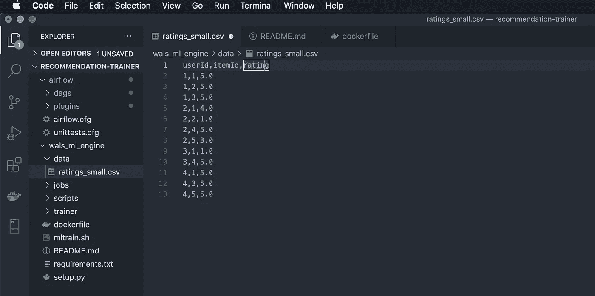
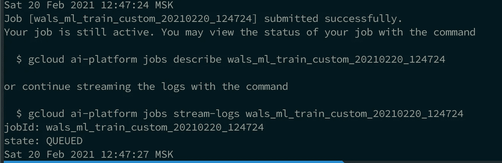
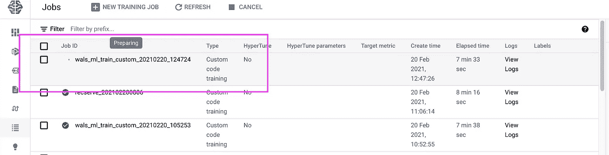
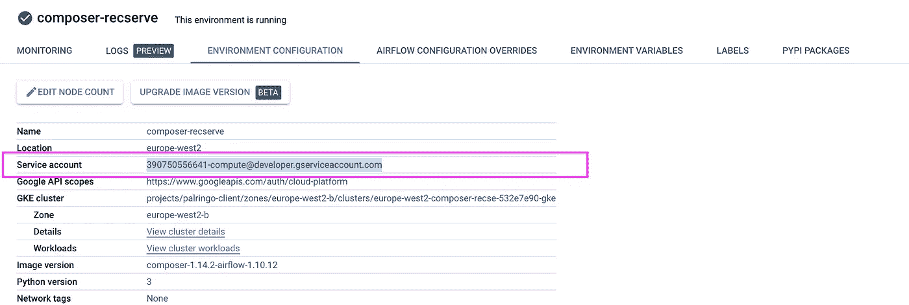
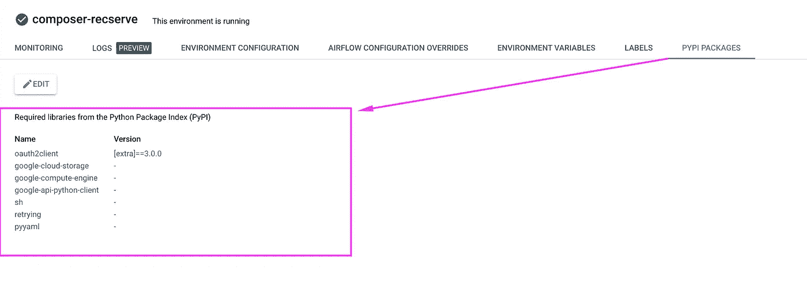
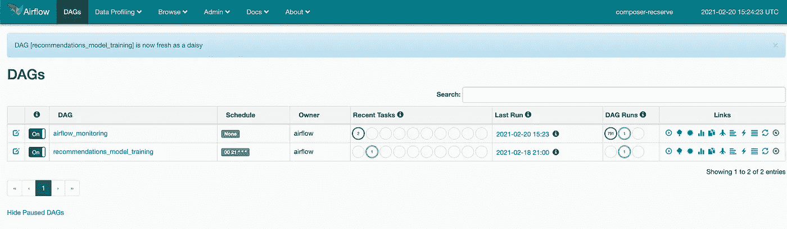
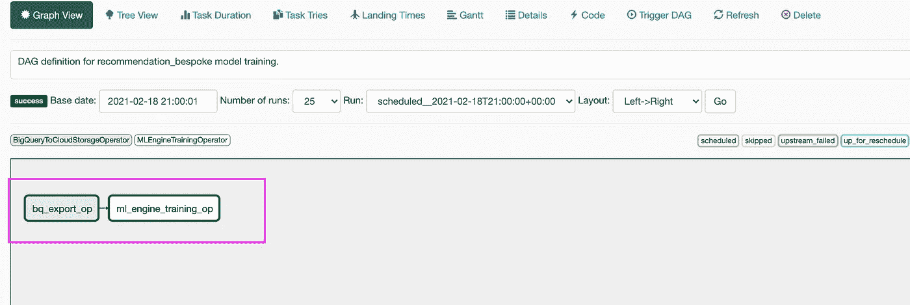

# 使用谷歌人工智能平台和定制环境容器训练你的 ML 模型

> 原文：<https://towardsdatascience.com/training-your-ml-model-using-google-ai-platform-and-custom-environment-containers-1531888cac3d?source=collection_archive---------17----------------------->

## 使用 Tensorflow、气流调度程序和 Docker 的完整指南


由 [Setyaki Irham](https://unsplash.com/@setyaki?utm_source=medium&utm_medium=referral) 在 [Unsplash](https://unsplash.com?utm_source=medium&utm_medium=referral) 拍摄的照片

G oogle AI 平台允许使用各种[环境](https://cloud.google.com/ai-platform/training/docs/runtime-version-list)进行高级模型训练。因此，训练您的模型非常简单，只需一个命令，如下所示:

```
gcloud ai-platform jobs submit training ${JOB_NAME} \
    --region $REGION \
    --scale-tier=CUSTOM \
    --job-dir ${BUCKET}/jobs/${JOB_NAME} \
    --module-name trainer.task \
    --package-path trainer \
    --config trainer/config/config_train.json \
    --master-machine-type complex_model_m_gpu \
    --**runtime-version 1.15**
```

然而，Google 运行时环境不时地被否决，你可能想要使用你自己的**自定义运行时环境**。本教程讲解如何在 AI 平台训练上用自定义容器设置一个并训练一个 Tensorflow 推荐模型。

**我的资源库**可以在这里找到:
[https://github . com/mshakhomirov/recommendation-trainer-customendocker/](https://github.com/mshakhomirov/recommendation-trainer-customEnvDocker/tree/main)

## 概观

本教程将解释如何使用 WALS 算法训练一个`user-items-ratings`推荐模型。

*   这是一个非常常见的例子，当用户对一些内容或产品进行评级，你需要向他们推荐类似的产品。
*   这是一个产品级代码示例，可以处理任意大小的用户评分矩阵。

**本指南包含以下步骤:**

*   本地环境设置
*   编写 Dockerfile 文件并创建自定义容器
*   本地运行 docker 映像
*   将图像推送到 GCP 集装箱登记处
*   提交自定义容器培训作业
*   用气流安排模型训练

## 先决条件:

1.  GCP 开发者帐户
2.  已安装码头
3.  Python 2
4.  [云 SDK](https://cloud.google.com/sdk/docs) 安装完毕。
5.  [启用 AI 平台培训&预测、计算引擎和容器注册 API](https://console.cloud.google.com/flows/enableapi?apiid=ml.googleapis.com,compute_component,containerregistry.googleapis.com&redirect=https://console.cloud.google.com&_ga=2.262537804.1160810420.1613540222-181916626.1572688026)。

创建上述资源将产生大约 0.20 美元的成本。完成后不要忘记清理。

## 训练数据集

我们用于培训的数据( [repo](https://github.com/mshakhomirov/recommendation-trainer-customEnvDocker/) )将如下所示:



作者图片

它非常类似于 MovieLens 评级数据集，但出于开发目的进行了简化。您可以将该模式应用于任何东西，包括 Google Analytics 页面视图或任何其他与产品/内容相关的用户活动。

> 第一步。安装 docker 后，您需要对其进行认证。使用`gcloud`作为 Docker 的凭证助手:

```
gcloud auth configure-docker
```

> **第二步。**创建您的云存储空间，并设置您的本地环境变量:

```
export BUCKET_NAME="your_bucket_name"
export REGION=us-central1
gsutil mb -l $REGION gs://$BUCKET_NAME
```

> 提示:试着在同一个地区做**一个**项目中的所有事情。

> **第三步。**克隆[回购](https://github.com/mshakhomirov/recommendation-trainer-customEnvDocker/)。

```
cd Documnets/code/
git clone [git@github.com](mailto:git@github.com):mshakhomirov/recommendation-trainer-customEnvDocker.git
cd recommendation-trainer/wals_ml_engine
```

> **第四步。**写一个 dockerfile 文件

Docker 文件已经存在于此 repo 中:

这一点非常重要，否则您的实例将无法将模型保存到云存储中:

```
# Make sure gsutil will use the default service account
RUN echo ‘[GoogleCompute]\nservice_account = default’ > /etc/boto.cfg
```

使用这个 docker 文件，您将使用这些自定义环境依赖项构建一个映像:

```
tensorflow==1.15
numpy==1.16.6
pandas==0.20.3
scipy==0.19.1
sh
```

这些依赖版本是我使用定制容器的主要原因。

> **谷歌人工智能平台的**运行时版本 1.15 **有 Tensorflow 1.15** ，但不同的 Pandas 版本对于我的用例场景是不可接受的，Pandas 版本必须是 0.20.3。

> **第五步。建立你的码头工人形象。**

```
export PROJECT_ID=$(gcloud config list project --format "value(core.project)")
export IMAGE_REPO_NAME=recommendation_bespoke_container
export IMAGE_TAG=tf_rec
export IMAGE_URI=gcr.io/$PROJECT_ID/$IMAGE_REPO_NAME:$IMAGE_TAGdocker build -f Dockerfile -t $IMAGE_URI ./
```

**本地测试:**

```
docker run $IMAGE_URI
```

**输出将是:**

```
task.py: error: argument --job-dir is required
```

这是正常的，因为这个图像将被用作我们的自定义环境，入口点是

```
“trainer/task.py”
```

例如，在推送我们的映像后，我们将能够在本地运行此命令:

```
gcloud ai-platform jobs submit training ${JOB_NAME} \
    --region $REGION \
    --scale-tier=CUSTOM \
    --job-dir ${BUCKET}/jobs/${JOB_NAME} \
    **--master-image-uri $IMAGE_URI \**
    --config trainer/config/config_train.json \
    --master-machine-type complex_model_m_gpu \
    -- \
    ${ARGS}
```

并且 **master-image-uri** 参数将替换**运行时环境。**查看回购中的 **mltrain.sh** 了解更多详情。

> **第六步。**将图像推送到 docker repo

```
docker push $IMAGE_URI
```

输出应该是:

```
The push refers to repository [gcr.io/<your-project>/recommendation_bespoke_container]
```

> **第七步**。提交培训工作

运行 repo 中包含的脚本:

```
./mltrain.sh train_custom gs://$BUCKET_NAME data/ratings_small.csv — data-type user_ratings
```

**输出:**



这意味着您的培训工作已使用自定义环境成功提交。现在，如果你去谷歌人工智能平台控制台，你应该可以看到你的训练运行:



作者图片

## 使用 Cloud composer(气流)运行模型训练。

现在，让我们部署一个 Cloud Composer 环境来编排模型培训更新。

> **步骤 8。**在您的项目中创建 Cloud Composer 环境:

```
export CC_ENV=composer-recserve
gcloud composer environments create $CC_ENV --location europe-west2
```

> **步骤九。**

获取 Cloud Composer 为您创建的云存储空间的名称:

```
gcloud composer environments describe $CC_ENV \
    --location europe-west2 --format="csv[no-heading](config.dagGcsPrefix)" | sed 's/.\{5\}$//'
```

在输出中，您可以看到云存储空间的位置，如下所示:

```
gs://[region-environment_name-random_id-bucket]
```

我的情况是:

```
gs://europe-west2-composer-recse-156e7e30-bucket
```

我们将在这里上传插件。

> **第十步。**设置一个包含输出路径的外壳变量:

```
export AIRFLOW_BUCKET="gs://europe-west2-composer-recse-156e7e30-bucket"
```

> **第十一步。上传气流插件**

在**气流/插件**文件夹中有两个文件。这些插件将作为助手模块来运行我们的 DAG 并提交培训作业。

```
gcloud composer environments storage plugins import \
    --location europe-west2 --environment composer-recserve --source airflow/plugins/
```

> **第十二步。检查云作曲家权限**

现在转到 GCP Cloud Composer Web UI，确保 Composer 的服务帐户拥有启动作业所需的所有权限，即 Cloud ML、BigQuery 等。您可以在 IAM 控制台中找到它。



另外，确保您的 Composer 环境安装了这些 PyPi 包:



作者图片

> **第十三步。上传你的 DAG 文件**

将 DAG `model_training.py`文件复制到 Cloud Composer bucket 中的`dags`文件夹:

```
gsutil cp airflow/dags/model_training.py ${AIRFLOW_BUCKET}/dags
```

完成了。现在，我们可以转到 Airflow web 控制台并检查我们的作业。

## 访问 Airflow web 控制台

Airflow web 控制台允许您管理 DAG 的配置和执行。例如，使用控制台，您可以:

*   检查并更改 DAG 执行的计划。
*   在 DAG 中手动执行任务。
*   检查任务日志。

> **第 14 步。**运行此命令获取气流控制台 uri:

```
gcloud composer environments describe $CC_ENV \
    --location europe-west2 --format="csv[no-heading](config.airflow_uri)"
```

您会看到控制台网站的 URL，如下所示:

```
[https://za4fg484711dd1p-tp.appspot.com](https://z9d39afb484711dd1p-tp.appspot.com)
```

要访问 Cloud Composer 实例的 Airflow 控制台，请转到输出中显示的 URL。您将使用您的 DAG:



达格。作者图片

单击建议 _ 模型 _ 训练 DAG 并检查日志。如果一切正常，你会看到一些成功的活动。此外，您会注意到您的定制环境[培训作业](https://console.cloud.google.com/ai-platform/jobs?)正在进行**。**

**假设我们从 BigQuery 中提取训练数据，这将是 ML 管道的第一步。转到 model_training.py DAG 并取消对此的注释:**

```
...
...
# t1 = BigQueryToCloudStorageOperator(
#     task_id='bq_export_op',
#     source_project_dataset_table='%s.recommendation_training' % DATASET,
#     destination_cloud_storage_uris=[training_file],
#     export_format='CSV',
#     dag=dag
# )
...
...
...
*# t3.set_upstream(t1)*
```

**这将允许从 BigQuery 表中提取和保存:**

```
**<your-project>.staging.recommendation_training**
```

**DAG 现在看起来像这样:**

****

**达格。作者图片**

**就是这样！我们已经建立了 ML 管道编排。**

## **结论**

**我们刚刚使用 Airflow 设置了 ML pipeline 流程编排，在定制环境中使用 Docker image 进行培训。这一点非常重要，因为现在你不再依赖可能会被否决的 Google 运行时环境，并且你能够满足你的**数据科学团队**设定的任何定制运行时版本要求。此外，使用版本控制设置可靠的 CI/CD ML 管道要容易得多。**

****Apache Airflow** 是一个优秀的管道编排管理器，其中每一步都依赖于前一步的成功完成。在本教程中，我们部署了一个 Google Cloud Composer 环境，其中我们的 ML 管道以有向无环图(DAG)表示，以执行模型数据提取和训练步骤。**

## **推荐阅读**

***[1]:[https://cloud . Google . com/ai-platform/training/docs/custom-containers-training](https://cloud.google.com/ai-platform/training/docs/custom-containers-training)**

***[2]:[https://cloud . Google . com/ai-platform/training/docs/using-containers](https://cloud.google.com/ai-platform/training/docs/using-containers)**

***[3]:[https://cloud . Google . com/SDK/g cloud/reference/ai-platform/jobs/submit/training #-master-image-uri](https://cloud.google.com/sdk/gcloud/reference/ai-platform/jobs/submit/training#--master-image-uri)**

***[4]:[https://github . com/Google cloud platform/cloud ml-samples/tree/master/tensor flow/containers/unsupported _ runtime](https://github.com/GoogleCloudPlatform/cloudml-samples/tree/master/tensorflow/containers/unsupported_runtime)**

***[5]:[https://cloud . Google . com/ai-platform/training/docs/reference/rest/v1/projects . jobs # replica config](https://cloud.google.com/ai-platform/training/docs/reference/rest/v1/projects.jobs#ReplicaConfig)**

***[6]:[https://airflow.readthedocs.io/_/downloads/en/1.10.2/pdf/](https://airflow.readthedocs.io/_/downloads/en/1.10.2/pdf/)**