# 使用深度学习训练您自己的消息建议模型

> 原文：<https://towardsdatascience.com/training-your-own-message-suggestions-model-using-deep-learning-3609c0057ba8?source=collection_archive---------4----------------------->

照片由[希望之家出版社-皮革日记工作室](https://unsplash.com/@hope_house_press_leather_diary_studio?utm_source=medium&utm_medium=referral)在 [Unsplash](https://unsplash.com?utm_source=medium&utm_medium=referral)

# 解释业务问题

随着近几年智能设备的出现，电子邮件和聊天已经成为我们今天生活的一个重要部分。每天，笔记本电脑和手机用户都会回复数百条信息，不仅仅是在工作场所，在个人生活中也是如此。这些回答中的大部分倾向于特定领域或需要上下文，但有很大一部分是通用的，由常见的词语组成，如“好的”、“哇”或“早上好”等。因此，我们的设备有一些额外的功能来帮助我们在这样的日常情况下响应收到的消息是有意义的。
谷歌已经有了这样一个机制，叫做智能回复，可以在 Gmail 中看到。智能回复通过对用户当前正在查看的消息提供 3 种可能的响应来工作。响应的长度通常少于 10 个标记，并且通常具有不同的语义意图。
在本文中，我们试图训练一个类似的深度学习模型，该模型将接受用户输入，并基于这些输入，输出 3 种可能的相关响应。

# 目录

*   数据来源
*   现有工作
*   初始方法
*   训练 LSTM 模型来预测响应标签
*   未来的工作

# 数据来源

互联网上充斥着可以用来训练我们模型的数据集。一个很好的选择是开放字幕数据集，可以从以下链接下载-

[**https://github . com/PolyAI-LDN/conversatile-datasets/tree/master/open subtitle**](https://github.com/PolyAI-LDN/conversational-datasets/tree/master/opensubtitles)

开放字幕数据集由 62 种语言的数千部电影的字幕组成。该数据集对于文本翻译任务的训练模型非常有帮助。

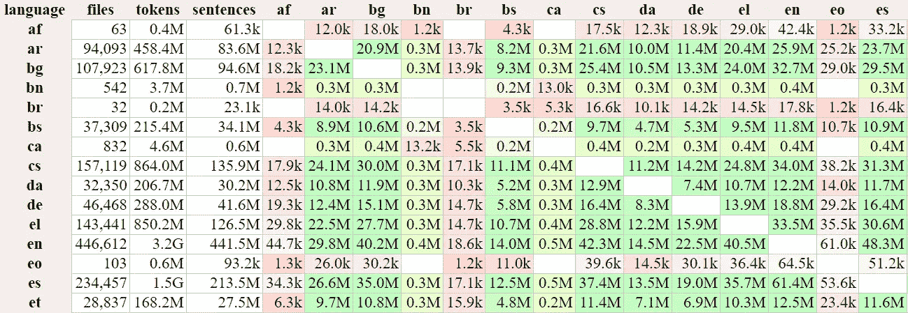

**Opus 主页截图**

这个数据集有一个小缺点，因为这个数据集中的句子是电影对白，所以它包含了大量的俚语文本，这是不可取的，因为我们需要我们的模型输出坚持一些质量标准。
Ubuntu 对话语料库是另一个很好的候选，它包括从 Ubuntu 的技术支持聊天系统中提取的大约 100 万个 2 人对话。这个数据集可以在下面的链接中找到。

[**https://github.com/rkadlec/ubuntu-ranking-dataset-creator**](https://github.com/rkadlec/ubuntu-ranking-dataset-creator)

**但是由于这个数据集中的信息倾向于过多地围绕 Ubuntu 技术支持，它由许多命令和 Ubuntu 相关的术语组成，因此我们的模型最终可能会稍微倾向于使用技术术语，而不是通用的、非技术的日常词汇。
最后，我们有话题聊天数据集，可以在下面的链接中找到**

**[**https://github.com/alexa/Topical-Chat**](https://github.com/alexa/Topical-Chat)**

**该数据集中的消息基于随机的主题，但是由于主题彼此之间有很大的不同，并且随着每次对话而变化，所以它不应该使我们的模型偏向任何单一的主题，因此该数据集对于训练我们的模型似乎是理想的。(尽管后来发现，早期的试验模型之一最终确实偏向于用与美国情景喜剧“The Simpsons”相关的文本进行响应，因为数据集中的一些对话主题与 Simpsons 有关。例如，当被问到“你好吗”时，模型会回答“我很好”。你喜欢看《辛普森一家》吗**

**在 Kaggle 上，同样的数据集也有一个稍微改动过的版本，链接如下**

**[**https://www . ka ggle . com/arnavsharmas/chatbot-dataset-topic-chat**](https://www.kaggle.com/arnavsharmaas/chatbot-dataset-topical-chat)**

**正如页面上提到的，该数据集包含“基于人类知识的开放领域对话”，由 8000 多个对话和 184，000 多条消息组成。每条消息都分配有一个对话 ID，这很有用，因为它有助于只训练与输入文本相关的响应。**

**数据集中的一个对话样本(显然，话题与猫有关)如下—**

*   **“猫呢，你喜欢猫吗？我自己就是狗迷。”**
*   **“猫被称为家猫和野猫。他们让我们的世界变得非常干净，没有老鼠！”**
*   **“是啊，猫可能很酷，但它们肯定会花很多时间睡觉。”**
*   **"猫听到的声音太微弱或频率太高，人耳听不到."**
*   **“我也听说了。嗯，和你聊天很愉快。祝你愉快。”**

**如上例所示，数据集中的一些响应可能过于具体，因此不能用作对更广泛的用户输入的响应。因此，我们还必须确保响应是通用的和非特定的，以便每个集合都提供最大的效用。**

**我们将使用来自 Kaggle 链接的数据集，因为大部分培训将在 Kaggle 上进行。Kaggle 在其笔记本中提供了 TPU 访问，从而将培训时间从几个小时大幅减少到了几分钟。**

**这个数据集在 Kaggle 上被命名为“聊天机器人数据集主题聊天”,是 CSV 格式，有 3 列-**

1.  **对话 id**
2.  **消息**
3.  **感情**

**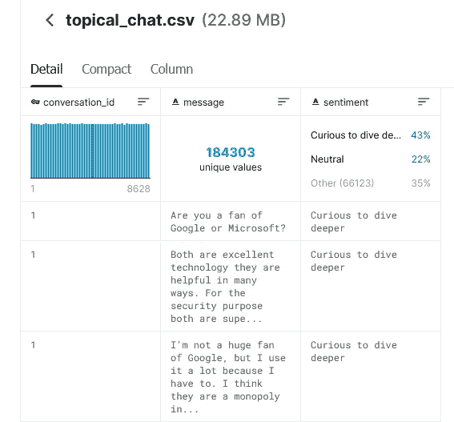**

****Kaggle 上数据集页面截图****

**列“ **conversation_id** ”是一个整数，表示消息所属的会话。“**消息**”列包含实际的句子，该句子或者是对话的开始，或者是对对话中先前消息的回复。“**情绪**栏表示 7 种情绪之一— 愤怒、好奇、伪装、恐惧、快乐、悲伤和惊讶。**

**为了训练我们的模型，我们将只使用数据集中的前两列，即 **conversation_id** 和 **message。****

# **现有工作**

**正如谷歌的智能回复文件中提到的，建立一个自动建议回复电子邮件的系统并不是一个积极研究的领域。为电子邮件提出自动回复建议并不完全是一个标准的机器学习问题，因此在这个方向上几乎没有任何工作。**

# **初始方法**

## **预处理和数据集准备**

**我们首先使用 Pandas 将所有消息加载到一个数据帧中。**

**加载数据框后，所有重复项都将被删除。**

**进行基本的预处理以去除所有标点符号。**

**然后，数据帧中的所有消息按照会话 ID 进行拆分和分组。我们创建了两个名为“input_texts”和“target_texts”的列表，并将会话组中的每条消息(少于 50 个单词)添加到“input_texts”中，将其后的消息(少于 10 个单词)添加到“target_texts”中。之所以只考虑 10 个单词或更少的消息作为目标文本，是因为我们希望捕获广泛和一般的语句，这些语句可以作为对各种用户输入的查询的响应。简短的目标文本，如“好的”、“哇”、“很高兴与你聊天”、“你也一样”，可以作为各种查询的合适响应。另一方面，像下面这样的长而具体的句子很少被用作回应**

**“来自这样一位才华横溢的歌手和舞者真是太棒了。我做梦也跳不出那样的舞。”**

**输入文本最多允许有 50 个单词，因为我们假设任何更长的句子都需要更详细的响应，需要上下文，在某些情况下还需要领域知识，因此不适合从我们的模型中获取响应文本。**

**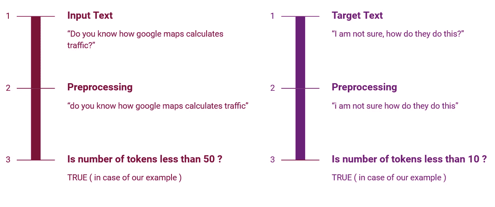**

****过滤输入和目标文本****

**一旦输入和目标文本数组被填充，我们就标记和填充两个数组的每一项。标记化是自然语言处理中非常常见的任务，它将数组中的每个句子转换成更小的单元，并为该单元分配唯一的整数值。每个单元既可以是一个单独的单词，也可以是单词中的一个字符。每个单元被称为一个标记，因此这个过程被称为标记化。考虑一下“我爱咖啡”这句话。这句话可以用以下两种方式来标记—**

**字符标记—**

**i = 1，(空格)= 2，l = 3，o = 4，v = 5，e = 6，c = 7，o = 4，f = 8，e = 6**

**工作代币—**

**我= 1，爱= 2，咖啡= 3**

**在字符级标记化中，我们最终得到 8 个唯一的标记，而在单词级标记化中，我们得到 3 个标记。**

**为了训练我们的模型，我们使用了单词标记。**

**由于每个句子中的单词数量不同，因此数据集中每个项目的输入大小也不同。这是因为，很明显，数据集中有些句子较长，有些较短。现在，如果我们在训练期间一次只向我们的模型提供一个数组项目(即批量= 1 ),这是可以的。但是这将显著增加训练时间，因此不是优选的。**

**在填充中，单个标记化的句子以零作为前缀或后缀，以保持输入大小固定。这允许我们在训练中使用更高的批量值。**

**在下面的代码片段中，我们声明了一个标记化器，然后将它“安装”在目标文本数组上。这将为目标文本数组中的每个唯一单词生成一个令牌。一旦生成了标记，就通过将目标文本数组传递给“texts_to_sequences”函数，将其转换为标记数组。完成标记化后，使用函数“generate_padded_sequences”填充新创建的“target_sequences”数组。**

**在对输入和目标文本进行标记化和填充之后，我们训练我们的第一个模型，这是一个单词级 Seq2Seq 模型。**

## **训练单词级 Seq2Seq 模型并使用波束搜索进行预测**

**Seq2Seq 模型是一个编码器-解码器框架，它接收一个输入序列(可以是字符或单词)并输出另一个序列。例如，输入可以是英语单词序列，输出可以是完全不同的语言(如法语或印地语)的单词序列。在我们的例子中，输入是用户的查询，输出是对用户查询的响应。**

**Seq2Seq 的工作原理是首先将输入序列输入编码器，然后将其转换为状态向量。**

**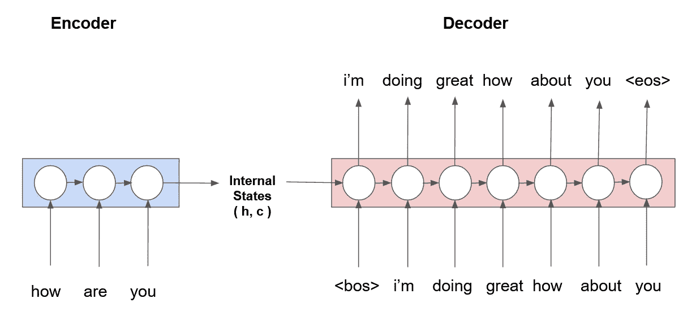**

****词级 Seq2Seq 模型****

**一旦状态向量准备就绪，解码器就将状态向量与第一个目标序列一起输入，该目标序列映射到任何指示序列开始的标记，例如— <bos>或语句开始，以获得第一个时间步长的输出。解码器的输出现在与新的状态向量一起被采样。最新的输出和状态向量现在再次被馈送到解码器，以获得下一时间步的输出和状态向量。重复该过程，直到解码器输出指示序列结束的标记，例如— <eos>或语句结束或最大输出句子长度限制。</eos></bos>**

**训练后，可以“贪婪地”或通过使用波束搜索来进行文本预测。在贪婪方法中，来自较早时间步骤的具有最高概率的令牌(连同状态向量)被简单地馈送给模型，以获得当前时间步骤的输出。重复这个过程，直到从模型接收到作为输出的语句结束标记。**

****贪婪文本预测****

**另一方面，在波束搜索中，考虑前 K 个可能的记号(和它们相应的状态向量),而不是仅仅一个。然后，前 K 个表征和状态向量在下一个时间步骤中被馈送到模型，每个表征生成下一个前 K 个表征，从而导致 K*K 个可能的输出。计算所有输出的组合概率得分(对于跨所有时间步长的令牌)。这个 K*K 个输出的数组根据它们的分数排序(以降序方式),除了最上面的 K 个，所有其他输出都被排除。重复这个过程，直到模型为 K 个“束”中的每一个输出语句结束标记或最大输出句子长度限制。**

**Seq2Seq 是一个基于文本生成的模型，它为输入文本生成文本输出。文本生成模型的一个问题是，有时模型可能会给出太不正式或不适合电子邮件的响应(例如，“好啊”，“非常感谢兄弟”)。在某些情况下，输出也可能是令人不快的(例如，“迷路”)。这是基于文本生成的模型的主要缺点之一。**

**除此之外，我们还能如何开发 LSTMs 的巨大潜力，同时确保在模型响应时始终保持特定的质量标准？**

**一种方法是根据预定的响应集训练我们的模型，该响应集只包含满足所有质量响应的响应。对于使用来说被认为太不合适或太不正式的回答可以从数据集中移除，从而确保满足所有标准。一旦排除了所有不需要的响应，剩余的集合可以被分配标签，然后可以被用作训练模型的目标，输入是用户输入的文本。如果在生产环境中使用这种模型来提供某种服务(例如，为银行应用程序提供聊天机器人支持)，这种方法可以帮助我们确保所有响应都限制在所提供的服务范围内。这种方法的另一个优点是这些标签中的一些可以被映射到一些功能上，从而代替文本输出，执行一个任务。例如，继续我们前面的例子，在银行环境中，一个标签可以被映射到获取客户的银行账户余额。因此，当用户输入诸如“我的银行账户余额是多少”之类的任何文本时，(假设)客户的实时银行余额被获取并显示给他或她。**

**然而，这种方法的挑战是生成只包含适当响应的理想“响应集”。另一个挑战是将这样的响应集标签映射到训练数据集中的各个输入文本。**

**以下几节解释了我们可以在某种程度上克服上述挑战的方法之一。**

# **训练基于响应集的 LSTM 模型**

**如上所述，响应集是语义相近的句子的集合，这些句子优选地具有 10 个或更少的标记(在我们的情况下),并且是通用的、非特定的句子，可以作为对各种用户输入的输入的有效响应。由于我们拥有的唯一数据是数据集中的消息，我们面临的任务是过滤出特定的响应，然后将所有语义相近的消息分组到单独的集群中。**

**实现这一点的一个方法是—**

1.  ****将目标句子转换成向量(即句子嵌入)——**应用某种算法将目标信息转换成它们的 N 维表示。**
2.  ****对向量进行聚类** —使用聚类算法将 N 维空间中的邻近点分组在一起，以创建一组聚类或响应集。一旦点(即句子的向量表示)被聚类，每个聚类可以被分配一个标签。**
3.  ****将聚类标签映射到输入文本** —将每个目标句子映射到一个聚类的标签现在可以用于将相应的输入文本映射到这些聚类。一旦映射完成，我们就可以用这个新的数据集训练一个 LSTM 模型，在给定一个输入文本的情况下预测一个聚类标签。**

**关于这种方法的更多细节可以在下面的章节中找到。**

## **将目标句子转换成向量**

**我们的输入和目标文本数组中的句子可以通过使用以下任何一个库转换成向量**

1.  ****sent 2 vec—**[**https://github.com/pdrm83/sent2vec**](https://github.com/pdrm83/sent2vec)**

**Sent2Vec 可以看作是广泛使用的 word2vec 库的扩展。Word2vec 将单词转换为固定长度的向量，这样语义相似的单词，如“美丽的”和“有吸引力的”或“愤怒的”和“狂怒的”在向量空间中更接近。我们可以使用 word2vec 通过使用单词袋等技术来表示句子，但是这种方法不考虑句子的顺序和整体含义。因此，需要一种更复杂的方法来将所有消息转换成向量。这就是 sent2vec 的用武之地。**

**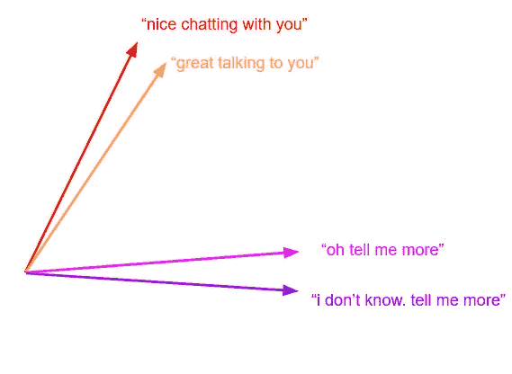**

****句去矢****

**Sent2vec 将句子编码成有意义的格式，这种格式考虑了单词的顺序和句子的整体语义。**

**因此，Sent2vec 是一个不错的编码器，可用于对数据集中的消息进行编码。然而，当试图在 16GB 的机器上编码 21，000+数据集句子时，sent2vec 在编码时不断耗尽内存，最终导致笔记本崩溃。经过多次试验，发现 sent2vec 最多只能编码大约 5000 个句子。由于 5000 个句子不足以训练我们的模型，因此需要另一个可以编码 21，000+个句子的库。**

****2。惹恼—**[**https://github.com/spotify/annoy/**](https://github.com/spotify/annoy/)**

**Yeah 上的骚扰或近似最近邻居是 Spotify 开发和使用的一个库，用于提供音乐推荐。ANNOY 能够在几分钟内成功地对所有 21，000+点进行编码。**

**这个库使用欧几里德距离、曼哈顿距离、余弦距离、汉明距离或点(内)积距离来解决 N 维空间中最近邻搜索的问题。给定一个查询点，库搜索接近这个点的点，并且使用非常少的内存。**

**以下代码片段返回数据集中所有消息的 N 维向量—**

**" inputanoyindex . build(100)"构建一个由 100 棵树组成的森林。一旦构建完成，inputAnnoyIndex 就可以用于查找与给定点最近的 k 个点。**

**下面我们随机向库输入一个查询点索引，它会返回几个相似的句子。**

> **当然罗，你看过《功夫》吗？是的，我也是。你看过《功夫》吗？你看过功夫吗**

**使用同样的方法，我们为输入文本和目标文本生成一个简单的相似性矩阵。**

**在下一步中，我们使用这个相似性矩阵将数据集中所有相似的句子聚集在一起，并为每个聚类分配标签。**

## **聚类语义相似的句子**

**聚类语义相似的句子是至关重要的一步，因为它让我们生成响应集。为了生成响应集，语义上彼此接近的句子被分组到单个簇中(或者换句话说，一个响应集)。以这种方式，数据集中的所有目标句子被分组到多个响应集合中，并被分配唯一的标签。**

**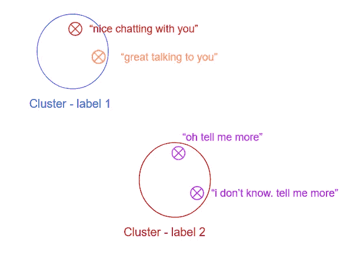**

****聚类语义相似的句子****

**一旦分配了标签，我们就根据目标文本的标签在输入文本上训练模型。**

**在前面的步骤中生成的句子相似性矩阵的预览如下所示**

**为了将所有相似的句子聚类在一起，我们使用 DBSCAN(带噪声的基于密度的应用空间聚类)算法，这是最广泛使用的聚类算法之一。使用 DBSCAN 算法而不是其他聚类算法(如 K-Means)的原因之一是，给定某个空间中的一组点，DBSCAN 将密集邻域中的邻近点组合在一起，并自行得出聚类数。这很方便，因为我们不知道我们的目标文本数组包含多少“响应集”或相似句子集。我们将使用 scikit-learn 的 DBSCAN 算法实现来满足集群需求。更多细节可以在下面的链接中找到——**

**【T2**https://sci kit-learn . org/stable/modules/generated/sk learn . cluster . DBS can . html****

**然而，在我们开始 DBSCAN 之前，参数“eps”必须是固定的，它是两个点之间的最大距离，以便被认为是彼此的邻域。这很重要，因为如果 eps 值太小，将不会发生聚类，所有点都将被标记为噪声。另一方面，如果 eps 选择得太大，它会导致所有点合并成一个大簇。因此，必须将 eps 的最佳值传递给 DBSCAN 算法，使得只有语义接近的句子被分组，而将其他不相关的句子作为噪声排除在外。**

**为了做到这一点，我们首先尝试通过使用熊猫的“n 最小”函数来估计每个点的第 10 个邻居的距离分布。**

**一旦我们对所有点的第 10 个邻居的距离的分布有了一个公平的想法，我们通过尝试多个 eps 值并捕获每个 eps 值的聚类和噪声点的数量来更深入地挖掘。**

**我们绘制了 Y 轴上的聚类数/噪声与 X 轴上的 eps 值的关系图。**

**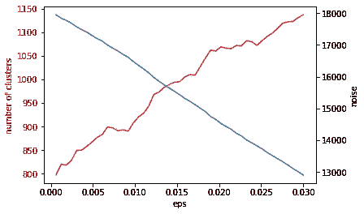**

****聚类数/噪声与 EPS 的关系****

**基于观察，我们认为 0.006 是运行 DBSCAN 算法的 eps 的合适值，该算法最终给出 881 个语义相似句子的聚类。**

**有关 881 集群的更多详细信息，请点击下面的链接。**

**[**https://www . ka ggle . com/great rxt/smart-reply-clustering-asury-output**](https://www.kaggle.com/greatrxt/smart-reply-clustering-annoy-output)**

## **训练模型**

**这是最关键的步骤，其中我们训练单层 LSTM 模型来接受输入文本并预测目标聚类标签。**

****

****模型预测工作流程****

**模型架构非常简单，第一层是一个嵌入层，它接受一个整数(代表数据集词汇表中的一个单词),并将其转换为该单词的 512 维密集矢量表示。下一层是 LSTM 层，后面是辍学率为 20%的辍学层。最后一层是具有 sigmoid 激活的致密层。一旦输入文本，密集层输出每个标签的概率。**

**该模型被训练 25 个时期。在配备 16 GB RAM 和第六代 I7 处理器的标准笔记本电脑上，每个纪元需要大约 50-60 分钟才能完成。因此，25 个纪元的训练需要一整天。如果我们的模型需要微调，因此需要一次又一次地训练，这会使训练变得有些乏味。因此，使用 TPU 加速器，在 Kaggle 笔记本上完成了 25 个时期的全部训练。一旦笔记本中的加速器选项切换到“TPU”，我们使用以下代码片段来启用 TensorFlow Keras 中的 TPU 培训。**

**我们实例化一个 TPUStrategy，然后在这个 TPUStrategy 的范围内实例化我们的模型。**

**一旦模型被训练，我们保存它以便以后使用。**

**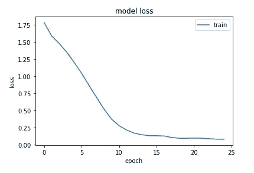**

****模型损失与历元数的关系****

**左边的图显示了模型损失与模型被训练的时期数的关系。**

**我们使用下面给出的函数“get_response”来获得文本输入的输出。该函数从用户处获取输入文本，并将其提供给模型。该模型进而预测每个分类标签的概率。然后以降序方式对概率进行排序，并且仅考虑具有前 5 个概率分数的标签(predictions . arg sort()[0][::-1][:n])。**

**一旦我们有了具有前 5 个概率分数的聚类标签，我们就遍历每个聚类，并从每个聚类中随机选取任何句子，并将其作为可能的响应显示给用户。**

## **最终输出**

**我们模型的一些样本输出(以及每个响应的概率分数)如下所示**

**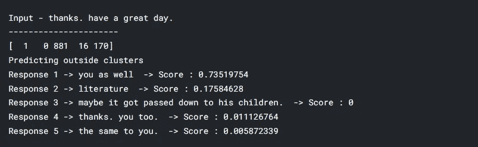**

**请注意，在生产设置中，得分为 0 的回答将被忽略。**

**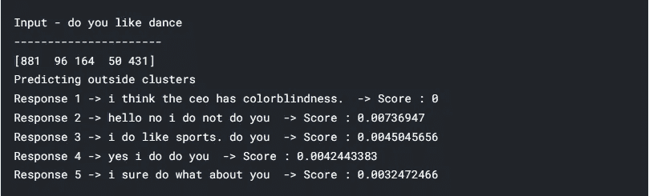****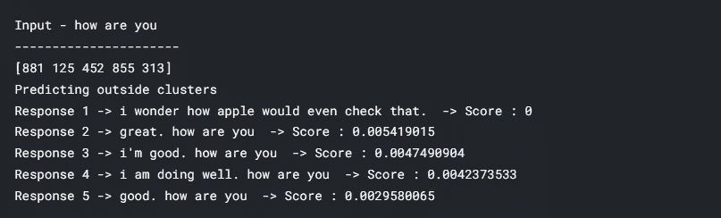**

# ****未来工作****

****对输入文本和目标文本进行词干/词尾排序****

**词干化是一种文本标准化技术，它通过删除常见的后缀或前缀来切断单词的结尾或开头，而词汇化则在将单词简化为其根单词之前考虑单词的形态分析。使用这样的技术，输入文本可以被标准化，然后输入到模型中，有望得到更好的预测。类似地，目标文本也可以被规范化，以便聚集相似的聚类并增加每个聚类的点数。**

****剔除点数较少的聚类****

**一些聚类具有非常少的点(只有 2、3 个点)，因此不足以训练模型。通过将 DBSCAN 中的“min_samples”设置为更高的值(大约 50)，可以删除这些点。但是这将减少响应集的数量。这个问题可以通过向我们的数据集添加更多的点来解决，如下所述。**

****使用附加数据集进行训练****

**合并额外的数据集可以帮助我们在每个聚类中获得更多的点。看起来 21，000+个点足以训练我们的模型，但是这些点分布在 880 个集群中。因此，一些聚类只有很少的训练点，这使得数据集非常不平衡。**

**通过合并更多的数据集来增加更多的点可能会解决这个问题。**

# **结论**

**有人可能会说，使用响应集而不是传统的基于文本生成的方法来训练深度神经网络限制了它们的巨大潜力。这是真的，因为使用响应集训练的网络将只有有限数量的响应，无论模型架构有多好或训练有素。另一方面，与我们当前的模型相比，一个训练有素的具有良好架构的模型可以给出更好、更多样的建议。**

**但是，正如已经解释过的，即使是最好的模型有时也会偏离轨道，并给出不适当的响应，这在生产设置中可能是不期望的。因此，在深度神经网络变得足够好以准确处理人类给出的任何类型的输入文本之前，我们可能不得不退回到这样的替代方法，以保证在现实世界的场景中遵守所需的标准。**

# **GitHub 链接**

**完整的代码可以在 GitHub 上找到，链接如下**

**【https://github.com/greatrxt/deep-suggestions **

# **作者的 LinkedIn 个人资料**

**[https://www.linkedin.com/in/rakshitpujari/](https://www.linkedin.com/in/rakshitpujari/)**

# ****参考文献****

**[https://www.appliedaicourse.com/](https://www.appliedaicourse.com/)**

**[https://towardsdatascience . com/lemma tization-in-natural-language-processing-NLP-and-machine-learning-a 4416 f 69 a7b 6](/lemmatization-in-natural-language-processing-nlp-and-machine-learning-a4416f69a7b6)**

**[https://blog . bitext . com/what-is-difference-thanking-and-lemma tization/](https://blog.bitext.com/what-is-the-difference-between-stemming-and-lemmatization/)**

**[https://sun Jackson . github . io/2018/06/19/a3f 95 a 167 B4 a 350 a 82 CB 523478 e 89 b 16/](https://sunjackson.github.io/2018/06/19/a3f95a167b4a350a82cb523478e89b16/)**

**[https://blog . keras . io/a-ten-minute-introduction-to-sequence-to-sequence-learning-in-keras . html](https://blog.keras.io/a-ten-minute-introduction-to-sequence-to-sequence-learning-in-keras.html)**

**[https://keras.io/examples/nlp/lstm_seq2seq/](https://keras.io/examples/nlp/lstm_seq2seq/)**

**[https://www.aclweb.org/anthology/W15-4640.pdf](https://www.aclweb.org/anthology/W15-4640.pdf)**

**谷歌的聪明回复—[https://www.kdd.org/kdd2016/papers/files/Paper_1069.pdf](https://www.kdd.org/kdd2016/papers/files/Paper_1069.pdf)**

**[https://Lena-voita . github . io/NLP _ course/seq 2 seq _ and _ attention . html # main _ content](https://lena-voita.github.io/nlp_course/seq2seq_and_attention.html#main_content)**

**[https://machinelementmastery . com/beam-search-decoder-natural-language-processing/](https://machinelearningmastery.com/beam-search-decoder-natural-language-processing/)**

**[https://en.wikipedia.org/wiki/Beam_search](https://en.wikipedia.org/wiki/Beam_search)**