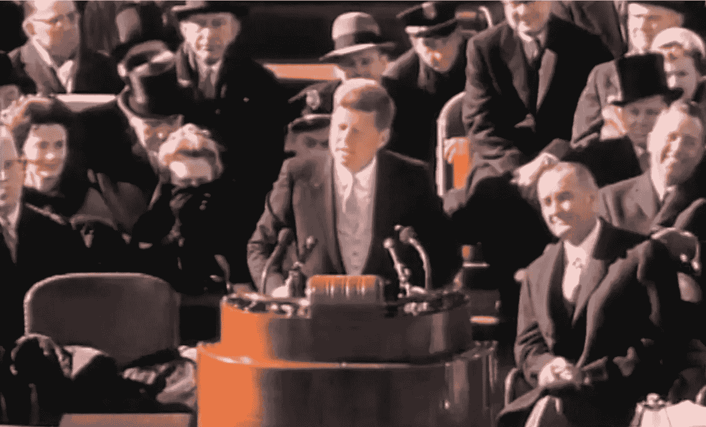
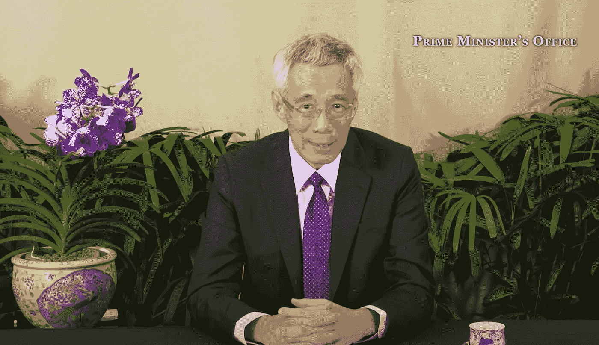

# 用 Wav2Vec2 抄写诗歌和演讲

> 原文：<https://towardsdatascience.com/transcribing-poetry-and-speeches-with-wav2vec2-2658c6510f06?source=collection_archive---------30----------------------->

## 迄今为止，音频文件的有效转录一直是现代 NLP 中主要的“缺失环节”之一。进入拥抱脸的脸书 Wav2Vec2 模型的实现，它产生了令人印象深刻的开箱即用的结果。


2021 年 1 月 20 日，诗人阿曼达·戈尔曼发表就职诗。通过 [PBS NewsHour 的 YouTube 剪辑](https://www.youtube.com/watch?v=LZ055ilIiN4)截屏。

AI 自己写不出伟大的诗歌(还不行？).但是它现在可以很好地转录诗歌朗诵，如果从 [Wav2Vec2 变压器模型](https://huggingface.co/transformers/model_doc/wav2vec2.html)得到的结果是什么的话。

我使用长度从 62 秒到 12.5 分钟不等的音频剪辑进行了测试，包括青年诗人阿曼达·戈尔曼的令人回味的[就职诗](https://www.youtube.com/watch?v=LZ055ilIiN4)，结果令人印象深刻。

高效的音频到文本转录是现代自然语言处理(NLP)工具包中“缺失的环节”之一。现在看来不再是了，这要归功于拥抱脸对脸书的 Wav2Vec2 模型的实现。

令人兴奋的是，它开辟了从音频文件到文本情感分析甚至翻译的“链式链接”NLP 任务的新可能性。这里需要注意的是，长音频剪辑以这种方式处理时确实是内存密集型的，对于没有超级电脑的人(比如我)来说需要额外的工作。

这篇文章概述了我最近试验的结果，并包括一个 [repo](https://github.com/chuachinhon/wav2vec2_transformers) 的链接，里面有笔记本和样本文件来运行你自己的试验。你可以在这里查看两个长片段[的输出结果。](https://www.dropbox.com/sh/evmoflm2w3a1zo1/AAAbKTt2fL45Sf8lIOS7RuJwa?dl=0)

# 回购、要求和参考

我的 [repo](https://github.com/chuachinhon/wav2vec2_transformers) 包含 3 个笔记本(2 个 Jupyter，1 个 Colab)和 3 套音频文件。要运行它们，您需要:

*   [变压器≥ 4.3](https://pypi.org/project/transformers/)
*   [Librosa](https://pypi.org/project/librosa/) (管理音频文件)

repo 中的[音频文件已被拆分并向下采样至 16kHz。如果您希望使用自己的音频剪辑，请确保它们以 16kHz 采样，因为这是 Wav2Vec2 基本模型预先训练和微调的频率。](https://github.com/chuachinhon/wav2vec2_transformers/tree/main/audio)

每个音频剪辑应该有多长？这将取决于你所能处理的计算量。Wav2Vec2 转录过程非常占用内存。试图转录超过 90 秒的音频文件都崩溃了，即使是在 Colab Pro 上。

因此，我将音频剪辑保持在最大 60 秒左右。要处理较长的音频片段，你必须将它们分成相等的部分，每部分一分钟(或者你的机器可以处理的任何东西)。我们稍后再讨论这个。

在我的试验中，我使用了 [Audacity](https://www.audacityteam.org/) 来分割音频文件。它是免费的，对于手头的任务来说绰绰有余。

在这篇文章中，我不会深入讨论技术细节。但是关于 Wav2Vec2 的文档和论文值得一读:

*   关于[拥抱脸](https://huggingface.co/transformers/model_doc/wav2vec2.html)的文档
*   关于 wav2vec 2.0 的论文:语音表示的自我监督学习框架
*   托管推理[拥抱面上的 API](https://huggingface.co/facebook/wav2vec2-base-960h)

在 Hugging Face 的 model hub 上有几个版本的 Wav2Vec2 模型。对于这个练习，我坚持使用 [wav2vec2-base-960h](https://huggingface.co/facebook/wav2vec2-base-960h) 基本型号。

# 尝试 1:“问问你能为你的国家做些什么”



1961 年 1 月 20 日，美国前总统约翰·肯尼迪发表就职演说。通过 JFK 总统图书馆和博物馆网站上的视频截图。

试用 Wav2Vec2 的最简单方法是使用一个小的音频剪辑，该剪辑对于模型来说可以相对快速地一次性转录。我从已故美国总统约翰·肯尼迪 1961 年著名的就职演说(第 13 分钟开始)中挑选了一个 62 秒的片段，这是 Wav2Vec2 的文字记录:

> 在漫长的世界历史中，只有少数几代人被赋予在自由面临最大危险时捍卫自由的职责。我不会逃避这一职责，我欢迎这一职责。我不相信我们中的任何人会与任何其他民族或任何其他一代人交换位置。**王锷为此付出的精力、信念和奉献精神将会使我们的国家和整个世卫组织为之服务 那团火发出的光芒**和**真的**像**世界，所以我的美国同胞**不要问你的国家能为你做什么，问你能为你的国家做什么****

Wav2Vec2 抄本中的粗体部分是有问题的部分。总的来说，在我看来，结果令人印象深刻。但是，在一个更长的音频剪辑中，如果说话的口音和节奏发生变化，该模型将如何表现呢？

# 试验 2:“我们攀登的山”


2021 年 1 月 20 日，诗人阿曼达·戈尔曼发表就职诗。通过 [PBS NewsHour 的 YouTube 剪辑](https://www.youtube.com/watch?v=LZ055ilIiN4)截屏。

为了与第一次审判形成鲜明对比的第二次审判，我提前 40 年跳到另一个美国总统就职典礼，并挑选了一个 5 分 34 秒的阿曼达·戈尔曼在美国国会大厦的台阶上发表一首美丽而令人回味的诗的片段。

然而，试图一次转录 334s 片段被证明是徒劳的，内存不足的问题反复破坏了我的笔记本。我最终找到了一个简单但笨拙的解决办法，将原始剪辑分成更小的 35 个剪辑，一次转录一个。见本[笔记本](https://github.com/chuachinhon/wav2vec2_transformers/blob/main/notebooks/2.0_wav2vec2_poetry.ipynb)。

这是来自 Wav2Vec2 的[文字记录](https://www.dropbox.com/s/zx4bfct1zhl18az/amanda_gorman.txt?dl=0):

```
MISTER PRESIDENT DOCTER **BYDEN** MADAM VICE PRESIDENT MISTER MHOFF AMERICANS AND THE WORLD WHEN DAY COMES WE ASK OURSELVES WHERE CAN WE FIND LIGHT IN THIS NEVER ENDING SHADE THE LOSS WE CARRY A SEA WE MUST WADE WE BRAVE THE BELLY OF THE BEAST WE'VE LEARNED THAT QUIET ISN'T ALWAYS PEACE IN THE NORMS IN NOTIONS OF WHAT JUST
IS ISN'T ALWAYS JUST IS AND YET THE DAWN IS HOURS BEFORE WE KNEW IT SOMEHOW WE DO IT SOMEHOW WE'VE WEATHERED AND WITNESSED A NATION THAT ISN'T BROKEN BUT SIMPLY UNFINISHED WE THE SUCCESSORS OF A COUNTRY AND A TIME WERE A SKINNY BLACK GIRL DESCENDED FROM SLAVES AND RAISED BY A SINGLE MOTHER CAN DREAM OF BECOMING PRESIDENT ONLY TO FIND HERSELF RECITING
FOR ONE AND YES WE ARE FAR FROM POLISHED FAR FROM **PESTIM** BUT THAT DOESN'T MEAN WE ARE STRIVING TO FORM A UNION THAT IS PERFECT WE **OR** STRIVING TO FORGE OR UNION WITH PURPOSE TO COMPOSE A COUNTRY COMMITTED TO ALL CULTURES COLORS CHARACTERS AND CONDITIONS OF MAN AND SO WE LIFT OUR GAZES NOT TO WHAT STANDS BETWEEN US BUT WHAT STANDS BEFORE US WE CLOSE THE DIVIDE BECAUSE WE **KNOT A
PUT OUR FUTSURE** FIRST WE MUST FIRST PUT OUR DIFFERENCES ASIDE WE LAY DOWN OUR ARMS TIL WE CAN REACH OUT OUR ARMS TO ONE ANOTHER WE SEEK HARM TO NONE AND HARMONY FOR ALL LET THE GLOBE IF NOTHING ELSE SAY THIS IS TRUE THAT EVEN AS WE GRIEVED WE **GREWE** THAT EVEN AS WE HURT WE HOPED THAT EVEN AS WE TIRED WE **TRIE** THAT WILL FOREVER BE TIED TOGETHER VICTORIOUS NOT BECAUSE WE WILL NEVER AGAIN **KNO** DEFEAT BUT BECAUSE WE WILL N
EVER AGAIN **SO** DIVISION SKIPSER TELLS US TO **INVISION** THAT EVERYONE SHALL SIT UNDER THE OWN VINE AND FIG TREE AND NO ONE SHALL MAKE THEM AFRAID IF WE'RE TO LIVE UP TO OUR OWN TIME **THAN** VICTORY WON'T LIE IN THE BLADE BUT IN ALL THE BRIDGES WE'VE MADE THAT IS THE PROMISE TO GLADE THE HILL WE **CLIME** IF ONLY WE DARE IT BECAUSE BEING AMERICAN IS MORE THAN A PRIDE WE INHERIT IT'S THE PAST WE STEP INTO AND HOW WE **RE
HAR** IT WE'VE SEEN A FOREST THAT WOULD SHATTER OR NATION RATHER THAN SHARE IT **WELD** DESTROY OUR COUNTRY IF IT MEANT DELAYING DEMOCRACY AND THIS EFFORT VERY NEARLY SUCCEEDED BUT WHILE DEMOCRACY CAN BE PERIODICALLY DELAYED IT CAN NEVER BE PERMANENTLY DEFEATED IN THIS TRUTH IN THIS FAITH WE TRUST FOR WHILE WE HAVE OUR EYES ON THE FUTURE OR HISTORY HAS ITS EYES ON US THIS IS THE ERA OF JUST REDEMPTION WE FEARED **A
CEPTION** WE DID NOT FEEL PREPARED TO BE THE **EIRS** OF SUCH A TERRIFYING HOUR BUT WITHIN IT WE FOUND THE POWER TO AUTHOR A NEW CHAPTER TO OFFER HOPE AND LAUGHTER TO OURSELVES SO WHILE ONCE WE ASKED HOW COULD WE POSSIBLY PREVAIL OVER CATASTROPHE NOW WE ASSERT HOW COULD CATASTROPHE POSSIBLY PREVAIL OVER US WE WILL NOT MARCH BACK TO WHAT WAS BUT MOVE TO WHAT SHALL BE A COUNTRY THAT IS BRUISED BUT WHOLE **BE
VOLENCE** BUT BOLD FIERCE AND FREE WE WILL NOT BE TURNED AROUND OR INTERRUPTED BY INTIMIDATION BECAUSE WE KNOW OUR INACTION AND INERTIA WILL BE THE INHERITANCE OF THE NEXT GENERATION OUR BLENDERS BECOME THEIR BURDENS BUT ONE THING IS CERTAIN IF WE MERGE MERCY WITH MIGHT AND MIGHT WITH **MIGHT** THEN LOVE BECOMES OUR LEGACY **IN** CHANGE OUR CHILDREN'S BIRTHRIGHT SO LET US LEAVE BEHIND A COUNTRY
BETTER THAN ONE WE WERE LEFT WITH EVERY BREATH FROM OUR BRONZE POUNDED CHEST WE WILL RAISE THIS WOUNDED WORLD INTO A WONDROUS ONE WE WILL RISE FROM THE **GOLDLIMD** HILLS OF THE WEST WE WILL RISE FROM THE WIND SWEPT NORTHEAST WHERE OUR FORFATHER'S FIRST REALISE REVOLUTION WE WILL RISE FROM THE LAKE **RIMD** CITIES OF THE MIDWESTERN STATES WE WILL RISE FROM THE SUNBAKED SOUTH WE WILL REBUILD RECONCILE AND **BECOVER** AND EVERY KNOWN NOOK OF OUR NATION IN EVERY CORNER CALLED OUR COUNTRY OUR PEOPLE DIVERSE AND BEAUTIFUL WILL **EMMERGE** BATTERED
AND BEAUTIFUL WHEN DAY COMES WE STEP OUT OF THE SHADE AFLAME AND UNAFRAID THE NEW DAWN BALLOONS AS WE FREE IT FOR THERE WAS ALWAYS LIGHT IF ONLY WERE BRAVE ENOUGH TO SEE IT IF ONLY **WERE** BRAVE ENOUGH TO BE IT
```

同样，粗体部分是模型没有正确处理的有问题的部分。但是我认为这些都是很小的问题，很容易解决。随着 Wav2Vec2 模型变得更加复杂，我非常肯定结果会更好。

# 试验三:新加坡和 WEF



通过[新加坡总理办公室的 YouTube 频道截屏。](https://www.youtube.com/watch?v=izrdoAm4_Gw)

在第三次试验中，我想在一个超过 10 分钟的剪辑上评估这个模型，这个剪辑的特点是一个说话者带有亚洲口音。我选定了 2021 年 1 月 29 日新加坡总理李显龙在世界经济论坛达沃斯议程周的演讲。

这一次，我把 12 分钟 30 秒的演讲分成了 13 个部分(12 个 60 秒的片段和 1 个 30 秒的片段)，并在 [Colab Pro](https://github.com/chuachinhon/wav2vec2_transformers/blob/main/notebooks/2.1_wav2vec2_colab.ipynb) 上运行。《T2》的剧本花了 2 分钟 4 秒制作完成:

```
IAM VERY **HONOR** TO SPEAK AT **DISCLOSING** ADDRESS AND I LIKE TO CONGRATULATE PROFESSOR **SCHOEB** YOURSELF AND THE WHOLE **BLW  F** TEAM FOR PUTTING TOGETHER A SUCCESSFUL PROGRAMM IT 'S BEEN A YEAR SINCE WE WERE ALL PHYSICALLY GATHERED IN **DAVORCE** FOR THE FIFTIETH ANNUAL MEETING **OFER THE DBU F** AT THAT TIME WE WERE JUST STARTING TO HEAR ABOUT THIS NEW VIRUS AND TRYING TO UNDERSTAND WHAT WAS HAPPENING NONE OF US ANTICIPATED HOW QUICKLY A FULL SCALE **PANDAMIC** WOULD BLOW UP AND DRAMATICALLY CHANGE OUR WORLD THE **DESRUPTION** TO LIVES AND LIVELIHOODS HAS BEEN MASSIVE AND UNPRECEDENTED THE **VIRAS** IS STILL RAGING IN MANY COUNTRIES IN THE DEVELOPED WORLD IN THE US AN EUROPE AND ALSO IN THE DEVELOPING WORLD IN AFRICA SOUTH AMERICA AND SOUTH ASIA THANKFULLY WITH **BAXINES** BECOMING AVAILABLE THERE IS SOME LIGHT AT THE END OF THE TUNNEL IT IS NOW
CRITICAL THAT **VAXINES** ARE **RULED** OUT QUICKLY ACROSS THE WORLD BUT EVEN WITH **VAXINES** THE **PANDAMIC** IS FAR FROM BEING QUELLED THE NEW VARIANCE DISCOVERED **AND** THE U K IN SOUTH AFRICA AND BRASIL ARE **WARRYING** AND FURTHER MUTATIONS WILL SURELY EMERGE UNTIL A LARGE PART OF THE WORLD'S POPULATION IS VACCINATED WE STILL **NEEDS** STRONG PUBLIC HEALTH MEASURES EVERYWHERE TO SUPPRESS THE SPREAD OF THE **VIOLUS** AND KEEP POPULATION SAFE WHAT WILL THE **POSTCOVE NINETEEN WOLL** LOOK LIKE WILL COUNTRIES EMERGE MORE **RESOLVE** TO BUILD A MORE **RESILIANT** BUT STILL GLOBALIZED **WELL** OR ARE WE HEADED TOWARDS A LESS INTEGRATED GLOBAL ECONOMY A LESS STABLE INTERNATIONAL ORDER THE ANSWER DEPENDS ON THE DECISIONS THAT COUNTRIES TAKE NOW EVEN BEFORE **COVER NINETEEN** GLOBILIZATION WAS ALREADY UNDER PRESSURE CONFIDENCE AND **MALTILACERAL** INSTITUTIONS AND RULES AND **NORMES** WAS ERODING POPULOUS POLITICS NATIVISM NATIONALISM PROTECTIONISM WERE ON THE RISE **COUNTRYS** INITIAL REACTIONS TO THE **PENDEMIC** SEEMED TO **HERL GRUBILIZATIONS DEMIES** BORDERS WERE CLOSE SUPPLY CHANGE WERE BADLY DISRUPTED EACH COUNTRY SCRAMBLE TO SECURE ITS OWN SUPPLIES OF ESSENTIAL GOODS ESPECIALLY IN MEDICINES FACE MASKS AND VENTILATORS IT WAS EACH MAN FOR HIMSELF BUT AS THEIR SITUATION UNFOLDED WE WERE FORCEFULLY REMINDED THAT OUR FATES WERE INTERTWINED AND THAT WE HAD TO WORK TOGETHER AND SO WE DID IN MANY AREAS WE RESTORED SUPPLY CHANGE WE **REPATRATED** EACH OTHER'S CITIZENS STUCK **OVER SEAS** WE SHARED TESTS AND MEDICAL SUPPLIES WE SUPPORTED **VAXYNG MALTILATERALISM** INITIATIVES LIKE THE KOVACS
SO THAT ALL COUNTRIES **AV SPECIALLY** THE LEAST DEVELOP ONES WOULD HAVE ACCESS TO **VACSCENES** AND AS WE GRADUALLY REBUILT CONFIDENCE IN ONE ANOTHER WE OPENED UP CONTROL CORRIDORS FOR TRAVEL AND TRADE BETWEEN COUNTRIES CRUCIALLY INTERNATIONAL SCIENTIFIC CO OPERATION IN THE FIGHT AGAINST **COVERNINETEEN** CONTINUE DOCTORS AND SCIENTISTS SHARED INFORMATION ABOUT THE DISEASE AND THE VIRUS STUDYING THEM DEVELOPING TREATMENTS AND TESTING **VAKSCENES** THIS ENABLE US TO IMPROVE PATIENT CARE AND TO PRODUCE EFFECTIVE **ACTENES** IN RECORD TIME SOME USING NEW **ECKNOWLEDGIES** SUCH INTERNATIONAL CO OPERATION AND **MALTILATERAL** EFFORTS REMAIN ESSENTIAL TO TACKLE THE GLOBAL PANDEMIC COHERENTLY WITH BORDER CLOSURES AND LOCK DOWNS ECONOMIES HAVE ALL TAKEN A DEEP PLUNGE THE **LIBLIHOODS** OF MILLIONS CAME UNDER **IN
NORMOUS** STRESS ONLY UNPRECEDENTED LEVELS OF EMERGENCY SPENDING AND **MAGETARY** STIMULUS HAVE KEPT US **AFLOAD** PROVIDING A LIFE LINE TO COMPANIES WORKERS AND FAMILIES CENTRAL BANKS HAVE PLAYED THEIR PART TO PREVENT FINANCIAL SYSTEMS AND GLOBAL CAPITAL MARKETS FROM SEIZING UP **UNLIKEN** PREVIOUS CRISES THESE EXTRAORDINARY MEASURES CANNOT BE SUSTAINED INDEFINITELY IN FACT SPENDING PACKAGES ARE ALREADY TAPERING OFF BUT HOPEFULLY AS **FASCINATION** BECOMES MORE WIDESPREAD AND WE MAKE HEADWAYS SUPPRESSING THE **VIOLUS COVET NINETEEN** RESTRICTIONS CAN BE PROGRESSIVELY EASE AND ECONOMIES WILL **REBOUN** THE WORLD BANK AND **I MY** FORECAST GLOBAL GROWTH TO RECOVER THIS YEAR IT WILL NOT RESTORE OUTPUT TO **PRICOVENINETEEN** LEVELS BUT **TI** SOMETHING STILL TO BE THANKFUL FOR NOW WE ARE ENTERING A NEW PHASE
THE PANDEMIC HAS EXPOSED BUSINESSES AND JOBS WHICH ARE NOT GOING TO REMAIN VIABLE THEY HAVE TO BE LET GO TO ALLOW NEW GROWTH AND BETTER JOBS TO BE CREATED IN THEIR PLACE HARD DECISIONS HAVE TO BE MADE AND THIS WILL **EXASCEBATE** EXISTING STRESSES GOVERNMENTS WILL COME UNDER MORE PRESSURE TO ADOPT PROTECTIONISTS AND **NATIVEST** POSITIONS TO RESUME GROWTH WE MUST LOOK BEYOND RETURNING TO THE **STATEST QUA** ANTI WE MUST LOOK AHEAD WILEN COUNTRIES GOVERNMENTS AND BUSINESSES MUST COLLABORATE TO TACT NEW MARKETS AND DEVELOP NOVELT ACKNOWLEDGES EXTERNALLY COUNTRIES NEED TO STRENGTHEN THE FRAMEWORK FOR INTERNATIONAL CO OPERATION AS AN IMMEDIATE TASK COUNTRIES SHOULD COLLABORATE TO DEVELOP A STANDARDIZE ROBUST SYSTEM TO VERIFY THE AUTHENTICITY OF TESTS AND VACCINATIONS THIS IS ESSENTIAL TO REOPEN B
ORDERS AND RESUME INTERNATIONAL TRAVEL IN THE LONGER TERM COUNTRIES SHOULD WORK TOGETHER TO UPDATE AND **STRENGTHENINTS TERNATIONAL** INSTITUTIONS LIKE THE **W TEOL** AND CREATE NEW RULES TO GOVERN AND FOSTER NOVEL FORMS OF ECONOMIC ACTIVITY FOR EXAMPLE TO SUSTAIN THE GROWTH OF THE DIGITAL ECONOMY AND FACILITATE SAFE SECURE AND EFFICIENT CROSS BORDER E PAYMENTS AND DATA FLOWS WE HAVE TO DEVELOP NEW E TRADE REGULATIONS **SINGAPOLE** HAS CONCLUDED DIGITAL ECONOMY AGREEMENTS WITH LIKE MINDED COUNTRIES LIKE AUSTRALIA CHILLE AND NEW **ZEALAN** WE HOPE THAT THIS IS ONLY THE BEGINNING WE ENCOURAGE ALL COUNTRIES TO COME TOGETHER TO SHAPE AND GROW THE DIGITAL ECONOMY GLOBLY **THUSSIGNING** OF THE **REGINAL** COMPREHENSIVE ECONOMIC PARTNERSHIP OR THE **ARLC E P LAST
TIA** BY FIFTEEN COUNTRIES IN ASIA WAS ALSO A MAJOR COLLECTIVE COMMITMENT TO TRADE **AN** ECONOMIC INTEGRATION AMIDST THE PANDEMIC THE **ARC P** WILL BROADEN **TRAN OPEN AT** MARKETS IN EAST AND SOUTH **EASTATIA** AND AUSTRALASIA AND HOPEFULLY PREVENT THE PUSH FOR **RASILIANTS** AND SELF RELIANCE FROM GOING TOO FAR WHILE DEALING WITH THE AFTERMATH OF **COVET NINETEEN** WE MUST NOT LOSE SIGHT OF OTHER LONG TERM CHALLENGES THAT AFFECT ALL OF US ONE MAJOR PROBLEM IS CLIMATE CHANGE TWENTY TWENTY WAS THE WORLD'S **HOTTESEER** ON RECORD EXTREME WEATHER EVENTS HAVE BECOME MUCH MORE FREQUENT LAST **YIAR** CARBON EMISSIONS WENT DOWN BUT ONLY BECAUSE OF **COVET NINETEEN** OTHERWISE THE TREN HAS BEEN INEXORABLY UPWARDS CLIMATE CHANGE IS CLEARLY **EX
CELERATING** DANGEROUSLY AND IT IS LATE IN THE DAY BUT IF COUNTRIES ACT NOW AND IN CONCERT HUMAN KIND CAN STILL HOPE TO AVERT A CATASTROPHE WE ALL KNOW WHAT WE NEED TO DO WITHIN INDIVIDUAL COUNTRIES TO MUSTER SUPPORT FOR POLICIES AND MEASURES THAT WILL SLOW THE CHANGES AND LIMIT GLOBLE WARNING COLLECTIVELY TO SET HIGHER COMMON STANDARDS AND HOLD ONE ANOTHER TO OUR MUTUAL COMMITMENTS WHETHER IT'S TIGHTENING EMISSION RULES **FASING** OUT **FOSSILFIELD** SUBSIDIES OR PROMOTING RENEWABLE ENERGY WE CAN TAKE SOME COMFORT THAT COUNTRIES ARE NOW TAKING CLIMATE CHANGE MORE SERIOUSLY THE US HAS REJOINED THE PARIS AGREEMENT CHINA HAS ANNOUNCED A ZERO EMISSIONS TARGET BY TWENTY **SIXLY** BUT MUCH MORE STILL NEEDS TO BE DONE GOING BEYOND OUR PARIS COMMITMENTS OTHERWISE
WE RISK GRAVE CONSEQUENCES IN THE NOT TOO DISTANT FUTURE EVEN WITHIN OUR OWN LIFETIMES TO TACKLE THESE CHALLENGES COVET NINETEEN ECONOMIC RECOVERY AND CLIMATE CHANGE GLOBA CO OPERATION IS ESSENTIAL BUT GETTING COUNTRIES TO WORK TOGETHER IS NOT SIMPLY A MATTER OF NURTURING AND SHOWING GOODWILL THE INTERNATIONAL ORDER MUST BE UNDERPINNED BY STABLE GREAT POWER RELATIONS BIG COUNTRIES NATURALLY JOSTLE AND COMPETE WITH ONE ANOTHER FOR INFLUENCE AND POWER BUT THEY ALSO NEED TO WORK WITH ONE ANOTHER THROUGH ESTABLISH AN ACCEPTED RULES AND NORMS ON ISSUES WHICH AFFECT US ALL BE IT **PANDAMICS** ECONOMIC CO OPERATION OR CLIMATE CHANGE RECENT YEARS HAVE WITNESSED GROWING FRICTION AND DISTRUST RATHER THAN CO OPERATION AND CONFIDENCE BUILDING AMONG MAJOR POWERS THE MOST WORRYING TREND I
S THE **W S CHINA** RELATIONS THIS REMAINS THE MOST IMPORTANT **BYLATURAL** RELATIONSHIP FOR THE WORLD IN THE YEARS AHEAD OVER THE LAST FOUR YEARS TENSIONS BETWEEN THE U S AND CHINA HAVE INTENSIFIED SHARPLY BOTH POWERS HAVE ADOPTED MORE **SERTIVE** AND UNCOMPROMISING POSTURES THE U S NOW SEES CHINAS AS STRATEGIC RIVAL AND CHALLENGER TO ITS PRE EMINENT POSITION AND CHINA IS VIGOROUSLY ASSERTING WHAT IT CONSIDERS ITS RIGHTFUL PLACE IN THE WORLD ON BOTH SIDES DOMESTIC PRESSURES TO HARDEN THEIR EXTERNAL POSITIONS ARE CONSIDERABLE AND MODERATE VOICES HAVE BEEN MARGINALIZE GIVEN THE ENORMOUS STAKES DIFFICULT AS IT WILL BE IT CANNOT POSSIBLY BE TOO LATE FOR THE U S AND CHINA TO RESET THE TONE OF THEIR INTERACTIONS AND AVERT A CLASH
BETWEEN THEM WHICH WILL BECOME A GENERATIONAL TWILIGHT STRUGGLE THE NEW US ADMINISTRATION IS AN OPPORTUNITY TO STEER THE RELATIONSHIP TOWARDS SAFER WATERS AMID PRESIDENT **BIDONS** MANY URGENT PREOCCUPATIONS THE U S CHINA RELATIONSHIP SHOULD BECOME A KEY STRATEGIC **PRORITY** TO **BILD** A STABLE INTERNATIONAL ORDER REGULAR CONSTRUCTIVE DIALOGUE IS CRITICAL IAM THUS HAPPY TO SEE MANY DISTINGUISHED PARTICIPANTS TAKING PART IN THE **DAVOSA** **GENDER** WEEK THE WORLD ECONOMIC FORUM PLAYS AN IMPORTANT RULE PROMOTING DIALOGUE BRINGING TOGETHER LEADERS IN GOVERNMENT INDUSTRY AND CIVIL SOCIETY IT'S A FORUM WHERE LEADERS FROM COUNTRIES LARGE AND SMALLER LIKE CAN SPEAK AND BE HEARD AND THIS IS WHY WHEN PROFESSOR **SHROB** ASK ME WHETHER **SINGO POET HOSTESS** SPECIAL ANNUAL MEETING OF THE W E F I AGREED IT WAS NOT
A DECISION LIGHTLY TAKEN BUT WE ARE HAPPY TO MAKE A MODEST CONTRIBUTION TO THE GLOBAL DISCUSSION AS THE HOST COUNTRY WE WILL WORK WITH A W E F TO ENSURE THE HEALTH AND SAFETY OF ALL I WELCOME ALL OF YOU TO **SING A POR** IN MAY SO THAT WE CAN TAKE THESE DISCUSSIONS FORWARD AND FORGE A NEW **PARTH** AHEAD TOGETHER THANK YOU
```

按照前两次试验，粗体部分表示有问题的地方。演讲中有很多技术术语，很明显是模型出错了，就像总理对一些单词的发音一样。

这次需要做更多的清理工作。但是这花了 2 分钟 4 秒。想一想手动抄写演讲稿可以节省多少时间。

Wav2Vec2 的转录本无论如何都不是完美的。对于某些用例来说，缺少标点符号可能是一个问题，音频剪辑的管理需要额外的资源。

但是考虑到所有的事情，我会说 Wav2Vec2 模型在 NLP 中开辟了令人兴奋的新的可能性，不仅仅是快速和准确的转录。我对通过其他 transformer 模型将抄本用作翻译、情感分析或摘要的输入的前景感到特别兴奋。

这会变得非常有趣。

和往常一样，如果你在这篇文章或我之前的文章中发现了错误，请联系我:

*   推特:[蔡振鸿](https://medium.com/u/b3d8090c0aee?source=post_page-----aad7f2e1d0a0----------------------)
*   领英:[www.linkedin.com/in/chuachinhon](http://www.linkedin.com/in/chuachinhon)

这篇文章的回购，包含图表的数据和笔记本，可以在这里找到。