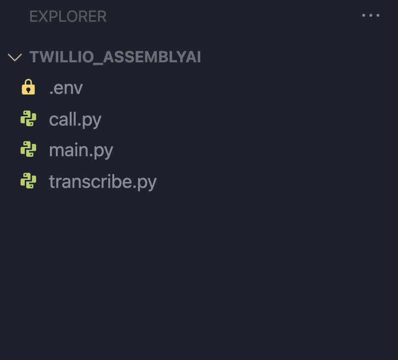
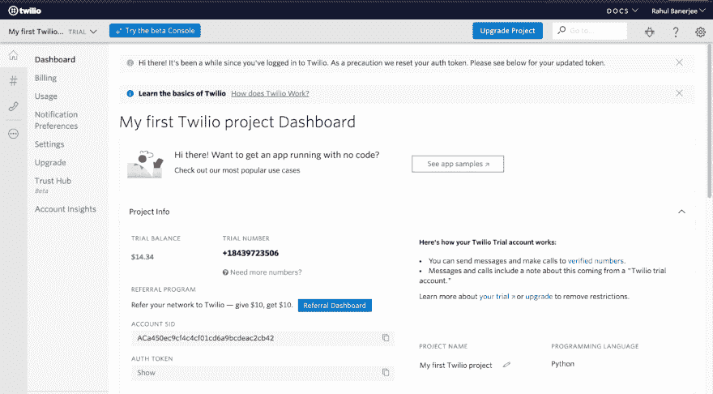
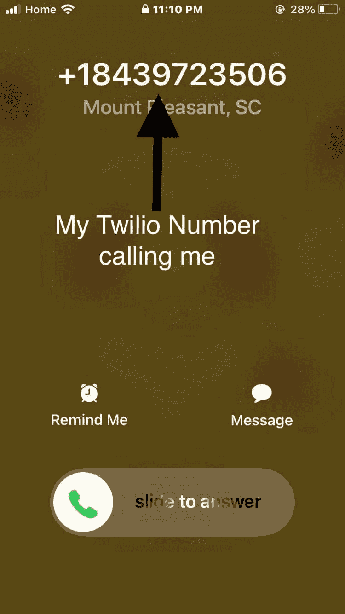
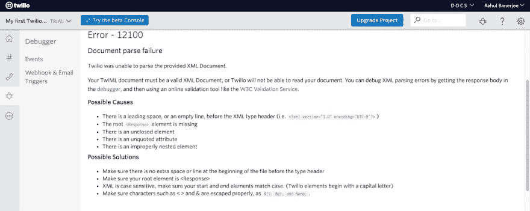
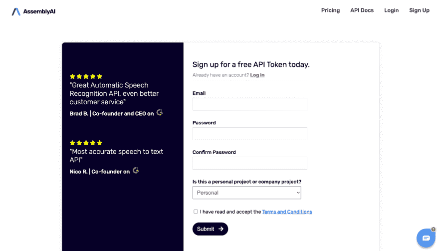
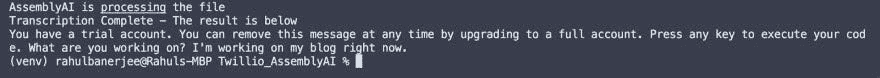
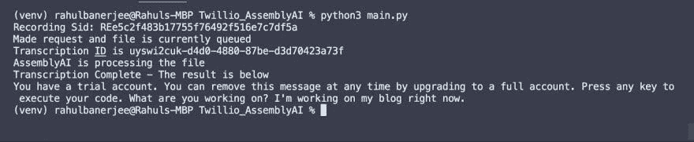

# 使用 Twilio API 和 AssemblyAI 转录 Twilio 录音

> 原文：<https://towardsdatascience.com/transcribing-twilio-recordings-using-the-twilio-api-and-assemblyai-4daf25fa32f0?source=collection_archive---------36----------------------->

## 我们将使用 Twilio API 和 AssemblyAI API


照片由[奎诺·阿尔](https://unsplash.com/@quinoal?utm_source=unsplash&utm_medium=referral&utm_content=creditCopyText)在 [Unsplash](https://unsplash.com/s/photos/phone?utm_source=unsplash&utm_medium=referral&utm_content=creditCopyText) 上拍摄

在本教程中，我们将使用 [AssemblyAI 的 API](https://docs.assemblyai.com/overview/getting-started) 用 Twilio 转录一段通话记录。我们将使用 Python 来编写脚本。我们将讨论以下内容

*   我们将使用的库/API
*   设置环境和文件结构
*   使用 twilio API
*   使用 AssemblyAI API
*   转录录音

# 要求

*   Python 的基础知识
*   虽然不是必需的，但是熟悉请求库将会有所帮助

# GitHub 回购链接

你可以在这里找到完整的[源代码](https://github.com/rahulbanerjee26/twilio_assemblyai)

# 我们将使用的库/API

# 特维利奥

Twilio 是一项让你使用 API 拨打/接听电话和短信的服务。Twilio 还为他们的 API 提供了一个官方的[包装器](https://pypi.org/project/twilio/)。包装器使得与他们的 API 通信更加容易。在本教程中，我们将使用它们的包装器。[Jovan Hernandez](https://medium.com/hackernoon/using-twilio-to-send-sms-texts-via-python-flask-and-ngrok-9874b54a0d3)[撰写的这篇文章](https://medium.com/u/3cd0a0ff5636?source=post_page-----4daf25fa32f0--------------------------------)讲述了如何使用 Twilio 和 Python。

# AssemblyAI

[AssemblyAI](https://docs.assemblyai.com/overview/getting-started) 可以将音频转换成文本。它提供了一个任何现代编程语言都可以使用的 REST API。例如:Python，JavaScript，PHP 等。

# 要求

我们将使用[请求库](https://requests.readthedocs.io/)向 AssemblyAI 的 REST API 发出请求。阅读亚当·斯奈德[的文章](https://medium.com/u/4f07b5458966?source=post_page-----4daf25fa32f0--------------------------------)来学习更多关于在 Python 中使用请求的知识。

# Python-dotenv

为了遵循最佳实践，我们将在一个. env 文件中存储我们的凭据和电话号码。Python-dotenv 库帮助我们从。环境文件

# 设置环境和文件结构

# 创建必要的文件

使用命令行创建新的文件夹/目录

```
mkdir twilio_assemblyai
```

将目录更改为新创建的文件夹

```
cd twilio_assemblyai
```

为了保证机密凭证的安全，最好将凭证存储在. env 文件中。然后我们可以使用 [Python-dotenv](https://pypi.org/project/python-dotenv/) 库从。环境文件。让我们继续创建。env 文件，以及我们将一起构建的 3 个 python 文件。

*如果使用 Windows:*

```
New-Item main.py, transcribe.py, call.py ,.env
```

*如果使用 macOS 或 Linux:*

```
touch main.py; touch transcribe.py; touch call.py ;touch .env
```

以下是我们刚刚创建的文件的概述:

*   [call.py](https://github.com/rahulbanerjee26/twilio_assemblyai/blob/main/call.py) —该文件包含使用 twilio 发出呼叫并创建该呼叫记录的脚本
*   [transcripte . py](https://github.com/rahulbanerjee26/twilio_assemblyai/blob/main/transcribe.py)—该文件包含与 AssemblyAI 的 API 交互所需的函数
*   [main.py](https://github.com/rahulbanerjee26/twilio_assemblyai/blob/main/main.py) —这个文件集合了我们在 transcribe.py 和 call.py 中的函数，所以我们有一个打电话的脚本，然后用 AssemblyAI 转录那个电话的录音
*   。env —这个文件将包含我们的秘密凭证，比如我们的 API 凭证、电话号码和我们发出的呼叫的 ID

# 创建和激活虚拟环境

如果这是您第一次使用虚拟环境，您必须使用以下命令安装 [virtualenv](https://pypi.org/project/virtualenv/) :

*如果使用 Windows:*

```
python -m pip install --user virtualenv
```

*如果使用 macOS 或 Linux:*

```
python3 -m pip install --user virtualenv
```

确保你在我们在教程开始时创建的目录中。如果不是，只需使用 cd 命令来更改目录。

```
cd twilio_assemblyai
```

首先，我们需要通过在命令行上输入以下代码来创建一个虚拟环境:

*如果使用 Windows:*

```
python -m venv venv
```

*如果使用 macOS 或 Linux:*

```
python3 -m venv venv
```

然后，我们需要使用以下命令激活本地虚拟环境:

*如果使用 Windows:*

```
venv/Scripts/activate
```

*如果使用 macOS 或 Linux:*

```
source venv/bin/activate
```

关于如何建立虚拟环境以及它们如何工作的更多细节，你可以参考官方 Python 文档..



文件结构截图

# 安装所需的库

我们需要安装我们在“我们将使用的库/API”一节中讨论过的以下库

*   python-dotenv
*   要求
*   特维利奥

*如果使用 Windows:*

```
pip install twilio, requests, python-dotenv
```

*如果使用 macOS 或 Linux:*

```
pip3 install twilio, requests, python-dotenv
```

# 使用 twilio API

# 获取 API 凭据

*   在这里创建一个 twilio 账户[。你会得到一个免费的 twilio 电话号码。](https://www.twilio.com/try-twilio)


Twilio 网站

*   使用提供的免费电话号码，您只能向经过验证的号码拨打电话。在注册过程中，添加您的个人号码并进行验证。我们将拨打经过验证的号码。您可以在此添加多个验证号码
*   转到您的[账户仪表板](https://www.twilio.com/console?)
*   在项目信息部分，您应该看到您的**账户 SID** 和**认证令牌**。这些是您使用 twilio API 的凭证。我们将它们存储在。我们之前创建的 env 文件。
*   在项目信息部分，你还应该看到你的 twilio 电话号码。我们会将此电话号码与经过验证的电话号码一起保存在。环境文件。



Twilio 仪表板

```
account_sid = "YOUR TWILIO ACCOUNT SID"
auth_token = "YOUR TWILIO AUTH TOKEN"from_phone_number = "YOUR TWILIO PHONE NUMBER"
to_phone_number = "YOUR VERIFIED NUMBER"
```

# 用于拨打和记录呼出电话的功能

我们将使用 twilio 库来打电话。本节中的所有代码都应该在 [call.py](https://github.com/rahulbanerjee26/twilio_assemblyai/blob/main/call.py) 文件中。首先，让我们导入所需的库

```
import os
from dotenv import load_dotenv
from twilio.rest import Client
import requests
from requests.auth import HTTPBasicAuth
```

**客户端**让我们创建一个 twilio 包装器的实例。我们将使用这个实例的方法进行调用。在创建实例之前，让我们定义一个函数。

```
def make_phone_call(client,from_phone_number,to_phone_number):
    return None
```

上述函数将接受一个 **twilio 客户端**实例、我们的 twilio 电话号码和我们验证过的电话号码作为参数。现在，让它保持空白。我们稍后将回到这个问题。

现在，让我们从. env 加载我们的凭证和电话号码。创建一个 **twilio client** 实例将需要这些凭证。

```
if __name__ == '__main__':
    load_dotenv()
    account_sid = os.environ.get('account_sid')
    auth_token = os.environ.get('auth_token')
    from_phone_number = os.environ.get('from_phone_number')
    to_phone_number = os.environ.get('to_phone_number') client = Client(account_sid, auth_token)
    call_sid = make_phone_call(client, from_phone_number, to_phone_number) print(f'Call sid is {call_sid}')
```

上面的代码片段创建了一个 **twilio 客户端**实例。调用 **make_phone_call** ，并将 **twilio client** 实例和电话号码作为参数传递。

现在，让我们编写 **make_phone_call** 函数，该函数将向我们验证过的电话号码发出呼叫并进行录音。该函数将返回呼出呼叫的 ID。这个 ID 需要存储在。env 文件，我们之前创建的。

```
def make_phone_call(client_,from_phone_number_,to_phone_number_):
    '''
    Parameter:
        client: A twillio client instance
    Return:
        call.sid: The sid of the outgoing call
    '''
    phone_call = '''<Response>
    <Say>What are you working on?</Say>
    <Pause length="5"/>
    </Response>''' call = client_.calls.create(
                            record = True,
                            twiml=phone_call,
                            from_=from_phone_number_,
                            to = to_phone_number_
                        )   
    return call.sid
```

变量 **phone_call** 是我们拨出电话时将被读取/播放的脚本。它必须用类似于 HTML/XML 的 [TwiML](https://www.twilio.com/docs/voice/twiml) 来编写。出于本教程的目的，我们只需要关注以下 TwiML 元素:

*   [Say](https://www.twilio.com/docs/voice/twiml/say) —这个标签之间的内容只是在传出时朗读
*   [暂停](https://www.twilio.com/docs/voice/twiml/pause) —暂停并让被呼叫者讲话。它有一个属性 **length** ，表示呼叫暂停的持续时间。
*   响应——它类似于 **html** 标签。基本上，整个脚本必须在响应标记之间

所以把这些片段放在一起，这就是变量 **phone_call** 中的脚本所做的

*   询问被叫者他们正在做什么
*   等待 5 秒钟，等待被呼叫者说话

**客户端**实例的 **calls.create** 方法发出一个电话呼叫。它接受以下参数

*   **记录** —一个布尔值，告诉 twilio 记录电话
*   **twiml** —通话过程中要播放的脚本
*   **from_** —拨打电话的号码。在我们的例子中，它是 twilio 数
*   **到** —我们要呼叫的号码。如前所述，如果你使用的是免费帐户，它必须是一个经过验证的号码。

一旦你运行一个脚本，你应该会收到一个电话对你的验证号码。键入以下命令运行脚本



Twilio 电话号码呼叫

*如果使用 Windows:*

```
python call.py
```

*如果使用 macOS 或 Linux:*

```
python3 call.py
```

下面是 **make_phone_call** 函数的输出


终端输出

记下 **make_phone_call** 函数返回的调用 sid。接下来，将您的呼叫 sid 存储在。环境文件。

```
call_sid = ‘YOUR CALL SID’
```

如果您遇到任何错误，您可以检查[可编程语音仪表板](https://www.twilio.com/console/voice/dashboard)。

Twilio 为调试错误信息提供了有用的消息。一个常见的错误是脚本的格式。确保脚本中没有多余的空格或新行。下面是仪表板中的一个错误示例



Twilio 错误日志

# 函数来获取录制 ID

Twilio 提供了以下 API 端点来获取特定调用的记录 id。需要注意的是，一个呼叫可以有多个相关的录音，但是在我们的例子中，整个呼叫只有一个录音。例如:特定时间范围的记录。我们的通话有一段录音，是整个通话的录音。

```
https://api.twilio.com/2010-04-01/Accounts/{account_sid}
/Calls/{call_sid_}/Recordings.json
```

Twilio 使用 [HTTPBasicAuth](https://docs.python-requests.org/en/master/user/authentication/) 来认证对其 API 端点的请求。下面，我们将编写一个函数来获取我们的呼叫记录的 ID，我们需要它来下载该记录。

```
def get_recording_sid(account_sid_,auth_token_,call_sid_):
    '''
    Parameter:
        account_sid: Twilio Account SID,
        auth_token: Twilio API Key/Auth Token
        call_sid_: Call Sid
    Return:
        recording.sid: The sid of the recording
    '''
    url = f"https://api.twilio.com/2010-04-01/Accounts/{account_sid_}"\
        + f'/Calls/{call_sid_}/Recordings.json'
    result = requests.get(url , auth = HTTPBasicAuth(account_sid_,     auth_token_))
    recordings  = result.json()
    # Since our call has a single recording, we just need to access the first               
    # element in the list of recordings. If a call has multiple recordings     
    #  associated with it, this list will contain the SIDs of all the      
    #  recordings.
    recording_sid = recordings['recordings'][0]['sid']
    return recording_sid
```

一旦有了 twilio 调用 id，就可以调用 **get_recording_sid** 函数来获得一个录音 ID。下面是调用该函数的方式

```
recording_sid = get_recording_sid(account_sid, auth_token, call_sid)
print(f"Recording Sid: {recording_sid}")
```

参数 account_sid 和 auth_token 是您的 twilio API 凭证。

下面是一个输出示例

```
Recording Sid: REe5c2f483b17755f76492f516e7c7df5a
```

我们将调用 main.py 中的**get _ recording _ sid**

# 您的录音的 URL

我们可以通过以下网址访问我们录音的 mp3 文件

```
[https://api.twilio.com/2010-04-01/Accounts/{account_sid}/Recordings/{recording_sid}.mp3'](https://api.twilio.com/2010-04-01/Accounts/{account_sid}/Recordings/{recording_sid}.mp3')
```

您只需将{account_sid}替换为您的 twilio 帐户 id，将{recording_sid}替换为我们从上述函数中检索到的您的录音 ID。

# 使用 AssemblyAI API

本节中的函数将在[transcripte . py](https://github.com/rahulbanerjee26/twilio_assemblyai/blob/main/transcribe.py)中编写

# 获取 API 凭据

*   转到[https://www.assemblyai.com/](https://www.assemblyai.com/)
*   注册一个账户



AssemblyAI 网站

*   转到[https://app.assemblyai.com/dashboard/](https://app.assemblyai.com/dashboard/)
*   复制 API 键下的字符串


AssemblyAI 网站

*   将令牌存储在。环境文件

```
assemblyai_token = “Your AssemblyAI API Key”
```

在编写函数之前，我们需要导入请求库

```
import requests
```

# 将文件排队并获取转录 ID 的函数

我们将使用记录 URL 并向端点发出请求，这将启动转录状态。

最初，当我们请求音频文件的转录时，它具有“排队”的状态。我们将在后面的章节中更多地讨论文件如何从“排队”到“完成”。现在，我们只需要向转录端点以及文件的 URL 发出请求。我们需要向以下 AssemblyAI API 端点发出请求:

```
[https://api.assemblyai.com/v2/transcript](https://api.assemblyai.com/v2/transcript)
```

该端点接受新的转录作业。下面是一个接受 AssemblyAI API 令牌和音频文件 URL 作为参数的函数。

```
def get_transcribe_id(token,url):
    '''
        Parameter:
        token: The AssemblyAI API key
        url  : Url to uploaded file
        Return Value:
        id   : The transcribe id of the file
    '''
    endpoint = "https://api.assemblyai.com/v2/transcript"
    json = {
      "audio_url": url
    }
    headers = {
      "authorization": token,
      "content-type": "application/json"
    }
    response = requests.post(endpoint, json=json, headers=headers)
    id_ = response.json()['id']
    print("Made request and file is currently queued")
    return id_
```

该函数接受两个参数:AssemblyAI API 令牌和一个音频文件 URL。

我们可以使用 **get_recording_sid** 函数来获取记录 id，并创建包含 twilio 呼叫记录的端点。下面的代码应该写在 [main.py](http://main.py/) 中。但是，为了测试我们的上述函数，我们可以将它包含在 regulate . py 中。环境文件。请参阅“拨打和记录呼出电话的函数”一节，从。环境文件。

```
recording_sid = get_recording_sid(account_sid, auth_token, call_sid)
print(f"Recording Sid: {recording_sid}")
recording_endpoint = 'https://api.twilio.com/2010-04-01/Accounts/' \
+ f'{account_sid}/Recordings/{recording_sid}.mp3'
```

我们将使用**get _ transcripte _ id**函数，并将这个记录端点作为参数传递。

```
transcribe_id = get_transcribe_id(assemblyai_token,recording_endpoint)
print(f”Transcription ID is {transcribe_id}”)
```

下面是 get _ transcribe _ id 函数的示例输出

```
Transcription ID is uyzt6qhog-15d8–4af4-a87f-bdc66a2a56f2
```

转录 ID 有助于我们检查转录的状态。我们需要将这个 ID 作为参数传递给一个单独的端点(将在下面讨论),并继续请求获得转录的状态。我们将继续请求，直到转录完成。

# 检查转录状态的功能

一旦我们有了音频文件的转录 ID，我们就可以向下面的 AssemblyAI API 端点发出 GET 请求来检查转录的状态

```
[https://api.assemblyai.com/v2/transcript/{transcribe_id}](https://api.assemblyai.com/v2/transcript/{transcribe_id})
```

只要没有遇到错误，转录的状态就从“排队”变为“处理中”再变为“完成”，如果遇到错误，则变为“错误”。如果当前没有进行音频文件转录，则立即处理新文件。如果有正在进行的转录，则新的音频文件将排队，直到前一个作业完成。如果您希望能够同时运行多个作业，您将需要[升级到高级计划](https://www.assemblyai.com/pricing)

我们将需要轮询这个端点，直到我们得到一个状态为“completed”或“error”的响应对象。基本上，继续向这个端点发出请求并检查状态。

```
def get_text(token,transcribe_id):
    '''
      Parameter:
        token: The AssemblyAI API key
        transcribe_id: The ID of the file which is being
      Return Value:
        result : The response object
    '''
    endpoint = f"https://api.assemblyai.com/v2/transcript/{transcribe_id}"
    headers = {
      "authorization": token
    }
    result = requests.get(endpoint, headers=headers).json()
    return result
```

上面的函数只是接受 AssemblyAI API 令牌和转录 ID 作为参数，并返回包含转录状态的结果。下面是一个 while 循环，它不断向端点发出请求。

我们可以利用一个 [while 循环](https://www.w3schools.com/python/python_while_loops.asp)来连续调用上述函数并向端点发出请求。在循环的每次迭代中，我们将检查转录的状态。循环将继续运行，直到状态为“完成”。发出请求并等待状态完成的过程称为轮询。

```
result = {}
print("AssemblyAI is processing the file")
while result.get("status") != 'completed' and result.get("status") != 'error':
    time.sleep(2)
    result = get_text(assemblyai_token,transcribe_id)print("Transcription Complete - The result is below")
print(result['text'])
```

为了限制请求的数量，我们将在请求之间添加一个睡眠功能。下面是输出的样子



终端输出

使用 while 循环的轮询应该在 main.py 文件中完成。我们将在下面讨论 main.py 文件。

# 转录录音

我们将使用来自 [transcription.py](http://transcription.py/) 和 Twilio recording ID 的函数来转录呼出呼叫。这段代码要用 [main.py](http://main.py/) 写。

首先，让我们导入必要的库和方法

```
import os
from dotenv import load_dotenv
from transcribe import get_transcribe_id, get_text
from call import get_recording_sid
```

接下来，我们将从。环境文件

```
# Reading Data from .env file
load_dotenv()
account_sid = os.environ.get('account_sid')
call_sid = os.environ.get('call_sid')
auth_token = os.environ.get('auth_token')
assemblyai_token = os.environ.get('assemblyai_token')
```

我们将使用 **get_recording_sid** 函数来获取录制 id

```
recording_sid = get_recording_sid(account_sid, auth_token, call_sid)
print(f”Recording Sid: {recording_sid}”)
```

现在，我们将使用录音 ID 并创建录音的 URL

```
recording_endpoint = ‘https://api.twilio.com/2010-04-01/Accounts/' \
+ f’{account_sid}/Recordings/{recording_sid}.mp3'
```

我们将使用**get _ transcripte _ id**函数，并将这个记录端点作为参数传递。

```
transcribe_id = get_transcribe_id(assemblyai_token,recording_endpoint)
print(f”Transcription ID is {transcribe_id}”)
```

一旦我们获得转录 ID，我们将轮询转录端点以获得转录的状态。

```
result = {}
print("AssemblyAI is processing the file")
while result.get("status") != 'completed':
result = get_text(assemblyai_token,transcribe_id)
print("Transcription Complete - The result is below")
print(result['text'])
```

要运行 main.py 文件:

*如果使用 Windows:*

```
python main.py
```

*如果使用 macOS 或 Linux:*

```
python3 main.py
```

下面是输出



终端输出

# 结论

恭喜你！👏你已经成功地写了一个可以转录音频的脚本。如果您想在此基础上进行构建，您可以尝试在电话记录中添加转录作为注释。