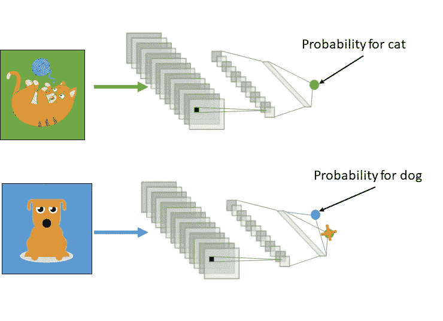
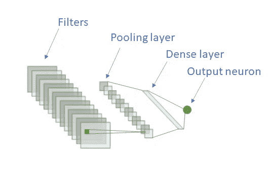
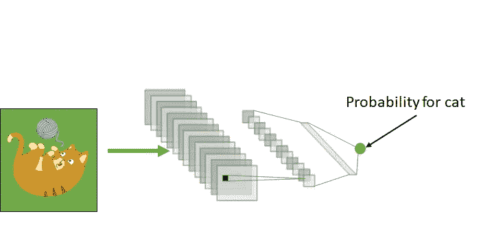
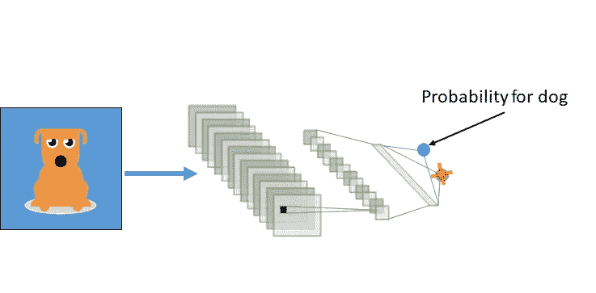
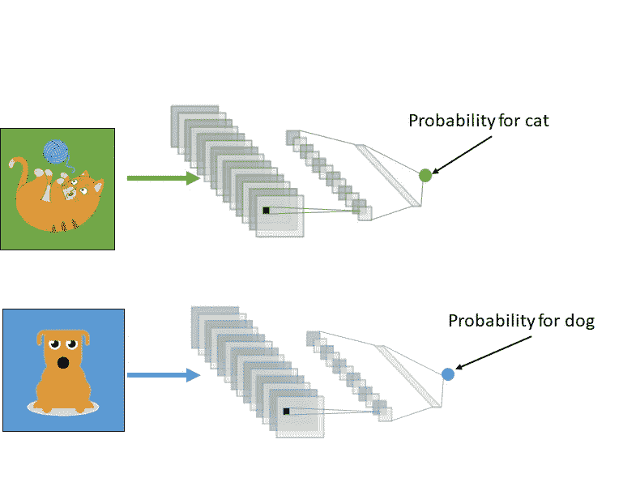
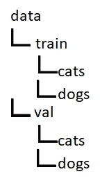

# 深度迁移学习

> 原文：<https://towardsdatascience.com/transfer-learning-3e9bb53549f6?source=collection_archive---------23----------------------->

## 重用他人训练的模型的艺术

(图片由作者提供)

# 介绍

好的机器学习模型需要海量的**数据**和许多**GPU**或**TPU**来训练。而且大多数时候他们只能执行一个特定的任务。

大学和大公司有时会发布他们的模型。但是很可能你想开发一个机器学习应用程序，但是没有适合你的任务的模型。

但是不要担心，你不必收集大量的数据和花费大量的现金来开发自己的模型。可以用迁移学习来代替。这减少了训练时间，您可以用更少的数据获得良好的性能。

# 什么是迁移学习？

在迁移学习中，我们使用模型在特定任务的训练中收集的知识来解决[不同但相关的任务](https://en.wikipedia.org/wiki/Transfer_learning)。该模型可以从以前的任务中学到的东西中获益，以便更快地学习新的任务。

这里打个比方，说你要检测图像上的狗。在网上你可以找到一个可以检测猫的模型。因为这是一个足够相似的任务，你拍几张你的狗的照片，然后重新训练这个模型来探测狗。也许它会有偏见，只认出你的宠物，但我想你明白了😉。

也许模型已经学会了通过他们的皮毛或者他们有眼睛的事实来识别猫，这对于识别狗也是非常有帮助的。

迁移学习其实有[两种](https://pytorch.org/tutorials/beginner/transfer_learning_tutorial.html)，特征提取和微调。

一般来说，这两种方法遵循相同的程序:

*   初始化预训练的模型(我们想要学习的模型)
*   重塑最终图层，使其输出数量与新数据集中的类数量相同
*   定义我们想要更新的图层
*   在新数据集上训练

# 特征抽出

让我们考虑一个卷积神经网络架构，它具有滤波器、密集层和一个输出神经元。

(图片由作者提供)

网络被训练来预测图像上有猫的概率。我们需要一个**大数据集**(有猫和没有猫的图像)**训练时间长**。这一步叫做“前期训练”。

(图片由作者提供)

接下来是有趣的部分。我们再次训练网络，但是这一次使用包含狗的小图像数据集。在训练期间，除了输出层之外的所有层都被“冻结”。这意味着我们不会在培训期间更新它们。训练之后，网络输出狗在图像上可见的概率。与之前的预培训相比，该培训程序将**花费更少的时间**。

(图片由作者提供)

或者，我们也可以“解冻”最后两个图层，即输出图层和密集图层。这取决于我们拥有的数据量。如果数据较少，我们可以考虑只训练最后一层。

# 微调

在微调中，我们从预先训练的模型开始，但是我们更新所有的权重。

(图片由作者提供)

# pytorch 中的迁移学习示例

我将使用来自 kaggle 的数据集[猫对狗](https://www.kaggle.com/c/dogs-vs-cats/data)。数据集可以在[这里](https://www.microsoft.com/en-us/download/details.aspx?id=54765)找到。你总是可以使用不同的数据集。

这里的任务与我上面的例子有点不同。用于识别哪些图像上有狗，哪些图像上有猫的模型。为使代码正常工作，您必须按以下结构组织数据:

(图片由作者提供)

你可以在这里找到关于猫和狗[的更详细的介绍。](https://medium.com/predict/using-pytorch-for-kaggles-famous-dogs-vs-cats-challenge-part-1-preprocessing-and-training-407017e1a10c)

## 设置

我们从导入所需的库开始。

(作者代码)

我们检查一个 CUDA 兼容的 CPU，否则我们将使用 CPU。

(作者代码)

然后我们加载 torchvision 的预训练 ResNet50。

(作者代码)

数据扩充是通过对图像应用不同的变换来完成的，从而防止过拟合。

(作者代码)

我们创建数据加载器，它将从内存中加载图像。

(作者代码)

创建学习率计划程序，它将在培训过程中修改学习率。或者，您可以使用 ADAM 优化器，它可以自动调整学习速率，并且不需要调度程序。

(作者代码)

## 特征提取优化器

这里将只为最后一层计算梯度，因此只训练最后一层。

## 用于微调的优化器

在这里，所有的层将被训练。

## 培养

我们来定义一下训练循环。

(作者代码)

最后，我们可以训练我们的模型。

要么使用**特征提取**:

(作者代码)

或者使用**微调**:

(作者代码)

# 不要太骄傲地使用迁移学习

当我向人们推荐他们可以在他们的 ML 项目中使用迁移学习时，他们有时会拒绝，宁愿自己训练一个模型，而不是使用迁移学习。但是没有人应该为使用迁移学习而感到羞耻，因为:

*   训练神经网络使用能量，因此增加了全球碳排放量。转移学习**通过减少训练时间来拯救我们的星球**。
*   当训练数据不足时，迁移学习可能是您的模型表现良好的唯一选择。在计算机视觉中，通常缺乏训练数据。

# 结论

对于现代数据科学家来说，迁移学习是一个方便的工具。您可以使用其他人预先训练的模型，并对其执行迁移学习，以节省时间、计算机资源并减少训练所需的数据量。

# 数据集

## 猫和狗的数据集

数据集可以在下找到。

【https://www.tensorflow.org/datasets/catalog/cats_vs_dogs 

并根据[知识共享署名 4.0 许可](https://creativecommons.org/licenses/by/4.0/)进行许可。

# 来源

[什么是深度迁移学习，为什么它变得如此流行？](/what-is-deep-transfer-learning-and-why-is-it-becoming-so-popular-91acdcc2717a)

[吴恩达转移学习](https://www.youtube.com/watch?v=yofjFQddwHE)

[Lambda 实验室，揭开 gpt 3 的神秘面纱](https://lambdalabs.com/blog/demystifying-gpt-3/)

[深度学习的碳排放](https://www.forbes.com/sites/robtoews/2020/06/17/deep-learnings-climate-change-problem/?sh=a8d8db06b438)

[DALL E:从文本创建图像](https://openai.com/blog/dall-e/)

## 想联系支持我？

LinkedIn
[https://www.linkedin.com/in/vincent-m%C3%BCller-6b3542214/](https://www.linkedin.com/in/vincent-m%C3%BCller-6b3542214/)
脸书
[https://www.facebook.com/profile.php?id=100072095823739](https://www.facebook.com/profile.php?id=100072095823739)
Twitter
[https://twitter.com/Vincent02770108](https://twitter.com/Vincent02770108)
Medium
[https://medium.com/@Vincent.Mueller](https://medium.com/@Vincent.Mueller)
成为 Medium 会员并支持我(*你的部分会费直接交给我*)
[https://medium.com/@Vincent.Mueller/membership](https://medium.com/@Vincent.Mueller/membership)