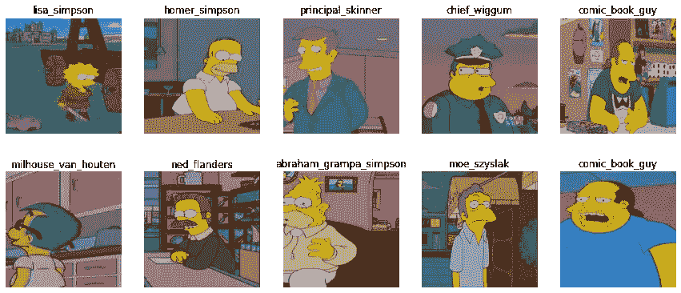
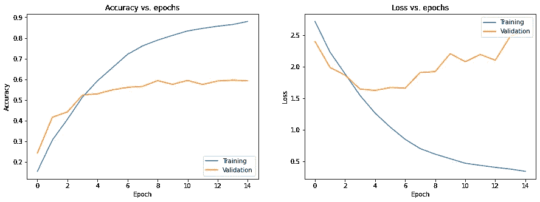
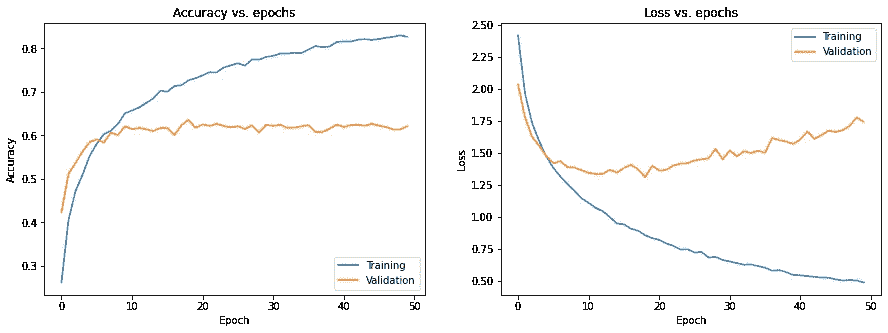
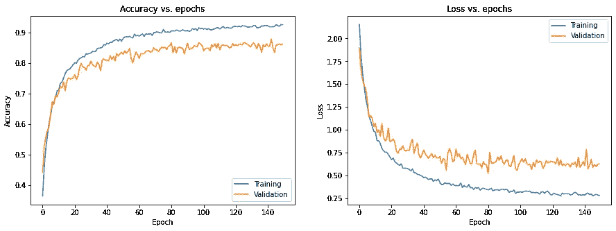
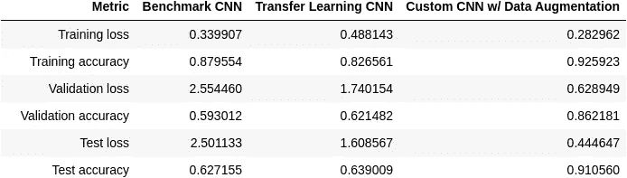
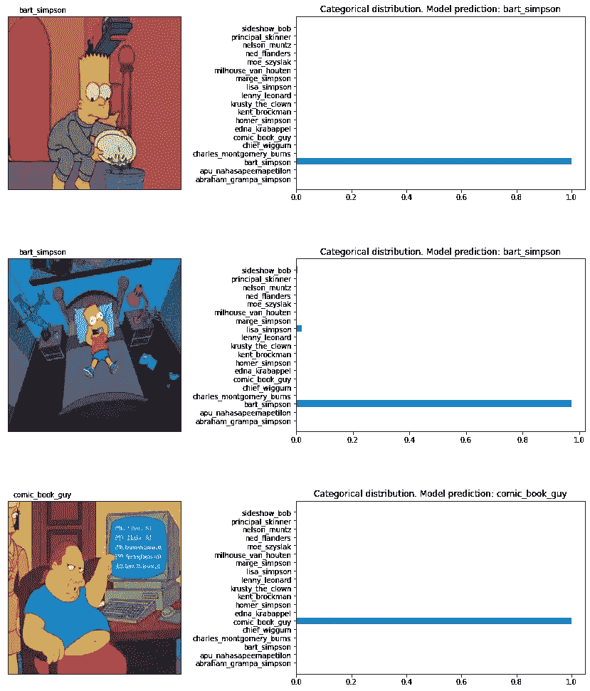

# 应用于辛普森图像数据集的迁移学习和数据扩充

> 原文：<https://towardsdatascience.com/transfer-learning-and-data-augmentation-applied-to-the-simpsons-image-dataset-e292716fbd43?source=collection_archive---------12----------------------->

## [理解大数据](https://towardsdatascience.com/tagged/making-sense-of-big-data)

## 使用 Tensorflow 和 Keras 的深度学习应用

# 1.介绍

在机器学习(ML)的理想场景中，有大量带标签的训练实例，它们与测试数据[【1】](https://arxiv.org/abs/1911.02685)共享相同的分布。但是，在某些情况下，收集这些数据可能需要大量资源，或者不切实际。因此，迁移学习成为一种有用的方法。它包括通过从不同但相关的领域转移信息来增加模型的学习能力。换句话说，它放松了训练和测试数据独立同分布的假设[【2】](https://link.springer.com/chapter/10.1007/978-3-030-01424-7_27)。只有当要学习的特征对两个任务都通用时，这种方法才有效。另一种处理有限数据的方法是使用数据扩充(DA)。它包括应用一套变换来膨胀数据集。传统的 ML 算法非常依赖于特征工程，而深度学习(DL)专注于通过无监督或半监督的特征学习方法和分层特征提取来学习数据。DL 通常需要大量的数据来进行有效的训练，这使得它成为 TL 和 DA 的强有力的候选对象。

我们的任务是对一系列带标签的图像进行分类。由于数据集较小，我们面临两个问题:有效学习数据中的模式的挑战和过度拟合的高概率。我们从零开始实现一个卷积神经网络(CNN)模型作为基准模型。接下来，遵循 TL 的原理，我们在 ImageNet 数据集上使用一个预先训练好的卷积神经网络([【3】](https://arxiv.org/abs/1610.02357)，[【4】](https://keras.io/api/applications/xception/))。我们移除了它的顶层，以包含我们自己的适合我们的问题规范的深层结构。因此，预训练的 CNN 在整个新模型中充当特征提取层。通过这种方法，我们解决了这两个问题:我们大大减少了对大量训练数据的需求，同时也减少了过度拟合。我们还进行了第二个实验，通过应用一套增强图像大小和质量的技术来增加我们的训练数据。这种方法被定义为数据扩充(DA ),它是一种正则化技术。虽然它保留了标签，但它也使用转换来增加数据集，以添加更多不变的示例[【5】](https://arxiv.org/pdf/1708.06020.pdf)。

在本文中，我们使用辛普森一家的角色数据集[【6】](https://www.kaggle.com/alexattia/the-simpsons-characters-dataset)。我们对数据集进行了过滤，仅包含包含 100 张以上图像的类(字符)。在训练、验证和测试数据集之间进行拆分后，数据集的最终大小如下:12411 幅图像用于训练，3091 幅图像用于验证，950 幅图像用于测试。

和往常一样，代码可以在我的 [GitHub](https://github.com/luisroque/deep-learning-articles) 上获得。

本文属于使用 TensorFlow 进行深度学习的系列文章:

*   [迁移学习和数据增强应用于辛普森图像数据集](/transfer-learning-and-data-augmentation-applied-to-the-simpsons-image-dataset-e292716fbd43)
*   [基于 F. Pessoa 的工作用递归神经网络生成文本](/generating-text-with-recurrent-neural-networks-based-on-the-work-of-f-pessoa-1e804d88692d)
*   [使用 Seq2Seq 架构和注意力的神经机器翻译(ENG to POR)](/neural-machine-translation-using-a-seq2seq-architecture-and-attention-eng-to-por-fe3cc4191175)
*   [残差网络从无到有应用于计算机视觉](/residual-networks-in-computer-vision-ee118d3be68f)

# 2.数据预处理

尽管数据集的大小很小，CNN 可以有效地学习，但它足够大，我们在加载和转换它时会有内存问题。我们使用数据生成器向不同的模型提供实时数据。生成器函数是一种特殊类型的函数，它返回一个惰性迭代器，也就是说，它们不将内容存储在内存中。在创建生成器时，我们应用一个转换来规范化我们的数据，在训练和验证数据集之间分割它们，并定义一个 32 的批处理大小。

```
import tensorflow as tf
from tensorflow.keras.models import  Sequential, Model
import numpy as np
import os
import pandas as pd
from sklearn.metrics import confusion_matrix
import matplotlib.pyplot as plt
%matplotlib inline
import seaborn as sns
from tensorflow.keras import Input, layers
from tensorflow.keras.layers import Dense, Flatten, Conv2D, MaxPooling2D
import tensorflow_hub as hub
from tensorflow.keras.layers import Dropout, BatchNormalization
from sklearn.model_selection import train_test_split
from tensorflow.keras.preprocessing.image import ImageDataGeneratordirectory_train = "./data/simpsons_data_split/train/"
directory_test = "./data/simpsons_data_split/test/"def get_ImageDataGenerator(validation_split=None):
    image_generator = ImageDataGenerator(rescale=(1/255.),
                                         validation_split=validation_split)
    return image_generatorimage_gen_train = get_ImageDataGenerator(validation_split=0.2)def get_generator(image_data_generator, directory, train_valid=None, seed=None):
    train_generator = image_data_generator.flow_from_directory(directory, batch_size=32, class_mode='categorical', target_size=(299,299), subset=train_valid, seed=seed)    
    return train_generatortrain_generator = get_generator(image_gen_train, directory_train, train_valid='training', seed=1)
validation_generator = get_generator(image_gen_train, directory_train, train_valid='validation')Found 12411 images belonging to 19 classes.
Found 3091 images belonging to 19 classes.image_gen_test = get_ImageDataGenerator(validation_split=None)
test_generator = get_generator(image_gen_test, directory_test)Found 950 images belonging to 19 classes.
```

我们可以遍历生成器来获得一组图像，其大小等于上面定义的批处理大小。

```
target_labels = next(os.walk(directory_train))[1]

target_labels.sort()

batch = next(train_generator)
batch_images = np.array(batch[0])
batch_labels = np.array(batch[1])

target_labels = np.asarray(target_labels)

plt.figure(figsize=(15,10))
for n, i in enumerate(np.arange(10)):
    ax = plt.subplot(3,5,n+1)
    plt.imshow(batch_images[i])
    plt.title(target_labels[np.where(batch_labels[i]==1)[0][0]])
    plt.axis('off')
```



图 1:由训练生成器生成的一组图像。

# 3.基准模型

我们定义一个简单的 CNN 作为基准模型。它结合使用 2D 卷积层(对图像执行空间卷积)和最大池操作。接下来是具有 128 个单元和 ReLU 激活功能的密集层和速率为 0.5 的下降层。最后，最后一层产生我们的网络的输出，其单元数量等于目标标签的数量，并使用 softmax 激活函数。该模型是用 Adam 优化器编译的，具有默认设置和分类交叉熵损失。

```
def get_benchmark_model(input_shape):
    x = Input(shape=input_shape)
    h = Conv2D(32, padding='same', kernel_size=(3,3), activation='relu')(x)
    h = Conv2D(32, padding='same', kernel_size=(3,3), activation='relu')(x)
    h = MaxPooling2D(pool_size=(2,2))(h)
    h = Conv2D(64, padding='same', kernel_size=(3,3), activation='relu')(h)
    h = Conv2D(64, padding='same', kernel_size=(3,3), activation='relu')(h)
    h = MaxPooling2D(pool_size=(2,2))(h)
    h = Conv2D(128, kernel_size=(3,3), activation='relu')(h)
    h = Conv2D(128, kernel_size=(3,3), activation='relu')(h)
    h = MaxPooling2D(pool_size=(2,2))(h)
    h = Flatten()(h)
    h = Dense(128, activation='relu')(h)
    h = Dropout(.5)(h)
    output = Dense(target_labels.shape[0], activation='softmax')(h)

    model = tf.keras.Model(inputs=x, outputs=output)

    model.compile(optimizer='adam',
             loss='categorical_crossentropy',
             metrics=['accuracy'])
    return model
```

下面，你可以找到我们的模型的概要，详细列出了定义的层和每层的训练参数数量。

```
benchmark_model = get_benchmark_model((299, 299, 3))
benchmark_model.summary()Model: "model"
_________________________________________________________________
Layer (type)                 Output Shape              Param #   
=================================================================
input_1 (InputLayer)         [(None, 299, 299, 3)]     0         
_________________________________________________________________
conv2d_1 (Conv2D)            (None, 299, 299, 32)      896       
_________________________________________________________________
max_pooling2d (MaxPooling2D) (None, 149, 149, 32)      0         
_________________________________________________________________
conv2d_2 (Conv2D)            (None, 149, 149, 64)      18496     
_________________________________________________________________
conv2d_3 (Conv2D)            (None, 149, 149, 64)      36928     
_________________________________________________________________
max_pooling2d_1 (MaxPooling2 (None, 74, 74, 64)        0         
_________________________________________________________________
conv2d_4 (Conv2D)            (None, 72, 72, 128)       73856     
_________________________________________________________________
conv2d_5 (Conv2D)            (None, 70, 70, 128)       147584    
_________________________________________________________________
max_pooling2d_2 (MaxPooling2 (None, 35, 35, 128)       0         
_________________________________________________________________
flatten (Flatten)            (None, 156800)            0         
_________________________________________________________________
dense (Dense)                (None, 128)               20070528  
_________________________________________________________________
dropout (Dropout)            (None, 128)               0         
_________________________________________________________________
dense_1 (Dense)              (None, 19)                2451      
=================================================================
Total params: 20,350,739
Trainable params: 20,350,739
Non-trainable params: 0
_________________________________________________________________
```

我们使用回调来训练基准 CNN 模型，以在验证准确性在 10 个时期内没有提高的情况下更早地停止训练过程。这个数字应该更小，但它用于显示模型很快开始过度拟合数据。

```
def train_model(model, train_gen, valid_gen, epochs):
    train_steps_per_epoch = train_gen.n // train_gen.batch_size
    val_steps = valid_gen.n // valid_gen.batch_size

    earlystopping = tf.keras.callbacks.EarlyStopping(patience=10)
    history = model.fit(train_gen, 
                        steps_per_epoch = train_steps_per_epoch,
                        epochs=epochs,
                        validation_data=valid_gen, 
                        callbacks=[earlystopping])

    return history
```

每次我们使用一个生成器，都需要在馈给一个模型之前进行重置；否则，我们将丢失大量数据。

```
train_generator = get_generator(image_gen_train, directory_train, train_valid='training')
validation_generator = get_generator(image_gen_train, directory_train, train_valid='validation')Found 12411 images belonging to 19 classes.
Found 3091 images belonging to 19 classes.history_benchmark = train_model(benchmark_model, train_generator, validation_generator, 50)Epoch 1/50
387/387 [==============================] - 747s 2s/step - loss: 2.8358 - accuracy: 0.1274 - val_loss: 2.4024 - val_accuracy: 0.2436
Epoch 2/50
387/387 [==============================] - 728s 2s/step - loss: 2.3316 - accuracy: 0.2758 - val_loss: 1.9895 - val_accuracy: 0.4170
[...]
Epoch 14/50
387/387 [==============================] - 719s 2s/step - loss: 0.3846 - accuracy: 0.8612 - val_loss: 2.4831 - val_accuracy: 0.5962
Epoch 15/50
387/387 [==============================] - 719s 2s/step - loss: 0.3290 - accuracy: 0.8806 - val_loss: 2.5545 - val_accuracy: 0.5930
```

下图显示了训练和验证数据集的准确性和损失随时间(时期)的演变。显然，我们的模型过度拟合了数据，因为训练的准确性接近 90%，并且验证数据集的损失实际上在过去的时期中不断增加。这也是训练中纪元数量减少的原因。

```
plt.figure(figsize=(15,5))
plt.subplot(121)
plt.plot(history_benchmark.history['accuracy'])
plt.plot(history_benchmark.history['val_accuracy'])
plt.title('Accuracy vs. epochs')
plt.ylabel('Accuracy')
plt.xlabel('Epoch')
plt.legend(['Training', 'Validation'], loc='lower right')

plt.subplot(122)
plt.plot(history_benchmark.history['loss'])
plt.plot(history_benchmark.history['val_loss'])
plt.title('Loss vs. epochs')
plt.ylabel('Loss')
plt.xlabel('Epoch')
plt.legend(['Training', 'Validation'], loc='upper right')
plt.show()
```



图 2:基准模型在几个时期内的准确性和损失演变。

我们可以通过使基准模型适合我们的测试数据集来评估它。结果如下所示。

```
test_steps = test_generator.n // test_generator.batch_size
benchmark_test_loss, benchmark_test_acc = benchmark_model.evaluate(test_generator, steps=test_steps)
print('\nTest dataset:')
print("Loss: {}".format(benchmark_test_loss))
print("Accuracy: {}".format(benchmark_test_acc))29/29 [==============================] - 9s 304ms/step - loss: 2.5011 - accuracy: 0.6272

Test dataset:
Loss: 2.5011332035064697
Accuracy: 0.6271551847457886
```

# 4.预先训练的 CNN

对于预训练的模型，我们使用 Xception 架构([【3】](https://arxiv.org/abs/1610.02357)，[【4】](https://keras.io/api/applications/xception/))，在`keras.applications`模块中实现的深度 CNN。我们已经加载了预训练的参数(在 ImageNet 数据集上学习的)。我们使用预训练的 CNN 作为大的特征提取层，我们用针对我们的多类分类任务的一组未训练的层来扩展它。这就是翻译原则被有效应用的地方。

```
feature_extractor = tf.keras.applications.Xception(weights="imagenet")feature_extractor.summary()Model: "xception"
__________________________________________________________________________________________________
Layer (type)                    Output Shape         Param #     Connected to                     
==================================================================================================
input_2 (InputLayer)            [(None, 299, 299, 3) 0                                            
__________________________________________________________________________________________________
[...]     
avg_pool (GlobalAveragePooling2 (None, 2048)         0           block14_sepconv2_act[0][0]       
__________________________________________________________________________________________________
predictions (Dense)             (None, 1000)         2049000     avg_pool[0][0]                   
==================================================================================================
Total params: 22,910,480
Trainable params: 22,855,952
Non-trainable params: 54,528
_________________________________________________________________________________________________def remove_head(feature_extractor_model):
    model_input = feature_extractor_model.input
    output = feature_extractor_model.get_layer(name='avg_pool').output
    model = tf.keras.Model(inputs=model_input, outputs=output)
    return modelfeature_extractor = remove_head(feature_extractor)
feature_extractor.summary()Model: "model_1"
__________________________________________________________________________________________________
Layer (type)                    Output Shape         Param #     Connected to                     
==================================================================================================
input_2 (InputLayer)            [(None, 299, 299, 3) 0                                            
__________________________________________________________________________________________________
[...]    
avg_pool (GlobalAveragePooling2 (None, 2048)         0           block14_sepconv2_act[0][0]       
==================================================================================================
Total params: 20,861,480
Trainable params: 20,806,952
Non-trainable params: 54,528
__________________________________________________________________________________________________def add_new_classifier_head(feature_extractor_model):
    model = Sequential([
        feature_extractor_model,
        Dense(128, activation='relu'),
        Dropout(.5),
        Dense(target_labels.shape[0], activation='softmax')
    ])

    return model
```

下面，我们可以看到添加到我们的模型头部的层。

```
new_model = add_new_classifier_head(feature_extractor)
new_model.summary()Model: "sequential"
_________________________________________________________________
Layer (type)                 Output Shape              Param #   
=================================================================
model_1 (Functional)         (None, 2048)              20861480  
_________________________________________________________________
dense_2 (Dense)              (None, 128)               262272    
_________________________________________________________________
dropout_1 (Dropout)          (None, 128)               0         
_________________________________________________________________
dense_3 (Dense)              (None, 19)                2451      
=================================================================
Total params: 21,126,203
Trainable params: 21,071,675
Non-trainable params: 54,528
_________________________________________________________________def freeze_pretrained_weights(model):
    model.get_layer(name='model_1').trainable=False

    model.compile(optimizer='adam',
                 loss='categorical_crossentropy',
                 metrics=['accuracy'])
    return model
```

我们将预先训练的 CNN 参数冻结为不可训练的——我们可以看到在我们的新模型中有超过 2000 万个不可训练的参数。与基准模型相比，这也导致每个时期的训练时间更短。

```
frozen_new_model = freeze_pretrained_weights(new_model)
frozen_new_model.summary()Model: "sequential"
_________________________________________________________________
Layer (type)                 Output Shape              Param #   
=================================================================
model_1 (Functional)         (None, 2048)              20861480  
_________________________________________________________________
dense_2 (Dense)              (None, 128)               262272    
_________________________________________________________________
dropout_1 (Dropout)          (None, 128)               0         
_________________________________________________________________
dense_3 (Dense)              (None, 19)                2451      
=================================================================
Total params: 21,126,203
Trainable params: 264,723
Non-trainable params: 20,861,480
_________________________________________________________________def train_model(model, train_gen, valid_gen, epochs):
    train_steps_per_epoch = train_gen.n // train_gen.batch_size
    val_steps = valid_gen.n // valid_gen.batch_size

    history = model.fit(train_gen, 
                        steps_per_epoch = train_steps_per_epoch,
                        epochs=epochs,
                        validation_data=valid_gen)

    return historyhistory_frozen_new_model = train_model(frozen_new_model, train_generator, validation_generator, 50)Epoch 1/50
387/387 [==============================] - 564s 1s/step - loss: 2.6074 - accuracy: 0.1943 - val_loss: 2.0344 - val_accuracy: 0.4232
Epoch 2/50
387/387 [==============================] - 561s 1s/step - loss: 2.0173 - accuracy: 0.3909 - val_loss: 1.7743 - val_accuracy: 0.5118
[...]
Epoch 49/50
387/387 [==============================] - 547s 1s/step - loss: 0.4772 - accuracy: 0.8368 - val_loss: 1.7771 - val_accuracy: 0.6137
Epoch 50/50
387/387 [==============================] - 547s 1s/step - loss: 0.4748 - accuracy: 0.8342 - val_loss: 1.7402 - val_accuracy: 0.6215
```

我们在没有使用回调的情况下运行了更长时间的模型。我们没有看到同样的过度拟合模式，因为超过 90%的砝码被冻结。事实上，我们可以运行少量的时期，因为在 10 个时期后我们看不到真正的改进。

```
plt.figure(figsize=(15,5))
plt.subplot(121)
plt.plot(history_frozen_new_model.history['accuracy'])
plt.plot(history_frozen_new_model.history['val_accuracy'])
plt.title('Accuracy vs. epochs')
plt.ylabel('Accuracy')
plt.xlabel('Epoch')
plt.legend(['Training', 'Validation'], loc='lower right')

plt.subplot(122)
plt.plot(history_frozen_new_model.history['loss'])
plt.plot(history_frozen_new_model.history['val_loss'])
plt.title('Loss vs. epochs')
plt.ylabel('Loss')
plt.xlabel('Epoch')
plt.legend(['Training', 'Validation'], loc='upper right')
plt.show()
```



图 3:TL 模型在几个时期内的准确性和损失演变。

将我们的新模型与测试数据集进行拟合，结果是精度略有提高(略高于 1%)。

```
test_generator = get_generator(image_gen_test, directory_test)
new_model_test_loss, new_model_test_acc = frozen_new_model.evaluate(test_generator, steps=test_steps)
print('\nTest dataset')
print("Loss: {}".format(new_model_test_loss))
print("Accuracy: {}".format(new_model_test_acc))Found 950 images belonging to 19 classes.
29/29 [==============================] - 33s 1s/step - loss: 1.6086 - accuracy: 0.6390

Test dataset
Loss: 1.6085671186447144
Accuracy: 0.639008641242981
```

# 5.数据扩充

正如我们在上面看到的，DA 是一组用于膨胀数据集同时减少过度拟合的方法。我们关注由几何和光度变换组成的通用 DA(参见[【5】](https://arxiv.org/pdf/1708.06020.pdf)了解更多关于这些和其他方法的信息)。几何变换改变了图像的几何形状，使得 CNN 不会因位置和方向的改变而改变。另一方面，光度变换通过调整图像的颜色通道，使 CNN 不受颜色和光照变化的影响。

```
def get_ImageDataGenerator_augmented(validation_split=None):
    image_generator = ImageDataGenerator(rescale=(1/255.),
                                        rotation_range=40,
                                        width_shift_range=0.2,
                                        height_shift_range=0.2,
                                        shear_range=0.2,
                                        zoom_range=0.1,
                                        brightness_range=[0.8,1.2],
                                        horizontal_flip=True,
                                        validation_split=validation_split)
    return image_generatorimage_gen_train_aug = get_ImageDataGenerator_augmented(validation_split=0.2)train_generator_aug = get_generator(image_gen_train_aug, directory_train, train_valid='training', seed=1)
validation_generator_aug = get_generator(image_gen_train_aug, directory_train, train_valid='validation')Found 12411 images belonging to 19 classes.
Found 3091 images belonging to 19 classes.train_generator = get_generator(image_gen_train, directory_train, train_valid='training', seed=1)Found 12411 images belonging to 19 classes.
```

我们可以显示原始图像和增强图像进行比较。请注意图像的几何变化，如翻转、垂直和水平方向的平移或缩放，以及光度测定，在一些图像的亮度变化中可见。

```
batch = next(train_generator)
batch_images = np.array(batch[0])
batch_labels = np.array(batch[1])

aug_batch = next(train_generator_aug)
aug_batch_images = np.array(aug_batch[0])
aug_batch_labels = np.array(aug_batch[1])

plt.figure(figsize=(16,5))
plt.suptitle("original images", fontsize=16)
for n, i in enumerate(np.arange(10)):
    ax = plt.subplot(2, 5, n+1)
    plt.imshow(batch_images[i])
    plt.title(target_labels[np.where(batch_labels[i]==1)[0][0]])
    plt.axis('off')
plt.figure(figsize=(16,5))
plt.suptitle("Augmented images", fontsize=16)
for n, i in enumerate(np.arange(10)):
    ax = plt.subplot(2, 5, n+1)
    plt.imshow(aug_batch_images[i])
    plt.title(target_labels[np.where(batch_labels[i]==1)[0][0]])
    plt.axis('off')
```


图 4:一组没有任何变换的图像和相应的增强图像之间的比较。

```
train_generator_aug = get_generator(image_gen_train_aug, directory_train, train_valid='training')Found 12411 images belonging to 19 classes.
```

扩充的数据集现在被提供给我们上面定义的定制模型(不使用预先训练的权重)。

```
benchmark_model_aug = benchmark_model
benchmark_model_aug.summary()Model: "model"
_________________________________________________________________
Layer (type)                 Output Shape              Param #   
=================================================================
input_1 (InputLayer)         [(None, 299, 299, 3)]     0         
_________________________________________________________________
conv2d_1 (Conv2D)            (None, 299, 299, 32)      896       
_________________________________________________________________
max_pooling2d (MaxPooling2D) (None, 149, 149, 32)      0         
_________________________________________________________________
conv2d_2 (Conv2D)            (None, 149, 149, 64)      18496     
_________________________________________________________________
conv2d_3 (Conv2D)            (None, 149, 149, 64)      36928     
_________________________________________________________________
max_pooling2d_1 (MaxPooling2 (None, 74, 74, 64)        0         
_________________________________________________________________
conv2d_4 (Conv2D)            (None, 72, 72, 128)       73856     
_________________________________________________________________
conv2d_5 (Conv2D)            (None, 70, 70, 128)       147584    
_________________________________________________________________
max_pooling2d_2 (MaxPooling2 (None, 35, 35, 128)       0         
_________________________________________________________________
flatten (Flatten)            (None, 156800)            0         
_________________________________________________________________
dense (Dense)                (None, 128)               20070528  
_________________________________________________________________
dropout (Dropout)            (None, 128)               0         
_________________________________________________________________
dense_1 (Dense)              (None, 19)                2451      
=================================================================
Total params: 20,350,739
Trainable params: 20,350,739
Non-trainable params: 0
_________________________________________________________________history_augmented = train_model(benchmark_model_aug, train_generator_aug, validation_generator_aug, epochs=150)Epoch 1/150
387/387 [==============================] - 748s 2s/step - loss: 2.1520 - accuracy: 0.3649 - val_loss: 1.8956 - val_accuracy: 0.4426
Epoch 2/150
387/387 [==============================] - 749s 2s/step - loss: 1.8233 - accuracy: 0.4599 - val_loss: 1.6556 - val_accuracy: 0.5273
[...]
Epoch 149/150
387/387 [==============================] - 753s 2s/step - loss: 0.2859 - accuracy: 0.9270 - val_loss: 0.6202 - val_accuracy: 0.8609
Epoch 150/150
387/387 [==============================] - 753s 2s/step - loss: 0.2830 - accuracy: 0.9259 - val_loss: 0.6289 - val_accuracy: 0.8622
```

过度拟合显然不再是一个问题。训练可以运行更长的时期，因为它显示了度量的一致改进。不过，我们可以在大约第 70 个纪元时停止学习过程，但是我们扩展了这个过程，以表明 DA 实际上可以减少过度拟合的可能性。此外，请注意，我们增加了模型识别属于每个字符的数据中的特征的能力，因为验证集的准确性显著提高(超过 86%)。

```
plt.figure(figsize=(15,5))
plt.subplot(121)
plt.plot(history_augmented.history['accuracy'])
plt.plot(history_augmented.history['val_accuracy'])
plt.title('Accuracy vs. epochs')
plt.ylabel('Accuracy')
plt.xlabel('Epoch')
plt.legend(['Training', 'Validation'], loc='lower right')

plt.subplot(122)
plt.plot(history_augmented.history['loss'])
plt.plot(history_augmented.history['val_loss'])
plt.title('Loss vs. epochs')
plt.ylabel('Loss')
plt.xlabel('Epoch')
plt.legend(['Training', 'Validation'], loc='upper right')
plt.show()
```



图 5:使用 DA 的定制模型在几个时期内的精度和损耗变化。

在我们的测试集上用增强的数据拟合我们的定制模型导致了超过 91%的显著增加的准确性。

```
test_generator = get_generator(image_gen_test, directory_test)
augmented_model_test_loss, augmented_model_test_acc = benchmark_model_aug.evaluate(test_generator, steps=test_steps)
print('\nTest dataset')
print("Loss: {}".format(augmented_model_test_loss))
print("Accuracy: {}".format(augmented_model_test_acc))Found 950 images belonging to 19 classes.
29/29 [==============================] - 9s 307ms/step - loss: 0.4446 - accuracy: 0.9106

Test dataset
Loss: 0.44464701414108276
Accuracy: 0.9105603694915771
```

# 6.结果

最后，我们可以比较基准模型、使用 TL 原则定义的预训练模型和带有扩充数据的定制模型之间的训练、验证和测试指标。结果表明，TL 方法仅略微优于基准模型。这可能是由于模型最初被训练的数据(域)的性质以及它如何转移到 Simpsons 字符域。另一方面，使用扩充数据的方法能够更有效地捕捉数据中的模式，将测试集中的准确率提高到 91%以上。

```
benchmark_train_loss = history_benchmark.history['loss'][-1]
benchmark_valid_loss = history_benchmark.history['val_loss'][-1]
benchmark_train_acc = history_benchmark.history['accuracy'][-1]
benchmark_valid_acc = history_benchmark.history['val_accuracy'][-1]

new_model_train_loss = history_frozen_new_model.history['loss'][-1]
new_model_valid_loss = history_frozen_new_model.history['val_loss'][-1]
new_model_train_acc = history_frozen_new_model.history['accuracy'][-1]
new_model_valid_acc = history_frozen_new_model.history['val_accuracy'][-1]

augmented_model_train_loss = history_augmented.history['loss'][-1]
augmented_model_valid_loss = history_augmented.history['val_loss'][-1]
augmented_model_train_acc = history_augmented.history['accuracy'][-1]
augmented_model_valid_acc = history_augmented.history['val_accuracy'][-1]comparison = pd.DataFrame([['Training loss', benchmark_train_loss, new_model_train_loss, augmented_model_train_loss],
                          ['Training accuracy', benchmark_train_acc, new_model_train_acc, augmented_model_train_acc],
                          ['Validation loss', benchmark_valid_loss, new_model_valid_loss, augmented_model_valid_loss],
                          ['Validation accuracy', benchmark_valid_acc, new_model_valid_acc, augmented_model_valid_acc],
                          ['Test loss', benchmark_test_loss, new_model_test_loss, augmented_model_test_loss],
                          ['Test accuracy', benchmark_test_acc, new_model_test_acc, augmented_model_test_acc]],
                           columns=['Metric', 'Benchmark CNN', 'Transfer Learning CNN', 'Custom CNN w/ Data Augmentation'])
comparison.index=['']*6
comparison
```



表 1:测试的 3 个模型的比较结果。带有 DA 的定制 CNN 产生了最好的结果——测试准确率超过 91%。

为了说明使用 DA 的自定义 CNN 输出，我们绘制了测试集中随机图像预测的分类分布。

```
test_generator = get_generator(image_gen_test, directory_test, seed=123)
predictions = benchmark_model_aug.predict(test_generator)Found 950 images belonging to 19 classes.test_generator = get_generator(image_gen_test, directory_test, seed=123)
batches = []
for i in range(1):
    batches.append(next(test_generator))

batch_images = np.vstack([b[0] for b in batches])
batch_labels = np.concatenate([b[1].astype(np.int32) for b in batches])Found 950 images belonging to 19 classes.fig, axes = plt.subplots(3, 2, figsize=(16, 17))
fig.subplots_adjust(hspace = 0.4, wspace=0.8)
axes = axes.ravel()

for i in range(3):

    inx = np.random.choice(batch_images.shape[0], 1, replace=False)[0]

    axes[0+i*2].imshow(batch_images[inx])
    axes[0+i*2].get_xaxis().set_visible(False)
    axes[0+i*2].get_yaxis().set_visible(False)
    axes[0+i*2].text(60., -8, target_labels[np.where(batch_labels[inx]==1)[0][0]], 
                    horizontalalignment='center')
    axes[1+i*2].barh(np.arange(len(predictions[inx])),predictions[inx])
    axes[1+i*2].set_yticks(np.arange(len(predictions[inx])))
    axes[1+i*2].set_yticklabels(target_labels)
    axes[1+i*2].set_title(f"Categorical distribution. Model prediction: {target_labels[np.argmax(predictions[inx])]}")

plt.show()
```



图 6:随机图像(在左边)和由定制 CNN 产生的预测的相应分类分布，带有 DA ( *在右边*)

# 7.结论

我们使用两种不同的方法解决了小数据集和高过拟合可能性的问题。首先，我们加载了一个预先训练好的模型，从中我们删除了顶层，并添加了我们的任务所需的一组特定的层。第二种方法测试了使用 DA 技术来扩充我们的数据集。我们的结果表明，第二种方法能够克服有限的数据和过拟合问题，产生非常有趣的指标。

可以通过在不同类型的数据集中测试更多的架构或预先训练的网络来进一步研究 TL 原则。在这种情况下，面部识别任务的预训练模型可能会产生有趣的结果。关于 DA 方法，它可以通过应用更复杂的变换来扩展。

保持联系: [LinkedIn](https://www.linkedin.com/in/luisbrasroque/)

# 8.参考

[【1】](https://arxiv.org/abs/1911.02685)——【庄等，2020】庄，f，齐，z，段，k，，d，朱，y，朱，h，熊，h，何，Q. (2020)。迁移学习综述。

[【2】](https://link.springer.com/chapter/10.1007/978-3-030-01424-7_27)——【谭等，2018】谭，孙，孔，张，杨，刘(2018)。深度迁移学习综述。

[【3】](https://arxiv.org/abs/1610.02357)——【乔莱，2017】乔莱，F. (2017)。例外:具有深度可分卷积的深度学习。

[【4】](https://keras.io/api/applications/xception/)——[https://keras.io/api/applications/xception/](https://keras.io/api/applications/xception/)

[【5】](https://arxiv.org/pdf/1708.06020.pdf)——[https://arxiv.org/pdf/1708.06020.pdf](https://arxiv.org/pdf/1708.06020.pdf)

[【6】](https://www.kaggle.com/alexattia/the-simpsons-characters-dataset)——[https://www . ka ggle . com/Alex attia/the-Simpsons-characters-dataset](https://www.kaggle.com/alexattia/the-simpsons-characters-dataset)