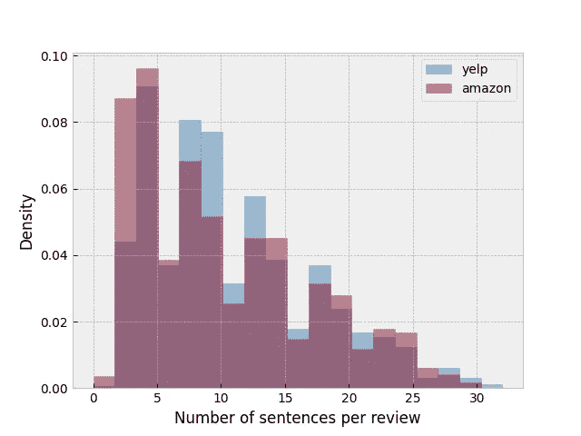
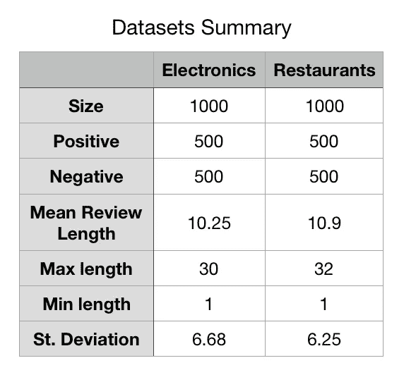
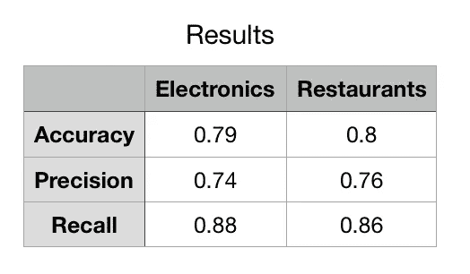
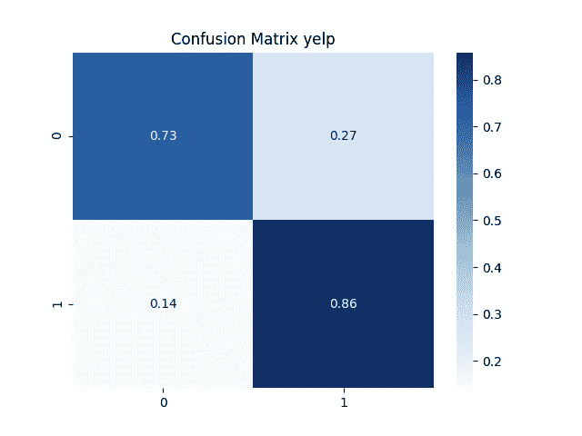

# 迁移学习和 RNN——CoreNLP 系列

> 原文：<https://towardsdatascience.com/transfer-learning-and-rnn-the-corenlp-series-pt-iii-2944f42a19a0?source=collection_archive---------33----------------------->

## 这篇文章旨在测试 CoreNLP 预训练的 RNN 在不同领域做出预测的能力。

大家好，欢迎来到第三个*(可能也是最后一个？我还没决定…* 🙄 *)* 本 **coreNLP 系列**的一部分！在本系列的前几篇文章中，我已经[介绍了 coreNLP 库](/intro-to-stanfords-corenlp-and-java-for-python-programmers-c2586215aab6)和[研究了他们为情感分析计算句子嵌入方式背后的理论](/sentence-embeddings-and-corenlps-recursive-sentiment-model-d88af7f7b4f5)。

这将是一篇更加实用的文章，在这篇文章中，我将解决 RNN 的一个最大限制:**很难**(几乎不可能)**重新训练模型**。在这篇文章中，我将解释**迁移学习**的概念，作为这个培训问题的解决方案。我还将**在两个数据集上测试 RNN** ，这两个数据集在二元情感分类任务的训练中没有出现过。

[梁杰森](https://unsplash.com/@ninjason?utm_source=medium&utm_medium=referral)在 [Unsplash](https://unsplash.com?utm_source=medium&utm_medium=referral) 上的照片

# **RNN 模式的培训局限性**

从我使用 coreNLP 的体验来看，Socher 的递归模型最讨厌的地方(除了运行的时间)就是**基本不可能重新训练**。

CoreNLP 实际上使你用一个简单的命令重新训练模型变得非常容易。然而，问题是你需要一个非常特殊的训练数据集。

如前所述，为了综合学习句子的情感，在 RNN 解析树的每个节点处构建了**一个 **softmax 分类器**。这意味着，为了训练这个 RNN，基本上在树的每个节点**都需要**真实标签**(情感分数范围从 0-4)**！让我们更深入地了解一下这意味着什么…**

*   ****斯坦福情感树库**。**

**为了进行这种特殊的训练，创建了一个标记了已解析树的**语料库:**[**斯坦福情感树库**](https://nlp.stanford.edu/sentiment/treebank.html) 。这个语料库由 11，855 个单句组成，这些单句是从**电影评论**中提取的，更具体地说是从由庞和李(2005)介绍的**烂番茄数据集**中提取的。原始文本数据被解析，获得 **215，154 个唯一短语**。这些短语由三位人类评委根据他们的情感**手动标注**。因此，情感树库包括数千个句子中每个可能短语**的**情感标签，允许 RNTN 被训练预测句子每个节点的情感。**********

这个语料库对于训练和测试 RNN 非常有效，但是它的复杂性使得它很难复制。想象一下……人们需要手动标注语料库中的每个单词、短语、短语和句子！！这是一个很大的限制，因为它使得在电影评论之外的一些语料库上重新训练和测试模型变得非常困难。

# **迁移学习**

由于上述限制，我们无法重新培训 RNN。然而，在本帖中，我们感兴趣的是使用 RNN 在其他数据集上进行预测，而不一定是来自烂番茄的电影评论。我们如何面对**训练和测试数据不同的问题？**

机器学习的整个研究领域都试图在不同的数据集(或领域)上重用在一个数据集(或领域)中训练的分类器。这被称为**迁移学习**或**领域适应**。这是一个旨在将在*源*域上训练的分类器推广到*目标*域的领域。

有许多****原因**为什么人们想要*重用*在一个领域(例如电影评论)上训练的分类器来对另一个领域(例如餐馆评论)进行预测。可以说，最主要的问题是我们在这篇文章中面临的问题:有时收集训练数据是一项困难而昂贵的任务。**

**这个问题在现实世界中经常出现，因此已经开发了非常复杂的迁移学习技术来解决它。我不打算深入探讨它们。在这篇文章中，我的主要目的是简单地了解一下**在电影评论领域训练有素的 RNN 如何能够推广到其他领域**。**

# ****任务****

**在这篇文章中，我们将测试预训练的 RNN 在句子级别的**二元情感分类任务。RNN 是在电影评论这个来源领域接受训练的。测试将在**两个不同的目标领域**上进行:餐馆评论和电子评论。****

**在性能方面，Socher 等人(2013)报告说，RNN 可以在句子级别上对二元情感分类实现 85.4%的**准确率。****

****的目标**将是**比较 RNN 在源域和目标域上的性能。**通过这种方式，我们将能够得出一些结论，即 Socher 的模型能够如何将其学习成果转移到训练期间未见过的其他数据集进行预测。**

# **目标领域:餐馆和电子产品**

**为了测试 RNN 的领域适应能力，我选择了**两个数据集作为目标领域**。他们都是基于评论，以确保写作风格保持不变。不同之处在于评论的主题:电子产品**和餐馆**T21。******

********

****数据集 1** 包含来自**亚马逊**网站上分类为“**手机和配件”、**的评论的句子，是麦考利和莱斯科维奇收集的更大数据集的一部分。**数据集 2** 的实例从 Yelp 挑战数据集获得，该数据集是在 **Yelp** 平台上发布的**餐厅**评论的更大数据集。**

**两个数据集的大小相同:每个都有 1000 个句子。根据他们的情感，句子被**二进制标记为**否定(0 类)或肯定(1 类)。为了强化数据集的极性，不考虑具有中性评级的综述。**类是平衡的**，每种情绪 500 个实例。**评论的长度**及其在两个数据集上的分布**非常相似**。**

# **方法学**

**该过程分为三个步骤。所有的代码都可以在我的 [GitHub](https://github.com/laurabravopriegue/coreNLP_tutorial) 上找到，但是我现在将浏览一些主要部分！**

1.  ****数据探索和格式化****

**第一个脚本`formatting_and_eda.py`获取上面的统计数据并生成直方图。它还在目录`test_data`中生成`.txt`文件。文件`X_amazon.txt`和`X_yelp.txt`是 RNN 将要进行预测的评论。文件`Y_amazon.txt`和`Y_yelp.txt`是真正的标签，我们将使用它们进行评估。**

****2。RNN 预测****

**第二个脚本`coreNLP_pipeline4.py`运行 coreNLP 管道。这个 coreNLP 管道是为了预测单个句子的情感得分而构建的。预测得分以五个不同类别标签(1-5)的分布形式输出。**

**我们的结果将被打印到`predictions_amazon.txt`和`predictions_yelp.txt.`上，它们将以数据帧的形式组织，包含以下各列:**

**`review_id, sent_id, sentence, score, very_neg, neg, neu, pos, very_pos`**

**其中`very_neg, neg, neu, pos, very_pos`是 RNN 预测的句子非常否定、否定、中性、肯定和非常肯定的概率。**

**该文件必须带有两个参数:输入文件和数据集的名称。例如:**

**`java -cp “*” coreNLP_pipeline4.java test_data/X_amazon.txt amazon`**

**我在`stanford-corenlp-4.1.0` 文件夹中运行了两次:一次用于 amazon 数据，另一次用于 yelp 数据。**

****3。结果评估****

**一旦我们有了预测器的结果，剩下的唯一事情就是评估它们相对于 y 的真实值有多好。这就是`evaluation.py` 所做的。**

**然而，Y_true 的值是二进制的:0 或 1，Y_pred 的值是分布在五个值上的概率:非常正、正、中性、负和非常负。因此，为了对结果进行评估，我们必须首先对它们进行二值化。**

**为了将它们转换成 1 和 0，我们去掉中性列，将正负概率相加，得到正负总得分。如果一个句子的总正面得分大于总负面得分，那么它的目标值将是 1，反之亦然。**

**为了评估，我们将计算**准确度**、**精度**、**召回**和一个**混淆矩阵**。**

# ****结果****

**Socher 等人(2013)报告称，RNTN 在句子级别上对二元情感分类可以达到 85.4% 的**准确率。从下表中可以看出，目标领域的分类准确度较低:**电子领域的准确度为 79%，餐馆领域的准确度为 80%。******

************

**然而，尽管表现不佳，我们仍然可以自信地说 **Socher 的递归模型** **能够对电子产品和餐馆的目标域进行跨域分类**达到良好的标准。**

**令人感兴趣的是，在执行该评估时获得的其他度量可以提供递归分类器的行为。对于两个目标领域，该模型在分类类别 1(肯定句)方面似乎比类别 0(否定句)表现得更好。这两个目标域之间的性能似乎也没有太大差异。**

# **结论**

**这都是为了现在！我希望你喜欢它，并希望你有动力在不同的领域使用这个超级酷的模型，相信性能会相对较好。下次见！✌🏻**

# **文献学**

**Socher，r .，Perelygin，a .，Wu，j .，Chuang，j .，Manning，C.D .，ng，a .，Potts，c .，2013 年 10 月。情感树库语义合成的递归深度模型。在*2013 年自然语言处理经验方法会议论文集*(第 1631-1642 页)。可在:[https://www.aclweb.org/anthology/D13-1170](https://www.aclweb.org/anthology/D13-1170)**

**斯坦福科伦普。(未注明)。*斯坦福 CoreNLP——自然语言软件*。可在:[https://stanfordnlp.github.io/CoreNLP/](https://stanfordnlp.github.io/CoreNLP/)**