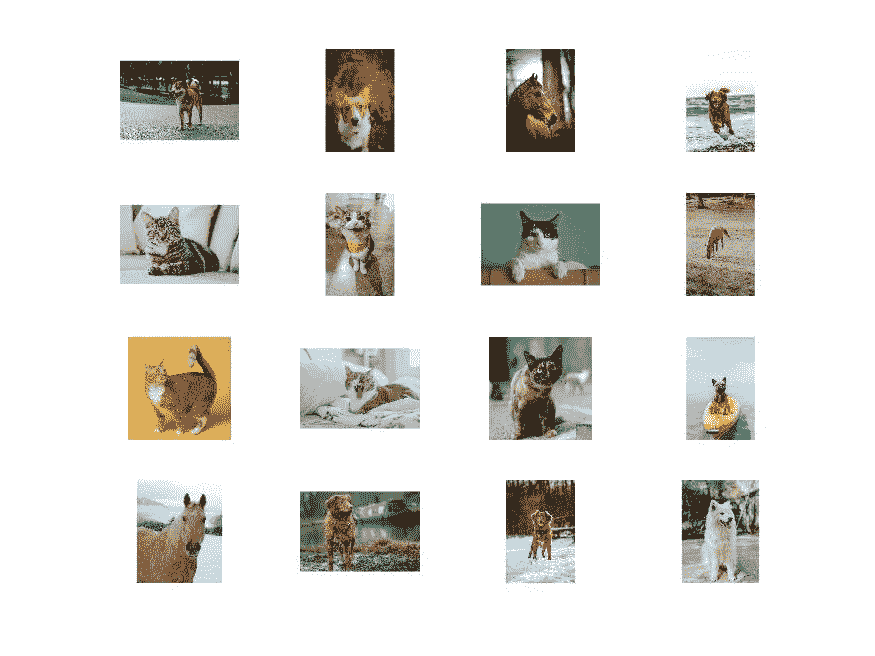
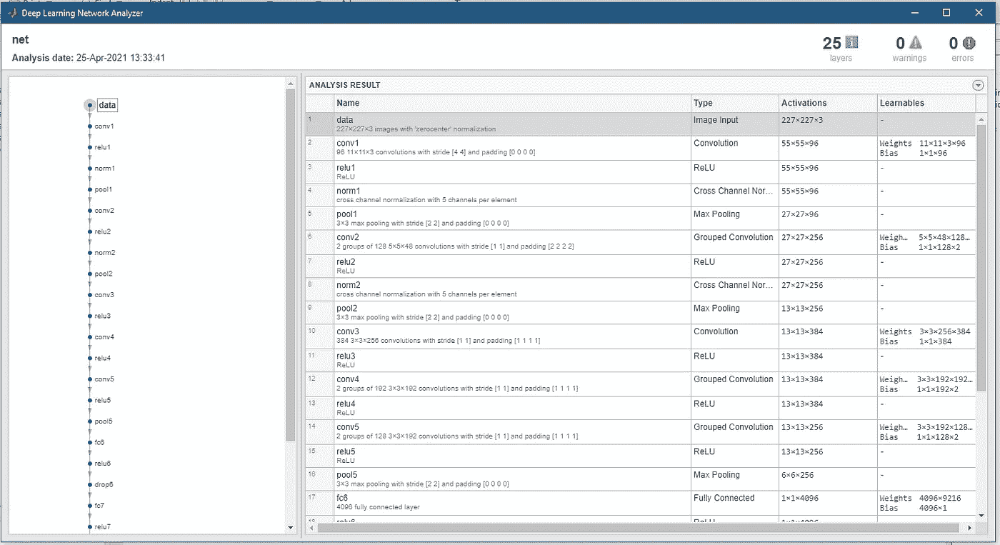
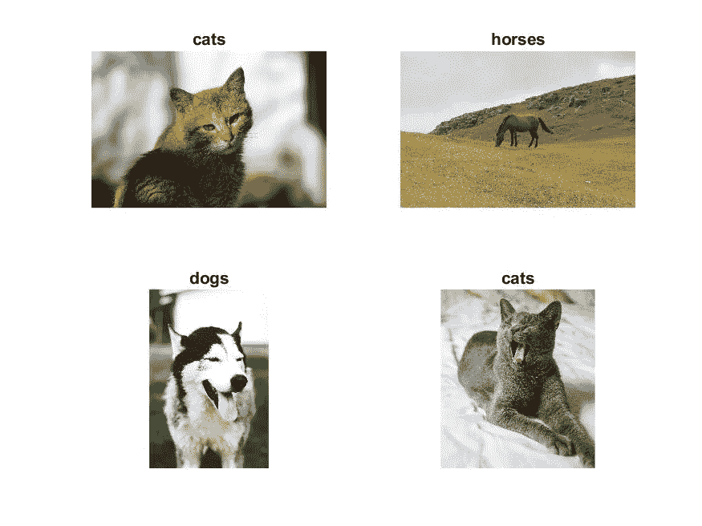

# 使用来自 MATLAB 的 Alexnet 预训练网络对 Unsplash 数据应用迁移学习

> 原文：<https://towardsdatascience.com/transfer-learning-applied-on-the-unsplash-data-using-alexnet-pretrained-network-2fc6aa70d43a?source=collection_archive---------35----------------------->

## **使用 MATLAB 预先训练的深度学习网络进行迁移学习可以很容易地实现，以获得快速和令人印象深刻的结果**

我从 Unsplash 获得了图像数据。我下载了 42 幅猫的图像、46 幅狗的图像和 35 幅马的图像，输入到 MATLAB 中预先训练好的 Alexnet 模型中。有关 MATLAB 中 Alexnet 网络的详细信息，请参见其[文档](https://www.mathworks.com/help/deeplearning/ref/alexnet.html)。


照片由 [JJ 英](https://unsplash.com/@jjying?utm_source=medium&utm_medium=referral)在 [Unsplash](https://unsplash.com?utm_source=medium&utm_medium=referral) 上拍摄

# Alexnet

AlexNet 是一个 8 层深度的卷积神经网络。MATLAB 有一个预先训练好的网络版本，对来自 [ImageNet 数据库](https://www.mathworks.com/help/deeplearning/ref/alexnet.html#bvk8vk9_sep_mw_6dc28e13-2f10-44a4-9632-9b8d43b376fe)的 100 多万张图像进行训练。预训练的网络可以将图像分类为 1000 个预定义的对象类别。

针对一百万幅图像上的 1000 个对象类别的训练使得该网络学习了广泛图像的丰富特征表示。

[](https://www.earthinversion.com/machinelearning/transfer-learning-applied-on-unsplash-data-using-alexnet/) [## 基于 alexnet 预训练网络的迁移学习在 Unsplash 数据上的应用

### 我从 Unsplash 获得了图像数据。我下载了 42 张猫的图片，46 张狗的图片，35 张马的图片…

www.earthinversion.com](https://www.earthinversion.com/machinelearning/transfer-learning-applied-on-unsplash-data-using-alexnet/) 

# 装置

您可以通过键入以下命令来检查 alexnet 的安装

```
alexnet
```

在命令行中。如果没有安装，它会在附加资源管理器中提示指向所需支持包的链接。简单来说，跟着链接走。

# 为什么要转学？

迁移学习因其速度快、易于实现而成为深度学习应用中的热门。人们可以使用预先训练好的网络，并将其作为学习新任务的起点。这使用较少数量的训练图像将学习的特征快速转移到新的任务。

# 数据

我从 Unsplash 网站上获得了这三类图片。Unsplash 提供了数百万张高质量的免费图片。我获得了猫、狗和马的图像。使用这些类别没有特定的原因，但使用猫和狗已经成为测试任何模型的标准，因为它提供了足够的鲁棒性。

我将数据保存到三个子文件夹中，分别标有`cats`、`dogs`和`horses`，在文件夹`unsplashData`下。我将压缩数据保存在包含脚本的文件夹中。

# 准备数据

我们做的第一件事是使用`unzip`命令解压数据。然后，我们根据文件夹名称自动标记图像，并将数据存储为一个`ImageDatastore`对象。

```
clear; close; clc;

%% Unzip and load the new images as an image datastore
filename = 'unsplashData';
unzip(strcat(filename,'.zip'));

% imageDatastore automatically labels the images based on folder names and stores the data as an ImageDatastore object
imds = imageDatastore(filename, ...
    'IncludeSubfolders',true, ...
    'LabelSource','foldernames');
```

# 将数据分为训练数据集和验证数据集

我们使用随机选择的图像的 70%用于训练，30%用于验证。

```
[imdsTrain,imdsValidation] = splitEachLabel(imds,0.7,'randomized');
```

# 可视化加载的图像

我们绘制了 16 个随机选择的数据。

```
visualize = 1;
if visualize==1
    numTrainImages = numel(imdsTrain.Labels);
    idx = randperm(numTrainImages,16);
    fig1 = figure;
    for i = 1:16
        subplot(4,4,i)
        I = readimage(imdsTrain,idx(i));
        imshow(I)
    end
    print(fig1,strcat(filename,'input-data-selected'),'-djpeg')
end
```



作者图片

# 负载预训练网络

```
net = alexnet;
inputSize = net.Layers(1).InputSize
```

来分析 alexnet 网络的层次。

```
inspect_network=0;
if inspect_network==1
    analyzeNetwork(net)
end
```



作者图片

# 替换最后三层

我们从预训练的网络中提取所有层，除了最后三层。可以增加完全连接层的 WeightLearnRateFactor 和 BiasLearnRateFactor 值，以便在新层中比在转移层中学习得更快

```
layersTransfer = net.Layers(1:end-3); 

numClasses = numel(categories(imdsTrain.Labels)) %the number of classes in the new data

layers = [
    layersTransfer
    fullyConnectedLayer(numClasses,'WeightLearnRateFactor',20,'BiasLearnRateFactor',20)
    softmaxLayer
    classificationLayer];
```

# 使用增强的图像数据库来自动调整训练图像的大小

alexnet 网络设计用于处理固定尺寸(227 x 227 x 3)的图像。我们遵循标准操作来扩充训练图像——沿着垂直轴随机翻转训练图像，将它们随机水平和垂直平移 30 个像素。数据扩充对于防止网络过度拟合和记忆训练图像的精确细节是必要的。

```
pixelRange = [-30 30];
imageAugmenter = imageDataAugmenter( ...
    'RandXReflection',true, ... %randomly flip the training images along the vertical axis
    'RandXTranslation',pixelRange, ... %randomly translate them up to 30 pixels horizontally and vertically
    'RandYTranslation',pixelRange);

augimdsTrain = augmentedImageDatastore(inputSize(1:2),imdsTrain, ...
    'DataAugmentation',imageAugmenter); 

% automatically resize the validation images without performing further data augmentation
augimdsValidation = augmentedImageDatastore(inputSize(1:2),imdsValidation);
```

# 微调培训选项

应用迁移学习的目标是保持预训练网络早期层的特征(迁移的层权重)。

```
options = trainingOptions('sgdm', ...
    'MiniBatchSize',10, ... %when performing transfer learning, you do not need to train for as many epochs
    'MaxEpochs',6, ...
    'InitialLearnRate',1e-4, ... %slow down learning in the transferred layers ( fast learning only in the new layers and slower learning in the other layers)
    'Shuffle','every-epoch', ...
    'ValidationData',augimdsValidation, ...
    'ValidationFrequency',3, ...
    'Verbose',false, ...
    'Plots','training-progress', ...
    'ExecutionEnvironment','auto'); %Hardware resource for training network - auto, cpu, gpu, multi-gpu, parallel
```

# 训练网络

我们训练由转移层和新层组成的网络。

```
netTransfer = trainNetwork(augimdsTrain,layers,options); %By default, trainNetwork uses a GPU if one is available
```

# 分类验证图像

```
[YPred,scores] = classify(netTransfer,augimdsValidation); %classify using the fine-tuned network
```

我们显示了四个样本验证图像及其预测标签。

```
classify_visualize = 1;
if classify_visualize==1
    idx = randperm(numel(imdsValidation.Files),4);
    fig = figure;
    for i = 1:4
        subplot(2,2,i)
        I = readimage(imdsValidation,idx(i));
        imshow(I)
        label = YPred(idx(i));
        title(string(label));
    end
    print(fig,strcat(filename,'classification-result'),'-djpeg')
end
```



作者图片

# 分类准确度

分类准确度给出了网络正确预测的标签的比例。

```
YValidation = imdsValidation.Labels;
accuracy = mean(YPred == YValidation)% accuracy = 0.9189
```

# 结论

我使用 MATLAB 中预先训练的 Alexnet 网络，用 Unsplash 数据对其进行微调。但是，它有可能导致图像数据的任何分类问题。我们还应该探索 MATLAB 提供的其他几个预训练网络，如 squeezenet、resnet18、googlenet 等，以实现更好的准确性。准确性在很大程度上取决于数据数量、质量和模型参数，如层数。

*原载于 2021 年 4 月 25 日*[*【https://www.earthinversion.com】*](https://www.earthinversion.com/machinelearning/transfer-learning-applied-on-unsplash-data-using-alexnet/)*。*